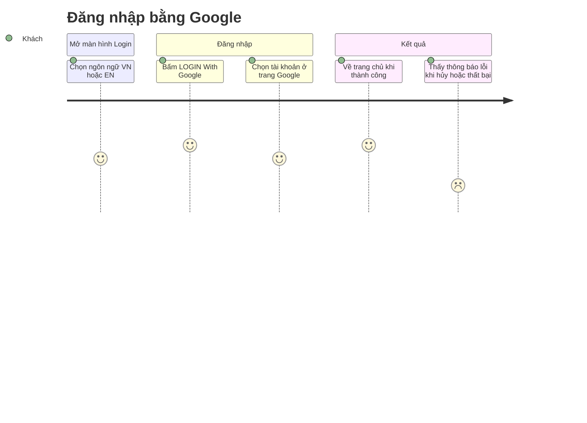

<!-- layout-exempt: rebuild-spec owns all docs/system|features|generated|flows paths — all references here are output targets or internal definitions -->
<!-- Contract: references/feature-spec-researcher-contract.md -->
<!-- Nửa BA/QA của cặp spec F001: mô tả thuần ngôn ngữ, không có đường dẫn mã nguồn, không có động từ giao thức. Chi tiết kỹ thuật, trích dẫn nguồn và mã giả nằm ở technical-spec.md. -->

# Functional Spec — F001_LoginWithGoogle

**Priority**: P1
**Type**: mixed
**Generated**: 2026-10-08

**See also:** [`technical-spec.md`](./technical-spec.md) — điểm vào xử lý, trích dẫn nguồn, mã giả, thực thể dữ liệu và việc ghi DB cho Dev/QA/SA.

**Traceability:** F001_LoginWithGoogle → SCR001_Login → US001, US002, US012, US013, US014, US015 → BL001, BL002, BL003 → ROUTE003, ROUTE004, ROUTE005, ROUTE006, ROUTE007

## 1. Overview

**Problem:** Ứng dụng SAA 2025 cần một cửa vào duy nhất để người dùng chứng minh mình là ai trước khi dùng các tính năng dành riêng cho người đã đăng nhập; người dùng muốn vào bằng tài khoản Google sẵn có, không phải tạo hay nhớ mật khẩu riêng.
**Solution:** Người dùng đăng nhập bằng tài khoản Google ngay trên màn hình Login rồi được đưa về trang chủ (`/`). Màn hình Login có hai ngôn ngữ (VN, EN); ai đã đăng nhập thì bỏ qua Login và vào thẳng trang chủ. Trang chủ là công khai nên khách chưa đăng nhập vẫn xem được, không bị chuyển về Login.
**Scope:** Màn hình Login (header, hero, nút Google, footer), chuyển ngôn ngữ VN/EN cho chữ trên màn hình Login, luồng đăng nhập Google và xử lý hủy/thất bại, chuyển người đã đăng nhập khỏi Login về trang chủ, giữ và làm mới phiên đăng nhập (kể cả khi xem trang chủ công khai).
**Non-Scope:** Đăng nhập bằng email/mật khẩu hoặc nhà cung cấp khác; đăng ký riêng; giới hạn theo tên miền hay vai trò; nội dung trang chủ (F002); menu tài khoản và đăng xuất (F003); trang Todo (đã gỡ 2026-10-08); nhớ trang người dùng định vào trước khi bị chuyển sang Login; dịch toàn bộ ứng dụng ngoài màn hình Login.

**Actors**

| Actor | Description | Primary goal |
|-------|--------------|---------------|
| Khách chưa đăng nhập | người mở ứng dụng khi chưa có phiên | đăng nhập bằng tài khoản Google để vào ứng dụng |
| Người dùng đã đăng nhập | người đã có phiên hợp lệ | vào thẳng trang chủ mà không phải qua Login lại, và giữ phiên không bị đăng xuất giữa chừng; việc đăng xuất do F003 đảm nhiệm |

## 2. Functional Capabilities

| ID | Capability | What the user can do | User Stories | Requirements | Business Rules | Screens |
|----|------------|------------------------|-----------------|---------------|-------------------|---------|
| CAP-01 | Đăng nhập bằng Google | Xem màn hình Login, bấm nút Google, đăng nhập thành công để về trang chủ hoặc thấy thông báo lỗi khi hủy/thất bại | US001, US002, US013 | FR-201, FR-202, FR-203, FR-204, FR-205, FR-401, FR-402, FR-403, FR-601, FR-602 | BR-001, BR-002, BR-003, BR-006, BR-008, DEC-003 | SCR001_Login |
| CAP-02 | Chọn ngôn ngữ màn hình Login | Chuyển chữ trên màn hình Login giữa VN và EN, lựa chọn được nhớ | US012 | FR-206, FR-207, FR-404, FR-407 | BR-004 | — *(nằm trên màn hình Login, đã tính ở CAP-01)* |
| CAP-03 | Điều hướng và làm mới phiên đăng nhập | Người đã đăng nhập mở Login thì được đưa về trang chủ; phiên được duy trì và làm mới, kể cả khi xem trang chủ công khai *(FR-103 và DEC-002 đã gỡ 2026-10-08)* | US014, US015 | FR-001, FR-101, FR-102, FR-103 | BR-005, BR-009, DEC-001, DEC-002 | — *(áp dụng cho màn hình Login, đã tính ở CAP-01)* |
| CAP-04 | Trang chính tối thiểu và đăng xuất — **Đã gỡ (2026-10-08):** trang /todo bị gỡ; đăng xuất chuyển sang F003 | — *(không còn trong F001)* | — *(không còn story nào)* | FR-405, FR-406 | BR-007 | SCR002_Todo *(đã gỡ)* |

## 3. Open Decisions

| D### | Decision | Default proposal | Rationale | Blocks work |
|------|----------|-------------------|-----------|--------------|
| D001 | Chữ tiếng Anh của màn hình Login (hai dòng mô tả, footer, nút, tiêu đề) là gì? Thông báo lỗi tiếng Anh: "Login failed. Please try again." | **Đã chốt (2026-10-07):** giữ nguyên "ROOT FURTHER" và "LOGIN With Google"; EN: "Start your journey with SAA 2025." / "Log in to explore!" / footer "Copyright © 2025 Sun*" | Thiết kế chỉ có bản tiếng Việt; tiêu đề và nhãn nút là thương hiệu nên giữ nguyên | no |
| D002 | Trang Todo (nhãn nút đăng xuất, chữ khác) có theo ngôn ngữ đã chọn không? | **Đã chốt (2026-10-07), không còn áp dụng (2026-10-08):** trang Todo bị gỡ; nhãn đăng xuất thuộc F003. Từ điển VN/EN theo cookie `NEXT_LOCALE` vẫn dùng chung cho các trang khác | Ngôn ngữ đã được đọc phía máy chủ nên dùng lại từ điển gần như không tốn công | no |
| D003 | Bố cục màn hình Login ở khổ hẹp (máy tính bảng, điện thoại) trông thế nào? | **Đã chốt (2026-10-07):** giữ nguyên bố cục, thu nhỏ tỉ lệ: header cố định trên, footer cố định dưới, nội dung hero dồn gọn theo chiều ngang | Thiết kế chỉ nêu "giữ vị trí ở mọi kích thước" mà không có khung hình riêng cho khổ hẹp | no |
| D004 | Danh sách thả xuống của bộ chọn ngôn ngữ ghi gì cho mỗi mục? | **Đã chốt (2026-10-07):** mỗi mục gồm cờ và mã ngắn "VN" / "EN", giống nhãn đang hiển thị | Nhất quán với nhãn trên bộ chọn và đủ ổn định để kiểm thử | no |

## 4. Requirements

### Foundation (0xx)

- **FR-001** Phiên đăng nhập được giữ qua các lần tải trang và tự làm mới khi còn hiệu lực, để người dùng không phải đăng nhập lại liên tục; việc làm mới cũng diễn ra khi người dùng xem trang chủ công khai (`/`).

### Navigation (1xx)

- **FR-101** Khách chưa đăng nhập mở màn hình Login thì thấy màn hình Login.
- **FR-102** Người dùng đã đăng nhập mở màn hình Login thì được chuyển thẳng sang trang chủ (`/`).
- **FR-103** *Đã gỡ (2026-10-08): trang chủ (`/`) là công khai nên khách chưa đăng nhập không bị chuyển về Login; trang /todo vốn bị chặn đã bị gỡ.*

### Login (2xx)

- **FR-201** Header cố định ở đầu cửa sổ: logo ở bên trái, bộ chọn ngôn ngữ ở bên phải, giữ vị trí ở mọi kích thước cửa sổ.
- **FR-202** Logo Sun* Annual Awards 2025 chỉ để nhìn, không bấm được.
- **FR-203** Phần hero có ảnh nền key visual, tiêu đề "ROOT FURTHER" và hai dòng mô tả "Bắt đầu hành trình của bạn cùng SAA 2025." và "Đăng nhập để khám phá!"; các dòng này không tương tác và không chọn được chữ.
- **FR-204** Nút "LOGIN With Google" có biểu tượng Google, nằm dưới hai dòng mô tả, và nổi bóng khi rê chuột qua.
- **FR-205** Footer cố định ở cuối cửa sổ với chữ "Bản quyền thuộc về Sun* © 2025", không tương tác.
- **FR-206** Bộ chọn ngôn ngữ mặc định là "VN", có cờ Việt Nam bên trái và mũi tên xuống bên phải; rê chuột thì sáng lên và con trỏ đổi thành bàn tay; bấm thì mở danh sách ngôn ngữ.
- **FR-207** Danh sách ngôn ngữ dùng được bằng bàn phím và chuột: Esc đóng và trả tiêu điểm về nút, Tab đóng, phím mũi tên lên/xuống chuyển giữa hai mục, bấm ra ngoài thì đóng; chọn lại đúng ngôn ngữ đang dùng chỉ đóng danh sách.

### Interaction (4xx)

- **FR-401** Bấm nút Google thì chuyển cùng tab sang trang đăng nhập của Google; trong lúc chờ, nút bị vô hiệu và hiện biểu tượng đang tải.
- **FR-402** Xác thực Google thành công thì người dùng có phiên đăng nhập và được chuyển tới trang chủ (`/`).
- **FR-403** Hủy hoặc thất bại thì quay lại màn hình Login và hiện ngay dưới nút thông báo "Đăng nhập không thành công. Vui lòng thử lại."; thông báo ẩn khi bắt đầu lần thử kế tiếp.
- **FR-404** Chọn một ngôn ngữ trong danh sách thì toàn bộ chữ trên màn hình Login đổi theo ngay và lựa chọn được nhớ cho lần sau; nếu việc đổi gặp lỗi thì giữ ngôn ngữ cũ và trang không vỡ.
- **FR-405** *Đã gỡ (2026-10-08): trang /todo bị gỡ; email người dùng và nút Đăng xuất chuyển sang menu tài khoản của F003.*
- **FR-406** *Đã gỡ (2026-10-08): đăng xuất chuyển sang F003.*
- **FR-407** Thuộc tính ngôn ngữ của trang luôn khớp ngôn ngữ đang hiển thị (VN hoặc EN), kể cả ngay sau khi đổi mà không tải lại trang, để trình đọc màn hình đọc đúng giọng.

### Security (6xx)

- **FR-601** Sau khi đăng nhập, nơi đến luôn là trang chủ (`/`); không nhận địa chỉ đích do bên ngoài truyền vào.
- **FR-602** Địa chỉ quay về sau khi xác thực Google luôn thuộc đúng máy chủ mà người dùng đang truy cập; không xác định được địa chỉ đó thì đăng nhập thất bại thay vì đoán.

## 5. Business Rules

- Mọi tài khoản Google đều được phép đăng nhập, không giới hạn theo tên miền hay danh sách riêng (BR-001)
- Đích sau đăng nhập, và đích của người đã đăng nhập mở Login, luôn cố định là trang chủ (`/`), không đọc từ địa chỉ yêu cầu (BR-002)
- Hủy và thất bại dùng chung một thông báo; mã lỗi nào khác hai loại này đều không hiện thông báo và không được hiện lại trên trang (BR-003)
- Ngôn ngữ chỉ là VN hoặc EN và mặc định VN; giá trị lạ hoặc thiếu được hiểu là VN (BR-004)
- Phiên không hợp lệ, đã hết hạn hoặc không kiểm tra được (kể cả lỗi mạng, thiếu cấu hình) được đối xử như chưa đăng nhập, không gây lỗi trang (BR-005)
- Trong lúc chờ xác thực, nút Google không bấm lại được nên không thể gửi hai yêu cầu đăng nhập chồng nhau (BR-006)
- *Đã gỡ (2026-10-08): trang /todo bị gỡ nên F001 không còn trang chính tự kiểm tra phiên* (BR-007)
- Địa chỉ quay về sau Google luôn xây từ địa chỉ người dùng đang truy cập; không xác định được thì từ chối bắt đầu đăng nhập, không đoán (BR-008)
- Cookie phiên và cookie phục vụ đăng nhập chỉ đọc được phía máy chủ; cờ bảo mật chỉ bật ở môi trường chạy thật để chạy thử local vẫn đăng nhập được (BR-009)
- Truy cập màn hình Login: có phiên thì sang trang chủ (`/`), không có phiên thì hiện màn hình Login (DEC-001)
- *Đã gỡ (2026-10-08): trang chủ là công khai nên khách không bị chuyển về Login; trang /todo bị gỡ* (DEC-002)
- Khi Google trả người dùng về: Google báo hủy hoặc không có mã → về Login kèm thông báo; báo lỗi khác hoặc đổi mã lỗi → về Login kèm thông báo; đổi được phiên → về trang chủ; mã đi kèm một lỗi của Google không bao giờ được đổi (DEC-003)

## 6. Screens

| Screen Name | SCR### | What User Sees | What User Can Do |
|-------------|--------|-----------------|-------------------|
| Login | SCR001_Login | header cố định (logo, bộ chọn ngôn ngữ), hero "ROOT FURTHER" cùng hai dòng mô tả, nút "LOGIN With Google", footer cố định; thông báo lỗi dưới nút khi hủy/thất bại | đổi ngôn ngữ VN/EN; bấm nút Google để đăng nhập |
| Todo *(đã gỡ 2026-10-08)* | SCR002_Todo | — *(màn hình bị gỡ; trang chủ `/` thuộc F002, đăng xuất thuộc F003)* | — |

### User Journey

1. Khách chưa đăng nhập mở ứng dụng và thấy màn hình Login bằng tiếng Việt, bộ chọn ghi "VN".
2. Khách bấm bộ chọn ngôn ngữ, chọn EN — chữ trên màn hình Login đổi sang tiếng Anh; lựa chọn được nhớ.
3. Khách bấm "LOGIN With Google" — nút bị vô hiệu và hiện biểu tượng đang tải, rồi trang đăng nhập của Google mở ra trong cùng tab.
4. Khách chọn tài khoản Google và đồng ý — hệ thống lập phiên và đưa khách về trang chủ (`/`).
5. Nếu khách hủy hoặc Google báo lỗi, khách quay lại màn hình Login và thấy thông báo lỗi dưới nút; bấm lại để thử tiếp.
6. Người dùng đã đăng nhập mở lại màn hình Login — họ được đưa thẳng về trang chủ. *(Đăng xuất: ngoài phạm vi F001, thuộc F003.)*



## 7. User Stories

> Note: nhãn story cũ "US005/US006/US007" trong bản nháp trước là số cục bộ của feature và đã bị thay thế; chúng trùng với US005_OpenProfile, US006_SignOut và US007_OpenAdminDashboard của F003 nên không dùng làm mã F001. Ba story cũ đó — khách chưa đăng nhập không vào được trang chính, xem tài khoản đang đăng nhập, đăng xuất — đã gỡ (2026-10-08) vì trang /todo bị gỡ, trang chủ là công khai và đăng xuất chuyển sang F003.

### US001 — Đăng nhập bằng Google

**Actor:** Khách chưa đăng nhập
**Goal:** Bấm nút "LOGIN With Google" để được chuyển sang Google xác thực và bắt đầu đăng nhập.
**Business value:** Cho người dùng vào ứng dụng nhanh, không phải tạo hay nhớ mật khẩu riêng.

**Acceptance Criteria:**
- [ ] Nút "LOGIN With Google" hiện trên màn hình Login với nhãn theo ngôn ngữ đang chọn.
- [ ] Bấm nút thì nút bị vô hiệu, có biểu tượng đang tải và trình duyệt chuyển cùng tab sang Google.
- [ ] Quay lại bằng nút Back của trình duyệt từ trang Google thì trang tải lại và nút dùng được như ban đầu.
- [ ] Mọi tài khoản Google đều đăng nhập được.

### US002 — Thấy thông báo khi đăng nhập không thành công

**Actor:** Khách chưa đăng nhập
**Goal:** Biết đăng nhập đã không thành công và thử lại được.
**Business value:** Người dùng không bị kẹt hay phải đoán chuyện gì đã xảy ra.

**Acceptance Criteria:**
- [ ] Hủy hoặc thất bại thì quay lại màn hình Login và thấy "Đăng nhập không thành công. Vui lòng thử lại." (EN: "Login failed. Please try again.") ngay dưới nút.
- [ ] Hủy và thất bại cho cùng một thông báo; mã lỗi khác trên địa chỉ không hiện thông báo và không hiện lại chữ nào từ địa chỉ.
- [ ] Bấm nút lần nữa thì thông báo ẩn và quá trình đăng nhập bắt đầu lại.

### US012 — Đổi ngôn ngữ màn hình Login

**Actor:** Khách chưa đăng nhập
**Goal:** Đọc màn hình Login bằng tiếng Việt hoặc tiếng Anh.
**Business value:** Người dùng không đọc được tiếng Việt vẫn đăng nhập được mà không bị bỡ ngỡ.

**Acceptance Criteria:**
- [ ] Mặc định hiện "VN"; bấm bộ chọn thì danh sách hai ngôn ngữ mở ra, mục đang chọn được tô nền.
- [ ] Chọn EN thì chữ trên màn hình Login đổi sang tiếng Anh; mở lại màn hình Login vẫn thấy ngôn ngữ đã chọn.
- [ ] Chọn lại đúng ngôn ngữ đang dùng chỉ đóng danh sách; việc đổi gặp lỗi thì ngôn ngữ giữ nguyên.
- [ ] Esc, Tab, phím mũi tên và bấm ra ngoài điều khiển danh sách đúng như yêu cầu.

### US013 — Hoàn tất đăng nhập Google

**Actor:** Khách chưa đăng nhập
**Goal:** Sau khi xác thực xong với Google, được đưa về ứng dụng với phiên đăng nhập, hoặc biết đăng nhập bị hủy hay thất bại.
**Business value:** Người dùng đi hết luồng đăng nhập mà không bị kẹt ở bước trung gian.

**Acceptance Criteria:**
- [ ] Xác thực thành công thì người dùng có phiên và được đưa về trang chủ (`/`).
- [ ] Google báo hủy, hoặc không có mã quay về, thì về màn hình Login kèm thông báo lỗi và không có phiên.
- [ ] Google báo lỗi khác, hoặc việc đổi mã lỗi (kể cả dịch vụ xác thực không phản hồi), thì về màn hình Login kèm thông báo lỗi, không hiện trang lỗi hệ thống.
- [ ] Địa chỉ đích do bên ngoài truyền vào bị bỏ qua; nơi đến chỉ là trang chủ hoặc màn hình Login.

### US014 — Người đã đăng nhập bỏ qua màn hình Login

**Actor:** Người dùng đã đăng nhập
**Goal:** Không phải nhìn lại màn hình Login khi đã có phiên.
**Business value:** Tránh bước thừa và tránh nhầm rằng mình chưa đăng nhập.

**Acceptance Criteria:**
- [ ] Mở màn hình Login khi đã đăng nhập thì được chuyển thẳng sang trang chủ (`/`).
- [ ] Khách, hoặc phiên không kiểm tra được, mở màn hình Login thì thấy màn hình Login bình thường.
- [ ] Trang chủ (`/`) không bao giờ chuyển khách về Login.

### US015 — Làm mới phiên đăng nhập

**Actor:** Người dùng đã đăng nhập
**Goal:** Phiên tự được làm mới khi mở trang chủ để không bị đăng xuất giữa chừng khi sắp hết hạn.
**Business value:** Người dùng làm việc liền mạch, không phải đăng nhập lại chỉ vì phiên hết hạn ngầm.

**Acceptance Criteria:**
- [ ] Mở trang chủ khi phiên sắp hết hạn thì phiên được làm mới và người dùng vẫn ở trạng thái đã đăng nhập.
- [ ] Phiên không làm mới được (hết hạn hẳn, mạng lỗi) thì người dùng được đối xử như khách, trang vẫn mở và không báo lỗi hệ thống.

## 8. Scenarios

### US001 — Happy Path

**Given** khách ở màn hình Login, **When** bấm "LOGIN With Google" và hoàn tất xác thực với một tài khoản Google, **Then** khách được đưa về trang chủ (`/`).

### US001 — Error: không bắt đầu được đăng nhập

**Given** khách ở màn hình Login nhưng dịch vụ xác thực không tới được hoặc không xác định được địa chỉ đang truy cập, **When** bấm nút, **Then** nút bật lại và khách thấy "Đăng nhập không thành công. Vui lòng thử lại." dưới nút.

### US002 — Happy Path

**Given** khách hủy ở trang Google, **When** quay về màn hình Login, **Then** thông báo lỗi hiện dưới nút và nút dùng lại được.

### US002 — Error: thử lại vẫn thất bại

**Given** thông báo lỗi đang hiện, **When** khách bấm nút và lần này cũng thất bại, **Then** thông báo ẩn lúc bắt đầu thử rồi hiện lại khi quay về.

### US012 — Happy Path

**Given** màn hình Login đang ở VN, **When** khách chọn EN trong danh sách, **Then** chữ trên màn hình đổi sang tiếng Anh và lần sau mở lại vẫn là tiếng Anh.

### US012 — Error: giá trị ngôn ngữ đã lưu bị hỏng

**Given** lựa chọn ngôn ngữ đã lưu không phải VN hoặc EN, **When** khách mở màn hình Login, **Then** màn hình hiện bằng tiếng Việt.

### US013 — Happy Path

**Given** khách vừa đồng ý ở Google, **When** trình duyệt quay về ứng dụng với mã hợp lệ, **Then** phiên được lập và khách thấy trang chủ (`/`).

### US013 — Error: Google báo lỗi hoặc mã không đổi được

**Given** khách bấm hủy ở Google, hoặc mã quay về sai hay hết hạn, **When** trình duyệt quay về ứng dụng, **Then** khách ở màn hình Login thấy "Đăng nhập không thành công. Vui lòng thử lại." và không có phiên.

### US014 — Happy Path

**Given** người dùng đã đăng nhập, **When** mở màn hình Login, **Then** họ được đưa về trang chủ (`/`).

### US014 — Error: phiên đã hết hạn

**Given** phiên của người dùng đã hết hạn, **When** họ mở màn hình Login, **Then** họ thấy màn hình Login như khách chưa đăng nhập.

### US015 — Happy Path

**Given** người dùng đã đăng nhập và phiên sắp hết hạn, **When** họ mở trang chủ (`/`), **Then** phiên được làm mới và họ vẫn ở trạng thái đã đăng nhập.

### US015 — Error: không làm mới được phiên

**Given** phiên không còn làm mới được hoặc mạng bị lỗi, **When** người dùng mở trang chủ (`/`), **Then** họ được coi là khách, trang chủ vẫn mở và hiện liên kết đăng nhập, không có trang lỗi.

## 9. Edge Cases

| Scenario | What Happens | User-Facing Message |
|----------|--------------|----------------------|
| Khách hủy ở trang Google | quay về màn hình Login, nút dùng lại được | "Đăng nhập không thành công. Vui lòng thử lại." |
| Google báo lỗi khác, hoặc kết quả xác thực không hợp lệ hay đã hết hạn | quay về màn hình Login, không có phiên; mã đi kèm lỗi Google không được đổi | "Đăng nhập không thành công. Vui lòng thử lại." |
| Dịch vụ xác thực không phản hồi hoặc mất mạng | không tạo phiên, nút bật lại | "Đăng nhập không thành công. Vui lòng thử lại." |
| Không xác định được địa chỉ người dùng đang truy cập | không bắt đầu đăng nhập, nút bật lại | "Đăng nhập không thành công. Vui lòng thử lại." |
| Bấm nút Quay lại của trình duyệt khi đang chờ Google | trang được tải lại để nút về trạng thái bình thường | None — silent handling |
| Địa chỉ màn hình Login mang mã lỗi lạ | bỏ qua mã đó, hiện màn hình Login bình thường, không hiện lại chữ từ địa chỉ | None — silent handling |
| Địa chỉ quay về mang kèm đích khác (ví dụ trang cần vào) | bỏ qua đích đó, vẫn về trang chủ hoặc màn hình Login | None — silent handling |
| Ngôn ngữ đã lưu không phải VN hoặc EN | dùng tiếng Việt | None — silent handling |
| Chọn lại đúng ngôn ngữ đang dùng, hoặc việc đổi ngôn ngữ gặp lỗi | chỉ đóng danh sách; ngôn ngữ giữ nguyên | None — silent handling |
| Phiên hết hạn hoặc không kiểm tra được khi mở màn hình Login hay trang chủ | đối xử như chưa đăng nhập, hiện màn hình Login; trang chủ công khai vẫn mở được | None — silent handling |
| Mở địa chỉ trang Todo cũ | trang không còn nên không có nội dung | Trang 404 mặc định của hệ thống (không có trang lỗi riêng) |

## 10. Edge Behaviours to Verify

- **FR-001** → Sau khi đăng nhập, tải lại trang vẫn còn đăng nhập (kể cả khi đang ở trang chủ); phiên hết hạn thì bị coi là chưa đăng nhập.
- **FR-101** → Khách chưa đăng nhập mở màn hình Login thì thấy màn hình Login, không bị chuyển đi.
- **FR-102** → Đã đăng nhập mà mở màn hình Login thì thấy trang chủ (`/`).
- **FR-103** → *Đã gỡ (2026-10-08).* Khách chưa đăng nhập mở trang chủ (`/`) thì vẫn thấy trang chủ, không bị chuyển về Login.
- **FR-201** → Logo ở bên trái, bộ chọn ngôn ngữ ở bên phải, cả hai giữ vị trí khi đổi kích thước cửa sổ.
- **FR-202** → Logo không bấm được, rê chuột vào không có phản ứng.
- **FR-203** → Tiêu đề và hai dòng mô tả đúng chữ, không bấm hay chọn được.
- **FR-204** → Nút có biểu tượng Google và nổi bóng khi rê chuột.
- **FR-205** → Footer luôn thấy ở cuối cửa sổ kể cả khi cuộn, và không tương tác.
- **FR-206** → Mặc định "VN" có cờ bên trái, mũi tên bên phải; rê chuột sáng lên và con trỏ thành bàn tay; bấm thì mở danh sách.
- **FR-207** → Esc đóng danh sách và tiêu điểm về nút; Tab đóng; mũi tên lên/xuống chuyển mục; bấm ra ngoài đóng; chọn lại ngôn ngữ đang dùng chỉ đóng.
- **FR-401** → Bấm nút thì nút bị vô hiệu và có biểu tượng đang tải; trang chuyển sang Google trong cùng tab.
- **FR-402** → Xác thực thành công thì về trang chủ (`/`).
- **FR-403** → Hủy hoặc thất bại thì có thông báo dưới nút; bấm lại thì thông báo ẩn.
- **FR-404** → Chọn EN thì chữ trên màn hình Login đổi sang tiếng Anh và được nhớ; đổi lỗi thì ngôn ngữ cũ được giữ.
- **FR-405** → *Đã gỡ (2026-10-08): chuyển sang F003.*
- **FR-406** → *Đã gỡ (2026-10-08): chuyển sang F003.*
- **FR-407** → Sau khi chọn EN, thuộc tính ngôn ngữ của trang là tiếng Anh ngay cả khi chưa tải lại; chọn VN thì là tiếng Việt.
- **FR-601** → Nơi đến sau đăng nhập luôn là trang chủ (`/`) dù địa chỉ yêu cầu có kèm đích nào khác.
- **FR-602** → Đăng nhập chỉ bắt đầu khi xác định được địa chỉ người dùng đang truy cập; truy cập qua địa chỉ khác thì quay về đúng địa chỉ đó.

## 11. Risks & Known Issues

| ID | Type | Description | Impact | Status |
|----|------|--------------|--------|--------|
| RISK-01 | risk | Truy cập bằng một địa chỉ khác với địa chỉ đã đăng ký cho đăng nhập (ví dụ 127.0.0.1 thay vì localhost) làm bước xác thực quay về không khớp | đăng nhập luôn báo không thành công trong môi trường phát triển | [INFERRED] |
| RISK-02 | risk | Khi ứng dụng Google còn ở chế độ thử nghiệm, chỉ các tài khoản thử nghiệm được thêm sẵn mới đăng nhập được | tài khoản Google khác bị từ chối dù quy tắc BR-001 cho phép mọi tài khoản | [INFERRED] |
| RISK-03 | known-issue | Ảnh nền key visual của màn hình Login và cờ Anh trong bộ chọn ngôn ngữ chưa có trong kho ảnh của dự án (xuất từ thiết kế bị lỗi), nên hero không có ảnh nền và mục EN thiếu cờ | màn hình Login kém giống thiết kế; chức năng đăng nhập và đổi ngôn ngữ không bị ảnh hưởng | confirmed — đã chấp nhận 2026-10-07, bổ sung ảnh sau không cần đổi mã |
| RISK-04 | risk | Giá trị báo hủy của Google (người dùng bấm hủy) mới được suy ra từ tên mã, chưa thử với Google thật; nếu Google dùng giá trị khác thì hủy sẽ bị xếp vào thất bại | thông báo vẫn giống nhau nên người dùng không thấy khác biệt, chỉ lệch về phân loại | [INFERRED] |

## 12. Dependencies

| Dependency | Type | Why this feature needs it | Evidence |
|------------|------|-----------------------------|----------|
| Google (đăng nhập OAuth) | external-service | xác thực danh tính người dùng bằng tài khoản Google | FR-401, FR-402, BR-001 |
| Dịch vụ xác thực Supabase (bản chạy local khi phát triển) | external-service | lập và làm mới phiên đăng nhập *(hủy phiên khi đăng xuất thuộc F003)* | FR-001, FR-402, BR-005 |
| F002_HomepageSaa | feature | trang chủ là nơi đến sau khi đăng nhập thành công và nơi người đã đăng nhập được đưa tới; bộ chọn ngôn ngữ ở đây cũng được trang chủ dùng lại | FR-102, FR-402, BR-002 |
| F003_AccountMenuAdminRole | feature | đăng xuất và menu tài khoản chuyển sang F003; hồ sơ vai trò của người dùng mới được tạo ngay ở lần đăng nhập đầu | FR-405, FR-406, BR-007 |
| Tài sản thiết kế từ Figma (logo, key visual, cờ VN, biểu tượng Google) | data | hiển thị đúng thiết kế màn hình Login | FR-201, FR-203, FR-204, FR-206, RISK-03 |
| Thông tin OAuth Google và danh sách địa chỉ chuyển hướng được phép | config | dịch vụ xác thực chỉ cho phép quay về đúng địa chỉ đã đăng ký | FR-402, FR-602, RISK-01 |

## 13. Configuration

```text
DEFAULT_LOCALE = vi                  # ngôn ngữ mặc định của màn hình Login (hiển thị "VN")
SUPPORTED_LOCALES = vi, en           # hai ngôn ngữ được phép chọn
LOCALE_COOKIE = NEXT_LOCALE          # nơi nhớ lựa chọn ngôn ngữ, giữ 1 năm
POST_LOGIN_DESTINATION = /           # nơi đến duy nhất sau khi đăng nhập thành công (trang chủ; trước 2026-10-08 là /todo)
LOGIN_ERROR_MESSAGE_VI = "Đăng nhập không thành công. Vui lòng thử lại."
LOGIN_ERROR_MESSAGE_EN = "Login failed. Please try again."
```
