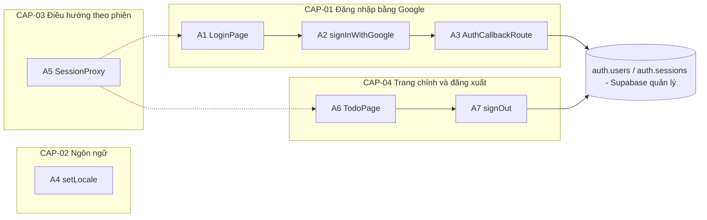
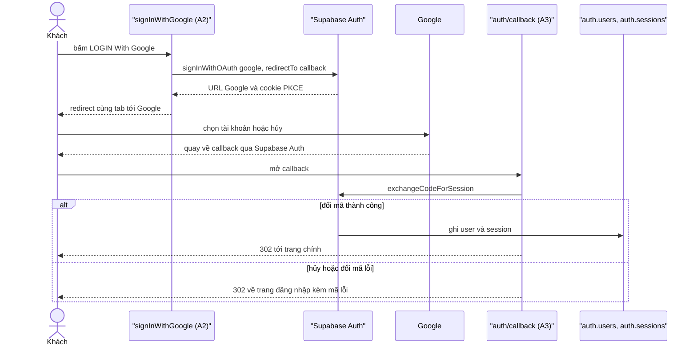

# F001_LoginWithGoogle

## 1. Technical Overview

Người dùng chưa đăng nhập vào `/login`, bấm nút Google, đi qua Supabase Auth (luồng PKCE, chuyển hướng cùng tab) tới Google rồi quay về `/auth/callback`; tại đây mã được đổi lấy phiên và người dùng vào `/todo`. Phiên nằm trong cookie do `@supabase/ssr` quản lý, được làm mới và dùng để chặn truy cập ở `proxy.ts`. Mọi truy cập Supabase đều chạy phía máy chủ (Server Action, Route Handler, proxy) nên không cần client trình duyệt; ngôn ngữ giao diện đăng nhập lấy từ cookie `NEXT_LOCALE` và một từ điển vi/en nằm trong repo.



## 2. Action Index

<!-- Mọi handler dưới đây là TÊN DỰ KIẾN (planned) — chưa có mã nguồn. -->

| # | Action (handler) | Method · Path | Codes | Writes | Detail |
|---|---|---|---|---|---|
| **A0** | *cross-cutting — belongs to no single action* | — | — | — | § 4.4 |
| **A1** | `LoginPage#render` *(planned)* | `GET` `/login` | FR-101, FR-201, FR-202, FR-203, FR-204, FR-205, FR-206, FR-403, BR-003, BR-004, US001, US002 | — *(read-only)* | § 3.1 |
| **A2** | `LoginActions#signInWithGoogle` *(planned)* | `POST` `/login` *(Server Action)* | FR-401, BR-006, INT-001, US001 | — *(chỉ ghi cookie PKCE, không ghi DB)* | § 3.1 ▸ **diagram** |
| **A3** | `AuthCallbackRoute#GET` *(planned)* | `GET` `/auth/callback` | FR-402, FR-403, FR-601, BR-001, BR-002, BR-003, DEC-003, INT-001, US001, US002 | `auth.users`, `auth.sessions` *(Supabase quản lý)* | § 3.1 ▸ **diagram** |
| **A4** | `LocaleActions#setLocale` *(planned)* | `POST` `/login` *(Server Action)* | FR-404, BR-004, US003 | — *(chỉ ghi cookie `NEXT_LOCALE`)* | § 3.2 |
| **A5** | `SessionProxy#proxy` *(planned)* | `proxy` · `/login`, `/todo/:path*` | FR-001, FR-102, FR-103, BR-005, DEC-001, DEC-002, INT-001, US004, US005 | — *(chỉ làm mới cookie phiên)* | § 3.3 |
| **A6** | `TodoPage#render` *(planned)* | `GET` `/todo` | FR-405, BR-005, BR-007, INT-001, US005, US006 | — *(read-only)* | § 3.4 |
| **A7** | `TodoActions#signOut` *(planned)* | `POST` `/todo` *(Server Action)* | FR-406, INT-001, US007 | `auth.sessions` *(Supabase quản lý)* | § 3.4 |

## 3. Actions

### 3.1 CAP-01 — LoginWithGoogle

Luồng đăng nhập là một chuỗi qua ba handler (A1 hiển thị → A2 khởi động → A3 hoàn tất) nên sơ đồ đặt ở mức capability, không lặp ở từng action.



#### A1 · Hiển thị trang đăng nhập
`GET /login` → `LoginPage#render` *(planned)*
`FR-101` `FR-201` `FR-202` `FR-203` `FR-204` `FR-205` `FR-206` `FR-403` `BR-003` `BR-004` `US001` `US002` · `SCR001`

**Who** · Khách chưa đăng nhập *(người đã đăng nhập bị A5 chuyển đi trước khi tới đây)*
**FE** · Trang `app/login/page.tsx` (planned): vỏ tĩnh gồm header cố định (logo + bộ chọn ngôn ngữ), hero ("ROOT FURTHER" + hai dòng mô tả), nút Google và footer cố định. Phần đọc cookie và `searchParams` nằm trong component con bọc `<Suspense>` vì `cacheComponents` bật.
**Request** · query `error` *(tùy chọn: `cancelled` hoặc `failed`)*; cookie `NEXT_LOCALE`
**BE** · `getLocale()` đọc cookie `NEXT_LOCALE`, tra từ điển `lib/i18n/dictionary.ts`; không gọi dịch vụ ngoài.
**Rule**
- **BR-003 — Hủy và thất bại dùng chung một thông báo.** Chỉ `cancelled` và `failed` mới hiện lỗi, cả hai ra cùng một câu theo ngôn ngữ hiện tại; mã khác bị bỏ qua. *(§ 4.4)*
- **BR-004 — Ngôn ngữ chỉ là `vi` hoặc `en`, mặc định `vi`.** Giá trị cookie lạ hoặc thiếu được coi là `vi`. *(§ 4.4)*
**Result** · Chỉ đọc, không ghi DB. Có `error` hợp lệ thì thông báo hiện ngay dưới nút với `role="alert"`; nút Google giữ nguyên để người dùng thử lại.
**Source:** TBD (draft)

---

#### A2 · Khởi động đăng nhập Google
`POST /login` *(Server Action)* → `LoginActions#signInWithGoogle` *(planned)*
`FR-401` `BR-006` `INT-001` `US001` · `SCR001`

**Who** · Khách chưa đăng nhập
**FE** · `GoogleButton` (`app/login/google-button.tsx`, client component) dùng `useActionState`: khi `pending` nút `disabled` + `aria-busy="true"` + biểu tượng đang tải; khi action trả lỗi thì hiện thông báo inline `role="alert"` và xóa khi lần thử kế tiếp bắt đầu. Sự kiện `pageshow` với `persisted` (bfcache, người dùng bấm Back từ Google) buộc tải lại trang.
**Request** · không có tham số; `origin` lấy từ header `origin` của request, mặc định `http://localhost:3000`
**BE** · `createClient()` (`lib/supabase/server.ts`) → `supabase.auth.signInWithOAuth({ provider: "google", options: { redirectTo: "<origin>/auth/callback" } })`. Có `data.url` thì `redirect(data.url)` (đặt ngoài try/catch vì `redirect()` ném lỗi điều hướng); có `error` hoặc thiếu `data.url` thì trả `{ error: "failed" }`.
**Rule** · **BR-006 — Không bấm lại được khi đang chờ.** Trạng thái `pending` của `useActionState` vô hiệu hóa nút, nên không thể gửi hai yêu cầu đăng nhập chồng nhau.
**Result** · Không ghi DB. Ghi cookie PKCE code verifier cùng host với callback; trình duyệt chuyển cùng tab sang Google. `INT-001` ở đây: bắt đầu luồng OAuth tại dịch vụ xác thực để lấy URL ủy quyền Google *(§ 4.5)*.
**Source:** TBD (draft)

---

#### A3 · Hoàn tất đăng nhập tại callback
`GET /auth/callback` → `AuthCallbackRoute#GET` *(planned)*
`FR-402` `FR-403` `FR-601` `BR-001` `BR-002` `BR-003` `DEC-003` `INT-001` `US001` `US002` · `SCR001`

**Who** · Khách vừa quay về từ Google
**FE** · không có giao diện — chỉ trả chuyển hướng 302
**Request** · query `code` *(vắng khi hủy)*; cookie PKCE code verifier
**BE** · `createClient()` → `supabase.auth.exchangeCodeForSession(code)`; cookie phiên được ghi qua `setAll`. Lỗi mạng hoặc ngoại lệ khi gọi dịch vụ xác thực cũng bị bắt và coi là `failed`. `INT-001` ở đây: đổi mã xác thực lấy phiên *(§ 4.5)*.
**Rule**
- **BR-001 — Mọi tài khoản Google đều được phép đăng nhập.** Không kiểm tra tên miền hay danh sách email; Google xác nhận danh tính là đủ.
- **BR-002 — Đích sau đăng nhập cố định là `/todo`.** Không đọc địa chỉ đích từ query, nên không có open redirect (`FR-601`).
- **BR-003 — Hủy và thất bại dùng chung một thông báo.** A3 chỉ phát hai mã `cancelled` và `failed`; A1 hiển thị. *(§ 4.4)*

| DEC | subtype | Condition | What the user sees | Source |
|---|---|---|---|---|
| **DEC-003** | flow | có `code` VÀ `exchangeCodeForSession` thành công | chuyển tới `/todo` với phiên đã lập | TBD (draft) |
| **DEC-003** | flow | có `code` nhưng đổi mã lỗi hoặc ngoại lệ | về `/login?error=failed` | TBD (draft) |
| **DEC-003** | flow | không có `code` (người dùng hủy) | về `/login?error=cancelled` | TBD (draft) |

**Result** · Lần đăng nhập đầu Supabase tạo bản ghi `auth.users` (và `auth.identities`); mỗi lần đăng nhập tạo một `auth.sessions`. Cookie phiên được đặt qua `setAll`. Người dùng thấy: `/todo`, hoặc `/login` kèm thông báo lỗi.
**Source:** TBD (draft)

---

### 3.2 CAP-02 — SwitchLanguage

#### A4 · Đổi ngôn ngữ giao diện đăng nhập
`POST /login` *(Server Action)* → `LocaleActions#setLocale` *(planned)*
`FR-404` `BR-004` `US003` · `SCR001`

**Who** · Khách chưa đăng nhập
**FE** · Bộ chọn ngôn ngữ ở header (component dự kiến, tên file `TBD (draft)`): bấm mở danh sách thả xuống, chọn một mục gọi action; nội dung trang đổi theo khi Next làm mới giao diện.
**Request** · `locale` = `vi` \| `en`
**BE** · `setLocale(locale)` kiểm tra giá trị rồi ghi cookie `NEXT_LOCALE` (`path=/`, 1 năm, `sameSite=lax`) trong `lib/i18n/actions.ts`.
**Rule** · **BR-004 — Ngôn ngữ chỉ là `vi` hoặc `en`, mặc định `vi`.** Giá trị khác bị bỏ qua, cookie giữ nguyên. *(§ 4.4)*
**Result** · Không ghi DB, chỉ ghi cookie. Người dùng thấy toàn bộ chữ trên trang đăng nhập chuyển sang ngôn ngữ đã chọn và lựa chọn được nhớ cho lần sau.
**Source:** TBD (draft)

---

### 3.3 CAP-03 — RouteBySession

#### A5 · Chặn và chuyển hướng theo phiên
`proxy` trên `/login`, `/todo/:path*` → `SessionProxy#proxy` *(planned)*
`FR-001` `FR-102` `FR-103` `BR-005` `DEC-001` `DEC-002` `INT-001` `US004` `US005`

**Who** · Mọi request tới `/login` hoặc `/todo/*`
**Request** · cookie phiên Supabase
**BE** · `proxy(request)` (`proxy.ts`, runtime Node) gọi `updateSession` (`lib/supabase/proxy-session.ts`): tạo server client, `supabase.auth.getClaims()` để xác minh chữ ký và làm mới token (`INT-001`: kiểm tra phiên ở dịch vụ xác thực *(§ 4.5)*); trả `supabaseResponse` cuối cùng, và khi redirect thì chép cookie vừa làm mới sang response chuyển hướng. Matcher chỉ gồm `/login` và `/todo/:path*`.
**Rule**
- **BR-005 — Phiên không hợp lệ hoặc hết hạn coi như chưa đăng nhập.** Claims vắng hoặc xác minh lỗi dẫn tới cùng nhánh với khách; không bao giờ tin dữ liệu cookie thô. *(§ 4.4)*

| DEC | subtype | Condition | What the user sees | Source |
|---|---|---|---|---|
| **DEC-001** | flow | đường dẫn là `/login` VÀ có claims hợp lệ | chuyển tới `/todo` | TBD (draft) |
| **DEC-002** | flow | đường dẫn là `/todo/*` VÀ không có claims hợp lệ | chuyển tới `/login`, không kèm thông báo lỗi | TBD (draft) |

**Result** · Không ghi DB. Cookie phiên được làm mới khi token sắp hết hạn; nếu không rơi vào hai nhánh trên, request đi tiếp bình thường.
**Source:** TBD (draft)

---

### 3.4 CAP-04 — TodoAndLogout

#### A6 · Hiển thị trang chính tối thiểu
`GET /todo` → `TodoPage#render` *(planned)*
`FR-405` `BR-005` `BR-007` `INT-001` `US005` `US006` · `SCR002`

**Who** · Người dùng đã đăng nhập
**FE** · Trang `app/todo/page.tsx` (planned) hiển thị email và `<form action={signOut}>` chứa nút Đăng xuất. Đọc phiên trong component con bọc `<Suspense>`.
**BE** · `createClient()` + `getClaims()` (`INT-001`: đọc claims từ dịch vụ xác thực *(§ 4.5)*) lấy `email`; không có claims thì `redirect("/login")`.
**Rule**
- **BR-005 — Phiên không hợp lệ hoặc hết hạn coi như chưa đăng nhập.** Nhánh không có claims ở đây chuyển về `/login`. *(§ 4.4)*
- **BR-007 — Trang chính tự kiểm tra phiên lần nữa.** Không chỉ dựa vào chuyển hướng ở A5: mỗi lần dựng trang đều gọi `getClaims()`, phòng khi proxy bị bỏ qua (Server Action POST tới đúng route trang).
**Result** · Chỉ đọc, không ghi DB. Người dùng thấy email của mình và nút Đăng xuất.
**Source:** TBD (draft)

---

#### A7 · Đăng xuất
`POST /todo` *(Server Action)* → `TodoActions#signOut` *(planned)*
`FR-406` `INT-001` `US007` · `SCR002`

**Who** · Người dùng đã đăng nhập
**FE** · Nút Đăng xuất trong `<form action={signOut}>` ở A6.
**BE** · `createClient()` → `supabase.auth.signOut()` (`INT-001`: hủy phiên ở dịch vụ xác thực *(§ 4.5)*), cookie phiên bị xóa qua `setAll`, rồi `redirect("/login")`.
**Result** · Phiên bị xóa trong `auth.sessions` (Supabase quản lý). Người dùng thấy trang đăng nhập; truy cập `/todo` sau đó bị A5 chuyển về `/login`.
**Source:** TBD (draft)

---

### 3.5 Edge cases

| Action | Scenario | Behavior |
|---|---|---|
| A3 | Người dùng hủy ở Google, query không có `code` | chuyển `/login?error=cancelled`, hiện thông báo lỗi *(BR-003)* |
| A3 | `code` sai hoặc hết hạn (ví dụ `code=bogus`) | `exchangeCodeForSession` lỗi, chuyển `/login?error=failed` |
| A2 · A3 | Dịch vụ xác thực không phản hồi hoặc lỗi mạng | A2 trả `{ error: "failed" }` và nút bật lại; A3 bắt ngoại lệ và chuyển `/login?error=failed`, không trả 500 |
| A2 | Bấm Back từ Google, trình duyệt khôi phục trang từ bfcache ở trạng thái chờ | `pageshow` có `persisted` buộc tải lại để nút về trạng thái ban đầu |
| A1 | `error` khác `cancelled` và `failed` | bỏ qua, không hiện thông báo *(BR-003)* |
| A1 · A4 | Cookie `NEXT_LOCALE` mang giá trị lạ | coi là `vi` *(BR-004)* |
| A5 · A6 | Phiên hết hạn hoặc không hợp lệ giữa chừng | coi như chưa đăng nhập: `/todo` chuyển `/login` *(BR-005)* |

## 4. Shared Foundation

### 4.1 Components

Mọi đường dẫn dưới đây đều là dự kiến (planned), chưa có file.

| Component | Responsibility | Used in | File |
|---|---|---|---|
| `LoginPage` | vỏ tĩnh trang đăng nhập + `<Suspense>` cho phần đọc cookie/query | A1 | `app/login/page.tsx` |
| `GoogleButton` | nút client: `useActionState`, `disabled`, `aria-busy`, lỗi inline, tải lại khi `pageshow` persisted | A1, A2 | `app/login/google-button.tsx` |
| `LanguageSelector` | bộ chọn ngôn ngữ ở header, danh sách thả xuống | A1, A4 | `TBD (draft)` |
| `createClient` | tạo Supabase server client mới mỗi lần gọi, `setAll` có try/catch | A2, A3, A6, A7 | `lib/supabase/server.ts` |
| `updateSession` | `getClaims()` + quy tắc chuyển hướng + chép cookie làm mới | A5 | `lib/supabase/proxy-session.ts` |
| `getLocale` / `dictionary` | đọc `NEXT_LOCALE`, kiểm tra vi/en, từ điển chữ | A1, A4 | `lib/i18n/get-locale.ts`, `lib/i18n/dictionary.ts` |
| `TodoPage` | trang chính tối thiểu | A6 | `app/todo/page.tsx` |

### 4.2 Data Model

#### Key Entities

Ứng dụng không tạo bảng riêng; hai bảng dưới do Supabase Auth quản lý. `MODEL###` → `TBD (draft)`.

| Entity | Table | Key Columns | Purpose |
|--------|-------|-------------|---------|
| Người dùng | `auth.users` | `id`, `email` | danh tính tài khoản Google; Supabase tạo ở lần đăng nhập đầu (A3), A6 đọc `email` qua claims |
| Phiên | `auth.sessions` | `id`, `user_id` | phiên đăng nhập; A3 tạo, A7 hủy, A5 làm mới token |

#### Polymorphic Behavior

N/A — no discriminator fields in Key Entities.

### 4.3 State Management

None.

### 4.4 Shared Rules

Không có quy tắc nào thuộc về mọi action (Bin 3), nên `A0` không claim mã nào.

#### Bin 2 — used by ≥2 named actions

**BR-003 — Hủy và thất bại dùng chung một thông báo lỗi.**
Used in: **A1** · **A3**. A3 chỉ phát hai mã `cancelled` (không có `code`) và `failed` (đổi mã lỗi); A1 hiển thị cùng một câu theo ngôn ngữ hiện tại và bỏ qua mọi mã khác.
**Source:** TBD (draft)
```text
A3: no code            -> redirect /login?error=cancelled
    exchange fails     -> redirect /login?error=failed
A1: error in {cancelled, failed} -> show dictionary[locale].loginFailed
    otherwise                    -> show nothing
```

**BR-004 — Ngôn ngữ chỉ là `vi` hoặc `en`, mặc định `vi`.**
Used in: **A1** · **A4**. A4 chỉ ghi cookie khi giá trị hợp lệ; A1 đọc cookie qua `getLocale()` và rơi về `vi` nếu giá trị lạ hoặc thiếu.
**Source:** TBD (draft)
```text
getLocale(cookie): cookie in {vi, en} ? cookie : vi
setLocale(v):      v in {vi, en} ? set NEXT_LOCALE=v (path=/, 1y, lax) : ignore
```

**BR-005 — Phiên không hợp lệ hoặc hết hạn coi như chưa đăng nhập.**
Used in: **A5** · **A6**. Quyết định dựa trên claims đã được xác minh bằng `getClaims()`, không dựa trên `getSession()` hay cookie thô; claims vắng hoặc lỗi dẫn tới cùng nhánh với khách.
**Source:** TBD (draft)
```text
claims = getClaims()
authenticated = claims is present and verified
A5: /login  and authenticated      -> /todo
    /todo/* and not authenticated  -> /login
A6: not authenticated -> redirect /login
```

### 4.5 Algorithms & Integrations

### Supabase Auth xử lý đăng nhập Google, đổi mã lấy phiên, xác minh phiên và đăng xuất (INT-001)
**Linked FR:** FR-401, FR-402, FR-001, FR-406
**Used in:** A2 → A3, A5, A6, A7
**Source:** TBD (draft)
**Type:** api-call
**Target:** Supabase Auth (local `http://127.0.0.1:54321`), phía sau là Google OAuth; điểm cuối `/auth/v1/authorize`, `/auth/v1/token`, `/auth/v1/logout`
**Payload:** `provider=google`, `redirect_to=<origin>/auth/callback`, tham số PKCE `code_challenge`/`code_challenge_method`; ở A3 gửi `code` kèm code verifier từ cookie. Không có secret nào đi qua trình duyệt.
**Failure handling:** A2 trả `{ error: "failed" }` khi lỗi hoặc thiếu URL; A3 coi lỗi đổi mã hoặc lỗi mạng là `failed` và chuyển hướng; A5 và A6 coi lỗi xác minh là chưa đăng nhập; A7 vẫn chuyển về `/login` sau khi xóa cookie. Không có retry.

### 4.6 Configuration

```text
SUPABASE_URL = http://127.0.0.1:54321    # server-only, không có tiền tố NEXT_PUBLIC_
SUPABASE_PUBLISHABLE_KEY = <từ npx supabase status>   # server-only
GOOGLE_CLIENT_ID / GOOGLE_CLIENT_SECRET   # file .env gốc, do Supabase CLI đọc qua env() — không vào .env.local
supabase/config.toml: additional_redirect_urls gồm http://localhost:3000/auth/callback
supabase/config.toml: [auth.email] enable_signup = true   # chỉ để E2E tạo phiên bằng mật khẩu ở local
NEXT_LOCALE cookie: path=/, maxAge 1 năm, sameSite=lax
proxy matcher: ["/login", "/todo/:path*"]
```

**Client behavior:** see behavior-logic.md, permissions.md, architecture.md

## 5. Verification & Technical Notes

### 5.1 Technical Verification

Chính sách kiểm thử `e2e-red-first`: một file E2E Playwright cấp màn hình (`e2e/login-screen.spec.ts`) chạy RED trước khi có mã giao diện; các ca cần phiên thật nằm riêng trong `e2e/login-authenticated.spec.ts` (gắn `@supabase`) và tạo phiên bằng `e2e/support/supabase-session.ts`.

- **SC-001** *(A1)* Trang `/login` hiển thị logo bên trái và bộ chọn ngôn ngữ bên phải ở header, tiêu đề "ROOT FURTHER", hai dòng mô tả, nút "LOGIN With Google" và footer; logo, mô tả, footer không tương tác (covers FR-201, FR-202, FR-203, FR-204, FR-205)
- **SC-002** *(A1, A4)* Mặc định hiện "VN"; bấm bộ chọn mở danh sách; chọn EN đổi chữ trên trang và đặt cookie `NEXT_LOCALE=en`; cookie giá trị lạ cho kết quả `vi` (covers FR-206, FR-404, BR-004)
- **SC-003** *(A2)* Bấm nút thì nút `disabled` và `aria-busy="true"`; request tới `/auth/v1/authorize` có `provider=google` và `redirect_to=<origin>/auth/callback` (covers FR-401, BR-006)
- **SC-004** *(A3)* `/auth/callback?code=bogus` chuyển `/login?error=failed` và hiện thông báo; không có `code` chuyển `/login?error=cancelled` (covers FR-403, DEC-003, BR-003)
- **SC-005** *(A5, A6)* Chưa đăng nhập vào `/todo` bị chuyển `/login`; đã đăng nhập vào `/login` bị chuyển `/todo` (covers FR-102, FR-103, DEC-001, DEC-002, BR-005)
- **SC-006** *(A6, A7)* `/todo` hiện email; đăng xuất đưa về `/login` và `/todo` lại bị chuyển về `/login` (covers FR-405, FR-406, BR-007)

#### US001 *(A1, A2, A3)*

**Independent Test:** Với phiên Supabase tạo sẵn, xác nhận callback thành công dẫn tới `/todo`; riêng bước Google thật chạy thủ công với tài khoản Google thử nghiệm.

**Acceptance Scenarios:**

1. **Given** khách ở `/login`, **When** bấm nút Google, **Then** nút `disabled` + `aria-busy="true"` và trình duyệt rời trang cùng tab tới Google.
2. **Given** Google xác thực xong, **When** Supabase chuyển tới `/auth/callback?code=…`, **Then** phản hồi 302 tới `/todo`.

#### US002 *(A1, A3)*

**Independent Test:** Mở `/auth/callback?code=bogus` và `/auth/callback` không `code`.

**Acceptance Scenarios:**

1. **Given** đổi mã lỗi, **When** callback chạy, **Then** 302 tới `/login?error=failed` và A1 hiện lỗi dưới nút với `role="alert"`.
2. **Given** lỗi đang hiện, **When** người dùng bấm nút lần nữa, **Then** lỗi bị xóa khi lần thử mới bắt đầu.

#### US003 *(A4)*

**Independent Test:** Chọn EN rồi tải lại trang.

**Acceptance Scenarios:**

1. **Given** ngôn ngữ mặc định `vi`, **When** chọn EN, **Then** cookie `NEXT_LOCALE=en` được đặt và chữ trên trang đổi sang tiếng Anh sau khi tải lại.

#### US004 *(A5)*

**Independent Test:** Với phiên hợp lệ, mở `/login`.

**Acceptance Scenarios:**

1. **Given** có phiên hợp lệ, **When** mở `/login`, **Then** 302 tới `/todo`.

#### US005 *(A5, A6)*

**Independent Test:** Không có cookie phiên, mở `/todo`.

**Acceptance Scenarios:**

1. **Given** không có phiên, **When** mở `/todo`, **Then** 302 tới `/login` không kèm `error`.
2. **Given** proxy bị bỏ qua, **When** A6 dựng trang mà không có claims, **Then** `redirect("/login")`.

#### US006 *(A6)*

**Independent Test:** Với phiên của một email thử nghiệm, mở `/todo`.

**Acceptance Scenarios:**

1. **Given** phiên hợp lệ, **When** mở `/todo`, **Then** trang hiện đúng email và nút Đăng xuất.

#### US007 *(A7)*

**Independent Test:** Bấm Đăng xuất rồi mở lại `/todo`.

**Acceptance Scenarios:**

1. **Given** phiên hợp lệ, **When** bấm Đăng xuất, **Then** chuyển `/login` và cookie phiên bị xóa.
2. **Given** vừa đăng xuất, **When** mở `/todo`, **Then** 302 tới `/login`.

### 5.2 Assumptions

- *(A2)* `redirectTo` dùng `origin` của request để host của cookie PKCE trùng host callback; luôn truy cập qua `http://localhost:3000`, không trộn với `127.0.0.1`.
- *(A3)* Khi người dùng hủy ở Google, Supabase quay về callback không có `code`; coi trường hợp đó là `cancelled`. Chưa chạy thật nên đây là suy luận (inferred).
- *(A2, A3)* Test case 60bc5bbb mô tả luồng "tab mới hoặc popup", nhưng đặc tả 2.2.1 và clarifications chọn chuyển hướng cùng tab; E2E kiểm tra điều hướng cùng tab, test case này không được dùng làm tiêu chí.
- *(A2)* E2E không gọi Google thật: chặn request `/auth/v1/authorize` bằng `page.route` và giữ lại để quan sát trạng thái `disabled`; đường thành công chỉ được kiểm bằng phiên tạo sẵn.
- *(A5, A6)* Ca cần phiên tạo sẵn phụ thuộc `[auth.email] enable_signup = true` (đã được duyệt) và Supabase local đang chạy; ca bị bỏ qua vì thiếu Supabase không được tính là GREEN.

### 5.3 Unresolved Questions

1. **Trạng thái chờ sau redirect ngoài** *(A2)*: chưa xác nhận `pending` của `useActionState` còn giữ đến khi trình duyệt rời trang khi action kết thúc bằng `redirect()` tới URL ngoài; cần chứng minh bằng E2E.
2. **Kiểu của tham số thứ hai của `setAll`** *(A2, A3, A5)*: tham số headers trong `@supabase/ssr` 0.12.7 chưa được thử về kiểu.
3. **Nạp `.env` của Supabase CLI** *(A3)*: `env(GOOGLE_CLIENT_ID)` chỉ đọc `.env` gốc, không đọc `.env.local` (supabase/cli#4452); chưa chạy thử.
4. **Trang `/` mặc định** *(A5)*: matcher chỉ phủ `/login` và `/todo/*`; chưa quyết định giữ nguyên trang `/` có sẵn.

### 5.4 Source References

Chưa có mã nguồn — xem `## 7. User Stories` trong functional-spec.md để biết hành vi dự kiến. Bảng này được điền khi triển khai.

#### Data Flow

```text
A2: (không tham số) -> signInWithOAuth(google, redirectTo=<origin>/auth/callback) -> { url, cookie PKCE } -> redirect(url)
A3: ?code -> exchangeCodeForSession(code, verifier cookie) -> cookie phiên + auth.users/auth.sessions -> 302 /todo | /login?error=...
A5: cookie phiên -> getClaims() -> claims hoặc rỗng -> next | 302 /todo | 302 /login (+ cookie làm mới)
```

### 5.5 Artifact References

| Artifact | File | Codes Used | Reviewed |
|----------|------|------------|----------|
| System Overview | [system-overview.md](../../docs/system/system-overview.md) | — | [ ] |
| Architecture | [architecture.md](../../docs/system/architecture.md) | — | [ ] |
| Feature List | [feature-list.md](../../docs/generated/feature-list.md) | F001 | [ ] |
| API Map | [api-map.md](../../docs/generated/api-map.md) | TBD (draft) | [ ] |
| Entities | [entities.md](../../docs/generated/entities.md) | TBD (draft) | [ ] |
| Screens | [functional-spec.md § 6](./functional-spec.md#6-screens) | TBD (draft) | [ ] |
| Behavior Logic | [behavior-logic.md](../../docs/generated/behavior-logic.md) | TBD (draft) | [ ] |
| Permissions Matrix | [permissions-matrix.md](../../docs/generated/permissions-matrix.md) | TBD (draft) | [ ] |
| User Stories | [user-stories.md](../../docs/generated/user-stories.md) | TBD (draft) | [ ] |
