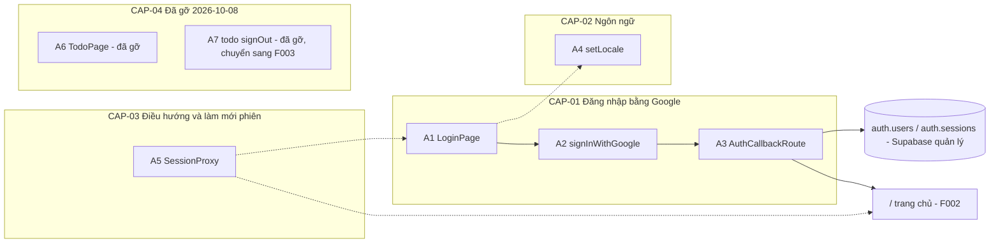
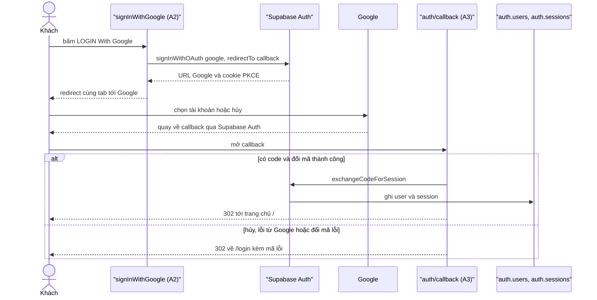
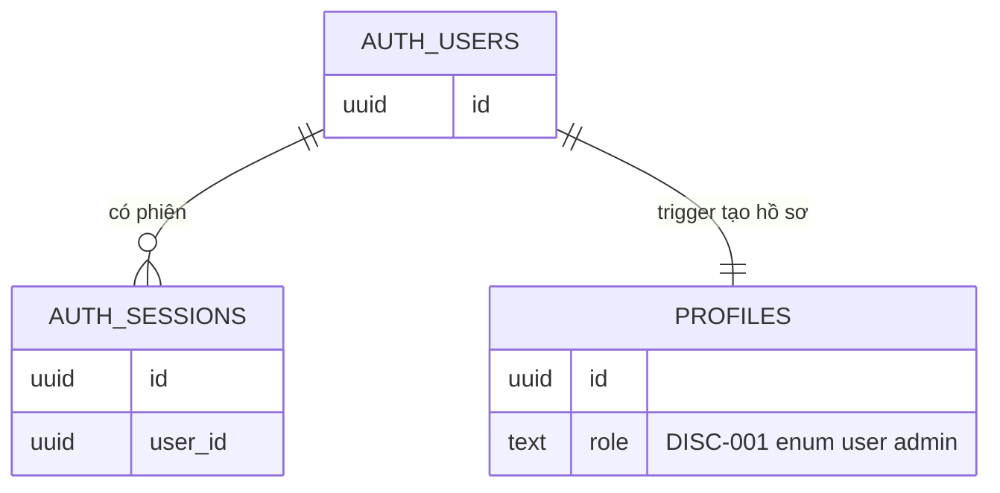

<!-- layout-exempt: rebuild-spec owns all docs/system|features|generated|flows paths — all references here are output targets or internal definitions -->
<!-- Contract: references/feature-spec-researcher-contract.md -->
<!-- Nửa Dev/QA/SA của cặp spec F001. Nửa BA/QA (mô tả thuần ngôn ngữ, yêu cầu/quy tắc một dòng, màn hình, user story, kịch bản) nằm ở functional-spec.md. Mỗi mã FR/BR/DEC/INT được PHÁT BIỂU một lần ở functional-spec.md và TRIỂN KHAI một lần ở đây. -->

# F001_LoginWithGoogle — Technical Spec

**Priority**: P1
**Type**: mixed
**Generated**: 2026-10-08

**See also:** [`functional-spec.md`](./functional-spec.md) — mô tả thuần ngôn ngữ, quyết định mở, yêu cầu/quy tắc một dòng, màn hình, user story, kịch bản, ca biên và cấu hình cho BA/QA.

**How to read this file:** § 2 là bảng chỉ mục — chọn action cần xem rồi đọc khối của nó ở § 3 một mạch từ đầu đến cuối. § 4 là phụ lục dùng chung — chỉ nhảy vào khi một khối ở § 3 trỏ tới.

> Note: nhãn story cũ "US005/US006/US007" trong bản nháp trước là số cục bộ của feature và đã bị thay thế; chúng trùng với US005_OpenProfile, US006_SignOut, US007_OpenAdminDashboard của F003 nên không được dùng làm mã F001. Ba story cũ (khách bị chặn khỏi trang chính, xem tài khoản đang đăng nhập, đăng xuất) đã gỡ ngày 2026-10-08 cùng trang `/todo`.

## 1. Technical Overview

Khách mở `/login`, bấm nút Google; Server Action khởi động luồng OAuth PKCE của Supabase Auth và chuyển cùng tab sang Google. Google trả về `/auth/callback`, route handler đổi `code` lấy phiên rồi 302 về trang chủ `/` (hoặc về `/login?error=cancelled|failed`). Phiên nằm trong cookie do `@supabase/ssr` quản lý; `proxy.ts` làm mới cookie ở `/`, `/login` và `/awards-information`, đồng thời chuyển người đã đăng nhập mở `/login` về `/` — `/` là trang công khai nên proxy không bao giờ chuyển hướng khách. Toàn bộ truy cập Supabase chạy phía máy chủ (Server Action, Route Handler, proxy); ngôn ngữ giao diện lấy từ cookie `NEXT_LOCALE` và từ điển vi/en trong repo. Trang `/todo` và đăng xuất đã gỡ khỏi F001 (2026-10-08); đăng xuất thuộc F003.



## 2. Action Index

| # | Action (handler) | Method · Path | Codes | Writes | Detail |
|---|---|---|---|---|---|
| **A0** | *cross-cutting — belongs to no single action* | — | — | — | § 4.4 |
| **A1** | `LoginPage#render` | `GET` `/login` | FR-101, FR-201, FR-202, FR-203, FR-204, FR-205, FR-403, FR-407, BR-003, BR-004, US001, US002 | — *(read-only)* | § 3.1 |
| **A2** | `LoginActions#signInWithGoogle` | `POST` `/login` *(Server Action)* | FR-401, FR-602, BR-006, BR-008, BR-009, INT-001, US001 | — *(chỉ ghi cookie PKCE, không ghi DB)* | § 3.1 ▸ **diagram** |
| **A3** | `AuthCallbackRoute#GET` | `GET` `/auth/callback` | FR-402, FR-403, FR-601, BR-001, BR-002, BR-003, BR-009, DEC-003, INT-001, US002, US013 | `auth.users`, `auth.sessions` *(Supabase quản lý)* | § 3.1 ▸ **diagram** |
| **A4** | `LocaleActions#setLocale` | `POST` `/login` *(Server Action)* | FR-206, FR-207, FR-404, FR-407, BR-004, US012 | — *(chỉ ghi cookie `NEXT_LOCALE`)* | § 3.2 |
| **A5** | `SessionProxy#proxy` | `proxy` · `/`, `/login`, `/awards-information` | FR-001, FR-102, FR-103, BR-002, BR-005, BR-009, DEC-001, DEC-002, INT-001, US014, US015 | — *(chỉ làm mới cookie phiên)* | § 3.3 |
| **A6** | *(đã gỡ 2026-10-08)* `TodoPage#render` | — *(trước đây `GET` `/todo`)* | FR-405, BR-007 | — | § 3.4 |
| **A7** | *(đã gỡ 2026-10-08)* `TodoActions#signOut` | — *(trước đây `POST` `/todo`)* | FR-406 | — | § 3.4 |

> Note: `FR-103`, `DEC-002`, `FR-405`, `FR-406`, `BR-007`, A6 và A7 là mã đã gỡ (2026-10-08); giữ nguyên để truy vết, không được dùng lại. `setLocale` còn được gọi từ trang chủ (ROUTE003) — luồng đó thuộc US017 của F002; F001 chỉ sở hữu luồng ở `/login` (ROUTE006).

## 3. Actions

### 3.1 CAP-01 — Đăng nhập bằng Google

Luồng đăng nhập là một chuỗi qua ba handler (A1 hiển thị → A2 khởi động → A3 hoàn tất) nên sơ đồ đặt ở mức capability, không lặp ở từng action.



#### A1 · Hiển thị trang đăng nhập
`GET /login` → `` `LoginPage#render` ``
`FR-101` `FR-201` `FR-202` `FR-203` `FR-204` `FR-205` `FR-403` `FR-407` `BR-003` `BR-004` `US001` `US002` · `SCR001_Login`

**Who** · Khách chưa đăng nhập *(người đã đăng nhập bị A5 chuyển đi trước khi tới đây)*
**FE** · `app/login/page.tsx:15-21` là vỏ tĩnh bọc `<Suspense>`; phần đọc `searchParams` và cookie nằm trong `LoginContent` (`app/login/page.tsx:23-44`) để `cacheComponents` prerender được vỏ. `LoginScreen` (`app/login/_components/login-screen.tsx:20-109`) ghép header cố định (logo ảnh không bấm được + bộ chọn ngôn ngữ, `:48-59`), tiêu đề "ROOT FURTHER" dạng ảnh kèm chữ ẩn cho trình đọc màn hình (`:65-76`), hai dòng giới thiệu (`:80-83`), `GoogleButton` (`:84-89`) và footer cố định (`:101-106`). Thông báo lỗi do `GoogleButton` vẽ với `role="alert"` (`app/login/_components/google-button.tsx:50-57`) và bị ẩn khi nút đang chờ (`!pending && state.error`).
**Request** · query `error` *(tùy chọn)*; cookie `NEXT_LOCALE`
**BE** · `getLocale()` đọc cookie rồi tra từ điển `getDictionary(locale).login`; không gọi dịch vụ ngoài. `HtmlLangSync` đặt `<html lang>` theo ngôn ngữ vừa tra *(FR-407, § 4.1)*. `app/login/page.tsx:28-41`
**Rule**
- **BR-003 — Hủy và thất bại dùng chung một thông báo.** Chỉ `cancelled` và `failed` mới bật lỗi (danh sách `ALERT_ERRORS`), cả hai ra cùng một câu theo ngôn ngữ hiện tại; mã khác bị bỏ qua và không được phản chiếu vào trang. *(§ 4.4)*
- **BR-004 — Ngôn ngữ chỉ là `vi` hoặc `en`, mặc định `vi`.** Giá trị cookie lạ hoặc thiếu được coi là `vi`. *(§ 4.4)*
**Result** · Chỉ đọc, không ghi DB. `error` hợp lệ thì khởi tạo `useActionState` với `{ error: "failed" }`, thông báo hiện ngay dưới nút; nút Google giữ nguyên để thử lại.
**Source:** `app/login/page.tsx:15-44` → `app/login/_components/login-screen.tsx:20-109` → `app/login/_components/google-button.tsx:13-60` → `lib/i18n/get-locale.ts:9-12` → `lib/i18n/dictionary.ts:25-41`

<!-- Không có diagram: action chỉ đọc, một luồng đồng bộ, không ghi bảng nào. -->

---

#### A2 · Khởi động đăng nhập Google
`POST /login` *(Server Action)* → `` `LoginActions#signInWithGoogle` ``
`FR-401` `FR-602` `BR-006` `BR-008` `BR-009` `INT-001` `US001` · `SCR001_Login`

**Who** · Khách chưa đăng nhập *(công khai theo thiết kế: bắt đầu đăng nhập không cần phiên)*
**FE** · `GoogleButton` (client component) dùng `useActionState`: khi `pending` thì nút `disabled`, `aria-busy="true"` và biểu tượng Google đổi thành spinner (`app/login/_components/google-button.tsx:19-21,37-48`). Khi action trả `{ error: "failed" }` thì thông báo inline hiện lại sau khi hết `pending` (`:50-57`). Sự kiện `pageshow` có `persisted` (người dùng bấm Back từ Google, bfcache khôi phục trạng thái chờ) buộc `window.location.reload()` (`:24-30`).
**Request** · không có tham số từ người dùng; `origin` suy ra từ header của request *(BR-008)*
**BE** · `requestOrigin(await headers())` (`app/login/actions.ts:33`) → `createClient()` (`:39`) → `supabase.auth.signInWithOAuth({ provider: "google", options: { redirectTo: <origin>/auth/callback } })` (`:40-43`). Có `data.url` thì `redirect(authorizeUrl)` đặt ngoài try/catch vì `redirect()` ném lỗi điều hướng của Next (`:57-60`); có `error`, ngoại lệ hoặc thiếu URL thì trả `{ error: "failed" }` và ghi log `[login]` (`:45-55`). `INT-001` ở đây: bắt đầu luồng OAuth tại dịch vụ xác thực để lấy URL ủy quyền Google *(§ 4.5)*.
**Rule**
- **BR-006 — Không bấm lại được khi đang chờ.** Trạng thái `pending` của `useActionState` vô hiệu hóa nút, nên không thể gửi hai yêu cầu đăng nhập chồng nhau. `app/login/_components/google-button.tsx:39`
- **BR-008 — Địa chỉ quay về luôn thuộc đúng host người dùng đang duyệt, không đoán.** Ưu tiên header `Origin` nếu là http(s); nếu không dùng `x-forwarded-host` hoặc `host` (phải là host[:port] hợp lệ), giao thức lấy từ `x-forwarded-proto`, mặc định `http` cho `localhost`/`127.0.0.1` và `https` cho host khác. Không xác định được thì trả `failed`, không tự bịa địa chỉ. `app/login/actions.ts:71-110`
  ```text
  origin = parseHttpOrigin(Origin) ?? originFromHost(x-forwarded-host ?? host)
  originFromHost: host matches HOST_PATTERN else null
                  proto = x-forwarded-proto in {http,https}
                          else (hostname in {localhost,127.0.0.1} ? http : https)
  origin == null -> return { error: "failed" }   # log [login]
  ```
- **BR-009 — Cookie phiên và cookie PKCE chỉ đọc được phía máy chủ.** Mọi cookie `@supabase/ssr` ghi ra mang `httpOnly`, `sameSite=lax`, `path=/`, và `secure` chỉ khi chạy production; PKCE verifier ghi ở bước này dùng chung cấu hình đó. *(§ 4.4)*
**Result** · Không ghi DB. Ghi cookie PKCE code verifier qua `setAll` (cùng host với callback); trình duyệt chuyển cùng tab sang Google.
**Source:** `app/login/_components/google-button.tsx:13-60` → `app/login/actions.ts:29-61` → `lib/supabase/server.ts:19-50`

---

#### A3 · Hoàn tất đăng nhập tại callback
`GET /auth/callback` → `` `AuthCallbackRoute#GET` ``
`FR-402` `FR-403` `FR-601` `BR-001` `BR-002` `BR-003` `BR-009` `DEC-003` `INT-001` `US002` `US013` · `SCR001_Login`

**Who** · Khách vừa quay về từ Google *(công khai theo thiết kế: nơi phiên được tạo, nằm ngoài matcher của proxy)*
**FE** · không có giao diện — chỉ trả chuyển hướng 302
**Request** · query `code` *(vắng khi hủy)* hoặc `error` *(Google/Supabase báo lỗi)*; cookie PKCE code verifier. Mọi query khác (`next`, `redirect_to`, …) bị bỏ qua.
**BE** · `GET` gọi `completeSignIn(searchParams)` rồi dựng 302 tới đường dẫn cố định trên origin của request (`app/auth/callback/route.ts:24-30`). Nhánh đổi mã: `createClient()` → `supabase.auth.exchangeCodeForSession(code)`, cookie phiên ghi qua adapter `setAll` và Next gắn vào redirect (`:43-48`). Ngoại lệ (Supabase không tới được, thiếu biến môi trường, lỗi ghi cookie) cũng bị bắt và coi là `failed`, ghi log `[auth/callback]`, không bao giờ trả 500 (`:49-59`). `INT-001` ở đây: đổi mã xác thực lấy phiên *(§ 4.5)*.
**Rule**
- **BR-001 — Mọi tài khoản Google đều được phép đăng nhập.** Mã không có nhánh nào đọc email, tên miền hay danh sách cho phép; Google xác nhận danh tính rồi đổi được mã là đủ. `app/auth/callback/route.ts:32-60`
- **BR-002 — Đích sau đăng nhập cố định là `/` (trang chủ).** `SUCCESS_PATH` là hằng, không đọc đích từ query nên không có open redirect (FR-601); proxy cũng chuyển người đã đăng nhập khỏi `/login` về cùng đích đó. *(§ 4.4; trước 2026-10-08 đích là `/todo`)*
- **BR-003 — Hủy và thất bại dùng chung một thông báo.** A3 chỉ phát hai mã `cancelled` và `failed`; A1 hiển thị. *(§ 4.4)*
- **BR-009 — Cookie phiên chỉ đọc được phía máy chủ.** Cookie phiên vừa lập mang cùng thuộc tính `httpOnly`/`sameSite=lax`/`path=/`, `secure` chỉ ở production. *(§ 4.4)*

| DEC | subtype | Condition | What the user sees | Source |
|---|---|---|---|---|
| **DEC-003** | flow | có `error` từ nhà cung cấp, bằng `access_denied` (người dùng hủy ở Google) | về `/login?error=cancelled`; `code` đi kèm (nếu có) không bao giờ được đổi | `app/auth/callback/route.ts:35-38` |
| **DEC-003** | flow | có `error` từ nhà cung cấp, giá trị khác | về `/login?error=failed` | `app/auth/callback/route.ts:35-38` |
| **DEC-003** | flow | không có `error` và không có `code` (hoặc `code` rỗng) | về `/login?error=cancelled` | `app/auth/callback/route.ts:40-41` |
| **DEC-003** | flow | có `code` VÀ `exchangeCodeForSession` thành công | chuyển tới `/` với phiên đã lập | `app/auth/callback/route.ts:43-48` |
| **DEC-003** | flow | có `code` nhưng đổi mã lỗi hoặc ném ngoại lệ | về `/login?error=failed` | `app/auth/callback/route.ts:49-59` |

**Result** · Lần đăng nhập đầu, Supabase tạo bản ghi `auth.users` (và `auth.identities`); mỗi lần đăng nhập tạo một `auth.sessions`; cùng lúc trigger DB `on_auth_user_created` chèn dòng `public.profiles` với role mặc định `user` *(thực thể thuộc F003, xem § 4.2)*. Cookie phiên ghi qua `setAll`. Người dùng thấy trang chủ `/`, hoặc `/login` kèm thông báo lỗi.
**Source:** `app/auth/callback/route.ts:24-60` → `lib/supabase/server.ts:19-50` → `supabase/migrations/20261008045415_create_profiles.sql:41-58`

---

### 3.2 CAP-02 — Chọn ngôn ngữ màn hình Login

#### A4 · Đổi ngôn ngữ giao diện
`POST /login` *(Server Action `setLocale`, ROUTE006)* → `` `LocaleActions#setLocale` ``
`FR-206` `FR-207` `FR-404` `FR-407` `BR-004` `US012` · `SCR001_Login`

**Who** · Khách chưa đăng nhập
**FE** · `LanguageSelector` (`app/_components/site/language-selector.tsx:24-146`, client component dùng chung với trang chủ) hiển thị cờ + mã "VN"/"EN" và mũi tên xuống; nhãn truy cập "Ngôn ngữ: VN" / "Language: EN" (`:19-22,85-115`). Bấm mở menu hai mục, mục đang chọn được focus (`:117-143`). Chọn ngôn ngữ khác gọi `onSelect` trong `startTransition` (`:47-58`); chọn lại đúng ngôn ngữ hiện tại chỉ đóng menu (`:49`). `Esc` đóng và trả focus về nút, `Tab` đóng không kéo focus lại, `ArrowUp`/`ArrowDown` xoay vòng giữa hai mục, bấm ra ngoài đóng (`:33-40,60-79`) *(FR-207)*. Action ném lỗi thì chỉ ghi log `[language] switch failed` và giữ ngôn ngữ cũ (`:51-56`).
**Request** · `locale` = `vi` \| `en`
**BE** · `setLocale(locale)` kiểm tra bằng `isLocale` rồi ghi cookie `NEXT_LOCALE` (`path=/`, `maxAge` 1 năm, `sameSite=lax`) — `lib/i18n/actions.ts:8-17`, danh sách cho phép ở `lib/i18n/locales.ts:1-11`. Giá trị ngoài danh sách bị bỏ qua, không ghi.
**Rule** · **BR-004 — Ngôn ngữ chỉ là `vi` hoặc `en`, mặc định `vi`.** `setLocale` bỏ qua giá trị lạ, cookie giữ nguyên; `getLocale()` coi cookie lạ hoặc thiếu là `vi`. *(§ 4.4)*
**Result** · Không ghi DB, chỉ ghi cookie (không `httpOnly` vì script `<html lang>` đọc bằng `document.cookie`). Next làm mới cây giao diện nên chữ đổi ngay; `HtmlLangSync` cập nhật `<html lang>` sau điều hướng mềm, còn `HtmlLangScript` đặt `lang` trước lần vẽ đầu ở lần tải cứng *(FR-407, § 4.1)*.
**Source:** `app/_components/site/language-selector.tsx:24-146` → `lib/i18n/actions.ts:8-17` → `lib/i18n/locales.ts:1-11` → `app/_components/html-lang.tsx:10-35`

---

### 3.3 CAP-03 — Điều hướng và làm mới phiên

#### A5 · Làm mới phiên và chuyển hướng theo phiên
`proxy` trên `/`, `/login` và `/awards-information` → `` `SessionProxy#proxy` ``
`FR-001` `FR-102` `FR-103` `BR-002` `BR-005` `BR-009` `DEC-001` `DEC-002` `INT-001` `US014` `US015` *(FR-103, DEC-002 đã gỡ 2026-10-08)* · `SCR001_Login`

**Who** · Mọi request `GET`/`HEAD`/`POST` tới `/` hoặc `/login` *(`/` là trang chủ công khai của F002)*
**Request** · cookie phiên Supabase
**BE** · `proxy(request)` (`proxy.ts:9-11`, runtime Node) uỷ quyền cho `updateSession` (`lib/supabase/proxy-session.ts:30-52`): `hasVerifiedSession` tạo server client trên cookie của request và gọi `supabase.auth.getClaims()` để xác minh chữ ký và làm mới token (`:60-97`; `INT-001`: kiểm tra phiên ở dịch vụ xác thực *(§ 4.5)*). Cookie mới được gom vào `pending`, phản chiếu lên request để Server Component cùng request đọc được token mới (`:72-78`), rồi gắn vào response kể cả khi là redirect — nếu không sẽ mất token mới và gây vòng đăng xuất (`:43-50`). Matcher là `["/", "/login", "/awards-information"]` (`proxy.ts:18-20`); `/` và `/awards-information` (thêm bởi F004) được khớp để token xoay vòng ở trang công khai rơi vào cookie của response (Server Component không ghi được cookie).
**Rule**
- **BR-005 — Phiên không hợp lệ hoặc hết hạn coi như chưa đăng nhập.** Claims vắng, lỗi xác minh, lỗi mạng hoặc thiếu/sai biến môi trường Supabase đều dẫn tới nhánh khách, request đi tiếp và chỉ ghi log `[proxy]`, không bao giờ trả 500; quyết định dựa trên claims đã xác minh bằng `getClaims()`, không dựa trên `getSession()` hay cookie thô. `lib/supabase/proxy-session.ts:54-96`
  ```text
  authenticated = getClaims() returns verified claims (any error -> false)
  redirectTarget:
    method not in {GET, HEAD}          -> next (Server Action POST never redirected)
    authenticated and path == /login   -> 307 /
    otherwise                          -> next (cookie refresh only; guest on / passes)
  ```
- **BR-002 — Đích chuyển hướng cố định là `/`.** `POST_LOGIN_PATH` là hằng, không đọc từ query nên không có open redirect. *(§ 4.4)*
- **BR-009 — Cookie làm mới giữ cùng thuộc tính an toàn.** Server client của proxy dùng chung `SESSION_COOKIE_OPTIONS` với server client thường. *(§ 4.4)*

| DEC | subtype | Condition | What the user sees | Source |
|---|---|---|---|---|
| **DEC-001** | flow | method là `GET` hoặc `HEAD` VÀ `pathname === "/login"` VÀ có claims hợp lệ | chuyển 307 tới `/` | `lib/supabase/proxy-session.ts:99-105` |
| **DEC-002** | flow | *Đã gỡ (2026-10-08): từng là "chưa đăng nhập mà vào `/todo` thì về `/login`"; `/todo` bị gỡ và `/` là trang công khai* | không còn nhánh chặn khách: khách ở `/` luôn xem được trang chủ, không bị chuyển hướng | `lib/supabase/proxy-session.ts:99-105` |

**Result** · Không ghi DB. Cookie phiên được làm mới khi token sắp hết hạn; nếu không rơi vào DEC-001, request đi tiếp bình thường. Khách ở `/`, `/login` và `/awards-information` luôn đi tiếp.
**Source:** `proxy.ts:9-20` → `lib/supabase/proxy-session.ts:30-105` → `lib/supabase/session-cookie-options.ts:11-16`

---

### 3.4 CAP-04 — Trang chính tối thiểu và đăng xuất *(đã gỡ 2026-10-08)*

Capability này bị gỡ khỏi F001: trang `/todo` không còn nên A6 và A7 không còn handler. Đăng xuất do F003 đảm nhiệm, không đặc tả lại ở đây. Mã giữ nguyên để truy vết, không đánh số lại.

#### A6 · Hiển thị trang chính tối thiểu *(đã gỡ 2026-10-08)*
`FR-405` `BR-007` · `SCR002_Todo`

**Result** · Đã gỡ: không còn route `/todo` (mở thì trang không tồn tại). BR-007 (trang tự kiểm tra phiên lần nữa) cũng đã gỡ vì chỉ áp dụng cho `/todo`.

---

#### A7 · Đăng xuất *(đã gỡ 2026-10-08)*
`FR-406` · `SCR002_Todo`

**Result** · Đã gỡ khỏi F001; đăng xuất chuyển sang F003.

---

### 3.5 Edge cases

| Action | Scenario | Behavior |
|---|---|---|
| A3 | Người dùng hủy ở Google (`?error=access_denied`) | 302 `/login?error=cancelled`; `code` đi kèm không được đổi *(DEC-003, BR-003)* |
| A3 | `?error=` khác `access_denied` | 302 `/login?error=failed` *(DEC-003)* |
| A3 | Không có `code` và không có `error` | coi là hủy: 302 `/login?error=cancelled` *(DEC-003)* |
| A3 | `code` sai hoặc hết hạn (ví dụ `code=bogus`) | `exchangeCodeForSession` lỗi, 302 `/login?error=failed`, log `[auth/callback]` |
| A3 | Query mang `next` hoặc `redirect_to` | bỏ qua, đích vẫn cố định `/` hoặc `/login?...` trên origin của request *(BR-002)* |
| A2 · A3 | Dịch vụ xác thực không phản hồi hoặc lỗi mạng | A2 trả `{ error: "failed" }`, nút bật lại; A3 bắt ngoại lệ, 302 `/login?error=failed`, không trả 500 |
| A2 | Không có `Origin` hợp lệ và `host` không phải host[:port] hợp lệ | trả `{ error: "failed" }`, không gọi Supabase *(BR-008)* |
| A2 | Bấm Back từ Google, bfcache khôi phục trang ở trạng thái chờ | `pageshow` có `persisted` buộc tải lại để nút về trạng thái ban đầu |
| A1 | `error` khác `cancelled` và `failed` | bỏ qua, không hiện thông báo, không phản chiếu chuỗi query *(BR-003)* |
| A1 · A4 | Cookie `NEXT_LOCALE` mang giá trị lạ | coi là `vi` *(BR-004)* |
| A4 | Chọn lại đúng ngôn ngữ đang dùng, hoặc `setLocale` ném lỗi | chỉ đóng menu / chỉ ghi log `[language] switch failed`, ngôn ngữ giữ nguyên |
| A5 | Phiên hết hạn, claims lỗi hoặc thiếu biến môi trường Supabase | coi như khách: `/login` hiện bình thường, `/` vẫn mở được *(BR-005)* |
| A5 | `POST` (Server Action) khi phiên đã hết hạn | không bao giờ bị chuyển hướng để không làm hỏng lời gọi action *(DEC-001)* |
| A6 | Mở `/todo` | route không còn, trả trang không tồn tại (E2E kiểm `/todo` → 404) |
| A1 · A4 | tệp ảnh nền `/login/key-visual.png` hoặc cờ `/login/flag-gb.svg` chưa có trong `public` | request ảnh 404, hero không có nền / mục EN thiếu cờ; đăng nhập và đổi ngôn ngữ không ảnh hưởng *(functional RISK-03)* |

## 4. Shared Foundation

### 4.1 Components

| Component | Responsibility | Used in | File |
|---|---|---|---|
| `LoginPage` / `LoginContent` | vỏ tĩnh trang đăng nhập + `<Suspense>`; đọc `searchParams` và cookie ngôn ngữ | A1 | `app/login/page.tsx` |
| `LoginScreen` | khung toàn trang: key visual, header, hero, footer | A1 | `app/login/_components/login-screen.tsx` |
| `GoogleButton` | nút client: `useActionState`, `disabled`/`aria-busy`, lỗi inline `role="alert"`, tải lại khi `pageshow` persisted | A1, A2 | `app/login/_components/google-button.tsx` |
| `LanguageSelector` | bộ chọn VN/EN ở header, menu thả xuống, bàn phím, bấm ra ngoài | A1, A4 | `app/_components/site/language-selector.tsx` |
| `HtmlLangScript` / `HtmlLangSync` | đặt `<html lang>` từ cookie trước lần vẽ đầu (tải cứng) và đồng bộ sau điều hướng mềm | A1, A4 | `app/_components/html-lang.tsx`, `app/layout.tsx` |
| `createClient` | tạo Supabase server client mới mỗi request, `setAll` có try/catch | A2, A3 | `lib/supabase/server.ts` |
| `updateSession` / `proxy` | `getClaims()` + quy tắc chuyển hướng + chép cookie làm mới | A5 | `proxy.ts`, `lib/supabase/proxy-session.ts` |
| `SESSION_COOKIE_OPTIONS` / `getSupabaseEnv` | thuộc tính cookie dùng chung; đọc và kiểm tra biến môi trường Supabase phía máy chủ | A2, A3, A5 | `lib/supabase/session-cookie-options.ts`, `lib/supabase/supabase-env.ts` |
| `getLocale` / `dictionary` | đọc `NEXT_LOCALE`, kiểm tra vi/en, từ điển chữ | A1, A4 | `lib/i18n/get-locale.ts`, `lib/i18n/locales.ts`, `lib/i18n/dictionary.ts` |
| `TodoPage` *(đã gỡ 2026-10-08)* | trang chính tối thiểu — không còn | A6 *(đã gỡ)* | `app/todo/page.tsx` *(đã xóa, không có file)* |

### 4.2 Data Model



| Entity | Table | Used for | Action |
|---|---|---|---|
| Người dùng *(Supabase Auth, không có MODEL###)* | `auth.users` | danh tính tài khoản Google; Supabase tạo ở lần đăng nhập đầu | A3 |
| Phiên *(Supabase Auth, không có MODEL###)* | `auth.sessions` | phiên đăng nhập; A3 tạo, A5 làm mới token | A3, A5 |
| MODEL002_Profile *(thuộc F003)* | `public.profiles` | dòng role do trigger DB tạo ở lần đăng nhập đầu; F001 không đọc, không ghi trực tiếp | A3 |

F001 không sở hữu bảng nào. Hai bảng `auth.*` do Supabase quản lý nên không có mã `MODEL###`; `public.profiles` là MODEL002 của F003, chỉ xuất hiện ở đây vì trigger chạy trong cùng lần đăng nhập đầu.

#### Polymorphic Behavior

##### DISC-001 — MODEL002_Profile.role

| Value | Render | Validation | Persistence |
|-------|--------|------------|-------------|
| `user` | F001 không đọc role nên không có khác biệt giao diện | CHECK `role in ('user','admin')` ở DB | A3 gián tiếp: trigger chèn dòng profile và role lấy mặc định `user` (`create_profiles.sql:20,41-58`) |
| `admin` | F001 không đọc role; giao diện admin thuộc F003 | như trên | F001 không bao giờ đặt `admin`; chỉ do vận hành ghi bằng SQL (`unverified` ngoài mã F001) |

**Source:** docs/generated/entities.md § MODEL002_Profile > Discriminator Fields

### 4.3 State Management

None.

### 4.4 Shared Rules

#### Bin 3 — cross-cutting, belongs to no single action

Không có quy tắc nào thuộc về mọi action, nên `A0` không claim mã nào. BR-001, BR-005, BR-006 và BR-008 chỉ một action dùng nên là Bin 1, nằm inline ở § 3.

#### Bin 2 — used by ≥2 named actions

**BR-002 — Đích sau đăng nhập và đích chuyển hướng của người đã đăng nhập luôn là `/`.**
Used in: **A3** · **A5**. Cả hai đích là hằng số trên origin của request, không đọc từ query; `/` là trang chủ công khai (F002) nên đích này không phải tiền tố được bảo vệ.
**Source:** `app/auth/callback/route.ts:4,26-29` · `lib/supabase/proxy-session.ts:6-10,102`
```text
A3: success -> 302 SUCCESS_PATH ("/")        # query ignored
A5: GET|HEAD /login and authenticated -> 307 POST_LOGIN_PATH ("/")
```

**BR-003 — Hủy và thất bại dùng chung một thông báo lỗi.**
Used in: **A1** · **A3**. A3 chỉ phát hai mã `cancelled` và `failed`; A1 hiển thị cùng một câu theo ngôn ngữ hiện tại và bỏ qua mọi mã khác.
**Source:** `app/auth/callback/route.ts:8,26-29` · `app/login/page.tsx:9-11,28-30`
```text
A3: provider error access_denied or no code -> /login?error=cancelled
    other provider error or exchange fails  -> /login?error=failed
A1: error in {cancelled, failed} -> show dictionary[locale].login.loginFailed
    otherwise                    -> show nothing
```

**BR-004 — Ngôn ngữ chỉ là `vi` hoặc `en`, mặc định `vi`.**
Used in: **A1** · **A4**. A4 chỉ ghi cookie khi giá trị hợp lệ; A1 đọc cookie qua `getLocale()` và rơi về `vi` nếu giá trị lạ hoặc thiếu.
**Source:** `lib/i18n/locales.ts:1-11` · `lib/i18n/get-locale.ts:9-12` · `lib/i18n/actions.ts:8-17`
```text
getLocale(cookie): cookie in {vi, en} ? cookie : vi
setLocale(v):      v in {vi, en} ? set NEXT_LOCALE=v (path=/, 1y, lax) : ignore
```

**BR-009 — Cookie phiên và cookie PKCE chỉ đọc được phía máy chủ.**
Used in: **A2** · **A3** · **A5**. Cả server client thường và server client của proxy truyền cùng `SESSION_COOKIE_OPTIONS`, nên cookie nào `@supabase/ssr` ghi (phiên, PKCE verifier) đều `httpOnly`, `sameSite=lax`, `path=/`; cờ `secure` chỉ bật khi `NODE_ENV === "production"` để `http://localhost` vẫn chạy được ở môi trường phát triển.
**Source:** `lib/supabase/session-cookie-options.ts:11-16` · `lib/supabase/server.ts:24` · `lib/supabase/proxy-session.ts:67`
```text
cookieOptions = { httpOnly: true, secure: NODE_ENV == "production", sameSite: "lax", path: "/" }
```

### 4.5 Algorithms & Integrations

### Supabase Auth xử lý đăng nhập Google, đổi mã lấy phiên và xác minh phiên (INT-001)
**Linked FR:** FR-401, FR-402, FR-001
**Used in:** A2 → A3, A5
**Source:** `app/login/actions.ts:39-43` · `app/auth/callback/route.ts:46-47` · `lib/supabase/proxy-session.ts:65-82`
**Type:** api-call
**Target:** Supabase Auth tại `SUPABASE_URL` (máy chủ), phía sau là Google OAuth; điểm cuối authorize/token của Supabase Auth (E2E chặn `/auth/v1/authorize` để quan sát nút chờ)
**Payload:** `provider=google`, `redirectTo=<origin>/auth/callback`, tham số PKCE `code_challenge`/`code_challenge_method` do SDK sinh; ở A3 gửi `code` kèm code verifier từ cookie; ở A5 gửi token trong cookie để `getClaims()` xác minh. Không có secret nào đi qua trình duyệt.
**Failure handling:** A2 trả `{ error: "failed" }` khi lỗi hoặc thiếu URL; A3 coi lỗi đổi mã hoặc lỗi mạng là `failed` và chuyển hướng; A5 coi lỗi xác minh là chưa đăng nhập. Không có retry.

### 4.6 Configuration

```text
SUPABASE_URL = <địa chỉ Supabase>            # server-only, không có tiền tố NEXT_PUBLIC_ (A2, A3, A5)
SUPABASE_PUBLISHABLE_KEY = <khóa publishable>  # server-only; thiếu hoặc sai -> getSupabaseEnv ném lỗi
GOOGLE_CLIENT_ID / GOOGLE_CLIENT_SECRET      # file .env gốc, Supabase CLI đọc qua env() trong supabase/config.toml:304,306
supabase/config.toml:148-150: site_url và additional_redirect_urls (gồm http://localhost:3000/auth/callback)
supabase/config.toml:201: [auth.email] enable_signup = true   # chỉ để E2E tạo phiên bằng mật khẩu ở local
NEXT_LOCALE cookie: path=/, maxAge 1 năm, sameSite=lax        # A4
proxy matcher: ["/", "/login", "/awards-information"]    # trước 2026-10-08: ["/login", "/todo/:path*"]; "/awards-information" thêm 2026-10-09 (F004)
```

**Client behavior:** see
[`behavior-logic.md`](../../generated/behavior-logic.md) (client-side patterns — debounce, optimistic UI, polling, upload, realtime),
[`permissions.md`](../../system/permissions.md) (feature flags / experiments / env / locale gates),
[`architecture.md`](../../system/architecture.md) (guards / deep-link state restoration / unsaved-changes protection).

## 5. Verification & Technical Notes

### 5.1 Technical Verification

Chính sách kiểm thử `e2e-red-first`: các file E2E Playwright cấp màn hình (`e2e/login-screen-layout.spec.ts`, `e2e/login-screen-language.spec.ts`, `e2e/login-screen-oauth-and-errors.spec.ts`, `e2e/auth-callback.spec.ts`); ca cần phiên thật nằm ở `e2e/login-authenticated.spec.ts` và `e2e/auth-callback-success.spec.ts` (`login-authenticated.spec.ts` gắn `@supabase`; `auth-callback-success.spec.ts` chưa gắn nhãn nhưng cũng cần Supabase local và Mailpit), tạo phiên bằng `e2e/support/supabase-session.ts`.

- **SC-001** *(A1)* `/login` hiển thị logo bên trái và bộ chọn ngôn ngữ bên phải ở header cố định, tiêu đề "ROOT FURTHER", hai dòng mô tả không chọn được, nút "LOGIN With Google" và footer cố định; logo không tương tác (covers FR-101, FR-201, FR-202, FR-203, FR-204, FR-205)
- **SC-002** *(A1, A4)* Mặc định hiện "VN"; bấm bộ chọn mở menu; chọn EN đổi chữ và đặt cookie `NEXT_LOCALE=en`, tải lại vẫn giữ; cookie giá trị lạ cho kết quả `vi`; bàn phím `Esc`/`Tab`/mũi tên và bấm ra ngoài hoạt động như § 3.2 (covers FR-206, FR-207, FR-404, FR-407, BR-004)
- **SC-003** *(A2)* Bấm nút thì nút `disabled` và `aria-busy="true"`; request tới authorize của Supabase có `provider=google` và `redirect_to=<origin>/auth/callback`; không có `Origin`/`host` hợp lệ thì `failed` (covers FR-401, FR-602, BR-006, BR-008)
- **SC-004** *(A3)* `/auth/callback?code=bogus` về `/login?error=failed`; không có `code` và `?error=access_denied` về `/login?error=cancelled`; `next`/`redirect_to` không làm đổi đích (covers FR-403, FR-601, DEC-003, BR-002, BR-003)
- **SC-005** *(A5)* Đã đăng nhập vào `/login` bị chuyển `/`; chưa đăng nhập vào `/` vẫn mở được, không bị chuyển hướng; cookie phiên vẫn được làm mới trên `/`; `POST` không bị chuyển hướng (covers FR-001, FR-102, DEC-001, BR-005, BR-009)
- **SC-006** *(A6, A7 — đã gỡ 2026-10-08)* Ca `/todo` hiện email và đăng xuất không còn trong F001 (trước đây covers FR-405, FR-406, BR-007); `/todo` trả không tồn tại; đăng xuất do F003 kiểm thử.
- **SC-007** *(A3)* code hợp lệ cùng cookie PKCE → 302 tới `/` và header hiện nút tài khoản của người đã đăng nhập (`e2e/auth-callback-success.spec.ts`, cần Supabase local và Mailpit) (covers FR-402, BR-001)

#### US001 *(A1, A2)*

**Independent Test:** Mở `/login`, bấm nút Google và chặn request authorize để quan sát trạng thái chờ; bước Google thật chạy thủ công với tài khoản thử nghiệm.

**Acceptance Scenarios:**

1. **Given** khách ở `/login`, **When** bấm nút Google, **Then** nút `disabled` + `aria-busy="true"` có spinner và trình duyệt rời trang cùng tab tới Google.
2. **Given** `signInWithOAuth` lỗi hoặc không xác định được origin, **When** bấm nút, **Then** action trả `{ error: "failed" }`, nút bật lại và thông báo lỗi hiện.

#### US002 *(A1, A3)*

**Independent Test:** Mở `/auth/callback?code=bogus` và `/auth/callback` không `code`, rồi mở `/login?error=<giá trị lạ>`.

**Acceptance Scenarios:**

1. **Given** đổi mã lỗi, **When** callback chạy, **Then** 302 tới `/login?error=failed` và A1 hiện lỗi dưới nút với `role="alert"`.
2. **Given** `?error=<giá trị lạ>`, **When** trang tải, **Then** không có thông báo và chuỗi query không xuất hiện trên trang.

#### US012 *(A1, A4)*

**Independent Test:** Chọn EN rồi tải lại trang; thử bàn phím trên menu.

**Acceptance Scenarios:**

1. **Given** ngôn ngữ mặc định `vi`, **When** chọn EN, **Then** cookie `NEXT_LOCALE=en` được đặt và chữ trên trang đổi sang tiếng Anh.
2. **Given** menu đang mở, **When** nhấn `Esc`, **Then** menu đóng và focus về nút bộ chọn.

#### US013 *(A3)*

**Independent Test:** Với phiên Supabase tạo sẵn (PKCE code thật từ tài khoản thử nghiệm), mở callback.

**Acceptance Scenarios:**

1. **Given** `code` hợp lệ cùng cookie PKCE, **When** callback chạy, **Then** 302 tới `/` và có cookie phiên.
2. **Given** `?error=access_denied`, **When** callback chạy, **Then** 302 tới `/login?error=cancelled` và không tạo phiên.

#### US014 *(A5)*

**Independent Test:** Với phiên hợp lệ, mở `/login`; không phiên thì mở `/login` và `/`.

**Acceptance Scenarios:**

1. **Given** có phiên hợp lệ, **When** `GET /login`, **Then** 307 tới `/`.
2. **Given** khách hoặc `getClaims` lỗi, **When** mở `/login` hoặc `/`, **Then** không chuyển hướng, trang hiện bình thường.

#### US015 *(A5)*

**Independent Test:** Mở `/` với access token sắp hết hạn và với refresh token đã chết.

**Acceptance Scenarios:**

1. **Given** token sắp hết hạn, **When** mở `/`, **Then** cookie mới có trong response và request đi tiếp.
2. **Given** refresh token chết hoặc mạng lỗi, **When** mở `/`, **Then** coi là khách, trang vẫn tải, proxy ghi log `[proxy]`, không trả 500.

### 5.2 Assumptions

- *(A2, A3)* `redirectTo` dùng origin của request để host của cookie PKCE trùng host callback; luôn truy cập qua một host nhất quán (ví dụ `http://localhost:3000`), không trộn với `127.0.0.1`. Pass này không chạy ứng dụng, đây là hành vi đọc từ mã, chưa xác nhận lúc chạy.
- *(A3)* Khi người dùng hủy ở Google, Supabase quay về callback kèm `?error=access_denied` (hoặc không có `code`); cả hai coi là `cancelled`. Chưa chạy Google thật nên mapping `access_denied` là suy luận từ tên hằng `CANCELLED_BY_USER`.
- *(A2, A3)* Test case 60bc5bbb mô tả luồng "tab mới hoặc popup", nhưng đặc tả 2.2.1 và clarifications chọn chuyển hướng cùng tab; E2E kiểm tra điều hướng cùng tab, test case này không được dùng làm tiêu chí.
- *(A2)* E2E không gọi Google thật: chặn request authorize bằng `page.route` và giữ lại để quan sát trạng thái `disabled`; đường thành công chỉ được kiểm bằng phiên tạo sẵn.
- *(A5)* Ca cần phiên tạo sẵn phụ thuộc `[auth.email] enable_signup = true` (đã được duyệt, chỉ local) và Supabase local đang chạy; ca bị bỏ qua vì thiếu Supabase không được tính là GREEN.
- *(A3, A5)* Từ 2026-10-08 đích sau đăng nhập và đích chuyển hướng của `/login` là `/` (theo clarifications của kế hoạch homepage-saa); `/` thuộc F002 và công khai nên A5 không chuyển hướng khách trên `/`.

### 5.3 Unresolved Questions

1. **Trạng thái chờ sau redirect ngoài** *(A2)*: chưa xác nhận trên trình duyệt thật rằng `pending` của `useActionState` còn giữ đến khi trình duyệt rời trang khi action kết thúc bằng `redirect()` tới URL ngoài; E2E chỉ quan sát trạng thái `disabled` khi request authorize bị giữ lại.
2. **`redirectTo` ngoài danh sách cho phép** *(A2)*: chưa xác nhận Supabase cục bộ xử lý ra sao khi origin của request không nằm trong `additional_redirect_urls` (mã chỉ có comment "Supabase still checks the final redirectTo against its allow-list", `app/login/actions.ts:68-70`); cần chạy thử với host khác `localhost`.
3. **Nạp `.env` của Supabase CLI** *(A3)*: `env(GOOGLE_CLIENT_ID)` chỉ được CLI đọc từ `.env` gốc, không từ `.env.local` (supabase/cli#4452); chưa chạy thử trong pass này.
4. **Màn hình bị gỡ** *(A6, A7)*: SCR002_Todo (`/todo`) đã gỡ (2026-10-08); đăng xuất do F003 sở hữu, mã chuyển hướng sau đăng xuất do F003 quyết định.

### 5.4 Source References

| Action | Order | Symbol | Path | Purpose |
|---|---|---|---|---|
| A2, A3, A5 | 1 | `SESSION_COOKIE_OPTIONS` / `getSupabaseEnv` | `lib/supabase/session-cookie-options.ts:11-16`, `lib/supabase/supabase-env.ts:15-38` | thuộc tính cookie dùng chung và biến môi trường Supabase phía máy chủ |
| A2, A3 | 2 | `createClient` | `lib/supabase/server.ts:19-50` | Supabase server client gắn cookie của request |
| A1 | 3 | `LoginPage` / `LoginContent` | `app/login/page.tsx:15-44` | vỏ trang, đọc `error` và ngôn ngữ |
| A1, A2 | 4 | `LoginScreen` / `GoogleButton` | `app/login/_components/login-screen.tsx:20-109`, `app/login/_components/google-button.tsx:13-60` | giao diện, nút chờ và thông báo lỗi |
| A2 | 5 | `signInWithGoogle` | `app/login/actions.ts:29-61` | khởi động OAuth, chuyển sang Google |
| A2 | 6 | `requestOrigin` | `app/login/actions.ts:71-110` | suy ra origin cho `redirectTo` |
| A3 | 7 | `GET` / `completeSignIn` | `app/auth/callback/route.ts:24-60` | đổi mã lấy phiên, chọn đích chuyển hướng |
| A4 | 8 | `LanguageSelector` | `app/_components/site/language-selector.tsx:24-146` | bộ chọn ngôn ngữ |
| A4 | 9 | `setLocale` / `isLocale` | `lib/i18n/actions.ts:8-17`, `lib/i18n/locales.ts:1-11` | ghi cookie ngôn ngữ, danh sách cho phép |
| A1, A4 | 10 | `getLocale` / `getDictionary` | `lib/i18n/get-locale.ts:9-12`, `lib/i18n/dictionary.ts:25-73` | đọc ngôn ngữ và chữ giao diện |
| A1, A4 | 11 | `HtmlLangScript` / `HtmlLangSync` | `app/_components/html-lang.tsx:10-35`, `app/layout.tsx:21-34` | giữ `<html lang>` khớp ngôn ngữ |
| A5 | 12 | `proxy` / `updateSession` | `proxy.ts:9-20`, `lib/supabase/proxy-session.ts:30-105` | làm mới phiên và chuyển hướng `/login` |

#### Data Flow

```text
A2: (không tham số) -> requestOrigin(headers) -> signInWithOAuth(google, redirectTo=<origin>/auth/callback) -> { url, cookie PKCE } -> redirect(url)
A3: ?code | ?error -> (error ? cancelled|failed : exchangeCodeForSession(code, verifier cookie)) -> cookie phiên + auth.users/auth.sessions -> 302 / | /login?error=...
A5: cookie phiên -> getClaims() -> claims hoặc rỗng -> next | 307 / (chỉ GET|HEAD /login) (+ cookie làm mới gắn vào response)
```

### 5.5 Artifact References

| Artifact | File | Codes Used | Reviewed |
|----------|------|------------|----------|
| System Overview | [overview.md](../../system/overview.md) | — | [x] |
| Architecture | [architecture.md](../../system/architecture.md) | — | [x] |
| Feature List | [feature-list.md](../../generated/feature-list.md) | F001 | [x] |
| API Map | [api-map.md](../../generated/api-map.md) | ROUTE003, ROUTE004, ROUTE005, ROUTE006, ROUTE007 | [x] |
| Entities | [entities.md](../../generated/entities.md) | MODEL002 | [x] |
| Screens | [functional-spec.md § 6](./functional-spec.md#6-screens) | SCR001, SCR002 | [x] |
| Behavior Logic | [behavior-logic.md](../../generated/behavior-logic.md) | BL001, BL002, BL003 | [x] |
| Permissions Matrix | [permissions-matrix.md](../../generated/permissions-matrix.md) | PERM001, PERM002, PERM007, PERM008, PERM011 | [x] |
| User Stories | [user-stories.md](../../generated/user-stories.md) | US001, US002, US012, US013, US014, US015 | [x] |
