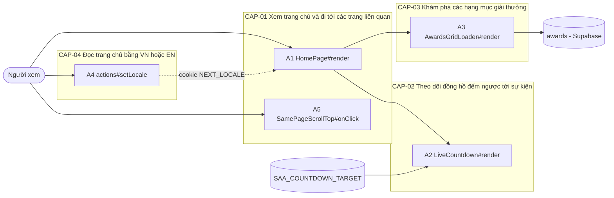
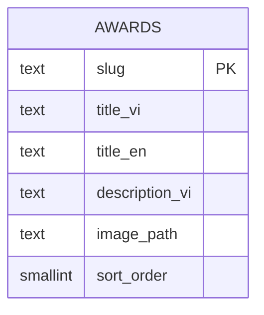

<!-- layout-exempt: rebuild-spec owns all docs/system|features|generated|flows paths — all references here are output targets or internal definitions -->
<!-- Contract: references/feature-spec-researcher-contract.md -->

# F002_HomepageSaa — Technical Spec

**Priority**: P0
**Type**: ui
**Generated**: 2026-10-08

**See also:** [`functional-spec.md`](./functional-spec.md) — plain-language overview, open
decisions, requirements/business rules stated in one-liners, screens, user stories, scenarios,
edge cases, and configuration for a BA/QA audience.

**How to read this file:** § 2 is the index — pick the action you care about and read its block
in § 3 straight through; each block is one complete thread, top to bottom. § 4 is the shared
appendix — jump in only when a § 3 block points you there.

## 1. Technical Overview

Người xem (khách hoặc người đã đăng nhập) mở `/`; trang là một vỏ tĩnh (`SaaPageShell`) bọc một ranh giới `<Suspense>`, bên trong `HomeContent` đọc cookie ngôn ngữ rồi ghép header, hero, Root Further, lưới giải thưởng, khối Sun* Kudos, nút widget và footer. Hai phần đọc dữ liệu lúc chạy nằm sau ranh giới riêng: lưới giải thưởng đọc bảng `awards` trên Supabase qua server client (vai trò `anon` hoặc `authenticated`, RLS cho đọc công khai) và hai vùng tài khoản trong header do F003 cấp. Đồng hồ đếm ngược là client component nhận `targetMs` (epoch ms, parse phía máy chủ từ biến server-only `SAA_COUNTDOWN_TARGET`) và tự tính số phút còn lại ở trình duyệt; ngôn ngữ lấy từ cookie `NEXT_LOCALE` và từ điển vi/en, chỉ chữ giao diện được dịch.



## 2. Action Index

| # | Action (handler) | Method · Path | Codes | Writes | Detail |
|---|---|---|---|---|---|
| **A0** | *cross-cutting — belongs to no single action* | — | FR-601, BR-007 | — | § 4.4 |
| **A1** | `HomePage#render` | `GET` `/` | FR-101, FR-102, FR-103, FR-104, FR-105, FR-201, FR-205, FR-206, FR-207, FR-208, BR-004, BR-006, US008, US009, US010 | — *(read-only)* | § 3.1 |
| **A5** | `SamePageScrollTop#onClick` *(client behaviour, no HTTP)* | — | FR-103, FR-104, FR-105, DEC-002, US016 | — *(read-only, chỉ cuộn trang)* | § 3.1 |
| **A2** | `LiveCountdown#render` *(client component trong A1)* | — | FR-002, FR-202, FR-203, FR-204, BR-001, BR-002, BR-006, DEC-001, ALG-001, ALG-002, US018 | — *(read-only, tính ở trình duyệt)* | § 3.2 |
| **A3** | `AwardsGridLoader#render` | `GET` `/` *(đoạn sau `<Suspense>`)* | FR-001, FR-301, FR-302, FR-303, FR-304, FR-305, FR-306, FR-307, FR-308, FR-309, BR-003, BR-004, BR-005, BR-006, DEC-003, ALG-003, INT-001, US011, US019 | — *(read-only: `awards`)* | § 3.3 |
| **A4** | `actions#setLocale` | `POST` `/` *(Server Action)* | FR-401, FR-402, FR-403, BR-006, US017 | — *(chỉ ghi cookie `NEXT_LOCALE`)* | § 3.4 |

**Rung set** — mỗi khối trong § 3 theo thứ tự **Who** → **FE** → **Request** → **BE** → **Rule** → **Result** → **State** → **Source**; rung vắng thì bỏ hẳn. Feature này không có máy trạng thái bền vững (§ 4.3) nên không có rung **State**. Không action nào ghi ≥2 bảng hoặc chạy nền, nên không khối nào cần `sequenceDiagram`.

## 3. Actions

### 3.1 CAP-01 — Xem trang chủ và đi tới các trang liên quan

#### A1 · Hiển thị trang chủ
`GET /` → `` `HomePage#render` ``
`FR-101` `FR-102` `FR-103` `FR-104` `FR-105` `FR-201` `FR-205` `FR-206` `FR-207` `FR-208` `BR-004` `BR-006` `US008` `US009` `US010` · `SCR003_Homepage`

**Who** · Người xem trang chủ, khách hoặc đã đăng nhập *(gate A0 — § 4.4)*
**FE** · `app/page.tsx:7-15` là vỏ tĩnh: `SaaPageShell` (`app/_components/site/saa-page-shell.tsx:5-14`) bọc một `<Suspense>` có khung chờ nền tối cao bằng màn hình (`app/page.tsx:10`) quanh `HomeContent`. `HomeContent` (`app/_components/home/home-content.tsx:27-61`) gắn `HtmlLangSync`, `SamePageScrollTop` (A5), header, `<main>` (hero, Root Further, mục giải thưởng, Kudos), nút widget và footer. Header cố định (`app/_components/site/site-header.tsx:22`): logo trái (`:26-36`), ba liên kết `/`, `/awards-information`, `/sun-kudos` chỉ hiện từ khổ `lg` trở lên (`:38`, `hidden … lg:flex`), liên kết `/` mang `aria-current="page"` và kiểu "đang chọn" khi `currentPage` là `about`, giá trị mặc định nên trang chủ không truyền prop (`:11-19,40-46`; từ F004 các trang khác truyền `currentPage` để chọn liên kết của chính chúng); bên phải là chuông, bộ chọn ngôn ngữ (A4) và ô vùng tài khoản có kích thước cố định `h-10 w-24` (`:61-68`), hai vùng F003 cắm qua `AccountBellRegion` và `AccountRegion` (`app/_components/home/home-content.tsx:39,41`). Hero (`app/_components/home/hero-section.tsx:10-85`): ảnh key visual `/home/key-visual.png` (`:15-23`), lớp phủ tối (`:25-28`), `<h1>` là ảnh logo kèm chữ ẩn "ROOT FURTHER" cho trình đọc màn hình (`:32-43`), khối thông tin sự kiện (A2, `:52-63`) và hai nút kêu gọi tới `/awards-information` và `/sun-kudos` dùng chung kiểu rê chuột/lấy tiêu điểm (`:7-8,69-80`). Root Further (`app/_components/home/root-further-section.tsx:9-45`) tách mỗi mục thành dòng, đặt câu trích sau đoạn thứ ba (`:5,11-13`). Kudos (`app/_components/home/kudos-section.tsx:6-55`) có nút "Chi tiết" tới `/sun-kudos` (`:36-42`). Widget là `<button type="button">` cố định góc phải dưới, có `aria-label`, không có sự kiện bấm (`app/_components/home/widget-button.tsx:6-25`). Footer (`app/_components/site/site-footer.tsx:15-68`): logo, bốn liên kết (`:37-59`; kiểu "đang chọn" chỉ áp khi prop `currentPage` được truyền, trang chủ không truyền), dòng bản quyền (`:63-65`).
**Request** · cookie `NEXT_LOCALE`; không có tham số
**BE** · `getLocale()` (`lib/i18n/get-locale.ts:9-12`) đọc cookie, `getDictionary(locale)` (`lib/i18n/dictionary.ts:71-73`) trả chữ giao diện; `HomeContent` còn gọi `parseCountdownTarget` cho A2 (`app/_components/home/home-content.tsx:28-31`). Không có lời gọi dịch vụ ngoài ở A1 — dữ liệu giải thưởng thuộc A3, nội dung vùng tài khoản thuộc F003. Nội dung dài (Root Further, câu trích, đoạn Kudos) là hằng số tiếng Việt dùng chung cho cả hai ngôn ngữ (`lib/i18n/home-copy.ts:38-52`).
**Rule**
- **BR-004 — Liên kết tới trang chưa xây dùng địa chỉ dự kiến.** Header, hero, Kudos và footer trỏ `/awards-information`, `/sun-kudos`, `/standards`; `/awards-information` đã có page từ F004 (2026-10-09), hai đích còn lại chưa có nên Next trả 404 mặc định, không có trang lỗi riêng. *(§ 4.4)*
- **BR-006 — Ngôn ngữ chỉ là `vi` hoặc `en` (mặc định `vi`); EN chỉ dịch chữ giao diện.** Nhãn liên kết, nút, tiêu đề mục và bản quyền đổi theo từ điển; Root Further, câu trích và đoạn Kudos giữ tiếng Việt. *(§ 4.4)*

**Result** · Chỉ đọc, không ghi DB. Người xem thấy đủ các khối của trang; footer dùng lại câu bản quyền của màn hình Login (`lib/i18n/dictionary.ts:47,59`).
**Source:** `app/page.tsx:7-15` → `app/_components/home/home-content.tsx:27-61` → `app/_components/site/site-header.tsx:11-71` → `app/_components/home/hero-section.tsx:10-85` → `app/_components/home/root-further-section.tsx:9-45` → `app/_components/home/kudos-section.tsx:6-55` → `app/_components/home/widget-button.tsx:6-25` → `app/_components/site/site-footer.tsx:15-68`

<!-- Không vẽ sequenceDiagram: dưới ngưỡng (chỉ đọc, không ghi bảng nào, không bất đồng bộ). -->

---

#### A5 · Cuộn về đầu trang khi bấm liên kết trỏ về chính trang này
`—` → `` `SamePageScrollTop#onClick` `` *(client, một listener `click` trên `document`)*
`FR-103` `FR-104` `FR-105` `DEC-002` `US016` · `SCR003_Homepage`

**Who** · Người xem trang chủ *(gate A0 — § 4.4)*
**FE** · `SamePageScrollTop` không vẽ gì (`app/_components/header-behaviour/same-page-scroll-top.tsx:17-31`), gắn một lần ở `app/_components/home/home-content.tsx:36`; bao logo và "About SAA 2025" ở header (`app/_components/site/site-header.tsx:26,41`) lẫn footer (`app/_components/site/site-footer.tsx:24,38`) mà không cần prop trên các liên kết (trang chủ giữ nguyên hành vi này; F004 chỉ thêm prop `currentPage` cho kiểu "đang chọn").
**Request** · sự kiện `click` của trình duyệt; không có tham số mạng
**BE** · không có lời gọi máy chủ; chỉ gọi `window.scrollTo({ top: 0, left: 0, behavior: "instant" })` (`app/_components/header-behaviour/same-page-scroll-top.tsx:23`). Không gọi `preventDefault` nên điều hướng của `next/link` vẫn chạy.
**Rule** · quyết định có cuộn hay không:

| DEC | subtype | Condition | What the user sees | Source |
|---|---|---|---|---|
| **DEC-002** | interaction | click chính (nút trái, không Ctrl/Meta/Shift/Alt) VÀ liên kết cùng origin, cùng pathname, không có `#hash`, không `download`, `target` rỗng hoặc `_self` | trang cuộn tức thì về đầu, không hoạt ảnh, URL vẫn là `/` | `app/_components/header-behaviour/same-page-scroll-top.tsx:19-24` `app/_components/header-behaviour/same-page-scroll-top.tsx:38-46` |
| **DEC-002** | interaction | click có phím bổ trợ hoặc không phải nút trái; hoặc liên kết sang pathname khác (`/awards-information`, `/sun-kudos`, `/standards`), có `#hash`, `target` khác `_self`, hoặc `download` | không cuộn; liên kết hành xử mặc định (chuyển trang hoặc mở tab mới) | `app/_components/header-behaviour/same-page-scroll-top.tsx:34-36` `app/_components/header-behaviour/same-page-scroll-top.tsx:39-45` |

**Result** · Chỉ đọc, không ghi DB; chỉ đổi vị trí cuộn. Người xem về đầu trang ngay khi bấm logo hoặc "About SAA 2025" lúc đang ở `/`.
**Source:** `app/_components/home/home-content.tsx:36` → `app/_components/header-behaviour/same-page-scroll-top.tsx:17-46`

<!-- Không vẽ sequenceDiagram: dưới ngưỡng (một listener client, không ghi bảng). Phần phân nhánh nằm trong bảng DEC-002. -->

---

### 3.2 CAP-02 — Theo dõi đồng hồ đếm ngược tới sự kiện

#### A2 · Đồng hồ đếm ngược và thông tin sự kiện
`—` → `` `LiveCountdown#render` `` *(client component trong A1)*
`FR-002` `FR-202` `FR-203` `FR-204` `BR-001` `BR-002` `BR-006` `DEC-001` `ALG-001` `ALG-002` `US018` · `SCR003_Homepage`

**Who** · Người xem trang chủ *(gate A0 — § 4.4)*
**FE** · `LiveCountdown` (`app/_components/home/countdown.tsx:13-16`, `"use client"`) vẽ `CountdownTiles` (`app/_components/home/countdown-tiles.tsx:24-45`): nhãn "Coming soon" chỉ vẽ khi `showComingSoon` (`:33-36`), ba ô DAYS / HOURS / MINUTES, mỗi ký tự một hộp (`Array.from(value)`, `:9`) nên ngày ba chữ số cho ba hộp; chữ số dùng `font-mono` thay cho font "Digital Numbers" của Figma vì font này chưa được đóng gói (`:4-5,15`). Khối thông tin sự kiện nằm cạnh trong hero (`app/_components/home/hero-section.tsx:52-63`): "Thời gian:" / "Địa điểm:" (EN: "Time:" / "Venue:") kèm giá trị và dòng livestream, chỉ để xem; giá trị `26/12/2025`, `Âu Cơ Art Center` và câu livestream là hằng số tiếng Việt dùng chung hai ngôn ngữ (`lib/i18n/home-copy.ts:31-35,64,89`).
**Request** · prop `targetMs` (`number | null`) và `labels` (`home.countdown`) do `HomeContent` truyền xuống (`app/_components/home/home-content.tsx:31,47`)
**BE** · Máy chủ, mỗi lần dựng `HomeContent`: `parseCountdownTarget(process.env.SAA_COUNTDOWN_TARGET)` (tham số `label` tuỳ chọn do F005 thêm; bỏ trống thì giữ nhãn lỗi `[countdown] SAA_COUNTDOWN_TARGET`) cho `targetMs` hoặc `null` — `ALG-001`: kiểm tra chuỗi ISO-8601 bắt buộc có múi giờ rồi đổi sang epoch ms *(§ 4.5)*. Trình duyệt, `useCountdown` (`lib/countdown/use-countdown.ts:42-55`; tham số thứ hai `clockOffsetMs` tuỳ chọn, mặc định `0`, do F005 thêm — trang chủ không truyền nên hành vi không đổi) — `ALG-002`: tính số phút còn lại làm tròn lên, tách ngày/giờ/phút và hẹn giờ vào đúng ranh giới phút kế tiếp *(§ 4.5)*.
**Rule**
- **BR-001 — Mốc đếm ngược phải là ISO-8601 có múi giờ; thiếu hoặc sai coi như không có mốc.** Giá trị thiếu, trống, thiếu múi giờ hoặc có trường ngoài khoảng (tháng 13, giờ 25…) cho `targetMs = null`; ngày lịch không tồn tại như 30/02 vẫn được engine lùi sang tháng sau và coi là hợp lệ. Khi `targetMs = null`: đồng hồ hiện 00 00 00, "Coming soon" ẩn, trang không lỗi; một dòng log `[countdown]` cho mỗi giá trị sai khác nhau trên mỗi tiến trình máy chủ. `lib/countdown/parse-countdown-target.ts:12-18,26-41`
- **BR-002 — Đếm theo phút, làm tròn lên, ít nhất hai chữ số.** Chỉ về 0 khi hiện tại đã tới hoặc qua mốc; số một chữ số được đệm số 0, ô ngày dài hơn khi còn trên 99 ngày. `lib/countdown/countdown-math.ts:15-18,21-28`
- **BR-006 — Ngôn ngữ chỉ là `vi` hoặc `en`; EN chỉ dịch chữ giao diện.** Nhãn "Thời gian/Địa điểm" và DAYS/HOURS/MINUTES theo từ điển; ngày, tên địa điểm và câu livestream giữ nguyên chữ Việt. *(§ 4.4)*

| DEC | subtype | Condition | What the user sees | Source |
|---|---|---|---|---|
| **DEC-001** | render | chưa hydrate (máy chủ hoặc lần render đầu của trình duyệt): snapshot server `-1` | ba ô `--`, nhãn "Coming soon" ẩn | `lib/countdown/use-countdown.ts:19-27` `lib/countdown/use-countdown.ts:53` |
| **DEC-001** | render | `targetMs` hợp lệ VÀ số phút còn lại > 0 | ngày/giờ/phút còn lại đệm hai chữ số và nhãn "Coming soon" | `lib/countdown/use-countdown.ts:54` `app/_components/home/countdown-tiles.tsx:33-36` |
| **DEC-001** | render | `targetMs = null` HOẶC hiện tại ≥ mốc (số phút còn lại = 0) | `00 00 00` và nhãn "Coming soon" ẩn | `lib/countdown/use-countdown.ts:54` `lib/countdown/countdown-math.ts:15-18` |

**Result** · Chỉ đọc, không ghi DB. Hẹn giờ phía trình duyệt kích hoạt đúng lúc số phút đổi, mỗi lần tính lại từ `Date.now()`, dừng khi về 0 và đọc lại ngay khi tab ẩn quay lại hiện (`lib/countdown/use-countdown.ts:63-93`). Người xem thấy số giảm mỗi phút mà không tải lại.
**Source:** `app/_components/home/home-content.tsx:31,47` → `lib/countdown/parse-countdown-target.ts:32-51` → `app/_components/home/countdown.tsx:13-16` → `lib/countdown/use-countdown.ts:42-93` → `lib/countdown/countdown-math.ts:15-40` → `app/_components/home/countdown-tiles.tsx:24-45`

<!-- Không vẽ sequenceDiagram: dưới ngưỡng (không ghi bảng nào, không phải tác vụ nền). Phần phân nhánh hiển thị là bảng DEC-001. -->

---

### 3.3 CAP-03 — Khám phá các hạng mục giải thưởng

#### A3 · Hiển thị mục giải thưởng
`GET /` *(đoạn sau `<Suspense>` của lưới)* → `` `AwardsGridLoader#render` ``
`FR-001` `FR-301` `FR-302` `FR-303` `FR-304` `FR-305` `FR-306` `FR-307` `FR-308` `FR-309` `BR-003` `BR-004` `BR-005` `BR-006` `DEC-003` `ALG-003` `INT-001` `US011` `US019` · `SCR003_Homepage/REG002_AwardsGrid`

**Who** · Người xem trang chủ *(vai trò DB `anon` hoặc `authenticated`; gate A0 — § 4.4)*
**FE** · Phần tiêu đề mục là tĩnh (`app/_components/home/awards-section.tsx:3-28`): chữ nhỏ "Sun* annual awards 2025", đường kẻ, `<h2>` "Hệ thống giải thưởng" (EN: "Awards System"); không có dòng mô tả phụ — theo Figma, thuộc tính và chuỗi mô tả phụ đã gỡ (Đã gỡ 2026-10-08). Lưới nằm trong `<Suspense>` riêng (`app/_components/home/home-content.tsx:50-54`) với khung chờ sáu ô không chữ, không liên kết (`app/_components/home/awards-grid.tsx:74-88`). Lưới 2 cột mặc định, 3 cột từ khổ `lg` (`app/_components/home/awards-grid.tsx:7-8`). Mỗi thẻ (`:26-70`): ảnh vuông viền vàng là liên kết `aria-hidden` và `tabIndex=-1` để không lặp thứ tự Tab (`:31-45`), tiêu đề là liên kết (`:49-53`), mô tả cắt 2 dòng bằng `line-clamp-2` (`:55-57`), liên kết "Chi tiết/Details" (`:59-65`); rê chuột nâng thẻ và tăng ánh sáng viền (`:29,35`).
**Request** · cookie `NEXT_LOCALE`; không có tham số
**BE** · `AwardsGridLoader` (`app/_components/home/home-content.tsx:63-67`) gọi `getAwards(locale)` (`lib/awards/get-awards.ts:18-45`): `await connection()` (`:20`, ngoài `try` để không nuốt tín hiệu prerender của Next) rồi `createClient()` (`lib/supabase/server.ts:19-50`) và `from("awards").select("slug,title_vi,title_en,description_vi,image_path").order("sort_order", { ascending: true })` (`lib/awards/get-awards.ts:23-27`, cột ở `lib/awards/award-card-mapping.ts:8`). `INT-001`: đọc danh sách hạng mục qua Supabase Data API *(§ 4.5)*. `ALG-003`: lọc hàng hỏng rồi đổi hàng thành thẻ *(§ 4.5)*.
**Rule**
- **BR-003 — Nội dung và thứ tự thẻ đến từ dữ liệu.** Không viết cứng tên giải trong giao diện; thứ tự là `sort_order` tăng dần do truy vấn. `lib/awards/get-awards.ts:24-27`
- **BR-005 — Liên kết thẻ là Awards Information kèm neo slug.** Mỗi thẻ trỏ `/awards-information#<slug>` với slug được `encodeURIComponent`; slug trống (sau `trim`) thì chỉ `/awards-information`. `lib/awards/award-card-mapping.ts:54,60`
- **BR-004 — Liên kết tới trang chưa xây dùng địa chỉ dự kiến.** `/awards-information` đã có page từ F004 (2026-10-09) nên bấm thẻ mở trang đó; phần neo `#<slug>` do F004 xử lý (trang tới đúng khối giải và chọn mục menu tương ứng). *(§ 4.4)*
- **BR-006 — EN chỉ dịch chữ giao diện.** Ở EN tiêu đề thẻ lấy `title_en` (rơi về `title_vi` nếu trống); mô tả luôn là `description_vi` vì chưa có bản tiếng Anh. *(§ 4.4)*

| DEC | subtype | Condition | What the user sees | Source |
|---|---|---|---|---|
| **DEC-003** | render | truy vấn thành công VÀ có ≥ 1 hàng hợp lệ | lưới thẻ theo thứ tự `sort_order` | `app/_components/home/awards-grid.tsx:24-26` `lib/awards/get-awards.ts:33-38` |
| **DEC-003** | render | truy vấn thành công VÀ 0 hàng | tiêu đề mục giữ nguyên; thông báo "Thông tin giải thưởng sẽ sớm được cập nhật." (EN: "Award information will be updated soon.") thay cho lưới | `app/_components/home/awards-grid.tsx:21-23` `lib/i18n/home-copy.ts:70` |
| **DEC-003** | render | truy vấn trả lỗi, ném ngoại lệ (kể cả thiếu biến môi trường Supabase) | cùng thông báo như khi rỗng; log `[awards]` ở máy chủ; phần còn lại của trang vẫn hiện | `lib/awards/get-awards.ts:28-31` `lib/awards/get-awards.ts:39-44` |
| **DEC-003** | render | một số hàng thiếu cột hoặc sai kiểu | hàng hỏng bị bỏ, log `[awards] skipped N malformed row(s)`; hàng hợp lệ còn lại vẫn hiện, hết hàng thì như khi rỗng | `lib/awards/get-awards.ts:33-37` `lib/awards/award-card-mapping.ts:34-44` |

**Result** · Chỉ đọc, không ghi DB. Người xem thấy lưới sáu thẻ (dữ liệu seed local) hoặc thông báo rỗng/lỗi dưới cùng tiêu đề; thẻ có ảnh không dùng được thì hiện logo SAA thay thế (`ALG-003`).
**Source:** `app/_components/home/home-content.tsx:50-54,63-67` → `lib/awards/get-awards.ts:18-45` → `lib/awards/award-card-mapping.ts:34-69` → `app/_components/home/awards-section.tsx:3-28` → `app/_components/home/awards-grid.tsx:20-88`

<!-- Không vẽ sequenceDiagram: dưới ngưỡng (một truy vấn đọc, đồng bộ trong request, không ghi bảng nào). Phần phân nhánh là bảng DEC-003. -->

---

### 3.4 CAP-04 — Đọc trang chủ bằng VN hoặc EN

#### A4 · Đổi ngôn ngữ giao diện từ trang chủ
`POST /` *(Server Action)* → `` `actions#setLocale` `` *(`lib/i18n/actions.ts`, dùng chung với F001)*
`FR-401` `FR-402` `FR-403` `BR-006` `US017` · `SCR003_Homepage`

**Who** · Người xem trang chủ *(gate A0 — § 4.4)*
**FE** · `LanguageSelector` (`app/_components/site/language-selector.tsx:24-146`) cắm vào slot ngôn ngữ của header (`app/_components/home/home-content.tsx:40`); nút mở hiện cờ và mã "VN" hoặc "EN" (`:85-115`, mặc định rơi về mục đầu "VN", `:31`), danh sách chỉ có VN và EN (`:13-16,117-143`). Bấm ra ngoài đóng danh sách (`:33-40`); Esc đóng và trả tiêu điểm về nút (`:42-45,60-65`); Tab đóng mà không kéo tiêu điểm về (`:66-70`); mũi tên lên/xuống xoay vòng giữa hai mục (`:71-78`). Chọn đúng ngôn ngữ đang dùng chỉ đóng danh sách (`:47-49`). Chọn ngôn ngữ khác gọi `onSelect` trong `startTransition`, lỗi được log `[language] switch failed` và giữ nguyên ngôn ngữ (`:50-57`).
**Request** · `locale` = `vi` \| `en`
**BE** · `setLocale(locale)` (`lib/i18n/actions.ts:8-17`): `isLocale` kiểm tra danh sách cho phép, giá trị khác thì thoát không làm gì (`:10`, `lib/i18n/locales.ts:9-11`); hợp lệ thì ghi cookie `NEXT_LOCALE` (`path=/`, một năm, `sameSite=lax`, `:12-16`). Sau action, Next làm mới cây render nên `HomeContent` đọc lại cookie (`app/_components/html-lang.tsx:28-29`).
**Rule** · **BR-006 — Ngôn ngữ chỉ là `vi` hoặc `en`, mặc định `vi`; EN chỉ dịch chữ giao diện.** Giá trị lạ trong action bị bỏ qua và cookie giữ nguyên; cookie lạ khi đọc rơi về `vi` (`lib/i18n/get-locale.ts:11`); nội dung dài vẫn tiếng Việt sau khi đổi. *(§ 4.4)*
**Result** · Không ghi DB, chỉ ghi cookie. Chữ giao diện đổi theo; `HtmlLangSync` cập nhật `<html lang>` theo ngôn ngữ đã chọn (`app/_components/html-lang.tsx:30-35`, FR-403), còn lần tải cứng thì đoạn script trong `<head>` đặt `lang` từ cookie trước khi vẽ (`app/_components/html-lang.tsx:6-11,24-26`, `app/layout.tsx:29`).
**Source:** `app/_components/home/home-content.tsx:40` → `app/_components/site/language-selector.tsx:24-146` → `lib/i18n/actions.ts:8-17` → `lib/i18n/locales.ts:1-11` → `app/_components/html-lang.tsx:28-35`

<!-- Không vẽ sequenceDiagram: dưới ngưỡng (chỉ ghi cookie, không ghi bảng). -->

---

### 3.5 Edge cases

| Action | Scenario | Behavior |
|---|---|---|
| A2 | `SAA_COUNTDOWN_TARGET` thiếu, trống, sai định dạng hoặc thiếu múi giờ | `targetMs = null`: 00 00 00, "Coming soon" ẩn, một dòng log `[countdown]` cho mỗi giá trị sai khác nhau mỗi tiến trình, không 500 *(BR-001)* |
| A2 | Hiện tại ≥ mốc | `00 00 00`, "Coming soon" ẩn, hẹn giờ dừng, không đếm âm *(BR-002)* |
| A2 | Còn trên 99 ngày | ô ngày hiện ba chữ số (ba hộp), bố cục không vỡ *(BR-002)* |
| A2 | Tab nền bị trình duyệt làm chậm hẹn giờ | lần kích hoạt kế tiếp tính lại từ `Date.now()`; khi tab hiện lại, `visibilitychange` đọc lại ngay |
| A2 | Trước khi hydrate (và khi JavaScript chưa chạy) | ba ô `--`, "Coming soon" ẩn *(DEC-001)* |
| A3 | Truy vấn `awards` lỗi hoặc ném ngoại lệ (mạng, quyền, thiếu `SUPABASE_URL`/`SUPABASE_PUBLISHABLE_KEY`) | log `[awards]`, giữ tiêu đề mục và hiện thông báo như khi rỗng, các phần khác không ảnh hưởng *(DEC-003)* |
| A3 | Bảng `awards` rỗng | giữ tiêu đề mục, hiện thông báo "Thông tin giải thưởng sẽ sớm được cập nhật." *(DEC-003)* |
| A3 | `slug` trống | thẻ vẫn hiện, liên kết `/awards-information` không có neo *(BR-005)* |
| A3 | `image_path` rỗng, tương đối, bắt đầu `//` hoặc có `\` | dùng ảnh `/home/logo.png` thay thế *(ALG-003)* |
| A3 | `title_en` trống ở EN | dùng `title_vi` *(BR-006)* |
| A3 | Mô tả dài hơn 2 dòng | cắt bằng dấu ba chấm, không đổi chiều cao thẻ |
| A1 · A3 | Bấm liên kết tới `/sun-kudos`, `/standards` khi chưa xây (`/awards-information` đã có page từ F004) | trình duyệt hiện trang 404 mặc định của Next *(BR-004)* |
| A1 | Khổ dưới `lg` (nhỏ hơn 1024px) | ba liên kết điều hướng ở header không hiện; logo, bộ chọn ngôn ngữ và vùng tài khoản vẫn hiện; footer vẫn đủ bốn liên kết |
| A1 | Vùng tài khoản chưa xác định xong trạng thái đăng nhập | ô cố định `h-10 w-24` giữ chỗ nên header không dịch chuyển (nội dung do F003) |
| A1 · A4 | Cookie `NEXT_LOCALE` có giá trị lạ | coi là `vi` *(BR-006)* |
| A4 | `setLocale` nhận giá trị ngoài `vi`/`en` | thoát sớm, không ghi cookie *(BR-006)* |
| A5 | Ctrl/Cmd/Shift/Alt + click, hoặc liên kết có `#hash` | không cuộn; trình duyệt xử lý mặc định *(DEC-002)* |
| A1-A5 | Người đã đăng nhập mở `/` | cùng nội dung như khách; chỉ vùng tài khoản khác (F003) *(A0, BR-007)* |

## 4. Shared Foundation

### 4.1 Components

| Component | Responsibility | Used in | File |
|---|---|---|---|
| `HomePage` | vỏ tĩnh: `SaaPageShell` + `<Suspense>` quanh `HomeContent` | A1 | `app/page.tsx` |
| `SaaPageShell` | nền, màu chữ, biến font dùng chung cho trang SAA | A1 | `app/_components/site/saa-page-shell.tsx` |
| `HomeContent` | đọc locale + mốc đếm ngược, ghép header/hero/mục/footer, đặt ranh giới `<Suspense>` của lưới | A1, A2, A3 | `app/_components/home/home-content.tsx` |
| `SiteHeader` | header cố định: logo, ba liên kết (liên kết trỏ về trang hiện tại đánh dấu "đang chọn" theo prop `currentPage`, mặc định `about` nên trang chủ không truyền gì), ba slot chuông / ngôn ngữ / tài khoản | A1, A4, A5 | `app/_components/site/site-header.tsx` |
| `AccountBellRegion`, `AccountRegion` | hai vùng header do F003 sở hữu (`SCR003_Homepage/REG001_AccountRegion`); F002 chỉ cắm vào slot | A1 | `app/_components/header-behaviour/account-region.tsx` |
| `SiteFooter` | logo, bốn liên kết, bản quyền; prop `currentPage` tuỳ chọn, bỏ trống (trang chủ) thì không liên kết nào ở kiểu đang chọn | A1, A5 | `app/_components/site/site-footer.tsx` |
| `HeroSection` | ảnh nền, tiêu đề, khối sự kiện, hai nút kêu gọi, chứa slot đồng hồ | A1, A2 | `app/_components/home/hero-section.tsx` |
| `LiveCountdown`, `CountdownTiles` | đồng hồ đếm ngược client + ba ô + nhãn "Coming soon" | A2 | `app/_components/home/countdown.tsx`, `app/_components/home/countdown-tiles.tsx` |
| `useCountdown` | hook `useSyncExternalStore` theo phút; tham số tuỳ chọn `clockOffsetMs` (mặc định `0`, F005) cộng vào mọi lần đọc `Date.now()` | A2 | `lib/countdown/use-countdown.ts` |
| `parseCountdownTarget`, `countdown-math` | hàm thuần: parse mốc, tính phút còn lại, tách ngày/giờ/phút | A2 | `lib/countdown/parse-countdown-target.ts`, `lib/countdown/countdown-math.ts` |
| `RootFurtherSection`, `KudosSection`, `WidgetButton` | các khối tĩnh còn lại | A1 | `app/_components/home/root-further-section.tsx`, `app/_components/home/kudos-section.tsx`, `app/_components/home/widget-button.tsx` |
| `AwardsSection`, `AwardsGrid`, `AwardsGridSkeleton`, `AwardsGridLoader` | tiêu đề mục, lưới thẻ, khung chờ, bộ nạp dữ liệu | A3 | `app/_components/home/awards-section.tsx`, `app/_components/home/awards-grid.tsx`, `app/_components/home/home-content.tsx` |
| `getAwards`, `toAwardCards` | đọc `awards`, lọc hàng hỏng, đổi thành thẻ | A3 | `lib/awards/get-awards.ts`, `lib/awards/award-card-mapping.ts` |
| `createClient` | Supabase server client gắn cookie request (BL001) | A3 | `lib/supabase/server.ts` |
| `LanguageSelector` | bộ chọn VN/EN dùng chung với F001 | A4 | `app/_components/site/language-selector.tsx` |
| `setLocale` | Server Action ghi cookie `NEXT_LOCALE` (PERM008) | A4 | `lib/i18n/actions.ts` |
| `SamePageScrollTop` | listener `click` cuộn về đầu trang | A5 | `app/_components/header-behaviour/same-page-scroll-top.tsx` |
| `HtmlLangScript`, `HtmlLangSync` | đặt `<html lang>` theo cookie (tải cứng) và theo locale đã giải quyết (điều hướng mềm) | A1, A4 | `app/_components/html-lang.tsx` |
| `getLocale`, `getDictionary`, `homeCopy` | đọc cookie, từ điển vi/en, chuỗi trang chủ | A1, A2, A3, A4 | `lib/i18n/get-locale.ts`, `lib/i18n/dictionary.ts`, `lib/i18n/home-copy.ts` |

### 4.2 Data Model



| Entity | Table | Used for | Action |
|---|---|---|---|
| `MODEL001_Award` | `awards` | nguồn thẻ giải thưởng; 6 dòng seed local: Top Talent, Top Project, Top Project Leader, Best Manager, Signature 2025 - Creator, MVP (Most Valuable Person) | A3 |

Feature chỉ đọc một bảng. `profiles` (vai trò) thuộc F003 và `auth.*` thuộc F001. Bảng và quyền: `supabase/migrations/20261008045411_create_awards.sql:15-22` (khóa chính `slug`, `sort_order` không UNIQUE để upsert đổi thứ tự không va chạm), RLS bật và policy `awards_select_public` chỉ `select` cho `anon, authenticated` (`:26-30`), thu hết quyền rồi chỉ cấp `select` cho `anon, authenticated` và đủ ghi cho `service_role` (`:34-36`). Dữ liệu seed `supabase/seeds/common/01-awards.sql:4-28` (upsert theo `slug`, chỉ chạy khi `db reset` local; `title_en` trùng `title_vi` vì là tên riêng); ảnh thẻ là tệp tĩnh `public/home/awards/<slug>.png`.

#### Polymorphic Behavior

N/A — no discriminator fields in Key Entities.

### 4.3 State Management

None.

<!-- Số phút còn lại của đồng hồ là giá trị dẫn xuất từ mốc và giờ hiện tại, không phải máy trạng thái bền vững; quy tắc hiển thị nằm ở DEC-001. Trạng thái mở/đóng của bộ chọn ngôn ngữ nhỏ hơn ngưỡng SM (2 trạng thái, 2 chuyển) nên không lập SM. -->

### 4.4 Shared Rules

#### Bin 3 — cross-cutting, belongs to no single action

**A0 · FR-601 / BR-007 — Trang chủ công khai cho mọi người xem.**
Cross-cutting: áp dụng cho toàn trang, không thuộc riêng action nào. `app/page.tsx` không kiểm tra phiên và quy tắc đăng nhập của `proxy.ts` không bao giờ chuyển hướng khách ở `/`: matcher phủ mọi page route (F005) và `/` được khớp để làm mới token (khách đi tiếp; `loginRedirectTarget` chỉ chuyển hướng người đã đăng nhập khỏi `/login`). Riêng khi site còn khoá, cổng prelaunch của F005 chuyển người không phải admin ở `/` về `/countdown`; từ mốc mở site trở đi trang chủ công khai như trên. Khách và người đã đăng nhập thấy cùng nội dung chung, chỉ vùng tài khoản khác nhau (F003). Ở tầng dữ liệu, `awards` chỉ cho `select` với `anon` và `authenticated` nên người xem không ghi được (PERM009).
**Source:** `app/page.tsx:7-15` · `proxy.ts:22-23` · `lib/supabase/proxy-session.ts:129-135` · `supabase/migrations/20261008045411_create_awards.sql:26-36`

#### Bin 2 — used by ≥2 named actions

**BR-004 — Liên kết tới trang chưa xây dùng địa chỉ dự kiến.**
Used in: **A1** · **A3**. Các đích là `/awards-information` (kèm `#<slug>` ở thẻ), `/sun-kudos`, `/standards`; trang đích chưa tồn tại nên 404 mặc định của Next là chấp nhận được. Hệ quả: công cụ kiểm tra liên kết hỏng sẽ báo lỗi tới khi các trang được xây.
**Source:** `app/_components/site/site-header.tsx:49,56` · `app/_components/site/site-footer.tsx:46,53,57` · `app/_components/home/hero-section.tsx:69,75` · `app/_components/home/kudos-section.tsx:37` · `lib/awards/award-card-mapping.ts:27,60`
```text
destinations = { awards: "/awards-information", kudos: "/sun-kudos", standards: "/standards" }
href(nav|cta|footer|kudos) = destinations[key]        # page may not exist yet -> 404 accepted
href(card)                 = destinations.awards + (slug ? "#" + encodeURIComponent(slug) : "")
```

**BR-006 — Ngôn ngữ chỉ là `vi` hoặc `en` (mặc định `vi`); EN chỉ dịch chữ giao diện.**
Used in: **A1** · **A2** · **A3** · **A4**. Chữ giao diện (liên kết, nút, nhãn, tiêu đề mục, đơn vị đếm ngược, nhãn "Thời gian/Địa điểm", bản quyền, nhãn nút widget) tra từ từ điển theo locale; đoạn Root Further, câu trích, mô tả giải thưởng, đoạn Kudos, giá trị ngày/địa điểm và câu livestream là hằng số dùng chung nên giữ tiếng Việt. Chữ nhỏ "Sun* annual awards 2025" của mục giải thưởng giống nhau ở hai ngôn ngữ.
**Source:** `lib/i18n/home-copy.ts:31-52,54-105` · `lib/i18n/dictionary.ts:43-69` · `lib/i18n/get-locale.ts:9-12` · `lib/awards/award-card-mapping.ts:57-58`
```text
locale = cookie NEXT_LOCALE in {vi, en} ? cookie : vi
chrome text  -> dictionary[locale]
body text    -> Vietnamese regardless of locale
award title  -> locale == en ? (title_en.trim() || title_vi) : title_vi
award desc   -> description_vi (always)
```

### 4.5 Algorithms & Integrations

### Phân tích mốc đếm ngược từ biến môi trường thành thời điểm hợp lệ hoặc rỗng (ALG-001)
**Linked FR:** FR-002, FR-203
**Used in:** A2
**Source:** `lib/countdown/parse-countdown-target.ts:9-10,32-51`
**Input:** chuỗi `SAA_COUNTDOWN_TARGET` hoặc `undefined` · **Output:** epoch ms hoặc `null` · **Complexity:** O(1)
**Description:** Chuỗi phải có dạng ISO-8601 kèm múi giờ (`Z` hoặc `±hh:mm`); chuỗi không có múi giờ bị từ chối vì sẽ cho kết quả khác nhau theo môi trường chạy. Lỗi không ném ra: trả `null` và ghi log một lần cho mỗi giá trị sai khác nhau trên mỗi tiến trình (`reportOnce`, `:12-18`) để cấu hình sai không làm tràn log. Biến chỉ đọc phía máy chủ; trình duyệt chỉ nhận con số.

**Pseudocode:**
```text
parse(raw):
  v = trim(raw)
  if v is empty: reportOnce("", "missing or blank"); return null
  ms = v matches /^\d{4}-\d{2}-\d{2}T\d{2}:\d{2}(:\d{2}(\.\d+)?)?(Z|[+-]\d{2}:\d{2})$/ ? Date.parse(v) : NaN
  if ms is not finite: reportOnce(v, "not ISO-8601 with offset"); return null
  return ms
```

### Tính số phút còn lại, tách ngày/giờ/phút và lịch cập nhật theo phút (ALG-002)
**Linked FR:** FR-202, FR-203
**Used in:** A2
**Source:** `lib/countdown/countdown-math.ts:15-40` · `lib/countdown/use-countdown.ts:19-27,42-93`
**Input:** `targetMs`, giờ hiện tại · **Output:** `[ngày, giờ, phút]` dạng chuỗi hoặc placeholder · **Complexity:** O(1)
**Description:** Số phút còn lại làm tròn lên nên 0 chỉ xuất hiện khi hiện tại đã tới hoặc qua mốc. Hẹn giờ kế tiếp đặt vào đúng lúc số phút đổi (tính từ mốc, không phải từ lúc tải trang), mỗi lần kích hoạt tính lại từ giờ hiện tại; khi tab ẩn quay lại hiện, `visibilitychange` đọc lại ngay. Snapshot phía máy chủ là placeholder `-1` để prerender không đọc giờ (tránh lỗi dưới `cacheComponents` và lệch hydrate).

**Pseudocode:**
```text
minutesLeft(target, now) = target == null ? 0 : ceil(max(0, target - now) / 60000)
digits(min) = [floor(min/1440), floor(min%1440/60), min%60].map(pad2)   # ngày có thể > 2 chữ số
snapshot(server/hydrate) = -1 -> placeholder "--" x3, Coming soon hidden   # DEC-001
nextTickMs = (target - now) % 60000 || 60000      # đúng lúc số phút đổi
stop ticking when target == null or target - now <= 0
on visibilitychange to visible: clear timer, notify, reschedule
```

### Chuyển các hàng bảng awards thành thẻ hiển thị, bỏ hàng hỏng (ALG-003)
**Linked FR:** FR-303, FR-304, FR-307, FR-308
**Used in:** A3
**Source:** `lib/awards/award-card-mapping.ts:27-31,34-44,52-69` · `lib/awards/get-awards.ts:33-38`
**Input:** các hàng `awards` đã sắp theo `sort_order`, locale · **Output:** danh sách `AwardCard` giữ nguyên thứ tự · **Complexity:** O(n)
**Description:** `isAwardRow` giữ hàng có đủ năm cột kiểu chuỗi, hàng khác bị bỏ và đếm vào log. Mỗi hàng thành một thẻ: `key` là `slug` gốc, tiêu đề theo locale, mô tả luôn `description_vi`, ảnh dùng `image_path` nếu là đường dẫn gốc dưới `/public` (bắt đầu `/`, không `//`, không `\`) nếu không dùng logo SAA, `href` là Awards Information kèm neo slug đã mã hóa hoặc không neo khi slug trống.

**Pseudocode:**
```text
rows = rows.filter(isAwardRow)              # log "[awards] skipped N malformed row(s)"
card.key   = row.slug
card.title = locale == en ? (trim(title_en) || title_vi) : title_vi
card.desc  = row.description_vi
card.image = isLocalPath(row.image_path) ? row.image_path : "/home/logo.png"
card.href  = trim(slug) ? "/awards-information#" + encodeURIComponent(trim(slug)) : "/awards-information"
```

### Đọc danh sách hạng mục giải thưởng từ dịch vụ dữ liệu Supabase (INT-001)
**Linked FR:** FR-001, FR-303, FR-306
**Used in:** A3
**Source:** `lib/awards/get-awards.ts:18-45` · `lib/supabase/server.ts:19-50`
**Type:** api-call
**Target:** Supabase Data API (PostgREST) trên bảng `public.awards`, qua server client dùng khóa publishable (vai trò `anon` khi không có phiên, `authenticated` khi có)
**Payload:** chọn cột `slug,title_vi,title_en,description_vi,image_path`, sắp `sort_order` tăng dần; không có secret nào đi qua trình duyệt
**Failure handling:** lỗi truy vấn hoặc ngoại lệ được log một dòng `[awards]` và trả danh sách rỗng (hiện thông báo rỗng, DEC-003); không retry; không cache, đọc theo từng request (`connection()` đặt đọc ở thời điểm request).

### 4.6 Configuration

```text
SAA_COUNTDOWN_TARGET = <ISO-8601 có múi giờ>   # server-only, mốc sự kiện cho A2; mẫu ở .env.example:18; thiếu/sai -> 00 00 00 (BR-001)
SUPABASE_URL, SUPABASE_PUBLISHABLE_KEY         # server-only, đọc bởi createClient cho A3 (tên biến, không có giá trị ở đây)
NEXT_LOCALE (cookie)                            # vi | en, path=/, 1 năm, sameSite=lax (A4)
proxy matcher ["/((?!_next/|__nextjs|.*\..*).*)"]                    # F005: mọi page route (trước đó ["/", "/login", "/awards-information"]); trang chủ vẫn được khớp để làm mới phiên; F001 (SessionProxy) sở hữu
supabase/migrations/20261008045411_create_awards.sql   # bảng awards + RLS + GRANT; tách khỏi profiles của F003
supabase/seeds/common/01-awards.sql             # upsert 6 hạng mục theo slug (chỉ chạy khi db reset local)
public/home/awards/<slug>.png                   # ảnh thẻ 336x336 đã ghép nền (Storage bucket không dùng)
```

**Client behavior:** see
[`behavior-logic.md`](../../generated/behavior-logic.md) (client-side patterns — debounce, optimistic UI, polling, upload, realtime),
[`permissions.md`](../../system/permissions.md) (feature flags / experiments / env / locale gates),
[`architecture.md`](../../system/architecture.md) (guards / deep-link state restoration / unsaved-changes protection).

## 5. Verification & Technical Notes

### 5.1 Technical Verification

Bộ kiểm thử Playwright hiện có phủ trang chủ: `e2e/homepage-layout-and-content.spec.ts` (bố cục, header, hero, Kudos, widget, footer, cuộn logo), `e2e/homepage-countdown.spec.ts` (đồng hồ với giờ giả), `e2e/homepage-awards.spec.ts` (nhãn `@supabase`, cần Supabase local đã `db reset`), `e2e/homepage-language.spec.ts` (bộ chọn ngôn ngữ). Ca đồng hồ dùng `page.clock` nên giờ máy chủ không ảnh hưởng (số chỉ tính ở trình duyệt).

- **SC-001** *(A1)* `/` không chuyển hướng với khách; thấy header, hero "ROOT FURTHER", Root Further, mục giải thưởng, khối Sun* Kudos, nút widget cố định góc phải dưới và footer (covers FR-101, FR-201, FR-206, FR-207, FR-208, FR-105)
- **SC-002** *(A1, A5)* "About SAA 2025" tô vàng + gạch chân (mặc định của header khi trang không truyền `currentPage`) và bấm thì cuộn lên đầu; footer ở trang chủ không có liên kết nào ở kiểu đang chọn; rê chuột lên "Awards Information" sáng nền; bấm các liên kết, logo, hai nút kêu gọi dẫn tới `/awards-information`, `/sun-kudos`, `/standards` hoặc đầu trang; footer đủ bốn liên kết và bản quyền (covers FR-102, FR-103, FR-104, FR-105, FR-205, DEC-002, BR-004)
- **SC-003** *(A2)* Với giờ giả trước mốc, ba ô hai chữ số đúng số ngày/giờ/phút, "Coming soon" hiện và khối sự kiện đúng chữ theo Figma; sau `runFor("01:00")` phút giảm một; với giờ ≥ mốc hiện `00 00 00` và "Coming soon" ẩn (covers FR-202, FR-203, FR-204, BR-002, DEC-001)
- **SC-004** *(A2)* `parseCountdownTarget` trả epoch ms cho chuỗi hợp lệ có múi giờ và `null` cho `undefined`, chuỗi rỗng, chuỗi sai định dạng, chuỗi không có múi giờ; log một lần cho mỗi giá trị sai (covers FR-002, BR-001)
- **SC-005** *(A3)* Sáu thẻ đúng thứ tự `sort_order`; 3 cột ở khung `lg` trở lên, 2 cột nhỏ hơn; mô tả cắt ở 2 dòng; bấm ảnh, tiêu đề, "Chi tiết" đều tới `/awards-information#<slug>`; hover nâng thẻ (covers FR-001, FR-301, FR-302, FR-303, FR-304, FR-305, BR-003, BR-005)
- **SC-006** *(A3)* Trạng thái rỗng và lỗi giữ tiêu đề mục và hiện đúng thông báo "Thông tin giải thưởng sẽ sớm được cập nhật." (EN: "Award information will be updated soon.") mà các phần khác vẫn hiện; hàng hỏng bị bỏ; ảnh sai đường dẫn dùng logo thay thế (covers FR-306, FR-307, FR-308, FR-309, DEC-003)
- **SC-007** *(A4, A1)* Mặc định "VN"; danh sách chỉ có VN và EN, đóng bằng bấm lại, bấm ra ngoài, Esc; chọn EN đặt cookie `NEXT_LOCALE=en`, chữ giao diện đổi, `<html lang>` theo ngôn ngữ, Root Further, mô tả giải thưởng và đoạn Kudos vẫn tiếng Việt; cookie lạ cho kết quả `vi` (covers FR-401, FR-402, FR-403, BR-006)
- **SC-008** *(A0, A3)* Khách không bị chuyển hướng khi mở `/`; với vai trò `anon`, `select` trên `awards` thành công còn `insert`, `update`, `delete` bị từ chối (covers FR-601, BR-007)

#### US008 *(A1)*

**Independent Test:** Bấm "Awards Information" ở header, "ABOUT AWARDS" ở hero và "Awards Information" ở footer.

**Acceptance Scenarios:**

1. **Given** khách ở `/` (khổ `lg` trở lên), **When** bấm "Awards Information" ở header, **Then** URL là `/awards-information` và trang Awards Information (F004) hiện ra, liên kết đó ở header đang chọn.
2. **Given** khách ở `/`, **When** bấm "ABOUT AWARDS", **Then** URL là `/awards-information`.

#### US009 *(A1)*

**Independent Test:** Bấm bốn liên kết trỏ `/sun-kudos` (header, hero, Kudos, footer).

**Acceptance Scenarios:**

1. **Given** khách cuộn tới khối Kudos, **When** bấm "Chi tiết", **Then** URL là `/sun-kudos`.

#### US010 *(A1)*

**Independent Test:** Bấm "Tiêu chuẩn chung" ở footer; header không có liên kết này.

**Acceptance Scenarios:**

1. **Given** khách ở `/`, **When** bấm "Tiêu chuẩn chung" ở footer, **Then** URL là `/standards`.

#### US011 *(A3)*

**Independent Test:** Với dữ liệu seed, bấm ảnh, tiêu đề và "Chi tiết" của một thẻ.

**Acceptance Scenarios:**

1. **Given** thẻ "Top Talent", **When** bấm tiêu đề, **Then** URL là `/awards-information#top-talent`.
2. **Given** hàng không có `slug`, **When** bấm thẻ, **Then** URL là `/awards-information` không neo.

#### US016 *(A5)*

**Independent Test:** Cuộn xuống rồi bấm logo ở header; lặp lại với Ctrl + click.

**Acceptance Scenarios:**

1. **Given** khách đã cuộn xuống giữa trang, **When** bấm logo hoặc "About SAA 2025", **Then** trang cuộn tức thì về đầu và URL vẫn là `/`.
2. **Given** khách giữ Ctrl, **When** bấm logo, **Then** trang hiện tại không cuộn.

#### US017 *(A4)*

**Independent Test:** Chọn EN rồi tải lại trang.

**Acceptance Scenarios:**

1. **Given** ngôn ngữ mặc định `vi`, **When** chọn EN, **Then** cookie `NEXT_LOCALE=en` được đặt và chữ giao diện đổi sang tiếng Anh sau khi làm mới.
2. **Given** cookie `NEXT_LOCALE` mang giá trị lạ, **When** mở `/`, **Then** trang hiện tiếng Việt.

#### US018 *(A2)*

**Independent Test:** Dùng `page.clock` đặt giờ trước mốc, quan sát tick, rồi đặt giờ ≥ mốc.

**Acceptance Scenarios:**

1. **Given** giờ giả cách mốc 2 ngày 3 giờ 15 phút, **When** trang hydrate xong, **Then** ba ô hiện 02 / 03 / 15 và "Coming soon" hiện.
2. **Given** giờ giả ≥ mốc hoặc mốc cấu hình sai, **When** trang tải xong, **Then** `00 00 00` và "Coming soon" ẩn.

#### US019 *(A3)*

**Independent Test:** Với dữ liệu seed, kiểm sáu thẻ rồi thử bảng rỗng.

**Acceptance Scenarios:**

1. **Given** 6 dòng `awards`, **When** mở `/`, **Then** có sáu thẻ đúng thứ tự và tiêu đề.
2. **Given** bảng rỗng hoặc truy vấn lỗi, **When** mở `/`, **Then** mục giải thưởng giữ tiêu đề và hiện thông báo thay cho lưới.

### 5.2 Assumptions

- *(A1)* Nội dung dài (đoạn Root Further, câu trích, mô tả sáu giải thưởng, đoạn Kudos) được lấy nguyên văn từ khung Figma i87tDx10uM khi triển khai (`lib/i18n/home-copy.ts:3-6`, `supabase/seeds/common/01-awards.sql:2`); spec này không chép lại.
- *(A0, A1)* `proxy.ts` khớp `/` (matcher phủ mọi page route, `proxy.ts:22-23`) nên token xoay vòng ở trang công khai được ghi vào cookie phản hồi; F001 (SessionProxy) sở hữu thay đổi này, F002 chỉ dựa vào đó.
- *(A2)* `useSyncExternalStore` chỉ dùng snapshot server khi dựng và hydrate nên không đọc `Date.now()` lúc prerender (`lib/countdown/use-countdown.ts:16-27`); đây là suy luận từ ngữ nghĩa React, spec này không chạy `next build`.
- *(A2)* `SAA_COUNTDOWN_TARGET` được đọc trong `HomeContent`, nằm sau `await getLocale()` (đọc cookie) nên chạy ở thời điểm request, không bị nướng lúc dựng; đổi mốc cần khởi động lại tiến trình máy chủ để nạp lại biến môi trường nhưng không cần dựng lại (`app/_components/home/home-content.tsx:28-31`). Chưa chạy thực tế để xác nhận.
- *(A3)* Ảnh giải thưởng là tệp tĩnh dưới `/public` (`public/home/awards/<slug>.png`), `image_path` lưu đường dẫn gốc; mô tả luôn tiếng Việt vì bảng không có `description_en` (`supabase/migrations/20261008045411_create_awards.sql:19`).
- *(A1, A3)* Dữ liệu 6 hạng mục chỉ là seed local; môi trường thật nằm ngoài phạm vi (quyết định 2026-10-08).

### 5.3 Unresolved Questions

1. **Thời điểm đọc `SAA_COUNTDOWN_TARGET` trên bản build** *(A2)*: đọc code cho thấy giá trị được đọc theo request, nhưng chưa chạy `next build && next start` để xác nhận không bị nướng; ảnh hưởng RISK-02 của functional-spec.
2. **`page.clock` và HMR của Next dev** *(A2)*: chưa xác nhận ca đồng hồ chạy ổn định trên `next dev` hay chỉ trên `build + start`.
3. **Cách E2E ép trạng thái lỗi của mục giải thưởng** *(A3)*: truy vấn chạy phía máy chủ nên `page.route` không chặn được; trạng thái rỗng kiểm được bằng dữ liệu, trạng thái lỗi chưa có đường kiểm tự động trong `e2e/homepage-awards.spec.ts`.
4. **Hành vi bố cục dưới 1024px của header** *(A1)*: ba liên kết điều hướng bị ẩn và chưa thấy menu thay thế trong code; chờ quyết định ở D007 của functional-spec.
5. **Ngày lịch không tồn tại vẫn được chấp nhận** *(A2)*: regex chỉ kiểm hình dạng chuỗi (`lib/countdown/parse-countdown-target.ts:9-10`) và `Date.parse("2026-02-30T10:00:00+07:00")` trả về mốc hợp lệ (lùi sang 2/3); chỉ trường ngoài khoảng (tháng 13, giờ 25…) mới ra NaN → `null`. Chú thích nguồn ở `lib/countdown/parse-countdown-target.ts:21` ("impossible values") gây hiểu nhầm; chưa sửa vì spec này không đổi mã nguồn.

### 5.4 Source References

| Action | Order | Symbol | Path | Purpose |
|---|---|---|---|---|
| — | 1 | `awards` (`MODEL001_Award`) | `supabase/migrations/20261008045411_create_awards.sql:15-36` | bảng giải thưởng, RLS và quyền |
| — | 2 | seed 6 hạng mục | `supabase/seeds/common/01-awards.sql:4-28` | dữ liệu local cho lưới |
| A1 | 3 | `HomePage` | `app/page.tsx:7-15` | vỏ tĩnh + `<Suspense>` |
| A1-A3 | 4 | `HomeContent` | `app/_components/home/home-content.tsx:27-67` | ghép trang, đọc locale và mốc |
| A1 | 5 | `SiteHeader`, `SiteFooter` | `app/_components/site/site-header.tsx:11-71`, `app/_components/site/site-footer.tsx:15-68` | header cố định và footer |
| A1, A2 | 6 | `HeroSection` | `app/_components/home/hero-section.tsx:10-85` | hero, sự kiện, hai nút kêu gọi |
| A2 | 7 | `parseCountdownTarget`, `useCountdown`, `countdown-math` | `lib/countdown/parse-countdown-target.ts:32-51`, `lib/countdown/use-countdown.ts:42-93`, `lib/countdown/countdown-math.ts:15-40` | đồng hồ đếm ngược |
| A3 | 8 | `getAwards`, `toAwardCards` | `lib/awards/get-awards.ts:18-45`, `lib/awards/award-card-mapping.ts:34-69` | đọc và ánh xạ giải thưởng |
| A3 | 9 | `AwardsSection`, `AwardsGrid` | `app/_components/home/awards-section.tsx:3-28`, `app/_components/home/awards-grid.tsx:20-88` | tiêu đề mục, lưới, khung chờ |
| A4 | 10 | `LanguageSelector`, `setLocale` | `app/_components/site/language-selector.tsx:24-146`, `lib/i18n/actions.ts:8-17` | đổi ngôn ngữ |
| A5 | 11 | `SamePageScrollTop` | `app/_components/header-behaviour/same-page-scroll-top.tsx:17-46` | cuộn về đầu trang |

#### Data Flow

```text
A1: cookie NEXT_LOCALE -> getLocale/getDictionary -> chữ giao diện -> vỏ tĩnh (+ A2, A3 trong Suspense)
A2: env SAA_COUNTDOWN_TARGET -> parse (ALG-001) -> targetMs -> client: ceil(minutes) (ALG-002) -> [ngày, giờ, phút] / 00 00 00
A3: cookie -> locale; supabase.from("awards") order sort_order (INT-001) -> hàng awards -> lọc + ánh xạ (ALG-003) -> lưới thẻ | thông báo rỗng
A4: locale -> setLocale -> cookie NEXT_LOCALE -> làm mới cây render -> A1 đọc lại cookie
A5: click trên document -> kiểm tra cùng trang không hash -> window.scrollTo(0, 0)
```

### 5.5 Artifact References

| Artifact | File | Codes Used | Reviewed |
|----------|------|------------|----------|
| System Overview | [overview.md](../../system/overview.md) | — | [x] |
| Architecture | [architecture.md](../../system/architecture.md) | — | [x] |
| Feature List | [feature-list.md](../../generated/feature-list.md) | F002 | [x] |
| API Map | [api-map.md](../../generated/api-map.md) | ROUTE001, ROUTE003, ROUTE006 | [x] |
| Entities | [entities.md](../../generated/entities.md) | MODEL001 | [x] |
| Screens | [functional-spec.md § 6](./functional-spec.md#6-screens) | SCR003_Homepage, SCR003_Homepage/REG002_AwardsGrid | [x] |
| Behavior Logic | [behavior-logic.md](../../generated/behavior-logic.md) | BL001 | [x] |
| Permissions Matrix | [permissions-matrix.md](../../generated/permissions-matrix.md) | PERM008, PERM009 | [x] |
| User Stories | [user-stories.md](../../generated/user-stories.md) | US008, US009, US010, US011, US016, US017, US018, US019 | [x] |

