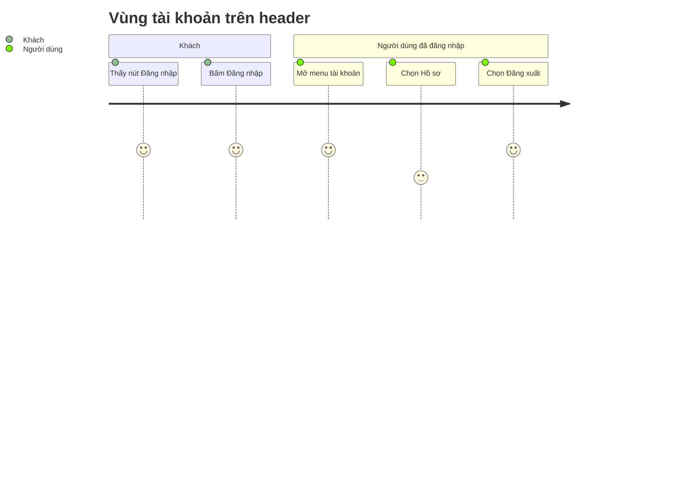

<!-- layout-exempt: rebuild-spec owns all docs/system|features|generated|flows paths — all references here are output targets or internal definitions -->
<!-- Contract: references/feature-spec-researcher-contract.md -->

# Functional Spec — F003_AccountMenuAdminRole

**Priority**: P1
**Type**: ui
**Generated**: 2026-10-08

**See also:** [`technical-spec.md`](./technical-spec.md) — endpoints, Source citations, pseudocode,
key entities, and DB writes for a Dev/QA/SA audience.

**Traceability:** F003_AccountMenuAdminRole → SCR003_Homepage/REG001_AccountRegion → US003, US004, US005, US006, US007, US020, US021 → BL001_SupabaseServerClient → ROUTE002

## 1. Overview

**Problem:** Header trang chủ SAA 2025 cần một vùng bên phải cho tài khoản: khách chưa biết bấm đâu để đăng nhập, người đã đăng nhập cần chỗ vào hồ sơ và chỗ đăng xuất, còn quản trị viên cần lối vào trang quản trị mà hệ thống phải phân biệt được bằng vai trò.
**Solution:** Vùng bên phải header đổi theo trạng thái. Khách thấy nút chữ "Đăng nhập" (EN: "Login") dẫn tới màn hình Login. Người đã đăng nhập thấy chuông thông báo (chỉ là giao diện) và nút tài khoản; bấm nút mở menu có Hồ sơ và Đăng xuất, thêm Trang quản trị nếu tài khoản là admin (EN: Profile / Sign out / Admin Dashboard). Vai trò lưu một nơi duy nhất là hồ sơ người dùng, mặc định `user`, người dùng không tự đổi được.
**Scope:** Chuông thông báo dạng giao diện; nút tài khoản 40x40 và menu mở/đóng bằng chuột, bàn phím; nút "Đăng nhập" cho khách; đăng xuất (chỉ feature này sở hữu việc đăng xuất); hồ sơ kèm vai trò, tự tạo cho tài khoản mới; đọc vai trò ở server để quyết định hiện Trang quản trị.
**Non-Scope:** Bảng thông báo và chấm đỏ chưa đọc (để cho feature thông báo sau); trang Hồ sơ và trang quản trị (menu chỉ có liên kết tới trang dự kiến, hiện báo 404); kiểm tra quyền bên trong trang quản trị khi trang đó được xây; giao diện hoặc danh sách trong cấu hình để cấp vai trò (người vận hành đặt bằng SQL); bộ chọn ngôn ngữ, nội dung trang chủ và phần còn lại của header (thuộc F002 và F001); việc chuyển hướng sau đăng nhập (thuộc F001).

**Actors**

| Actor | Description | Primary goal |
|-------|--------------|---------------|
| Khách chưa đăng nhập | người mở trang chủ khi chưa có phiên | tìm được nút "Đăng nhập" để vào màn hình Login |
| Người dùng đã đăng nhập (vai trò user) | người có phiên hợp lệ, hồ sơ vai trò `user` | vào hồ sơ cá nhân hoặc đăng xuất |
| Quản trị viên (vai trò admin) | người có phiên hợp lệ, hồ sơ vai trò `admin` | như người dùng thường, thêm lối vào trang quản trị |

## 2. Functional Capabilities

| ID | Capability | What the user can do | User Stories | Requirements | Business Rules | Screens |
|----|------------|------------------------|-----------------|---------------|-------------------|---------|
| CAP-01 | Vùng tài khoản theo trạng thái đăng nhập | Khách thấy nút "Đăng nhập" và không có chuông; người đã đăng nhập thấy chuông (chỉ giao diện) và nút tài khoản; trong lúc đọc phiên vùng này giữ chỗ cố định | US003, US004 | FR-101, FR-201, FR-202, FR-204, FR-205 | DEC-001 | SCR003_Homepage/REG001_AccountRegion |
| CAP-02 | Menu tài khoản | Mở và đóng menu bằng chuột hoặc bàn phím, đi tới Hồ sơ | US020, US021, US005 | FR-102, FR-203, FR-401, FR-402, FR-403, FR-404 | SM-001 | — *(cùng vùng tài khoản của CAP-01)* |
| CAP-03 | Đăng xuất | Kết thúc phiên trên trình duyệt này từ menu và quay về màn hình Login | US006 | FR-405 | BR-006 | — *(cùng vùng tài khoản của CAP-01)* |
| CAP-04 | Vai trò tài khoản và lối vào quản trị | Hệ thống giữ vai trò ở hồ sơ, tự tạo hồ sơ cho tài khoản mới, đọc vai trò ở server để chỉ admin thấy Trang quản trị | US007 | FR-001, FR-103, FR-601, FR-602 | BR-001, BR-002, BR-003, BR-004, BR-005 | — *(hiệu ứng hiện ở menu của CAP-01)* |

## 3. Open Decisions

None — no unresolved domain confirmations. Ba quyết định dưới đây đã chốt ngày 2026-10-08 và chỉ ghi lại để tra cứu.

| D### | Decision | Default proposal | Rationale | Blocks work |
|------|----------|-------------------|-----------|--------------|
| D001 | Lối vào Login của khách ở bên phải header trông thế nào, ghi chữ gì? (thiết kế chỉ vẽ trạng thái đã đăng nhập) | **Đã chốt:** nút chữ "Đăng nhập" (VN) / "Login" (EN) đặt đúng chỗ nút tài khoản, dẫn tới `/login`; khách không thấy chuông; feature này sở hữu nút | Dùng chữ có sẵn trong từ điển VN/EN, không cần biểu tượng mới | no |
| D002 | Ba mục menu ghi chữ gì ở chế độ VN? | **Đã chốt:** VN "Hồ sơ" / "Đăng xuất" / "Trang quản trị"; EN Profile / Sign out / Admin Dashboard | Clarifications cho dịch phần giao diện; nhãn đăng xuất lấy lại chữ đã dùng trên trang Todo cũ (đã gỡ 2026-10-08) | no |
| D003 | Cấp vai trò admin cho tài khoản thật bằng cách nào khi không có giao diện cấp quyền? | **Đã chốt:** người vận hành cập nhật vai trò bằng SQL; không có giao diện cấp quyền, không có danh sách email cho phép trong cấu hình | Người dùng không được ghi vai trò nên chỉ còn đường phía vận hành | no |

## 4. Requirements

### Foundation (0xx)

- **FR-001** Mỗi tài khoản có đúng một hồ sơ chứa vai trò, mặc định `user`; hồ sơ tự tạo ở lần đăng nhập đầu và được bổ sung cho tài khoản đã có trước đó.

### Navigation (1xx)

- **FR-101** Khách thấy nút "Đăng nhập" (EN: "Login") ở bên phải header, đặt đúng chỗ nút tài khoản; bấm thì tới màn hình Login (`/login`).
- **FR-102** Chọn Hồ sơ trong menu thì tới trang Hồ sơ (`/profile`, trang dự kiến, hiện báo 404).
- **FR-103** Chọn Trang quản trị trong menu thì tới trang quản trị (`/admin`, trang dự kiến, hiện báo 404).

### Header controls (2xx)

- **FR-201** Người đã đăng nhập thấy chuông thông báo và nút tài khoản, mỗi nút 40x40 px, chuông nằm bên trái bộ chọn ngôn ngữ; khách không thấy hai nút này.
- **FR-202** Chuông chỉ là giao diện: bấm không mở bảng nào và không có chấm đỏ chưa đọc.
- **FR-203** Menu luôn có Hồ sơ và Đăng xuất; Trang quản trị chỉ có khi vai trò là admin và nằm giữa hai mục kia.
- **FR-204** Chuông và nút tài khoản có tên truy cập cho trình đọc màn hình; nút tài khoản báo trạng thái mở hoặc đóng của menu.
- **FR-205** Trong lúc phiên đang được đọc, vùng bên phải giữ chỗ cố định cùng kích thước và không hiện chữ "Đăng nhập", nên header không dịch chuyển và nút không nhấp nháy.

### Interaction (4xx)

- **FR-401** Bấm nút tài khoản khi menu đóng thì mở menu; bấm lại thì đóng.
- **FR-402** Bấm ra ngoài menu đang mở, hoặc dùng Tab đưa tiêu điểm ra ngoài, thì đóng menu.
- **FR-403** Tab tới nút tài khoản rồi nhấn Enter hoặc Space thì mở menu.
- **FR-404** Nhấn Esc khi menu đang mở thì đóng menu và đưa tiêu điểm về nút tài khoản; không dùng phím mũi tên, các mục đi theo thứ tự Tab.
- **FR-405** Chọn Đăng xuất thì kết thúc phiên trên trình duyệt này và quay về màn hình Login (`/login`).

### Security (6xx)

- **FR-601** Vai trò chỉ lấy từ hồ sơ người dùng và chỉ đọc ở server; người dùng không tự đổi được và vai trò không lấy từ dữ liệu người dùng tự khai.
- **FR-602** Không xác định được vai trò (lỗi tra cứu hoặc chưa có hồ sơ) thì header vẫn hiển thị bình thường và tài khoản được xử lý như vai trò `user`.

## 5. Business Rules

- Vai trò chỉ là `user` hoặc `admin`, mặc định `user`; giá trị khác được hiểu là `user` (BR-001)
- Không đọc được vai trò thì coi là `user`, không bao giờ coi là admin (BR-002)
- Mục Trang quản trị chỉ hiện khi vai trò đọc được đúng là `admin` (BR-003)
- Ẩn mục menu chỉ là giao diện, không phải phân quyền; trang quản trị khi được xây phải tự kiểm tra lại vai trò ở server (BR-004)
- Chỉ phía vận hành ghi được vai trò (bằng SQL hoặc khóa dịch vụ); người dùng chỉ đọc được hồ sơ của chính mình (BR-005)
- Đăng xuất chỉ kết thúc phiên trên trình duyệt này, luôn đưa về màn hình Login kể cả khi phiên đã hết hạn hoặc việc hủy phiên báo lỗi (BR-006)
- Vùng bên phải header: không có phiên thì hiện nút Login; có phiên vai trò user thì hiện chuông và nút tài khoản với menu Hồ sơ, Đăng xuất; vai trò admin thì menu thêm Trang quản trị; lúc đang đọc phiên thì giữ chỗ, không hiện "Đăng nhập" (DEC-001)
- Menu tài khoản có hai trạng thái đóng và mở, chuyển qua bấm nút, bấm hoặc dùng Tab ra ngoài, Esc, Enter hoặc Space (SM-001)

## 6. Screens

| Screen Name | SCR### | What User Sees | What User Can Do |
|-------------|--------|-----------------|-------------------|
| Trang chủ SAA — vùng tài khoản trên header | SCR003_Homepage/REG001_AccountRegion | khách: nút "Đăng nhập"; người đã đăng nhập: chuông thông báo và nút tài khoản, menu mở ra có Hồ sơ, Đăng xuất và (với admin) Trang quản trị | khách: bấm "Đăng nhập" để tới Login; người đã đăng nhập: mở/đóng menu, tới Hồ sơ, tới Trang quản trị (admin), đăng xuất |

Vùng này nằm trong header của trang chủ (F002 sở hữu vỏ trang); feature này không có màn hình riêng.

### User Journey

1. Khách mở trang chủ và thấy nút "Đăng nhập" ở bên phải header; bấm vào thì sang màn hình Login.
2. Sau khi đăng nhập xong, người dùng quay về trang chủ; bên phải header giờ có chuông thông báo và nút tài khoản.
3. Người dùng bấm nút tài khoản — menu mở với Hồ sơ và Đăng xuất; quản trị viên thấy thêm Trang quản trị.
4. Người dùng bấm ra ngoài hoặc nhấn Esc thì menu đóng; dùng bàn phím thì Tab tới nút rồi Enter hoặc Space để mở lại.
5. Người dùng chọn Hồ sơ (hoặc Trang quản trị nếu là admin) và được đưa tới trang tương ứng — hiện là 404 vì trang chưa được xây.
6. Người dùng chọn Đăng xuất — phiên kết thúc, quay về màn hình Login; mở lại trang chủ thì header trở về trạng thái khách.

## 7. User Stories

### US003 — Mở màn hình Login từ header

**Actor:** Khách chưa đăng nhập
**Goal:** Từ trang chủ đi tới màn hình Login chỉ bằng một lần bấm.
**Business value:** Khách không phải đoán địa chỉ đăng nhập nên dễ trở thành người dùng đã đăng nhập.

**Acceptance Criteria:**
- [ ] Chưa đăng nhập thì bên phải header có nút "Đăng nhập" và không có chuông, không có nút tài khoản.
- [ ] Trong lúc đọc phiên, vùng này chỉ là khung giữ chỗ không có chữ, nên người đã đăng nhập không thấy "Đăng nhập" nhấp nháy.
- [ ] Lỗi khi đọc phiên được xử lý như khách: vẫn thấy nút "Đăng nhập".
- [ ] Bấm nút thì sang `/login`.

### US004 — Xem chuông thông báo

**Actor:** Người dùng đã đăng nhập (vai trò user)
**Goal:** Thấy biểu tượng thông báo ở vị trí quen thuộc trên header.
**Business value:** Giữ đúng bố cục thiết kế để feature thông báo sau chỉ cần gắn bảng và chấm đỏ vào.

**Acceptance Criteria:**
- [ ] Đã đăng nhập thì có chuông 40x40 px bên trái bộ chọn ngôn ngữ, có tên truy cập "Thông báo"/"Notifications"; admin cũng thấy chuông.
- [ ] Khách không thấy chuông.
- [ ] Bấm chuông chưa mở bảng nào và không có chấm đỏ (chỉ là giao diện).

### US020 — Mở menu tài khoản

**Actor:** Người dùng đã đăng nhập (vai trò user)
**Goal:** Mở menu tài khoản khi cần, bằng chuột hoặc bàn phím.
**Business value:** Người dùng bàn phím và trình đọc màn hình cũng dùng được menu.

**Acceptance Criteria:**
- [ ] Nút tài khoản 40x40 px, báo trạng thái mở/đóng cho trình đọc màn hình.
- [ ] Bấm nút, hoặc Enter/Space khi nút có tiêu điểm, thì menu mở với Hồ sơ và Đăng xuất.
- [ ] Người dùng vai trò user không thấy Trang quản trị; không đọc được vai trò thì cũng không thấy.

### US021 — Đóng menu tài khoản

**Actor:** Người dùng đã đăng nhập (vai trò user)
**Goal:** Đóng menu đang mở để menu không che nội dung.
**Business value:** Menu không cản trở việc xem trang, và người dùng bàn phím không bị mất vị trí tiêu điểm.

**Acceptance Criteria:**
- [ ] Nhấn Esc đóng menu và đưa tiêu điểm về nút tài khoản.
- [ ] Bấm ra ngoài, hoặc dùng Tab đưa tiêu điểm ra ngoài menu, thì menu đóng.
- [ ] Bấm lại nút tài khoản khi menu đang mở thì menu đóng.

### US005 — Mở trang Hồ sơ

**Actor:** Người dùng đã đăng nhập (vai trò user)
**Goal:** Từ menu tài khoản đi tới trang hồ sơ cá nhân của mình.
**Business value:** Người dùng có một lối vào cố định tới thông tin cá nhân từ trang chủ.

**Acceptance Criteria:**
- [ ] Menu của mọi người đã đăng nhập, kể cả admin, đều có mục Hồ sơ.
- [ ] Chọn Hồ sơ thì tới `/profile`; trang này chưa được xây nên hiện báo 404 và phiên vẫn còn.

### US006 — Đăng xuất

**Actor:** Người dùng đã đăng nhập (vai trò user)
**Goal:** Kết thúc phiên làm việc của mình ngay từ header.
**Business value:** Người dùng thoát an toàn khỏi máy dùng chung mà không cần trang riêng.

**Acceptance Criteria:**
- [ ] Menu có mục Đăng xuất; admin dùng được giống người dùng thường.
- [ ] Chọn Đăng xuất thì về `/login`; mở lại trang chủ thì header là của khách.
- [ ] Chỉ phiên trên trình duyệt này kết thúc, phiên ở thiết bị khác giữ nguyên.
- [ ] Phiên đã hết hạn hoặc việc hủy phiên báo lỗi thì vẫn về màn hình Login, không hiện thông báo lỗi.
- [ ] Không có hộp thoại xác nhận trước khi đăng xuất.

### US007 — Mở trang quản trị

**Actor:** Quản trị viên (vai trò admin)
**Goal:** Từ menu tài khoản đi tới khu vực quản trị.
**Business value:** Quản trị viên có lối vào riêng, còn người dùng thường không thấy chức năng không dành cho họ.

**Acceptance Criteria:**
- [ ] Tài khoản vai trò admin thấy Hồ sơ, Trang quản trị và Đăng xuất; vai trò user chỉ thấy Hồ sơ và Đăng xuất.
- [ ] Chọn Trang quản trị thì tới `/admin`; trang này chưa được xây nên hiện báo 404.
- [ ] Việc ẩn mục chỉ là giao diện; khi xây trang quản trị phải tự kiểm tra lại vai trò ở server.

## 8. Scenarios

### US003 — Happy Path

**Given** khách ở trang chủ, **When** bấm "Đăng nhập" ở bên phải header, **Then** khách thấy màn hình Login.

### US003 — Error: không đọc được phiên

**Given** việc đọc phiên bị lỗi (mạng hoặc cấu hình), **When** mở trang chủ, **Then** header vẫn hiện "Đăng nhập" như của khách, không có chuông và nút tài khoản, trang không báo lỗi.

### US004 — Happy Path

**Given** người dùng đã đăng nhập, **When** mở trang chủ, **Then** thấy chuông bên trái bộ chọn ngôn ngữ và không có chấm đỏ.

### US004 — Error: khách

**Given** khách chưa đăng nhập, **When** mở trang chủ, **Then** header không có chuông.

### US020 — Happy Path

**Given** người dùng đã đăng nhập ở trang chủ, **When** bấm nút tài khoản, **Then** menu mở với Hồ sơ và Đăng xuất.

### US020 — Error: không đọc được vai trò

**Given** việc đọc vai trò bị lỗi, **When** người dùng bấm nút tài khoản, **Then** menu vẫn mở với Hồ sơ và Đăng xuất, không có Trang quản trị.

### US021 — Happy Path

**Given** menu đang mở, **When** người dùng nhấn Esc, **Then** menu đóng và tiêu điểm trở về nút tài khoản.

### US021 — Error: bấm hai lần liên tiếp

**Given** menu đang đóng, **When** người dùng bấm nút tài khoản hai lần liên tiếp, **Then** menu mở rồi đóng, không bị kẹt ở trạng thái mở.

### US005 — Happy Path

**Given** menu tài khoản đang mở, **When** người dùng chọn Hồ sơ, **Then** trình duyệt tới `/profile`.

### US005 — Error: trang chưa được xây

**Given** trang Hồ sơ chưa tồn tại, **When** người dùng chọn Hồ sơ, **Then** thấy trang 404 và vẫn đăng nhập.

### US006 — Happy Path

**Given** người dùng đã đăng nhập, **When** mở menu và chọn Đăng xuất, **Then** người dùng ở màn hình Login và mở lại trang chủ thì thấy header của khách.

### US006 — Error: phiên đã hết hạn lúc đăng xuất

**Given** phiên đã hết hạn nhưng trang chưa tải lại, **When** người dùng chọn Đăng xuất, **Then** vẫn về màn hình Login, không có thông báo lỗi.

### US007 — Happy Path

**Given** tài khoản vai trò admin đã đăng nhập, **When** mở menu tài khoản, **Then** thấy Hồ sơ, Trang quản trị và Đăng xuất.

### US007 — Error: người dùng thường

**Given** tài khoản vai trò user đã đăng nhập, **When** mở menu tài khoản, **Then** không thấy Trang quản trị.

## 9. Edge Cases

| Scenario | What Happens | User-Facing Message |
|----------|--------------|----------------------|
| Phiên đang được đọc | Vùng bên phải giữ chỗ cùng kích thước, chưa hiện "Đăng nhập", header không dịch chuyển | None — silent handling |
| Tra cứu vai trò lỗi hoặc chưa có hồ sơ | Header hiện như của người dùng thường; lỗi chỉ ghi nhật ký ở server | None — silent handling |
| Phiên hết hạn hoặc không hợp lệ | Header hiện như của khách (nút "Đăng nhập") | None — silent handling |
| Bấm nút tài khoản hai lần liên tiếp | Menu mở rồi đóng, không kẹt ở trạng thái mở | None — silent handling |
| Chọn Hồ sơ hoặc Trang quản trị khi trang chưa được xây | Tới trang 404 mặc định, phiên giữ nguyên | Trang 404 của hệ thống |
| Tài khoản bị hạ từ admin xuống user khi đang đăng nhập | Lần tải trang kế tiếp menu bỏ Trang quản trị, không phải đăng nhập lại | None — silent handling |
| Tài khoản đăng nhập lần đầu | Hồ sơ vai trò `user` được tạo tự động trước khi người dùng thấy header | None — silent handling |
| Chọn Đăng xuất khi việc hủy phiên báo lỗi | Vẫn về màn hình Login, lỗi chỉ ghi nhật ký | None — silent handling |
| Người dùng thường tự gõ địa chỉ `/admin` | Trang chưa có nên báo 404; khi trang được xây phải tự chặn người không phải admin | Trang 404 của hệ thống |

## 10. Edge Behaviours to Verify

- **FR-001** → Đăng nhập một tài khoản mới thì có đúng một hồ sơ vai trò `user`; tài khoản có trước cũng có hồ sơ.
- **FR-101** → Khách thấy "Đăng nhập" (EN: "Login") ở bên phải header, không có chuông; bấm thì tới `/login`.
- **FR-102** → Chọn Hồ sơ thì địa chỉ là `/profile`.
- **FR-103** → Chọn Trang quản trị thì địa chỉ là `/admin`.
- **FR-201** → Đã đăng nhập thì thấy chuông và nút tài khoản, mỗi nút 40x40 px; chưa đăng nhập thì không thấy hai nút này.
- **FR-202** → Bấm chuông không mở bảng và không có chấm đỏ.
- **FR-203** → Admin thấy ba mục theo thứ tự Hồ sơ, Trang quản trị, Đăng xuất; user chỉ thấy Hồ sơ và Đăng xuất; nhãn VN/EN đúng như đã chốt.
- **FR-204** → Chuông và nút tài khoản có tên truy cập; nút tài khoản báo đúng trạng thái mở/đóng (đã cài đặt qua `aria-expanded`; e2e hiện chỉ tìm nút theo tên truy cập, chưa khẳng định `aria-expanded`).
- **FR-205** → Mở trang chủ khi phiên chưa đọc xong thì vùng bên phải có khung cùng kích thước và người đã đăng nhập không thấy "Đăng nhập" nhấp nháy.
- **FR-401** → Bấm nút tài khoản mở menu, bấm lần nữa đóng.
- **FR-402** → Bấm ra ngoài, hoặc Tab ra khỏi menu, thì menu đóng.
- **FR-403** → Tab tới nút rồi Enter hoặc Space đều mở menu.
- **FR-404** → Esc đóng menu và tiêu điểm về nút tài khoản; phím mũi tên không di chuyển giữa các mục.
- **FR-405** → Đăng xuất đưa về `/login`; mở lại trang chủ thì là trạng thái khách.
- **FR-601** → Người dùng đã đăng nhập không đổi được vai trò của mình bằng cách gọi trực tiếp vào dữ liệu.
- **FR-602** → Làm việc tra cứu vai trò lỗi thì trang chủ vẫn hiển thị và menu chỉ có hai mục.

## 11. Risks & Known Issues

| ID | Type | Description | Impact | Status |
|----|------|--------------|--------|--------|
| RISK-01 | risk | Ẩn Trang quản trị chỉ là giao diện; trang quản trị chưa tồn tại và không có kiểm tra vai trò ở server cho đường dẫn này; khi trang được xây có thể quên kiểm tra lại vai trò | Người không phải admin có thể vào trang quản trị nếu chỉ dựa vào việc ẩn mục menu | confirmed |
| RISK-02 | risk | Hồ sơ được tạo cùng lúc với tài khoản; nếu bước này lỗi thì việc tạo tài khoản mới cũng lỗi | Người dùng mới có thể không đăng nhập được ở lần đầu | [INFERRED] |
| RISK-03 | known-issue | Hai mục Hồ sơ và Trang quản trị dẫn tới trang chưa được xây nên hiện 404 | Người dùng bấm vào thấy trang báo lỗi 404 (phiên không mất) | confirmed |
| RISK-04 | risk | Menu không tự đóng khi chọn một mục; chỉ biến mất vì trang đích thay trang hiện tại | Nếu sau này header nằm trong bố cục dùng chung không tải lại, menu có thể còn mở sau khi chọn mục | [INFERRED] |

## 12. Dependencies

| Dependency | Type | Why this feature needs it | Evidence |
|------------|------|-----------------------------|----------|
| F001_LoginWithGoogle | feature | Cung cấp phiên đăng nhập, màn hình Login và việc làm mới phiên; việc đăng xuất chuyển từ F001 sang feature này | SCR001_Login, FR-101, FR-405 |
| F002_HomepageSaa | feature | Giữ vỏ trang và header chứa vùng này; làm trang chủ thành trang công khai | SCR003_Homepage/REG001_AccountRegion |
| Bộ chọn ngôn ngữ VN/EN (F001) | feature | Nhãn menu và nút "Đăng nhập" đổi theo ngôn ngữ đã chọn | FR-203, FR-101 |
| Dịch vụ xác thực và cơ sở dữ liệu (Supabase) | external-service | Xác minh phiên, hủy phiên và lưu hồ sơ kèm vai trò | FR-601, FR-405, BR-005 |
| Trang Hồ sơ (`/profile`) và trang quản trị (`/admin`) | feature | Đích của hai mục menu; chưa được xây | FR-102, FR-103 |
| Feature thông báo | feature | Bảng thông báo và chấm đỏ của chuông; chưa được xây | FR-202 |
| Biến cấu hình kết nối dịch vụ xác thực (URL và khóa công khai, chỉ ở server) | config | Cần có đủ thì mới đọc được phiên và vai trò; thiếu thì header coi mọi người là khách | FR-602, BR-002 |

## 13. Configuration

N/A — no user-facing configuration constants for this feature.
