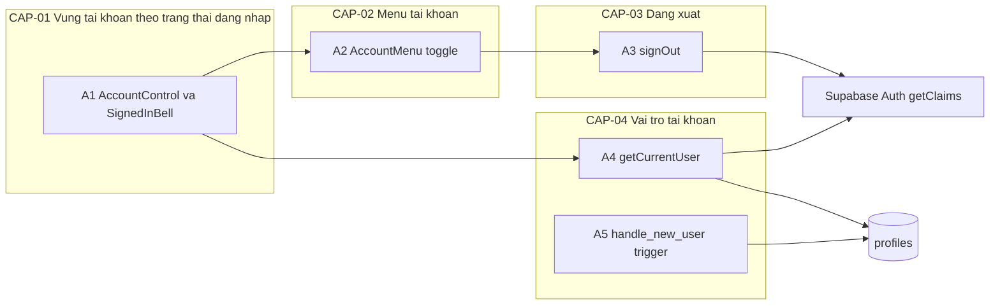
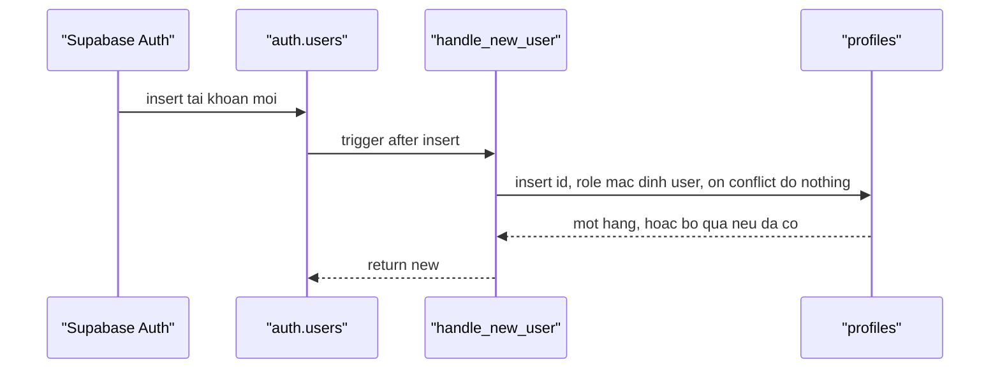
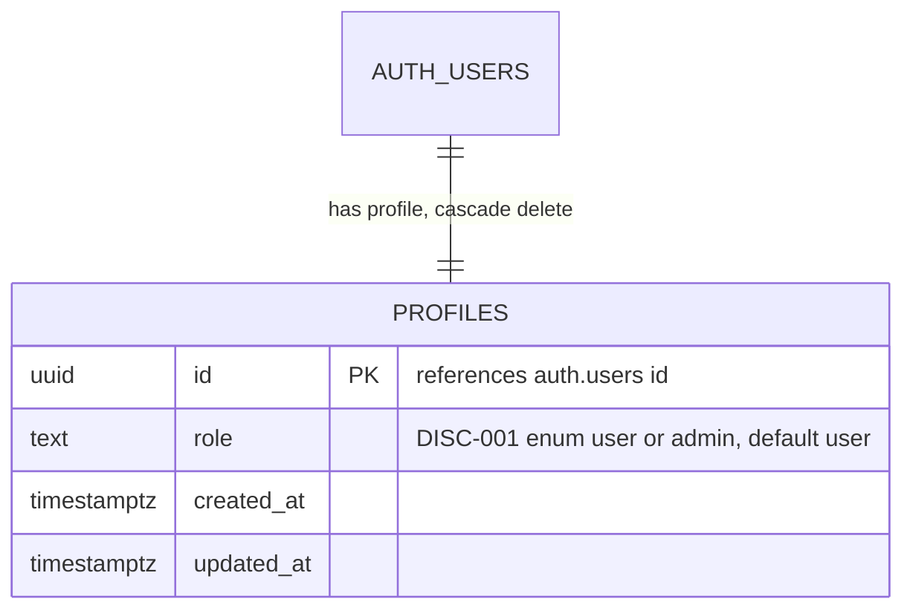
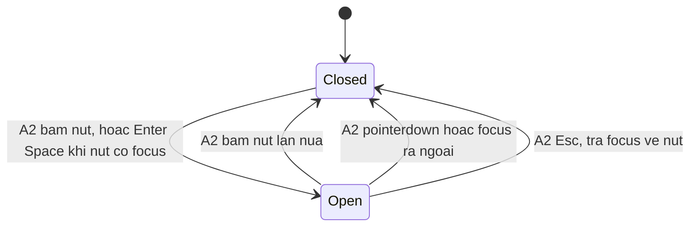

<!-- layout-exempt: rebuild-spec owns all docs/system|features|generated|flows paths — all references here are output targets or internal definitions -->
<!-- Contract: references/feature-spec-researcher-contract.md -->

# F003_AccountMenuAdminRole — Technical Spec

**Priority**: P1
**Type**: ui
**Generated**: 2026-10-08

**See also:** [`functional-spec.md`](./functional-spec.md) — plain-language overview, open
decisions, requirements/business rules stated in one-liners, screens, user stories, scenarios,
edge cases, and configuration for a BA/QA audience.

**How to read this file:** § 2 is the index — pick the action you care about and read its block
in § 3 straight through; each block is one complete thread, top to bottom. § 4 is the shared
appendix — jump in only when a § 3 block points you there.

## 1. Technical Overview

Vùng bên phải header của trang chủ `/` (SCR003_Homepage/REG001_AccountRegion) là hai Server Component đọc phiên qua `getCurrentUser()`: claims JWT bằng `getClaims()`, rồi vai trò từ `public.profiles` dưới RLS bằng chính phiên người dùng. Khách thấy liên kết "Đăng nhập" tới `/login`; người đã đăng nhập thấy chuông thông báo (chỉ giao diện) và nút tài khoản mở menu (client component, hai trạng thái đóng/mở); mục "Đăng xuất" là form gọi Server Action `signOut` rồi chuyển về `/login`. Hồ sơ `profiles` do trigger trên `auth.users` tạo, vai trò chỉ đổi được bằng `service_role` hoặc SQL của người vận hành. Feature chạm Supabase Auth và Postgres; F002 giữ vỏ trang và `SiteHeader`, F003 chỉ sở hữu vùng tài khoản.



## 2. Action Index

| # | Action (handler) | Method · Path | Codes | Writes | Detail |
|---|---|---|---|---|---|
| **A0** | *cross-cutting — belongs to no single action* | — | BR-004 | — | § 4.4 |
| **A1** | `AccountRegion#AccountControl` | `GET` `/` *(vùng header của trang chủ)* | FR-101, FR-201, FR-202, FR-203, FR-204, FR-205, BR-003, DEC-001, US003, US004, US007 | — *(read-only)* | § 3.1 |
| **A2** | `AccountMenu#toggle` *(client, no request)* | — | FR-102, FR-103, FR-204, FR-401, FR-402, FR-403, FR-404, SM-001, US005, US020, US021 | — *(chỉ trạng thái giao diện)* | § 3.2 |
| **A3** | `actions#signOut` | `POST` `/` *(Server Action)* | FR-405, BR-006, INT-001, US006 | — *(phiên do Supabase Auth quản lý, không ghi bảng của ứng dụng)* | § 3.3 |
| **A4** | `current-user#getCurrentUser` | — | FR-601, FR-602, BR-001, BR-002, BR-005, INT-001, INT-002, US007 | — *(read-only)* | § 3.4 |
| **A5** | `profiles#handle_new_user` *(background, no FE)* | trigger · `auth.users` *(after insert)* | FR-001, BR-001, BR-005 | `profiles` | § 3.4 ▸ **diagram** |

**Rung set** — mọi block trong § 3 dùng đúng thứ tự: **Who** → **FE** → **Request** → **BE** → **Rule** → **Result** → **State** → **Source**; rung không có thì bỏ hẳn.

## 3. Actions

### 3.1 CAP-01 — Vùng tài khoản theo trạng thái đăng nhập

#### A1 · Dựng vùng tài khoản trên header theo phiên và vai trò
`GET /` *(vùng header của trang chủ)* → `AccountRegion#AccountControl` · `AccountBellRegion#SignedInBell`
`FR-101` `FR-201` `FR-202` `FR-203` `FR-204` `FR-205` `BR-003` `DEC-001` `US003` `US004` `US007` · `SCR003_Homepage/REG001_AccountRegion`

**Who** · Khách, người dùng đã đăng nhập, admin *(gate A0 — § 4.4: BR-004 — ẩn/hiện chỉ là UX)*
**FE** · `HomeContent` đặt hai slot vào `SiteHeader`: `bellSlot` (trái bộ chọn ngôn ngữ) và `accountSlot` (phải, bọc trong khung cố định 96x40) — `app/_components/home/home-content.tsx:37-42`, `app/_components/site/site-header.tsx:61-68`. `AccountBellRegion` bọc `SignedInBell` trong `<Suspense fallback={null}>` (không placeholder, nên chuông xuất hiện không đẩy bộ chọn ngôn ngữ); `AccountRegion` bọc `AccountControl` trong `<Suspense fallback={<AccountSlotSkeleton />}>` (khối 96x40 không có chữ nên người đã đăng nhập không thấy "Login" nhấp nháy — FR-205) — `app/_components/header-behaviour/account-region.tsx:24-42`, `app/_components/site/account-slot-parts.tsx:9-11`. Khách: `GuestLoginLink` là `next/link` tới `/login`, nút chữ cao 40 (FR-101); đã đăng nhập: `NotificationBell` là `<button>` 40x40 có `aria-label`, không handler, không badge, không panel (FR-201, FR-202) — `account-slot-parts.tsx:14-33`.
**Request** · cookie phiên Supabase và cookie `NEXT_LOCALE` (nhãn lấy từ `getDictionary(locale).accountMenu`) — `lib/i18n/dictionary.ts:14-22,48-55,60-67`
**BE** · cả `SignedInBell` và `AccountControl` gọi `getCurrentUser()` (A4); hàm bọc `cache()` nên một request chỉ đọc phiên và vai trò một lần dù hai vùng cùng gọi — `account-region.tsx:44-62`, `lib/supabase/current-user.ts:33`. `AccountControl` truyền `triggerLabel`, danh sách mục đã lọc theo vai trò và `signOut` cho `AccountMenu` (A2); `role` không đi xuống trình duyệt, chỉ danh sách mục đã lọc đi xuống (FR-203) — `account-region.tsx:56-60`, `app/_components/header-behaviour/account-menu.tsx:8-15`.
**Rule** · quyết định vùng này hiện gì:
- **BR-003 — Mục Trang quản trị chỉ có khi vai trò đọc được đúng bằng `"admin"`.** `accountMenuItems` luôn thêm "Hồ sơ" (`/profile`) và chỉ thêm "Trang quản trị" (`/admin`) khi `role === "admin"`; khách, `user` và vai trò tra cứu lỗi (đã quy về `user`) đều không có mục này; quyết định đưa ra ở server, không đọc dữ liệu do trình duyệt gửi. Mục `/profile` và `/admin` là liên kết tới trang chưa có (404) — `account-region.tsx:64-73`.

| DEC | subtype | Condition | What the user sees | Source |
|---|---|---|---|---|
| **DEC-001** | render | phiên chưa đọc xong (đang trong `Suspense`) | khối giữ chỗ 96x40 không chữ; chưa có "Đăng nhập", chưa có chuông | `account-region.tsx:36-41` |
| **DEC-001** | render | `getCurrentUser()` trả `null` (không claims, lỗi auth, ngoại lệ) | liên kết "Đăng nhập"/"Login" tới `/login`; không chuông, không nút tài khoản | `account-region.tsx:46-53` |
| **DEC-001** | render | `user != null` và `role == "user"` | chuông + nút tài khoản; menu có Hồ sơ/Profile và Đăng xuất/Sign out | `account-region.tsx:47-60` |
| **DEC-001** | render | `user != null` và `role == "admin"` (DISC-001 giá trị `admin`) | như trên, menu thêm Trang quản trị/Admin Dashboard giữa Hồ sơ và Đăng xuất | `account-region.tsx:71` |

**Result** · read-only — **no DB write**. Hiển thị đúng một trong ba trạng thái của DEC-001; admin cũng thấy chuông giống `user`. Nhãn đổi theo VN/EN ("Đăng nhập"/"Login", "Hồ sơ"/"Profile", "Trang quản trị"/"Admin Dashboard", "Thông báo"/"Notifications", "Tài khoản"/"Account"); `/profile` và `/admin` hiện chưa có page nên bấm tới 404. Trạng thái khách là mặc định khi lỗi (fail closed ở A4).
**Source:** `app/_components/header-behaviour/account-region.tsx:24-73` → `app/_components/site/account-slot-parts.tsx:9-33` → `app/_components/site/site-header.tsx:61-68`

<!-- No diagram: dưới ngưỡng — read-only, đồng bộ, rẽ nhánh dạng bảng DEC-001 (diagram sẽ ép các điều kiện song song thành một chuỗi giả). -->

---

### 3.2 CAP-02 — Menu tài khoản

#### A2 · Mở/đóng menu tài khoản và đi tới Hồ sơ hoặc Trang quản trị
`—` *(tương tác phía client, không có request)* → `AccountMenu#toggle`
`FR-102` `FR-103` `FR-204` `FR-401` `FR-402` `FR-403` `FR-404` `SM-001` `US005` `US020` `US021` · `SCR003_Homepage/REG001_AccountRegion`

**Who** · Người dùng đã đăng nhập (mọi vai trò)
**FE** · `AccountMenuView` dựng nút gốc `<button>` 40x40 (biểu tượng người dùng) có `aria-label` = "Tài khoản"/"Account", `aria-haspopup="menu"`, `aria-expanded={open}`, `aria-controls` chỉ khi menu mở (FR-204); khi mở hiện `<div role="menu">` định vị dưới nút, chứa các `next/link` `role="menuitem"` (Hồ sơ, và Trang quản trị nếu có — FR-102, FR-103) rồi `<form action={signOut}>` với nút submit `role="menuitem"` (A3). Enter/Space mở menu nhờ `<button>` gốc, không có code riêng (FR-403) — `app/_components/site/account-menu-view.tsx:26-58`, `app/_components/header-behaviour/account-menu.tsx:16-33`.
**Request** · không có request; props `triggerLabel`, `items`, `signOut` đến từ A1
**BE** · hook `useMenuDisclosure()` giữ `open` bằng `useState`, trả `toggle` và `onMenuKeyDown`. Khi `open`, đăng ký ba listener toàn trang (`pointerdown`, `focusin`, `keydown`) và gỡ khi đóng — `lib/ui/use-menu-disclosure.ts:23-60`.
**Rule** · bốn đường đóng, một đường mở, không roving mũi tên:
- Bấm nút → `toggle` đổi `open` (mở rồi đóng ở lần bấm sau — FR-401) — `use-menu-disclosure.ts:62`.
- `pointerdown` ngoài nút và menu, hoặc `focusin` ra ngoài (Tab/Shift+Tab rời menu) → đóng, không trả focus (FR-402) — `use-menu-disclosure.ts:36-43,52-54`.
- `Escape` (dù focus ở nút, trong menu hay trên trang) → `preventDefault`, đóng và `focus()` về nút (FR-404) — `use-menu-disclosure.ts:28-31,44-50,64-71`.
- Không có xử lý phím mũi tên: các mục theo thứ tự Tab — `use-menu-disclosure.ts:21`.
**Result** · không gọi server, không ghi gì; menu mở/đóng theo SM-001. Chọn Hồ sơ/Trang quản trị là điều hướng thường của `next/link` tới `/profile`/`/admin` (404 tới khi có page, phiên giữ nguyên). Không có xử lý đóng menu khi chọn một mục: menu chỉ biến mất vì trang đích thay trang hiện tại.
**State** · `SM-001`: `Closed` → `Open` *(§ 4.3)*
**Source:** `app/_components/site/account-menu-view.tsx:26-58` → `app/_components/header-behaviour/account-menu.tsx:16-33` → `lib/ui/use-menu-disclosure.ts:23-74`

<!-- No diagram: dưới ngưỡng — không ghi DB, không gọi server; các nhánh đóng đã nằm trong stateDiagram § 4.3. -->

---

### 3.3 CAP-03 — Đăng xuất

#### A3 · Đăng xuất từ menu tài khoản
`POST /` *(Server Action)* → `actions#signOut`
`FR-405` `BR-006` `INT-001` `US006` · `SCR003_Homepage/REG001_AccountRegion`

**Who** · Người dùng đã đăng nhập (mọi vai trò); action chỉ tác động lên cookie phiên của chính người gọi nên không cần kiểm tra phiên hay vai trò trước *(PERM006)*
**FE** · mục "Đăng xuất"/"Sign out" là nút submit của `<form action={signOut.action}>` trong menu; không có hộp thoại xác nhận (FR-405) — `app/_components/site/account-menu-view.tsx:52-56`
**Request** · không có tham số; chỉ cookie phiên của người gọi. `signOut` truyền từ `AccountControl` xuống menu — `account-region.tsx:59`
**BE** · `createClient()` (BL001) rồi `supabase.auth.signOut({ scope: "local" })` bọc `try/catch`; `redirect("/login")` đặt ngoài `try/catch` vì `redirect()` ném lỗi điều khiển của Next — `lib/auth/actions.ts:19-33`, `lib/supabase/server.ts:19-50`.
**Rule** · **BR-006 — Đăng xuất chỉ kết thúc phiên ở trình duyệt này và luôn về `/login`.** `scope: "local"` không thu hồi phiên ở thiết bị khác (mặc định `global` sẽ thu hồi); lỗi trả về từ Supabase chỉ `console.warn`, ngoại lệ chỉ `console.error`, rồi vẫn `redirect("/login")` nên việc rời phiên không bao giờ thất bại với người dùng; không có phiên thì action là no-op rồi vẫn chuyển hướng — `lib/auth/actions.ts:16-18,22-33`. Proxy không chuyển hướng `POST` nên Server Action khi phiên đã hết hạn không bị hỏng — `lib/supabase/proxy-session.ts:23-25,99-105`.
**Result** · Supabase Auth xóa cookie phiên của trình duyệt này qua adapter cookie của `createClient` (không ghi bảng của ứng dụng); trình duyệt được chuyển tới `/login`, mở lại `/` thì header là của khách. Gắn `INT-001`: lời gọi Supabase Auth để hủy phiên hiện tại *(§ 4.5)*.
**Source:** `app/_components/site/account-menu-view.tsx:52-56` → `lib/auth/actions.ts:19-33` → `lib/supabase/server.ts:19-50`

<!-- No diagram: dưới ngưỡng — một lời gọi Supabase Auth, không ghi bảng ứng dụng, không có nhánh nghiệp vụ. -->

---

### 3.4 CAP-04 — Vai trò tài khoản

#### A4 · Đọc người dùng hiện tại và vai trò phía server
`—` *(hàm phía server, gọi từ A1 và từ `/admin` khi được xây)* → `current-user#getCurrentUser`
`FR-601` `FR-602` `BR-001` `BR-002` `BR-005` `INT-001` `INT-002` `US007`

**Who** · Mã phía server của hệ thống *(gate A0 — § 4.4: BR-004)*
**BE** · `getCurrentUser` bọc `cache()` của React; `await connection()` đặt ngoài `try` vì `getClaims()` đọc đồng hồ, cacheComponents không cho phép khi prerender. Gọi `supabase.auth.getClaims()` (INT-001: xác minh JWT của phiên); lỗi, không có `sub` hợp lệ hoặc ngoại lệ → `null` (khách). Có claims thì `from("profiles").select("role").eq("id", sub).maybeSingle()` bằng phiên của chính người dùng (INT-002: đọc hồ sơ của mình dưới RLS) và trả `{ id, email, role }` — `lib/supabase/current-user.ts:33-59,63-84`.
**Rule**
- **BR-002 — Không đọc được vai trò thì coi là `user`, không bao giờ `admin`.** Lỗi truy vấn, không có hàng hồ sơ hoặc ngoại lệ đều ra `"user"` và chỉ ghi log; header vẫn dựng bình thường (FR-602) — `current-user.ts:70-77,79-83`.
- **BR-001 — Vai trò chỉ là `user` hoặc `admin`, mặc định `user`.** Ở đây chuẩn hóa lúc đọc: chỉ giá trị đúng bằng chuỗi `"admin"` mới thành `admin`, mọi giá trị khác thành `user` (DISC-001 `role`) *(§ 4.4)* — `current-user.ts:78` gọi hàm thuần `toUserRole` (`lib/supabase/user-role.ts:13-15`), dùng chung với cổng prelaunch của F005 để chỉ có một bản quy tắc.
- **BR-005 — Chỉ phía vận hành ghi được vai trò; người dùng chỉ đọc hồ sơ của mình.** Ở đây: truy vấn dùng khóa publishable và phiên người dùng nên RLS chỉ cho thấy hàng của chính mình *(§ 4.4)* — `current-user.ts:63-69`.
**Result** · read-only — **no DB write**. FR-601: vai trò chỉ lấy từ `public.profiles` ở server, không từ `user_metadata` (người dùng tự ghi được). Kết quả `CurrentUser | null` cho A1; `/admin` khi được xây phải gọi lại đúng hàm này (BR-004).
**Source:** `lib/supabase/current-user.ts:17-59` → `lib/supabase/current-user.ts:61-84` → `lib/supabase/server.ts:19-50`

<!-- No diagram: dưới ngưỡng — chỉ đọc một bảng, đồng bộ. -->

---

#### A5 · Tự tạo hồ sơ khi có tài khoản mới (và bổ sung cho tài khoản có sẵn) *(background, no FE)*
`trigger` · `auth.users` after insert → `profiles#handle_new_user`
`FR-001` `BR-001` `BR-005`

**Who** · *không có tác nhân người — cơ sở dữ liệu kích hoạt khi Supabase Auth tạo tài khoản ở lần đăng nhập Google đầu tiên (F001)*
**FE** · *none*
**Request** · *no HTTP request* — sự kiện `insert` vào `auth.users`, trigger nhận `new.id`
**BE** · `public.handle_new_user()` `security definer`, `set search_path = ''`; trigger `on_auth_user_created` `after insert on auth.users for each row`; hàm chèn `public.profiles (id)` với `on conflict (id) do nothing`, không đọc metadata người dùng; `revoke execute` khỏi `public, anon, authenticated` — `supabase/migrations/20261008045415_create_profiles.sql:41-58`. Cùng migration có một câu lệnh backfill một lần chèn hồ sơ cho mọi dòng `auth.users` đã có — `20261008045415_create_profiles.sql:60-63`.
**Rule**
- **BR-001 — Vai trò mặc định `user`.** Hàng mới nhận mặc định của cột; `check (role in ('user','admin'))` chỉ cho hai giá trị *(§ 4.4)* — `20261008045415_create_profiles.sql:18-23`.
- **BR-005 — Chỉ phía vận hành ghi được vai trò.** Trigger là đường ghi duy nhất của luồng người dùng và chỉ chèn mặc định; `authenticated` không có policy lẫn grant để ghi *(§ 4.4)* — `20261008045415_create_profiles.sql:27-37`.
**Result** · Ghi một hàng `profiles` (`id`, `role` mặc định `user`) cùng giao dịch với việc tạo `auth.users`, đồng bộ; người dùng không thấy gì. Ở lần mở `/` đầu tiên A4 đọc được hàng này. Hàm lỗi thì việc tạo tài khoản cũng lỗi nên thân hàm giữ tối giản (comment ở migration).
**Source:** `supabase/migrations/20261008045415_create_profiles.sql:41-58` → `supabase/migrations/20261008045415_create_profiles.sql:60-63`



---

### 3.5 Edge cases

| Action | Scenario | Behavior |
|---|---|---|
| A1 · A4 | Tra cứu `profiles` lỗi hoặc chưa có hàng | `role = "user"`, header dựng bình thường; lỗi ghi log phía server (BR-002, FR-602) |
| A1 · A4 | Claims lỗi, không hợp lệ hoặc `getClaims` ném | Coi như khách; hiện "Đăng nhập" (DEC-001); không trả 500 |
| A1 · A4 | Admin bị hạ xuống `user` khi đang đăng nhập | Vai trò đọc lại ở mỗi request nên lần tải kế tiếp bỏ mục Trang quản trị; không cần đăng nhập lại |
| A1 | Phiên đang đọc | Khối giữ chỗ 96x40, chưa có "Đăng nhập" (FR-205); header không dịch chuyển |
| A2 | Bấm nút hai lần liên tiếp | Mở rồi đóng theo SM-001; không kẹt |
| A2 | Esc khi focus ở nút / trong menu / ngoài | Đóng và trả focus về nút; listener Esc chỉ gắn khi menu mở |
| A2 | Chọn Hồ sơ hoặc Trang quản trị khi route chưa xây | 404 mặc định của Next; phiên giữ nguyên |
| A3 | Phiên đã hết hạn hoặc `signOut` báo lỗi / ném | Chỉ ghi log, vẫn `redirect("/login")` (BR-006) |
| A3 | Server Action `POST /` khi không có phiên | Không có gì để hủy, vẫn chuyển về `/login`; proxy không chuyển hướng `POST` |
| A5 | Tài khoản có trước migration | Backfill cùng migration bổ sung hồ sơ; chèn lặp bị bỏ qua nhờ `on conflict do nothing` |
| A1-A5 | Gọi trực tiếp `/admin` khi không phải admin | Ngoài phạm vi: `/admin` chưa có page; khi xây phải tự kiểm tra vai trò (BR-004) |

## 4. Shared Foundation

### 4.1 Components

| Component | Responsibility | Used in | File |
|---|---|---|---|
| `AccountBellRegion` / `SignedInBell` | slot chuông; chỉ render khi có người dùng | A1 | `app/_components/header-behaviour/account-region.tsx:24-48` |
| `AccountRegion` / `AccountControl` | slot tài khoản; chọn khách hay menu, lọc mục theo vai trò | A1 | `app/_components/header-behaviour/account-region.tsx:35-73` |
| `GuestLoginLink`, `NotificationBell`, `AccountSlotSkeleton` | phần giao diện tĩnh của slot | A1 | `app/_components/site/account-slot-parts.tsx:9-33` |
| `AccountMenu` | client component giữ trạng thái mở/đóng, truyền props cho view | A2 | `app/_components/header-behaviour/account-menu.tsx:16-33` |
| `AccountMenuView` | giao diện nút + menu, không giữ trạng thái | A2, A3 | `app/_components/site/account-menu-view.tsx:12-61` |
| `useMenuDisclosure` | trạng thái và listener mở/đóng | A2 | `lib/ui/use-menu-disclosure.ts:23-74` |
| `signOut` | Server Action đăng xuất | A3 | `lib/auth/actions.ts:19-33` |
| `getCurrentUser` | đọc claims + vai trò, fail closed | A1, A4 | `lib/supabase/current-user.ts:33-84` |
| `SiteHeader` (F002) | cung cấp `bellSlot` và `accountSlot` cùng khung 96x40 | A1 | `app/_components/site/site-header.tsx:11-71` |
| `handle_new_user` | trigger SQL tạo hồ sơ | A5 | `supabase/migrations/20261008045415_create_profiles.sql:41-58` |

### 4.2 Data Model



| Entity | Table | Used for | Action |
|---|---|---|---|
| `MODEL002_Profile` | `public.profiles` | một hàng cho mỗi tài khoản; nguồn duy nhất của vai trò; A5 ghi, A4 đọc | A4, A5 |
| *(thực thể ngoài, không có MODEL###)* | `auth.users` | Supabase Auth quản lý; A5 gắn trigger lên bảng này, A4 lấy `sub`/`email` từ claims | A4, A5 |

Quyền và RLS của `profiles` nằm trong migration (`supabase/migrations/20261008045415_create_profiles.sql:18-37`):

```text
enable row level security
policy profiles_select_own: for select to authenticated using ((select auth.uid()) = id)
no insert/update/delete policy for authenticated
revoke all on profiles from public, anon, authenticated
grant select on profiles to authenticated        # anon: no grant
grant select, insert, update, delete on profiles to service_role
```

#### Polymorphic Behavior

##### DISC-001 — MODEL002_Profile.role

| Value | Render | Validation | Persistence |
|-------|--------|------------|-------------|
| `user` | menu: Hồ sơ, Đăng xuất (A1) | giá trị mặc định của cột; cũng là giá trị rơi về khi không đọc được vai trò (BR-002) | A5 chèn mặc định khi tạo hồ sơ |
| `admin` | menu: Hồ sơ, Trang quản trị, Đăng xuất (A1) | `check (role in ('user','admin'))`; người dùng không ghi được (BR-005) | không action nào của feature ghi giá trị này; người vận hành đặt bằng SQL/`service_role` |

**Source:** docs/generated/entities.md § MODEL002_Profile > Discriminator Fields

### 4.3 State Management

### Menu tài khoản chuyển giữa đóng và mở theo thao tác của người dùng (SM-001)
**kind:** ui
**Linked FR:** FR-401, FR-402, FR-403, FR-404
**Source:** `lib/ui/use-menu-disclosure.ts:23-74`



**Action transitions:** guard và tác dụng phụ của từng cạnh nằm ở rung **Rule**/**Result** của A2 (§ 3.2) — không lặp lại ở đây. Trạng thái chỉ là `useState` cục bộ, không lưu.

### 4.4 Shared Rules

#### Bin 3 — cross-cutting, belongs to no single action

**A0 · BR-004 — Ẩn mục menu chỉ là giao diện, không phải phân quyền (cross-cutting: áp cho mọi route/action quản trị, không thuộc một action nào của feature).**
Mọi route hoặc action quản trị (như `/admin` khi được xây) phải tự gọi `getCurrentUser()` ở server và từ chối khi `role !== "admin"`; việc A1 không liệt kê mục Trang quản trị không được coi là kiểm soát truy cập. Hiện `/admin` chưa có page. Proxy không chặn route nào theo vai trò như kiểm soát truy cập (PERM004: UX-only); cổng prelaunch của F005 có đọc vai trò (`lib/prelaunch/read-gate-user-role.ts:24-49`) nhưng chỉ để quyết định ai được vượt cổng ra mắt, và fail open ở phía mốc, nên không thay việc tự kiểm tra ở server. Không phải rule của riêng feature này mà là ràng buộc cho trang đích sau này.
**Source:** `lib/supabase/current-user.ts:27-28` · `app/_components/header-behaviour/account-region.tsx:64-68`
```text
adminRoute(request):
  user = getCurrentUser()            # A4, read again per request
  if user == null or user.role != "admin": deny
```

#### Bin 2 — used by ≥2 named actions

**BR-001 — Vai trò chỉ là `user` hoặc `admin`, mặc định `user`.**
Used in: **A4** · **A5**. A5 chèn hàng với mặc định `user`, cột có `check` giới hạn hai giá trị; A4 chuẩn hóa lúc đọc: chỉ chuỗi `"admin"` mới là admin, mọi giá trị khác thành `user`.
**Source:** `supabase/migrations/20261008045415_create_profiles.sql:18-23` · `lib/supabase/current-user.ts:78` · `lib/supabase/user-role.ts:13-15`
```text
A5: insert profiles(id)  -> role = default 'user'   # check role in ('user','admin')
A4: role = (row.role == 'admin') ? 'admin' : 'user'
```

**BR-005 — Chỉ phía vận hành ghi được vai trò; người dùng chỉ đọc được hồ sơ của chính mình.**
Used in: **A4** · **A5**. RLS chỉ có policy `select` cho chủ hàng và `authenticated` chỉ được `grant select`, nên không `insert/update/delete`; A5 chạy `security definer` để chèn mặc định; đổi vai trò chỉ qua `service_role` hoặc SQL do người vận hành chạy. Không có giao diện cấp quyền, không có danh sách email cho phép trong cấu hình.
**Source:** `supabase/migrations/20261008045415_create_profiles.sql:15-16` · `supabase/migrations/20261008045415_create_profiles.sql:27-37`
```text
authenticated: select profiles where id = auth.uid()   # own row only
authenticated: insert/update/delete                    # no policy, no grant
service_role:  full access (bypasses RLS)
```

### 4.5 Algorithms & Integrations

### Supabase Auth xác minh claims của phiên và hủy phiên khi đăng xuất (INT-001)
**Linked FR:** FR-405, FR-601
**Used in:** A4, A3
**Source:** `lib/supabase/current-user.ts:39` · `lib/auth/actions.ts:22`
**Type:** api-call
**Target:** Supabase Auth (`SUPABASE_URL`, server-only); `getClaims()` xác minh JWT, `signOut({ scope: "local" })` hủy phiên hiện tại
**Payload:** cookie phiên của người gọi qua `@supabase/ssr`; không gửi secret nào từ trình duyệt
**Failure handling:** A4 coi lỗi hoặc thiếu claims là khách (`null`); A3 chỉ ghi log rồi vẫn chuyển về `/login`. Không có retry.

### Supabase Data API đọc hồ sơ của chính người dùng dưới RLS (INT-002)
**Linked FR:** FR-601, FR-602
**Used in:** A4
**Source:** `lib/supabase/current-user.ts:65-69`
**Type:** api-call
**Target:** Supabase Data API (bảng `profiles`) qua `supabase.from("profiles")`
**Payload:** `select role` với `id = <sub>`; phiên người dùng và khóa publishable, không dùng khóa secret
**Failure handling:** lỗi truy vấn hoặc không có hàng → ghi log rồi `role = "user"` (BR-002); không retry, không làm hỏng trang.

### 4.6 Configuration

```text
SUPABASE_URL              # server-only; Supabase project URL (read by createClient, shared with F001)
SUPABASE_PUBLISHABLE_KEY  # server-only; publishable key (read by createClient, shared with F001)
```

Không thêm biến môi trường riêng cho feature (`lib/supabase/supabase-env.ts:15-21`, `lib/supabase/server.ts:20`). Khóa secret/`service_role` chỉ dùng ở bước vận hành (đặt vai trò) hoặc E2E, không nằm trong mã chạy của người dùng.

**Client behavior:** see
[`behavior-logic.md`](../../generated/behavior-logic.md) (client-side patterns — debounce, optimistic UI, polling, upload, realtime),
[`permissions.md`](../../system/permissions.md) (feature flags / experiments / env / locale gates),
[`architecture.md`](../../system/architecture.md) (guards / deep-link state restoration / unsaved-changes protection).

## 5. Verification & Technical Notes

### 5.1 Technical Verification

Bằng chứng tự động đã có trong repo: `e2e/homepage-account-menu.spec.ts` (chuông + nút, mở/đóng, bấm ngoài, Esc trả focus, Enter/Space, Tab, đăng xuất, khách sau đăng xuất), `e2e/homepage-account-menu-admin.spec.ts` (admin thấy đủ ba mục, đúng `href`), `e2e/supabase-schema-rls.spec.ts` (RLS `profiles`: chỉ đọc hàng của mình, không tự đổi `role`, `service_role` đặt admin được).

- **SC-001** *(A1)* Chưa đăng nhập: bên phải header có "Đăng nhập"/"Login" tới `/login`, không chuông, không nút tài khoản; đã đăng nhập: chuông và nút tài khoản 40x40, không badge (covers FR-101, FR-201, FR-202, FR-205, DEC-001)
- **SC-002** *(A2)* Bấm nút mở rồi bấm lần nữa đóng; bấm ngoài đóng; Tab tới nút rồi Enter/Space mở; Esc đóng và focus về nút; mũi tên không di chuyển giữa mục; nút tài khoản có `aria-label` và `aria-expanded` đổi theo trạng thái; chuông có `aria-label` (covers FR-204, FR-401, FR-402, FR-403, FR-404, SM-001)
- **SC-003** *(A1, A2)* `user`: menu có Hồ sơ và Đăng xuất, không Trang quản trị; `admin`: đủ ba mục; `href` là `/profile` và `/admin` (covers FR-102, FR-103, FR-203, BR-003, DEC-001)
- **SC-004** *(A3)* Đăng xuất đưa về `/login` và xóa cookie phiên; mở lại `/` hiện header khách (covers FR-405, BR-006)
- **SC-005** *(A4, A5)* Tài khoản mới có đúng một hàng `profiles` với `role = "user"`; người dùng không `update` được `role` của mình; không đọc được hàng người khác; hạ admin xuống user rồi tải lại thì mất Trang quản trị (covers FR-001, FR-601, BR-001, BR-005)
- **SC-006** *(A4)* Truy vấn `profiles` lỗi thì header vẫn dựng và menu chỉ có hai mục (covers FR-602, BR-002)

#### US003 *(A1)*

**Independent Test:** Mở `/` khi không có cookie phiên.

**Acceptance Scenarios:**

1. **Given** không có phiên, **When** mở `/`, **Then** bên phải header có liên kết "Đăng nhập" trỏ `/login` và không có chuông/nút tài khoản.
2. **Given** `getClaims` lỗi (mạng/env), **When** mở `/`, **Then** vẫn hiện "Đăng nhập" như khách, không trả 500.

#### US004 *(A1)*

**Independent Test:** Với phiên tạo sẵn, mở `/` và quan sát chuông.

**Acceptance Scenarios:**

1. **Given** đã đăng nhập, **When** mở `/`, **Then** có chuông 40x40 bên trái bộ chọn ngôn ngữ, không badge; bấm chuông không mở panel nào.

#### US020 *(A2)*

**Independent Test:** Với phiên tạo sẵn, thao tác nút tài khoản bằng chuột rồi bàn phím.

**Acceptance Scenarios:**

1. **Given** menu đóng, **When** bấm nút (hoặc Enter/Space khi có focus), **Then** `aria-expanded="true"` và menu `role="menu"` hiện.
2. **Given** vai trò `user`, **When** mở menu, **Then** không có mục Trang quản trị.

#### US021 *(A2)*

**Independent Test:** Mở menu rồi đóng bằng từng đường.

**Acceptance Scenarios:**

1. **Given** menu mở, **When** bấm ngoài hoặc Tab rời menu, **Then** menu đóng.
2. **Given** menu mở, **When** nhấn Esc, **Then** menu đóng và focus ở nút tài khoản.

#### US005 *(A2)*

**Independent Test:** Mở menu và kiểm `href` của mục Hồ sơ.

**Acceptance Scenarios:**

1. **Given** menu mở, **When** chọn Hồ sơ, **Then** địa chỉ là `/profile` (404 khi chưa có page, phiên vẫn còn).

#### US006 *(A3)*

**Independent Test:** Chọn Đăng xuất rồi mở lại `/`.

**Acceptance Scenarios:**

1. **Given** phiên hợp lệ, **When** chọn Đăng xuất, **Then** trình duyệt tới `/login` và cookie phiên bị xóa.
2. **Given** vừa đăng xuất, **When** mở `/`, **Then** header là của khách.

#### US007 *(A1, A4)*

**Independent Test:** Hai tài khoản riêng (một `user`, một `admin`) mở menu.

**Acceptance Scenarios:**

1. **Given** tài khoản `role = "admin"`, **When** mở menu, **Then** thấy Hồ sơ, Trang quản trị, Đăng xuất.
2. **Given** tài khoản `role = "user"`, **When** mở menu, **Then** không có Trang quản trị.

### 5.2 Assumptions

- *(A4)* Vai trò đọc bằng truy vấn `profiles` dưới RLS ngay sau `getClaims()`, không dùng custom access token hook: một truy vấn cho mỗi request của người đã đăng nhập; chỉ xem lại khi truy vấn thành điểm nghẽn đo được. Proxy (cổng prelaunch F005) đã có đường đọc vai trò riêng `readGateUserRole` vì `getCurrentUser()` không chạy được trong proxy; hai đường dùng chung `toUserRole`.
- *(A1, A4)* Proxy làm mới phiên cho `/` (matcher literal phủ mọi page route, F005 mở rộng từ `["/", "/login", "/awards-information"]`; thuộc F001/BL003) là điều kiện để trang chủ công khai không làm người đã đăng nhập mất phiên khi token xoay vòng — `proxy.ts:22-23`. Lập luận về token xoay vòng là suy luận, chưa chạy thật *[INFERRED]*.
- *(A3)* `scope: "local"` là quyết định sản phẩm đã chốt; code khớp quyết định — `lib/auth/actions.ts:22`.
- *(A5)* Cột `updated_at` không có trigger cập nhật vì không ai sửa hồ sơ trong phạm vi này (YAGNI) — `supabase/migrations/20261008045415_create_profiles.sql:18-23`.
- *(A1)* Luồng đăng nhập Google hoàn tất (callback) là của F001; hồ sơ `role = user` xuất hiện ở lần đăng nhập đầu nhờ A5, nên F003 chỉ đọc kết quả (liên quan US013 của F001).

### 5.3 Unresolved Questions

1. **Không đóng menu khi chọn mục** *(A2)*: `AccountMenu` không có xử lý đóng khi bấm một `next/link`; menu chỉ biến mất vì trang đích thay trang hiện tại. Chưa kiểm nếu sau này header nằm trong layout dùng chung (không bị unmount khi điều hướng).
2. **`connection()` hay API khác** *(A4)*: code dùng `connection()` để đánh dấu request-time; chưa đối chiếu hướng dẫn mới nhất của bản Next đang dùng — `lib/supabase/current-user.ts:35`.
3. **Trigger lỗi chặn đăng ký** *(A5)*: nếu `handle_new_user` lỗi thì tạo tài khoản cũng lỗi (ghi chú trong migration); `e2e/supabase-schema-rls.spec.ts` chưa có ca tạo tài khoản mới để chứng minh trigger chạy từ luồng đăng nhập thật.
4. **`aria-expanded` chưa có e2e khẳng định** *(A2)*: FR-204 đã được cài đặt — nút tài khoản có `aria-label`, `aria-haspopup="menu"`, `aria-expanded={open}` (`app/_components/site/account-menu-view.tsx:29-32`), chuông có `aria-label` (`app/_components/site/account-slot-parts.tsx:29`) — nhưng `e2e/homepage-account-menu.spec.ts` chỉ tìm chuông và nút theo tên truy cập (dòng 31, 33) mà không `toHaveAttribute("aria-expanded", …)`; việc `aria-expanded` đổi theo trạng thái mở/đóng chưa được kiểm chứng tự động.

### 5.4 Source References

| Action | Order | Symbol | Path | Purpose |
|---|---|---|---|---|
| A4, A5 | 1 | `public.profiles` | `supabase/migrations/20261008045415_create_profiles.sql:18-37` | bảng hồ sơ, RLS, grant (MODEL002_Profile) |
| A5 | 2 | `handle_new_user` | `supabase/migrations/20261008045415_create_profiles.sql:41-63` | trigger + backfill tạo hồ sơ |
| A4 | 3 | `getCurrentUser` | `lib/supabase/current-user.ts:33-84` | đọc claims và vai trò, fail closed |
| A1 | 4 | `AccountRegion` | `app/_components/header-behaviour/account-region.tsx:24-73` | slot chuông, slot tài khoản, lọc mục theo vai trò |
| A1, A3 | 5 | `account-slot-parts` | `app/_components/site/account-slot-parts.tsx:9-33` | skeleton, liên kết khách, chuông |
| A2 | 6 | `AccountMenu`, `useMenuDisclosure` | `app/_components/header-behaviour/account-menu.tsx:16-33`, `lib/ui/use-menu-disclosure.ts:23-74` | trạng thái mở/đóng |
| A2, A3 | 7 | `AccountMenuView` | `app/_components/site/account-menu-view.tsx:12-61` | nút + menu + form đăng xuất |
| A3 | 8 | `signOut` | `lib/auth/actions.ts:19-33` | Server Action đăng xuất |
| A1 | 9 | `SiteHeader` (F002) | `app/_components/site/site-header.tsx:61-68` | khung 96x40 cho slot tài khoản |

#### Data Flow

```text
A1: cookie -> getClaims() -> sub -> select role from profiles where id = sub (RLS) -> guest | user | admin -> login link, or bell + AccountMenu
A2: click / pointerdown outside / focusin outside / Esc -> setOpen -> menu shown or hidden (Esc also focuses trigger)
A3: form submit -> signOut({ scope: "local" }) -> session cookies cleared -> redirect /login
A5: insert auth.users -> trigger handle_new_user -> insert profiles(id) -> role = 'user'
```

### 5.5 Artifact References

| Artifact | File | Codes Used | Reviewed |
|----------|------|------------|----------|
| System Overview | [overview.md](../../system/overview.md) | — | [x] |
| Architecture | [architecture.md](../../system/architecture.md) | — | [x] |
| Feature List | [feature-list.md](../../generated/feature-list.md) | F003 | [x] |
| API Map | [api-map.md](../../generated/api-map.md) | ROUTE002 | [x] |
| Entities | [entities.md](../../generated/entities.md) | MODEL002 | [x] |
| Screens | [functional-spec.md § 6](./functional-spec.md#6-screens) | SCR003_Homepage/REG001_AccountRegion | [x] |
| Behavior Logic | [behavior-logic.md](../../generated/behavior-logic.md) | BL001 | [x] |
| Permissions Matrix | [permissions-matrix.md](../../generated/permissions-matrix.md) | PERM003, PERM004, PERM005, PERM006, PERM010 | [x] |
| User Stories | [user-stories.md](../../generated/user-stories.md) | US003, US004, US005, US006, US007, US020, US021 | [x] |
