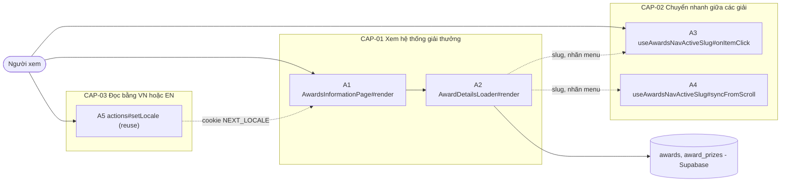
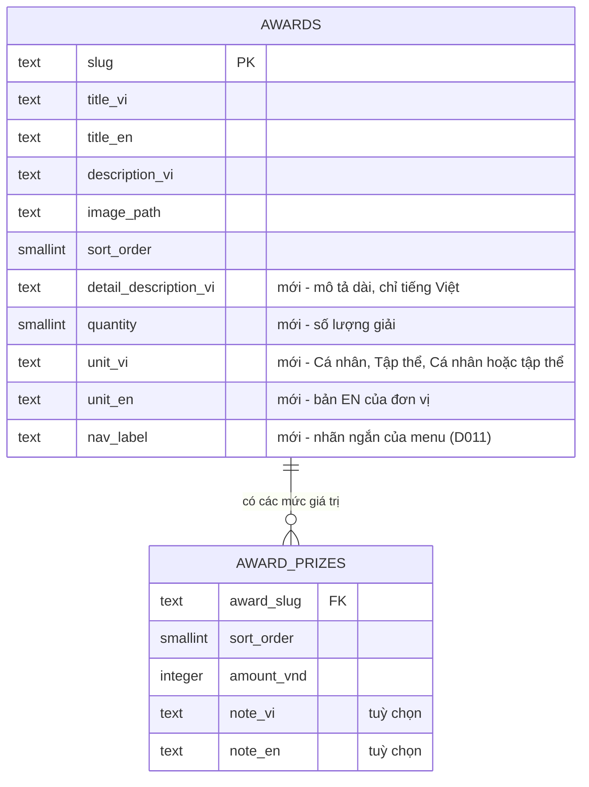

# F004_AwardsInformation — Technical Spec

**Priority**: P1
**Type**: ui
**Generated**: 2026-10-09

**See also:** [`functional-spec.md`](./functional-spec.md) — plain-language overview, open
decisions, requirements/business rules stated in one-liners, screens, user stories, scenarios,
edge cases, and configuration for a BA/QA audience.

**How to read this file:** § 2 is the index — pick the action you care about and read its block
in § 3 straight through; each block is one complete thread, top to bottom. § 4 is the shared
appendix — jump in only when a § 3 block points you there. Spec đã đối chiếu với mã nguồn as-built (2026-10-09): rung **Source** và cột `Source` trích `path:line` đã kiểm trong working tree; tên handler là tên thật của component hoặc hook.

## 1. Technical Overview

Người xem (khách hoặc đã đăng nhập) mở `/awards-information`; trang là một vỏ tĩnh (`SaaPageShell` có sẵn) bọc một ranh giới `<Suspense>`, bên trong đọc cookie ngôn ngữ rồi ghép header (liên kết "Awards Information" đang chọn), ảnh key visual, tiêu đề, phần giải thưởng, khối Sun* Kudos và footer. Phần giải thưởng đọc dữ liệu lúc chạy ở máy chủ qua Supabase server client (vai trò `anon` hoặc `authenticated`, RLS cho đọc công khai): bảng `awards` (mở rộng cột chi tiết) cùng bảng mới `award_prizes`; kết quả là menu bên trái và sáu khối giải. Menu là client component làm hai việc: bấm thì cuộn mượt và đánh dấu mục, cuộn tay hoặc neo `#<slug>` thì đánh dấu theo khối đang xem. Proxy chỉ thêm `/awards-information` vào matcher để làm mới phiên, không chuyển hướng.



## 2. Action Index

| # | Action (handler) | Method · Path | Codes | Writes | Detail |
|---|---|---|---|---|---|
| **A0** | *cross-cutting — belongs to no single action* | — | FR-601, BR-001 | — | § 4.4 |
| **A1** | `AwardsInformationPage#render` (`app/awards-information/page.tsx:7`) | `GET` `/awards-information` | FR-101, FR-102, FR-103, FR-201, FR-208, FR-211, FR-407, BR-002, BR-003, BR-004, US022, US026 | — *(read-only)* | § 3.1 |
| **A2** | `AwardDetailsLoader#render` (`app/awards-information/_components/award-details-loader.tsx:13`) | `GET` `/awards-information` *(đoạn sau `<Suspense>`)* | FR-001, FR-002, FR-202, FR-203, FR-204, FR-205, FR-206, FR-207, FR-209, FR-210, BR-004, BR-005, BR-006, DEC-001, DEC-002, ALG-002, INT-001, US023 | — *(read-only: `awards`, `award_prizes`)* | § 3.1 |
| **A3** | `useAwardsNavActiveSlug#onItemClick` (`app/_components/awards-nav-behaviour/use-awards-nav-active-slug.ts:73`) *(client behaviour, no HTTP)* | — | FR-401, FR-405, FR-406, BR-007, DEC-003, US024 | — *(read-only, chỉ cuộn trang)* | § 3.2 |
| **A4** | `useAwardsNavActiveSlug#syncFromScroll` (`app/_components/awards-nav-behaviour/use-awards-nav-active-slug.ts:103`) *(client behaviour, no HTTP)* | — | FR-002, FR-402, FR-403, FR-404, BR-007, BR-008, DEC-004, ALG-001, US025 | — *(read-only, chỉ đổi mục đang chọn)* | § 3.2 |
| **A5** | `actions#setLocale` *(reuse, unchanged)* | `POST` `/awards-information` *(Server Action)* | FR-408, BR-004, US027 | — *(chỉ ghi cookie `NEXT_LOCALE`)* | § 3.3 |

**Rung set** — mỗi khối trong § 3 theo thứ tự **Who** → **FE** → **Request** → **BE** → **Rule** → **Result** → **State** → **Source**; rung vắng thì bỏ hẳn. Feature này không có máy trạng thái bền vững (§ 4.3) nên không có rung **State**. Không action nào ghi bảng hay chạy nền, nên không khối nào cần `sequenceDiagram`.

## 3. Actions

### 3.1 CAP-01 — Xem hệ thống giải thưởng

#### A1 · Hiển thị trang Hệ thống giải
`GET /awards-information` → `` `AwardsInformationPage#render` ``
`FR-101` `FR-102` `FR-103` `FR-201` `FR-208` `FR-211` `FR-407` `BR-002` `BR-003` `BR-004` `US022` `US026` · `SCR004_AwardsInformation`

**Who** · Người xem, khách hoặc đã đăng nhập *(gate A0 — § 4.4)*
**FE** · Vỏ tĩnh `SaaPageShell` bọc `<Suspense>` có khung chờ nền tối cao bằng màn hình, như trang chủ. Nội dung ghép: `SiteHeader` với liên kết "Awards Information" ở trạng thái đang chọn (prop `currentPage="awards"`; header mặc định `about` nên trang chủ giữ hành vi cũ), vùng tài khoản và bộ chọn ngôn ngữ cắm vào slot sẵn có; ảnh key visual kèm logo "ROOT FURTHER" ở trên (key visual hiện là ảnh dùng lại `/home/key-visual.png` của trang chủ vì Figma chưa có tệp xuất riêng; cao 360px dưới `md`, 547px từ `md`); tiêu đề trang (chữ nhỏ, đường kẻ, chữ lớn vàng); ranh giới `<Suspense>` thứ hai quanh phần giải thưởng (A2) với khung chờ không chữ cùng kích thước vùng nội dung (FR-211); `KudosSection` có sẵn dùng lại nguyên (nhãn, tiêu đề, mô tả, logo KUDOS, nút "Chi tiết" trỏ `/sun-kudos`); `SiteFooter` có sẵn kèm `currentPage="awards"`. Không có nút widget (D007).
**Request** · cookie `NEXT_LOCALE`; không có tham số truy vấn (phần `#<slug>` chỉ ở trình duyệt, xem A4)
**BE** · `getLocale()` và `getDictionary(locale)` có sẵn trả chữ giao diện; từ điển có thêm một nhánh chữ riêng của trang (tiêu đề, nhãn "Số lượng giải thưởng" / "Giá trị giải thưởng", "Hoặc", đơn vị, thông báo rỗng). Khối Kudos dùng lại chuỗi Kudos đã có của trang chủ. Dữ liệu giải thuộc A2. Header nhận prop `currentPage` (mặc định `about`), footer nhận `currentPage` không có mặc định (bỏ trống thì không liên kết nào được chọn); trang chủ không truyền gì nên không đổi (`site-types.ts:16-30`).
**Rule**
- **BR-002 — Mỗi trang đánh dấu đang chọn đúng một liên kết điều hướng, là liên kết trỏ về chính trang đó.** Ở trang này là "Awards Information" (chữ vàng, gạch chân, `aria-current="page"`); "About SAA 2025" trả về kiểu thường. Footer đánh dấu cùng liên kết bằng `aria-current="page"` nhưng theo kiểu chọn riêng của Figma cho footer: nền nhạt và ánh sáng, không gạch chân, góc vuông (D014). Trang chủ không truyền `currentPage` nên header vẫn chọn "About SAA 2025" và footer không chọn liên kết nào. Nguồn: `app/_components/site/site-header.tsx:11-19,40-54`, `app/_components/site/site-footer.tsx:10-17,37-51`.
- **BR-003 — Liên kết tới trang chưa xây dùng địa chỉ dự kiến.** "Chi tiết" của Kudos, liên kết `/sun-kudos` và `/standards` ở header/footer trỏ đích dự kiến; trang chưa có thì Next trả 404 mặc định, không làm trang lỗi riêng (D007). Nguồn: `app/_components/home/kudos-section.tsx:37`, `site-header.tsx:56`, `site-footer.tsx:53-59`.
- **BR-004 — Ngôn ngữ chỉ là `vi` hoặc `en` (mặc định `vi`); EN chỉ dịch chữ giao diện.** Tiêu đề, nhãn, "Hoặc", nhãn Kudos theo từ điển; mô tả dài và đoạn Kudos giữ tiếng Việt. *(§ 4.4)*

**Result** · Chỉ đọc, không ghi DB. Người xem thấy đủ khối của trang: header, key visual, tiêu đề, phần giải (A2) hoặc khung chờ, Kudos, footer.
**Source:** `app/awards-information/page.tsx:7-15` → `app/awards-information/_components/awards-information-content.tsx:22-49` → `app/_components/site/site-header.tsx:11-71` → `app/_components/awards-information/awards-information-hero.tsx:9-45` → `app/_components/awards-information/awards-information-title.tsx:3-22` → `app/_components/home/kudos-section.tsx:6-55` → `app/_components/site/site-footer.tsx:15-68`

<!-- Không vẽ sequenceDiagram: dưới ngưỡng (chỉ đọc, không ghi bảng nào, đồng bộ trong request). -->

---

#### A2 · Hiển thị menu và sáu khối giải thưởng
`GET /awards-information` *(đoạn sau `<Suspense>` của phần giải thưởng)* → `` `AwardDetailsLoader#render` ``
`FR-001` `FR-002` `FR-202` `FR-203` `FR-204` `FR-205` `FR-206` `FR-207` `FR-209` `FR-210` `BR-004` `BR-005` `BR-006` `DEC-001` `DEC-002` `ALG-002` `INT-001` `US023` · `SCR004_AwardsInformation`

**Who** · Người xem *(vai trò DB `anon` hoặc `authenticated`; gate A0 — § 4.4)*
**FE** · Hai thành phần từ cùng một dữ liệu: menu bên trái (client component, xem A3/A4) và danh sách sáu khối giải bên phải. Mỗi khối là `<section>` có `id` là slug của giải: ảnh 336x336 viền vàng bo 24, biểu tượng + tên giải, mô tả dài, dòng số lượng (biểu tượng kim cương, nhãn, số, đơn vị), một hoặc nhiều dòng giá trị (biểu tượng giấy phép, nhãn, số tiền, ghi chú tuỳ chọn). Giữa hai mức giá trị của một giải có chữ "Hoặc" và đường kẻ. Khối thứ 1, 3, 5 ảnh bên trái, khối 2, 4, 6 ảnh bên phải (khổ máy tính); khổ nhỏ ảnh xếp trên. Đường kẻ dưới mỗi khối trừ khối cuối. Khối có `scroll-mt-36` (144px, tính cả thanh tab) dưới `lg` và `lg:scroll-mt-24` (96px) từ `lg` để không bị header cố định che khi cuộn tới. Mô tả dài hiển thị bằng `white-space: pre-line` nên đoạn cách nhau bằng `\n\n` (seed lưu `chr(10) || chr(10)`) xuống đoạn đúng như Figma (D013). Rỗng hoặc lỗi: chỉ một dòng thông báo, không có menu.
**Request** · cookie `NEXT_LOCALE`; không có tham số
**BE** · `getAwardDetails(locale)`: `await connection()` ngoài `try` như `getAwards` hiện có, `createClient()` có sẵn, rồi một truy vấn lồng đọc `awards` kèm các mức giá trị của `award_prizes`, sắp theo `sort_order`. `INT-001`: đọc dữ liệu giải qua Supabase Data API *(§ 4.5)*. `ALG-002`: lọc hàng hỏng, định dạng số lượng và số tiền, chọn chữ theo ngôn ngữ, gán phía ảnh *(§ 4.5)*. Không đổi `getAwards` và `AWARD_COLUMNS` của trang chủ.
**Rule**
- **BR-005 — Nội dung và thứ tự menu lẫn khối đến từ dữ liệu.** Tên, nhãn menu, mô tả dài, số lượng, đơn vị và mức giá trị không viết cứng trong giao diện; thứ tự là `sort_order` tăng dần, menu và khối cùng một thứ tự. Nguồn: `lib/awards/award-detail-mapping.ts:9-11` (cột), `lib/awards/get-award-details.ts:33` (thứ tự), `app/awards-information/_components/award-details-loader.tsx:29-45` (menu và khối từ cùng một mảng).
- **BR-006 — Quy tắc hiển thị giá trị.** Số lượng đệm tới ít nhất hai chữ số; số tiền ngăn nhóm nghìn bằng dấu chấm và kèm "VNĐ"; dòng ghi chú chỉ vẽ khi mức có ghi chú (vì vậy Best Manager và MVP không có dòng ghi chú). Nguồn: `lib/awards/award-detail-mapping.ts:84-86,105-112`, `app/_components/awards-information/award-block.tsx:20-24`.
- **BR-004 — Ngôn ngữ chỉ là `vi` hoặc `en`; EN chỉ dịch chữ giao diện.** Ở EN đơn vị và ghi chú lấy bản EN, nhãn dòng và "Hoặc" theo từ điển; mô tả dài luôn là bản tiếng Việt; tên giải là tên riêng, giữ nguyên. *(§ 4.4)*

| DEC | subtype | Condition | What the user sees | Source |
|---|---|---|---|---|
| **DEC-001** | render | đọc thành công VÀ có ≥ 1 giải hợp lệ | menu sáu mục + sáu khối theo `sort_order` | `app/awards-information/_components/award-details-loader.tsx:27-45` |
| **DEC-001** | render | đọc thành công VÀ 0 giải | tiêu đề trang giữ nguyên; thông báo "Thông tin giải thưởng sẽ sớm được cập nhật." (EN: "Award information will be updated soon.") thay cho menu và khối | `app/awards-information/_components/award-details-loader.tsx:17-26`, `app/_components/awards-information/award-details-states.tsx:4-6` |
| **DEC-001** | render | truy vấn trả lỗi hoặc ném ngoại lệ (kể cả thiếu biến môi trường Supabase) | cùng thông báo như khi rỗng; log `[awards-information]` ở máy chủ; Kudos và footer vẫn hiện | `lib/awards/get-award-details.ts:34-37`, `lib/awards/get-award-details.ts:45-50` |
| **DEC-001** | render | một số hàng thiếu cột hoặc sai kiểu | hàng hỏng bị bỏ khỏi cả menu và khối, log số hàng bị bỏ; hàng hợp lệ còn lại vẫn hiện, hết hàng thì như khi rỗng | `lib/awards/get-award-details.ts:39-43`, `lib/awards/award-detail-mapping.ts:64-81` |
| **DEC-002** | render | giải có đúng 1 mức giá trị | một dòng giá trị (kèm ghi chú nếu mức đó có) | `app/_components/awards-information/award-block.tsx:41-52` |
| **DEC-002** | render | giải có ≥ 2 mức giá trị (Signature) | các dòng giá trị theo `sort_order`, giữa hai dòng liên tiếp có "Hoặc" và đường kẻ | `app/_components/awards-information/award-block.tsx:29-39`, `app/_components/awards-information/award-block.tsx:45-48` |
| **DEC-002** | render | giải có 0 mức giá trị | khối vẫn hiện tên, mô tả, số lượng; không có dòng "Giá trị giải thưởng" | `app/_components/awards-information/award-block.tsx:41-52`, `app/_components/awards-information/award-block.tsx:109` |

**Result** · Chỉ đọc, không ghi DB. Người xem thấy menu và sáu khối theo dữ liệu seed local hoặc thông báo rỗng/lỗi dưới tiêu đề; ảnh dùng `image_path` có sẵn, đường dẫn không dùng được thì thay bằng logo SAA như thẻ ở trang chủ (D014).
**Source:** `app/awards-information/_components/award-details-loader.tsx:13-46` → `lib/awards/get-award-details.ts:24-51` → `lib/awards/award-detail-mapping.ts:99-116` → `app/_components/awards-information/award-details-layout.tsx:8-21` → `app/_components/awards-information/award-block.tsx:54-116`

<!-- Không vẽ sequenceDiagram: dưới ngưỡng (một truy vấn đọc, không ghi bảng nào, không bất đồng bộ nền). Phần phân nhánh là bảng DEC-001 và DEC-002. -->

---

### 3.2 CAP-02 — Chuyển nhanh giữa các giải bằng menu

#### A3 · Bấm một mục menu để cuộn tới giải
`—` → `` `useAwardsNavActiveSlug#onItemClick` `` *(client; hook của `AwardsNav`, trong menu của A2)*
`FR-401` `FR-405` `FR-406` `BR-007` `DEC-003` `US024` · `SCR004_AwardsInformation`

**Who** · Người xem *(gate A0 — § 4.4)*
**FE** · Menu có sáu mục (biểu tượng + nhãn ngắn); mục đang chọn chữ vàng, gạch chân vàng, ánh sáng nhẹ; mục khác nổi nền khi rê chuột hoặc lấy tiêu điểm (FR-406). Cố định theo cuộn ở khổ máy tính (cột 178px, `lg:top-28`), thành thanh tab cuộn ngang dính dưới header 64px ở khổ nhỏ (nền `#00101A` 90%, làm mờ phía sau). Mỗi mục là liên kết tới `#<slug>` để chuột giữa và bàn phím vẫn dùng được; mục đang chọn mang `aria-current="location"`.
**Request** · sự kiện `click` trên một mục; tham số là slug của mục
**BE** · không gọi máy chủ; tìm phần tử `id = slug` bằng `document.getElementById`, đặt mục vừa bấm làm mục đang chọn, ghim nó (`pin.hold()`) rồi gọi `scrollIntoView({ block: "start" })` với `behavior` theo DEC-003, sau đó `history.replaceState` đặt `#<slug>` (không thêm mục lịch sử, không phát `hashchange`; lỗi `SecurityError` bị bỏ qua). Trong lúc cuộn do bấm, mục này giữ nguyên dù các khối ở giữa đi qua (xem A4, `ALG-001`). Khối không tồn tại thì không chặn, liên kết `#<slug>` mặc định chạy.
**Rule**
- **BR-007 — Tại mọi thời điểm đúng một mục menu đang chọn; mặc định là mục đầu.** Chọn mục mới thì mục cũ tắt cùng lúc; không có trạng thái "không mục nào" khi menu có mục. *(§ 4.4)*

| DEC | subtype | Condition | What the user sees | Source |
|---|---|---|---|---|
| **DEC-003** | interaction | click chính trên mục menu VÀ `prefers-reduced-motion` không bật | trang cuộn mượt tới khối giải; mục vừa bấm đang chọn | `app/_components/awards-nav-behaviour/use-awards-nav-active-slug.ts:73-88` |
| **DEC-003** | interaction | click chính trên mục menu VÀ `prefers-reduced-motion: reduce` | trang nhảy tức thì tới khối giải; mục vừa bấm đang chọn | `app/_components/awards-nav-behaviour/use-awards-nav-active-slug.ts:79`, `app/_components/awards-nav-behaviour/awards-nav-scroll-dom.ts:14-16` |
| **DEC-003** | interaction | click có phím bổ trợ hoặc không phải nút trái | không chặn: trình duyệt xử lý liên kết `#<slug>` mặc định (mở tab mới) | `app/_components/awards-nav-behaviour/use-awards-nav-active-slug.ts:36-39`, `app/_components/awards-nav-behaviour/use-awards-nav-active-slug.ts:75` |

**Result** · Chỉ đọc, không ghi DB; chỉ đổi vị trí cuộn và mục đang chọn. Người xem tới đúng khối giải, mục vừa bấm sáng, mục trước tắt.
**Source:** `app/_components/awards-nav-behaviour/awards-nav.tsx:19-32` → `app/_components/awards-nav-behaviour/use-awards-nav-active-slug.ts:36-39,63-88` → `app/_components/awards-information/awards-nav-view.tsx:15-47`

<!-- Không vẽ sequenceDiagram: dưới ngưỡng (một sự kiện client, không ghi bảng). Phần phân nhánh là bảng DEC-003. -->

---

#### A4 · Cập nhật mục đang chọn khi cuộn tay hoặc mở bằng neo
`—` → `` `useAwardsNavActiveSlug#syncFromScroll` `` *(client; cùng hook của menu A2)*
`FR-002` `FR-402` `FR-403` `FR-404` `BR-007` `BR-008` `DEC-004` `ALG-001` `US025` · `SCR004_AwardsInformation`

**Who** · Người xem *(gate A0 — § 4.4)*
**FE** · Không có giao diện riêng: cùng menu của A3, chỉ đổi mục đang chọn. Khi mục đổi mà thanh tab ở khổ nhỏ đang cuộn ngang thì mục đang chọn được cuộn vào tầm nhìn của thanh tab bằng cách cuộn riêng thanh tab, không cuộn cả trang *(thiết kế, chưa có trong Figma; `app/_components/awards-nav-behaviour/awards-nav-scroll-dom.ts:56-68`)*.
**Request** · sự kiện `scroll` của trang (không dùng IntersectionObserver) cùng `scrollend`, `wheel`, `touchstart`, `keydown` để nhả ghim; `location.hash` lúc mount và khi `hashchange`
**BE** · không gọi máy chủ. `ALG-001`: chọn mục đang chọn theo vị trí các khối so với một đường chuẩn dưới header, có ghim tạm sau khi bấm menu hoặc mở bằng neo *(§ 4.5)*. Lúc mount (sau một khung hình): đọc `location.hash`, nếu khớp slug thì cuộn tức thì tới khối và đặt mục tương ứng; nếu không khớp thì đồng bộ theo vị trí cuộn hiện tại (đầu trang thì mục đầu). `hashchange` áp dụng lại cùng đường đó.
**Rule**
- **BR-007 — Tại mọi thời điểm đúng một mục menu đang chọn; mặc định là mục đầu.** Cuộn tay đổi mục theo khối đang xem; không có lúc nào hai mục cùng sáng hay không mục nào sáng. *(§ 4.4)*
- **BR-008 — Neo của trang là slug của giải; neo không khớp bị bỏ qua.** Phần `#...` không phải slug của giải nào thì không lỗi, không cuộn, mục đầu tiên đang chọn; slug được so khớp với danh sách slug có trong dữ liệu chứ không phải tên cố định trong mã; mã hoá lỗi (ví dụ `%E0%A4%A`) cũng bị bỏ qua thay vì ném lỗi. Nguồn: `lib/ui/section-scroll-spy.ts:28-44`, `app/_components/awards-nav-behaviour/use-awards-nav-active-slug.ts:95-101`.

| DEC | subtype | Condition | What the user sees | Source |
|---|---|---|---|---|
| **DEC-004** | interaction | vừa bấm menu và trang còn đang cuộn tới đích | mục vừa bấm giữ trạng thái đang chọn, các mục ở giữa không nhấp nháy | `app/_components/awards-nav-behaviour/use-awards-nav-active-slug.ts:8-34`, `app/_components/awards-nav-behaviour/use-awards-nav-active-slug.ts:105` |
| **DEC-004** | interaction | người xem cuộn tay VÀ chưa cuộn hết trang | mục của khối cuối cùng đã lên tới đường chuẩn đang chọn; chưa khối nào lên tới thì mục đầu | `lib/ui/section-scroll-spy.ts:18-26` |
| **DEC-004** | interaction | người xem cuộn tay tới cuối trang | mục cuối (MVP) đang chọn dù khối của nó chưa lên tới đường chuẩn | `lib/ui/section-scroll-spy.ts:20`, `app/_components/awards-nav-behaviour/awards-nav-scroll-dom.ts:12,18-21` |
| **DEC-004** | flow | mở trang kèm `#<slug>` khớp một giải | trang ở khối đó; mục tương ứng đang chọn | `app/_components/awards-nav-behaviour/use-awards-nav-active-slug.ts:95-101`, `app/_components/awards-nav-behaviour/use-awards-nav-active-slug.ts:132-136` |
| **DEC-004** | flow | mở trang không có neo hoặc neo không khớp giải nào | trang ở đầu; mục đầu (Top Talent) đang chọn; không lỗi | `lib/ui/section-scroll-spy.ts:34-44`, `app/_components/awards-nav-behaviour/use-awards-nav-active-slug.ts:57,59,135` |

**Result** · Chỉ đọc, không ghi DB; chỉ đổi mục đang chọn. Người xem thấy mục sáng đi theo khối đang đọc, luôn đúng một mục.
**Source:** `app/_components/awards-nav-behaviour/use-awards-nav-active-slug.ts:90-150` → `lib/ui/section-scroll-spy.ts:18-44` → `app/_components/awards-nav-behaviour/awards-nav-scroll-dom.ts:10-68`

<!-- Không vẽ sequenceDiagram: dưới ngưỡng (không ghi bảng, không bất đồng bộ nền). Phần phân nhánh là bảng DEC-004 và ALG-001. -->

---

### 3.3 CAP-03 — Đọc trang bằng VN hoặc EN

#### A5 · Đổi ngôn ngữ giao diện từ trang Awards Information
`POST /awards-information` *(Server Action)* → `` `actions#setLocale` `` *(`lib/i18n/actions.ts`, dùng lại nguyên, không đổi)*
`FR-408` `BR-004` `US027` · `SCR004_AwardsInformation`

**Who** · Người xem *(gate A0 — § 4.4)*
**FE** · `LanguageSelector` có sẵn cắm vào slot ngôn ngữ của header (cùng cách trang chủ dùng); không thay đổi giao diện hay hành vi của bộ chọn.
**Request** · `locale` = `vi` \| `en`
**BE** · `setLocale(locale)` có sẵn: danh sách cho phép `vi`/`en`, giá trị khác thì thoát không làm gì; hợp lệ thì ghi cookie `NEXT_LOCALE` (`path=/`, một năm, `sameSite=lax`). Sau action Next làm mới cây render nên A1, A2 đọc lại cookie.
**Rule** · **BR-004 — Ngôn ngữ chỉ là `vi` hoặc `en` (mặc định `vi`); EN chỉ dịch chữ giao diện.** Giá trị lạ trong action bị bỏ qua và cookie giữ nguyên; cookie lạ khi đọc rơi về `vi`; mô tả dài, đoạn Kudos và tên giải vẫn như bản tiếng Việt sau khi đổi. *(§ 4.4)*
**Result** · Không ghi DB, chỉ ghi cookie. Chữ giao diện của trang đổi theo ngôn ngữ đã chọn.
**Source:** `lib/i18n/actions.ts:8-17`

<!-- Không vẽ sequenceDiagram: dưới ngưỡng (chỉ ghi cookie, không ghi bảng). Handler là mã đã có của feature đổi ngôn ngữ ở trang chủ; feature này chỉ cắm vào một trang mới, không sửa. -->

---

### 3.4 Edge cases

| Action | Scenario | Behavior |
|---|---|---|
| A1 · A2 | Khách chưa đăng nhập mở trang | Thấy đủ nội dung, proxy không chuyển hướng, vùng tài khoản hiện nút đăng nhập *(A0, BR-001)* |
| A2 | Bảng `awards` rỗng, truy vấn lỗi hoặc thiếu `SUPABASE_URL`/`SUPABASE_PUBLISHABLE_KEY` | log `[awards-information]`, giữ tiêu đề trang, hiện thông báo rỗng thay cho menu và khối; Kudos và footer không ảnh hưởng *(DEC-001)* |
| A2 | Hàng `awards` thiếu cột hoặc sai kiểu | hàng bị bỏ khỏi cả menu và khối, log số hàng bị bỏ *(DEC-001, ALG-002)* |
| A2 | Giải không có hàng nào trong `award_prizes` | khối vẫn hiện, không có dòng giá trị *(DEC-002)* |
| A2 | Mức giá trị không có ghi chú (Best Manager, MVP) | không vẽ dòng ghi chú *(BR-006)* |
| A2 | `image_path` rỗng, tương đối, bắt đầu `//` hoặc có `\` | dùng ảnh logo SAA thay thế *(ALG-002)* |
| A2 | `unit_en` hoặc `note_en` trống ở EN | rơi về bản VN *(BR-004, ALG-002)* |
| A3 | Bấm mục khi đã đang chọn mục đó | cuộn tới khối của mục, trạng thái đang chọn không đổi *(BR-007)* |
| A3 | `prefers-reduced-motion: reduce` | cuộn tức thì *(DEC-003)* |
| A3 · A4 | Bấm menu trong lúc trang còn đang cuộn từ lần bấm trước | lần bấm sau thay lần trước; mục đang chọn là mục bấm sau *(DEC-004)* |
| A4 | Neo không khớp giải nào, ví dụ `#does-not-exist` | không lỗi JavaScript, trang ở đầu, mục đầu đang chọn *(BR-008, DEC-004)* |
| A4 | Khối cuối không lên tới đường chuẩn khi cuộn hết trang | mục cuối đang chọn *(DEC-004)* |
| A4 | Địa chỉ đổi `#<slug>` bằng nút Back/Forward | `hashchange` đặt lại mục đang chọn theo neo mới *(DEC-004)* |
| A1 | Bấm "Chi tiết" của Kudos khi `/sun-kudos` chưa xây | trang 404 mặc định của Next *(BR-003)* |
| A5 | Cookie `NEXT_LOCALE` có giá trị lạ | coi là `vi`; `setLocale` nhận giá trị ngoài `vi`/`en` thì thoát sớm *(BR-004)* |
| A1-A5 | Người đã đăng nhập mở trang | cùng nội dung như khách; chỉ vùng tài khoản khác (F003) *(A0, BR-001)* |

## 4. Shared Foundation

### 4.1 Components

| Component | Responsibility | Used in | File |
|---|---|---|---|
| `AwardsInformationPage` | vỏ tĩnh: `SaaPageShell` + `<Suspense>` quanh nội dung trang | A1 | `app/awards-information/page.tsx:7` |
| `AwardsInformationContent` | đọc locale, ghép header, key visual, tiêu đề, phần giải, Kudos, footer; đặt ranh giới `<Suspense>` của phần giải | A1 | `app/awards-information/_components/awards-information-content.tsx:22` |
| `AwardsInformationHero`, `AwardsInformationTitle` | key visual + logo ROOT FURTHER; chữ nhỏ, đường kẻ, `<h1>` | A1 | `app/_components/awards-information/awards-information-hero.tsx:9`, `awards-information-title.tsx:3` |
| `AwardDetailsLoader`, `AwardDetailsLayout` | bộ nạp dữ liệu (menu + khối, hoặc thông báo rỗng); bố cục hai cột từ `lg` | A2 | `app/awards-information/_components/award-details-loader.tsx:13`, `app/_components/awards-information/award-details-layout.tsx:8` |
| `AwardBlock`, `AwardDetailsEmpty`, `AwardDetailsSkeleton` | một khối giải; thông báo rỗng/lỗi; khung chờ ba khối không chữ | A2 | `app/_components/awards-information/award-block.tsx:54`, `award-details-states.tsx:4,11` |
| `AwardsNav`, `AwardsNavView`, `useAwardsNavActiveSlug` | menu client: vỏ giữ trạng thái, bản trình bày thuần (`aria-current="location"`), hook là nơi duy nhất ghi mục đang chọn | A3, A4 | `app/_components/awards-nav-behaviour/awards-nav.tsx:19`, `app/_components/awards-information/awards-nav-view.tsx:15`, `app/_components/awards-nav-behaviour/use-awards-nav-active-slug.ts:52` |
| `pickActiveSectionIndex`, `matchSectionHash` | thuật toán thuần: chọn mục theo đường chuẩn, so khớp neo với danh sách slug | A4 | `lib/ui/section-scroll-spy.ts:18,34` |
| `measureReadingLine`, `isAtPageBottom`, `revealNavItem`, `prefersReducedMotion` | các lời gọi DOM của menu (đo header, cuối trang, cuộn thanh tab, giảm chuyển động) | A3, A4 | `app/_components/awards-nav-behaviour/awards-nav-scroll-dom.ts:38,18,56,14` |
| `getAwardDetails`, `toAwardDetails`, `isAwardDetailRow` | đọc `awards` + `award_prizes` bằng một truy vấn, lọc hàng hỏng, ánh xạ thành dữ liệu hiển thị | A2 | `lib/awards/get-award-details.ts:24`, `lib/awards/award-detail-mapping.ts:99,64` |
| `SiteHeader`, `SiteFooter`, `SitePage` | prop `currentPage` chọn mục đang chọn; header mặc định `about`, footer không mặc định; footer có kiểu chọn riêng | A1 | `app/_components/site/site-header.tsx:11`, `app/_components/site/site-footer.tsx:15`, `app/_components/site/site-types.ts:16-30` *(sửa)* |
| `KudosSection` | khối Sun* Kudos, dùng lại nguyên | A1 | `app/_components/home/kudos-section.tsx` *(có sẵn)* |
| `SaaPageShell`, `LanguageSelector`, `AccountRegion`, `AccountBellRegion` | vỏ trang, bộ chọn ngôn ngữ, hai vùng tài khoản (F003) | A1, A5 | `app/_components/site/saa-page-shell.tsx`, `app/_components/site/language-selector.tsx`, `app/_components/header-behaviour/account-region.tsx` *(có sẵn)* |
| `getLocale`, `getDictionary`, bản chữ của trang | cookie ngôn ngữ, từ điển, chữ riêng của trang Awards Information | A1, A2, A5 | `lib/i18n/dictionary.ts:1-4,18` *(sửa)*, `lib/i18n/awards-information-copy.ts` *(mới)* |
| `setLocale` | Server Action ghi cookie `NEXT_LOCALE` | A5 | `lib/i18n/actions.ts` *(có sẵn, không đổi)* |
| `createClient` | Supabase server client gắn cookie request | A2 | `lib/supabase/server.ts` *(có sẵn)* |

### 4.2 Data Model



<!-- erDiagram chỉ giữ quan hệ và cột chính; bảng dưới nêu mục đích và action, không lặp danh sách cột. -->

#### Key Entities

| Entity | Table | Key Columns | Purpose |
|--------|-------|-------------|---------|
| `MODEL001_Award` *(có sẵn, mở rộng)* | `awards` | `slug` (PK), cột mới `detail_description_vi`, `quantity`, `unit_vi`, `unit_en`, `nav_label` | dữ liệu chi tiết của sáu giải cho A2; cột cũ trang chủ đang đọc giữ nguyên *(A2)* |
| `MODEL003_AwardPrize` *(mới)* | `award_prizes` | khóa (`award_slug`, `sort_order`), `amount_vnd`, `note_vi`, `note_en` | các mức giá trị của một giải; Signature có hai dòng *(A2)* |

Ghi chú as-built (`supabase/migrations/20261009021753_add_award_details_and_prizes.sql`):
- Migration chỉ **thêm** (`:26-31`): năm cột mới của `awards` cho phép NULL, không default (`quantity` có `check (quantity > 0)`), nên dòng đã có không hỏng; hàng chưa có chi tiết bị trang này bỏ (DEC-001) còn trang chủ không ảnh hưởng; seed điền giá trị thật. Không đổi cột cũ, không đổi quyền hiện có. `AWARD_COLUMNS` của trang chủ chọn cột tường minh nên không bị ảnh hưởng.
- `award_prizes` (`:33-42`): khóa chính (`award_slug`, `sort_order`) dẫn bằng `award_slug` nên cũng phục vụ khóa ngoại, không có chỉ mục riêng; khóa ngoại tới `awards(slug)` với `on delete cascade on update cascade`; ràng buộc `amount_vnd >= 0`; `note_vi`/`note_en` NULL nghĩa là không có dòng ghi chú (BR-006).
- RLS của `award_prizes` theo cùng mẫu như `awards` (`supabase/migrations/20261008045411_create_awards.sql:26-36`; `supabase/migrations/20261009021753_add_award_details_and_prizes.sql:46-57`): bật RLS, policy `award_prizes_select_public` chỉ `select` cho `anon, authenticated`, thu hết quyền rồi chỉ cấp `select` cho `anon, authenticated` và đủ ghi cho `service_role`.
- Seed bổ sung `supabase/seeds/common/02-award-details.sql` chạy sau `01-awards.sql` (thứ tự tên tệp; `sql_paths` là glob `./seeds/common/*.sql`), idempotent: cập nhật cột mới của `awards` theo `slug` (`:10-30`) và upsert `award_prizes` theo khóa (`:33-43`), chữ lấy nguyên văn từ `momorph/awards-information-content.md`; dấu cách đôi của Figma trong mô tả Signature và MVP được lưu thành `chr(10) || chr(10)` (D013).

#### Polymorphic Behavior

N/A — no discriminator fields in Key Entities.

### 4.3 State Management

None.

<!-- Mục đang chọn của menu là một giá trị dẫn xuất (slug đang chọn) do ba nguồn quyết định (bấm, cuộn, neo); quy tắc nằm ở BR-007 và DEC-004, và "đúng một mục" không phải vòng đời bền vững nên không lập SM. -->

### 4.4 Shared Rules

#### Bin 3 — cross-cutting, belongs to no single action

**A0 · FR-601 / BR-001 — Trang Awards Information công khai cho mọi người xem.**
Cross-cutting: áp dụng cho toàn trang, không thuộc riêng action nào. Trang không kiểm tra phiên; matcher của `proxy.ts` nay là `["/", "/login", "/awards-information"]` (`proxy.ts:18-20`), `/awards-information` được thêm dưới dạng literal tĩnh chỉ để làm mới token phiên — `redirectTarget` vẫn chỉ chuyển hướng người đã đăng nhập khỏi `/login`, nên khách không bao giờ bị chuyển hướng ở đây. Khách và người đã đăng nhập thấy cùng nội dung chung, chỉ vùng tài khoản khác (F003). Ở tầng dữ liệu, `awards` và `award_prizes` chỉ cho `select` với `anon` và `authenticated` nên người xem không ghi được; trang không dùng `service_role`.
**Source:** `proxy.ts:18-20` · `lib/supabase/proxy-session.ts:99-105` *(`redirectTarget`, không đổi)*; sửa matcher là thay đổi của feature này trên module do F001 sở hữu, tài liệu F001 và F002 đã cập nhật theo.

#### Bin 2 — used by ≥2 named actions

**BR-004 — Ngôn ngữ chỉ là `vi` hoặc `en` (mặc định `vi`); EN chỉ dịch chữ giao diện.**
Used in: **A1** · **A2** · **A5**. Chữ giao diện (tiêu đề, nhãn "Số lượng giải thưởng"/"Giá trị giải thưởng", "Hoặc", đơn vị, ghi chú, nhãn Kudos, thông báo rỗng) tra từ từ điển hoặc cột `*_en` theo locale; mô tả dài của giải, đoạn Kudos và tên giải là tiếng Việt dùng chung hai ngôn ngữ. Trống ở cột `*_en` thì rơi về cột `*_vi`.
**Design basis:** Study report + clarifications.md (D006, D012)
```text
locale = cookie NEXT_LOCALE in {vi, en} ? cookie : vi
chrome text   -> dictionary[locale]
unit, note    -> locale == en ? (trim(x_en) || x_vi) : x_vi
description   -> detail_description_vi (always)
award title   -> locale == en ? (trim(title_en) || title_vi) : title_vi
```

**BR-007 — Tại mọi thời điểm đúng một mục menu đang chọn; mặc định là mục đầu.**
Used in: **A3** · **A4**. Chọn mục mới (bằng bấm, cuộn hay neo) thì mục cũ tắt trong cùng một lần cập nhật; menu có mục thì không bao giờ ở trạng thái không mục nào hay hai mục sáng. Mặc định, khi chưa có tương tác và chưa có neo hợp lệ, là mục đầu tiên theo `sort_order`.
**Design basis:** Study report + clarifications.md (D004, D008)
```text
activeSlug : exactly one of menu slugs
init       = slugFromHash() if valid else first(menu)
setActive(s): activeSlug = s        # single writer path for click, scroll, hash
```

### 4.5 Algorithms & Integrations

### Chọn mục menu đang chọn theo vị trí cuộn, có ghim sau khi bấm (ALG-001)
**Linked FR:** FR-401, FR-402, FR-403
**Used in:** A4
**Source:** `lib/ui/section-scroll-spy.ts:18-26` · `app/_components/awards-nav-behaviour/use-awards-nav-active-slug.ts:8-34,103-122` · `app/_components/awards-nav-behaviour/awards-nav-scroll-dom.ts:10-48`
**Input:** vị trí đỉnh của các khối giải so với đường chuẩn dưới header, cờ đang cuộn do bấm menu, vị trí cuộn · **Output:** đúng một slug · **Complexity:** O(n) với n = số giải (6)
**Description:** Mục đang chọn là khối cuối cùng có đỉnh đã lên tới đường chuẩn; chưa khối nào lên tới thì là mục đầu (`pickActiveSectionIndex`). Đường chuẩn nằm ở 25% chiều cao vùng nhìn còn lại dưới các thanh cố định: đáy header cố định, cộng đáy menu khi menu đang là thanh tab xếp trên các khối (dưới `lg`) (`measureReadingLine`, `READING_LINE_RATIO = 0.25`). Cuộn hết trang (sai số 2px) thì chọn mục cuối vì khối cuối có thể không bao giờ lên tới đường chuẩn. Sau khi bấm menu hoặc mở bằng neo, mục đó được ghim cho tới khi cuộn dừng: `scrollend` **và** hẹn giờ nhàn rỗi 150ms (không có sự kiện `scroll` nào trong 150ms) cùng được gắn, cái nào tới trước thì nhả; ngoài ra `wheel`, `touchstart`, `keydown` nhả ghim ngay vì người xem đã tự cuộn. Trình nghe `scroll` thụ động, mỗi khung hình tối đa một lần tính (`requestAnimationFrame`); không dùng IntersectionObserver.

**Pseudocode:**
```text
onScroll():            if pin.held: pin.hold() (restart 150ms idle timer)    # DEC-004
                       else: schedule syncFromScroll on next frame
syncFromScroll():      if pin.held: return
  line   = fixedHeaderBottom (+ navBottom in tab-bar mode) + 25% of rest of viewport
  index  = pickActiveSectionIndex(tops, line, atBottom)   # atBottom -> last; last top <= line; else first
  setSelected(sections[index].slug)
goTo(slug):            setSelected(slug); pin.hold(); scrollIntoView({ block: "start" })   # click and hash
onClickMenu(slug):     plain primary click only; goTo(slug, smooth | instant if reduced motion); replaceState("#slug")
onHash(slug):          if matchSectionHash(hash, slugs): goTo(slug, instant)
release pin:           scrollend | 150ms without scroll | wheel | touchstart | keydown
```

### Chuyển hàng bảng giải thưởng thành dữ liệu hiển thị, bỏ hàng hỏng (ALG-002)
**Linked FR:** FR-203, FR-204, FR-205, FR-206, FR-207, FR-210
**Used in:** A2
**Source:** `lib/awards/award-detail-mapping.ts:51-116`
**Input:** các hàng `awards` kèm `award_prizes` đã sắp theo `sort_order`, locale · **Output:** danh sách khối hiển thị giữ nguyên thứ tự · **Complexity:** O(n + p)
**Description:** Hàng thiếu cột bắt buộc hoặc sai kiểu bị bỏ và đếm vào log. Mỗi hàng hợp lệ thành một khối: số lượng đệm hai chữ số, đơn vị theo locale (rơi về bản VN), số tiền định dạng ngăn nghìn bằng dấu chấm kèm "VNĐ", ghi chú theo locale hoặc bỏ nếu trống, các mức giá trị theo `sort_order`, ảnh dùng `image_path` nếu là đường dẫn gốc dưới `/public` (bắt đầu `/`, không `//`, không `\`), nếu không dùng logo SAA; phía ảnh là trái cho chỉ số chẵn (0-based) và phải cho chỉ số lẻ.

**Pseudocode:**
```text
rows = rows.filter(isValidAwardDetail)          # log "skipped N malformed row(s)"
blocks = rows.map((r, i) => ({
  slug: r.slug, navLabel: r.nav_label, title: title(r, locale),
  description: r.detail_description_vi,
  quantity: pad2(r.quantity), unit: pick(r.unit_en, r.unit_vi, locale),
  prizes: r.prizes.sortBy(sort_order).map(p => ({
    amount: groupThousandsWithDot(p.amount_vnd) + " VNĐ",
    note: pick(p.note_en, p.note_vi, locale) or null })),
  image: isLocalPath(r.image_path) ? r.image_path : "/home/logo.png",
  imageSide: i % 2 == 0 ? "left" : "right" }))
```

### Đọc chi tiết giải thưởng từ dịch vụ dữ liệu Supabase (INT-001)
**Linked FR:** FR-001, FR-209, FR-601
**Used in:** A2
**Source:** `lib/awards/get-award-details.ts:24-51`
**Type:** api-call
**Target:** Supabase Data API (PostgREST) trên `public.awards` và `public.award_prizes`, qua server client dùng khóa publishable (vai trò `anon` khi không có phiên, `authenticated` khi có)
**Payload:** một truy vấn lồng: `select(AWARD_DETAIL_COLUMNS)` chọn các cột của `awards` cần cho trang (gồm cột mới) kèm `award_prizes(sort_order,amount_vnd,note_vi,note_en)` nhúng (`lib/awards/award-detail-mapping.ts:9-11`), `.order("sort_order", { ascending: true })` (`lib/awards/get-award-details.ts:30-33`); không có secret nào đi qua trình duyệt.
**Failure handling:** lỗi truy vấn hoặc ngoại lệ được log một dòng `[awards-information]` và trả danh sách rỗng (hiện thông báo rỗng, DEC-001); không retry; không cache, đọc theo từng request (`connection()` đặt đọc ở thời điểm request, ngoài `try`; `unstable_rethrow` giữ nguyên lỗi prerender của Next, `get-award-details.ts:26,45-50`).

### 4.6 Configuration

```text
NEXT_LOCALE (cookie)                                    # vi | en, path=/, 1 năm, sameSite=lax (A5, dùng lại)
SUPABASE_URL, SUPABASE_PUBLISHABLE_KEY                  # server-only, đọc bởi createClient cho A2 (tên biến, không có giá trị ở đây)
proxy matcher ["/", "/login", "/awards-information"]    # proxy.ts:19; literal tĩnh làm mới phiên, không chuyển hướng (A0)
supabase/migrations/20261009021753_add_award_details_and_prizes.sql   # thêm 5 cột vào awards + bảng award_prizes + RLS + GRANT
supabase/seeds/common/02-award-details.sql              # seed chi tiết giải, chạy sau 01-awards.sql (chỉ khi db reset local)
public/home/awards/<slug>.png                           # ảnh 336x336 dùng lại của thẻ ở trang chủ (D014)
```

**Client behavior:** see
[`behavior-logic.md`](../../generated/behavior-logic.md) (client-side patterns — debounce, optimistic UI, polling, upload, realtime),
[`permissions.md`](../../system/permissions.md) (feature flags / experiments / env / locale gates),
[`architecture.md`](../../system/architecture.md) (guards / deep-link state restoration / unsaved-changes protection).

## 5. Verification & Technical Notes

### 5.1 Technical Verification

Chính sách kiểm thử: `e2e-red-first` (điều hướng và chuyển trạng thái đang chọn là hành vi) — viết ca Playwright cho màn hình này và chạy ĐỎ trước khi viết mã; runner Playwright đã có (`e2e/`), ca cần dữ liệu cần Supabase local đã `db reset`. Bộ test schema/RLS cho `award_prizes` và các cột mới là hai tệp mới `e2e/supabase-schema-rls-award-details-read.spec.ts` và `e2e/supabase-schema-rls-award-details-write-denied.spec.ts`. Ca của trang: `e2e/awards-information-page.spec.ts` (khung trang, header/footer, Kudos, khách và người đã đăng nhập), `-award-blocks.spec.ts` (sáu khối), `-nav.spec.ts` (menu, thanh tab ở 375px), `-nav-hash.spec.ts` (neo hợp lệ, lạ, mã hoá lỗi, giảm chuyển động, Back, thẻ từ trang chủ), `-nav-scroll-spy.spec.ts` (cuộn tay, cuối trang), `-language.spec.ts` (VN/EN, cookie); `e2e/homepage-layout-and-content.spec.ts` thêm hai ca bảo đảm trang chủ không chọn "Awards Information" ở header và không chọn liên kết nào ở footer.

- **SC-001** *(A0, A1)* `/awards-information` không chuyển hướng với khách; thấy header, key visual, tiêu đề, phần giải, khối Kudos, footer; "Awards Information" ở header có `aria-current="page"` còn "About SAA 2025" thì không (covers FR-101, FR-102, FR-201, FR-208, BR-001, BR-002)
- **SC-002** *(A2)* Menu sáu mục đúng thứ tự và nhãn ngắn; sáu khối đúng chữ Figma: Top Talent "10 Cá nhân" và "7.000.000 VNĐ cho mỗi giải thưởng", Best Manager và MVP không có dòng ghi chú, Signature hai mức với "Hoặc" (covers FR-202, FR-203, FR-204, FR-205, FR-206, BR-005, BR-006, DEC-002)
- **SC-003** *(A2)* Ảnh xen kẽ trái/phải ở khổ máy tính (khối 1, 3, 5 trái); đường kẻ giữa khối, không có sau khối cuối; khổ nhỏ ảnh xếp trên (covers FR-207)
- **SC-004** *(A2)* Với bảng `awards` rỗng hoặc truy vấn lỗi, tiêu đề trang giữ nguyên và hiện đúng thông báo "Thông tin giải thưởng sẽ sớm được cập nhật." (EN: "Award information will be updated soon.") còn Kudos và footer vẫn hiện; hàng hỏng bị bỏ (covers FR-209, FR-210, DEC-001)
- **SC-005** *(A3)* Bấm lần lượt từng mục: trang cuộn tới đúng khối, khối không bị header che, chỉ mục vừa bấm đang chọn (chữ vàng, gạch chân), mục trước tắt; rê chuột làm nổi mục; với giảm chuyển động bật thì cuộn tức thì (covers FR-401, FR-405, FR-406, BR-007, DEC-003)
- **SC-006** *(A4)* Cuộn tay qua các khối thì mục đang chọn đi theo, luôn đúng một mục, mục cuối chọn được khi cuộn hết trang; mở `#<slug>` hợp lệ tới đúng giải; `#does-not-exist` không có lỗi JavaScript, trang ở đầu, "Top Talent" đang chọn (covers FR-002, FR-402, FR-403, FR-404, BR-007, BR-008, DEC-004, ALG-001)
- **SC-007** *(A1)* "Chi tiết" ở khối Kudos có `href` là `/sun-kudos` (trang chưa xây nên 404 mặc định) (covers FR-407, BR-003)
- **SC-008** *(A5, A1, A2)* Mặc định "VN"; chọn EN đặt cookie `NEXT_LOCALE=en`, chữ giao diện đổi (tiêu đề, nhãn, ghi chú, đơn vị, "Or"), mô tả dài và đoạn Kudos vẫn tiếng Việt; cookie lạ cho kết quả `vi` (covers FR-408, BR-004)
- **SC-009** *(A0, A2)* Với vai trò `anon`, `select` trên `awards` và `award_prizes` thành công còn `insert`, `update`, `delete` bị từ chối; cột cũ trang chủ đọc vẫn trả đủ (covers FR-001, FR-601, BR-001)

#### US022 *(A1)*

**Independent Test:** Mở `/awards-information` khi chưa đăng nhập, rồi khi đã đăng nhập; mở từ liên kết ở header trang chủ.

**Acceptance Scenarios:**

1. **Given** khách chưa đăng nhập, **When** mở `/awards-information`, **Then** trả 200 với đủ nội dung, URL không đổi, không có màn hình đăng nhập.
2. **Given** khách ở `/`, **When** bấm "Awards Information" ở header, **Then** tới `/awards-information` và liên kết đó có `aria-current="page"`.

#### US023 *(A2)*

**Independent Test:** Với dữ liệu seed, đọc chữ của từng khối; rồi thử bảng rỗng.

**Acceptance Scenarios:**

1. **Given** sáu hàng `awards` và các hàng `award_prizes` đã seed, **When** mở trang, **Then** sáu khối đúng thứ tự, Signature có hai dòng giá trị ngăn bằng "Hoặc".
2. **Given** bảng `awards` rỗng, **When** mở trang, **Then** tiêu đề giữ nguyên và thông báo thay cho menu và khối.

#### US024 *(A3)*

**Independent Test:** Bấm "Top Talent" rồi "MVP" và kiểm tra vị trí cuộn cùng trạng thái đang chọn sau mỗi lần.

**Acceptance Scenarios:**

1. **Given** ở đầu trang, **When** bấm "MVP", **Then** khối MVP vào tầm nhìn và chỉ "MVP" có trạng thái đang chọn.
2. **Given** `prefers-reduced-motion: reduce`, **When** bấm một mục, **Then** vị trí cuộn đổi ngay, không có hoạt ảnh.

#### US025 *(A4)*

**Independent Test:** Cuộn tay tới khối thứ ba rồi thứ tư; mở `#signature-2025-creator` và `#does-not-exist`.

**Acceptance Scenarios:**

1. **Given** ở đầu trang, **When** cuộn tới khối "Best Manager", **Then** mục "Best Manager" đang chọn và các mục khác không.
2. **Given** địa chỉ có `#signature-2025-creator`, **When** trang tải, **Then** trang ở khối Signature và mục "Signature 2025 Creator" đang chọn.
3. **Given** địa chỉ có `#does-not-exist`, **When** trang tải, **Then** không có lỗi trên console, trang ở đầu và "Top Talent" đang chọn.

#### US026 *(A1)*

**Independent Test:** Cuộn xuống khối Kudos và kiểm tra chữ cùng liên kết của nút "Chi tiết".

**Acceptance Scenarios:**

1. **Given** khách ở trang, **When** cuộn tới cuối, **Then** thấy "Phong trào ghi nhận", "Sun* Kudos", đoạn mô tả và nút "Chi tiết" trỏ `/sun-kudos`.

#### US027 *(A5)*

**Independent Test:** Chọn EN rồi tải lại trang.

**Acceptance Scenarios:**

1. **Given** ngôn ngữ mặc định `vi`, **When** chọn EN, **Then** cookie `NEXT_LOCALE=en` được đặt và chữ giao diện đổi sang tiếng Anh, mô tả dài vẫn tiếng Việt.
2. **Given** cookie `NEXT_LOCALE` mang giá trị lạ, **When** mở trang, **Then** trang hiện tiếng Việt.

### 5.2 Assumptions

- *(A1)* Liên kết "Awards Information" ở header dùng lại chữ đã có trong từ điển trang chủ; chữ "Award Information" trong clarifications.md được hiểu là cùng mục này. Header và footer là mã của F002, được sửa ở mức thêm prop "trang hiện tại" với mặc định giữ nguyên hành vi cũ của trang chủ.
- *(A2)* Ảnh của khối giải dùng lại `public/home/awards/<slug>.png` (336x336, đã ghép nền và tên giải); Figma dùng cùng nền và ảnh tên giải nên không cần thêm ảnh (D014).
- *(A2)* Chữ mô tả dài, số lượng, đơn vị, số tiền và ghi chú lấy nguyên văn từ `momorph/awards-information-content.md` khi triển khai; spec này không chép lại.
- *(A0, A2)* `proxy.ts` thêm literal `/awards-information` vào matcher; thay đổi này thuộc module do F001 sở hữu nhưng được feature này thực hiện (clarifications.md); tài liệu F001 và F002 đã cập nhật theo (2026-10-09).
- *(A2)* Dữ liệu giải thưởng chỉ có seed local; môi trường thật nằm ngoài phạm vi (như D006 của F002).
- *(A4)* Cuộn tới khối và đặt mục đang chọn chỉ dùng API trình duyệt chuẩn (`scrollIntoView`, `scrollend`, `getBoundingClientRect`); hành vi ở trình duyệt không có `scrollend` dựa vào hẹn giờ nhàn rỗi 150ms và chỉ là suy luận, bộ Playwright hiện có chưa chạy riêng cho trường hợp đó.
- *(A1)* Ảnh key visual của trang là ảnh trang chủ dùng lại (`/home/key-visual.png`) vì Figma không có tệp xuất riêng cho khung này; cần thay khi có tệp chính thức (`app/_components/awards-information/awards-information-hero.tsx:15-24`).

### 5.3 Unresolved Questions

1. **[RESOLVED] Cách nhận biết "cuộn tự động đã dừng"** *(A3, A4)*: cả hai được gắn — nghe `scrollend` và hẹn giờ nhàn rỗi 150ms không có sự kiện `scroll`; cái nào tới trước nhả ghim, và `wheel`/`touchstart`/`keydown` nhả ghim ngay (`app/_components/awards-nav-behaviour/use-awards-nav-active-slug.ts:8-34,128-131`).
2. **[RESOLVED] Đường chuẩn và khoảng đệm khi chọn mục** *(A4)*: đường chuẩn ở 25% chiều cao vùng nhìn còn lại dưới đáy header cố định (cộng đáy menu khi là thanh tab), đo lúc gọi nên không có offset cứng theo breakpoint (`app/_components/awards-nav-behaviour/awards-nav-scroll-dom.ts:10,38-48`).
3. **[RESOLVED] Một truy vấn lồng hay hai truy vấn cho `awards` và `award_prizes`** *(A2)*: một truy vấn lồng, `award_prizes(...)` nhúng vào `select` của `awards` nhờ khóa ngoại (`lib/awards/get-award-details.ts:30-33`, `lib/awards/award-detail-mapping.ts:9-11`).
4. **Cách E2E ép trạng thái lỗi của phần giải thưởng** *(A2)*: truy vấn chạy ở máy chủ nên `page.route` không chặn được; trạng thái rỗng kiểm được bằng dữ liệu, trạng thái lỗi chưa có đường kiểm tự động (như F002).
5. **Mục đang chọn trong thanh tab cuộn ngang ở khổ nhỏ** *(A4)*: đã làm theo thiết kế dự kiến — mục đang chọn được cuộn vào tầm nhìn của thanh tab (`app/_components/awards-nav-behaviour/awards-nav-scroll-dom.ts:56-68`); vẫn chưa rõ Figma có cho thấy hành vi này, cần người sở hữu thiết kế xác nhận.

### 5.4 Source References

Mã as-built của feature (đã kiểm `path:line`): `app/awards-information/page.tsx:7-15`; `app/awards-information/_components/awards-information-content.tsx:22-49`, `award-details-loader.tsx:13-46`; `app/_components/awards-information/` (`award-block.tsx:54-116`, `award-details-layout.tsx:8-21`, `award-details-states.tsx:4,11`, `awards-information-hero.tsx:9-45`, `awards-information-title.tsx:3-22`, `awards-nav-view.tsx:15-47`, `awards-information-icons.tsx`, `awards-information-types.ts`); `app/_components/awards-nav-behaviour/` (`awards-nav.tsx:19-32`, `use-awards-nav-active-slug.ts:52-153`, `awards-nav-scroll-dom.ts:14-68`); `lib/ui/section-scroll-spy.ts:18-44`; `lib/awards/get-award-details.ts:24-51`, `lib/awards/award-detail-mapping.ts:9-116`; `lib/i18n/awards-information-copy.ts`; `proxy.ts:18-20`; `supabase/migrations/20261009021753_add_award_details_and_prizes.sql`; `supabase/seeds/common/02-award-details.sql`. Module có sẵn được dùng lại hoặc sửa nhẹ: `app/_components/site/site-header.tsx:11-71` và `site-footer.tsx:15-68` (thêm `currentPage`), `site-types.ts:16-30`, `app/_components/home/kudos-section.tsx` (dùng lại), `app/_components/site/saa-page-shell.tsx`, `lib/awards/award-card-mapping.ts:67` (chỉ đổi `isLocalPath` thành `export` để `award-detail-mapping.ts` dùng chung), `lib/awards/get-awards.ts` (mẫu đọc dữ liệu, không sửa), `lib/i18n/dictionary.ts:1-4,18`, `supabase/migrations/20261008045411_create_awards.sql` (mẫu RLS), `supabase/seeds/common/01-awards.sql`.

**Source:** `app/awards-information/page.tsx:7-15` → `app/awards-information/_components/awards-information-content.tsx:22-49` → `lib/awards/get-award-details.ts:24-51` → `lib/awards/award-detail-mapping.ts:99-116` → `app/_components/awards-nav-behaviour/use-awards-nav-active-slug.ts:52-153` → `lib/ui/section-scroll-spy.ts:18-44`

#### Data Flow

```text
A1: cookie NEXT_LOCALE -> getLocale/getDictionary -> chữ giao diện -> vỏ tĩnh (+ A2 trong Suspense)
A2: cookie -> locale; supabase.from(awards + award_prizes) order sort_order (INT-001) -> hàng -> lọc + ánh xạ (ALG-002) -> menu + sáu khối | thông báo rỗng
A3: click mục menu -> prefers-reduced-motion? -> scrollIntoView(slug) -> setActive(slug)
A4: scroll / hash -> ALG-001 (đường chuẩn, ghim, cuối trang) -> setActive(slug)
A5: locale -> setLocale -> cookie NEXT_LOCALE -> làm mới cây render -> A1, A2 đọc lại cookie
```

### 5.5 Artifact References

| Artifact | File | Codes Used | Reviewed |
|----------|------|------------|----------|
| System Overview | [overview.md](../../system/overview.md) | — | [ ] |
| Architecture | [architecture.md](../../system/architecture.md) | — | [ ] |
| Feature List | [feature-list.md](../../generated/feature-list.md) | F004 | [ ] |
| API Map | [api-map.md](../../generated/api-map.md) | ROUTE008, ROUTE009 | [ ] |
| Entities | [entities.md](../../generated/entities.md) | MODEL001_Award, MODEL003_AwardPrize | [ ] |
| Screens | [functional-spec.md § 6](./functional-spec.md#6-screens) | SCR004_AwardsInformation | [ ] |
| Behavior Logic | [behavior-logic.md](../../generated/behavior-logic.md) | BL001_SupabaseServerClient, BL003_SessionRefreshProxy | [ ] |
| Permissions Matrix | [permissions-matrix.md](../../generated/permissions-matrix.md) | PERM008, PERM009, PERM012 | [ ] |
| User Stories | [user-stories.md](../../generated/user-stories.md) | US022, US023, US024, US025, US026, US027 | [ ] |
