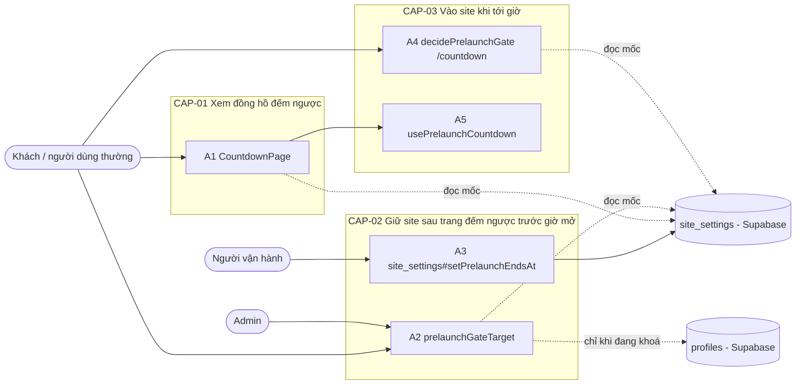
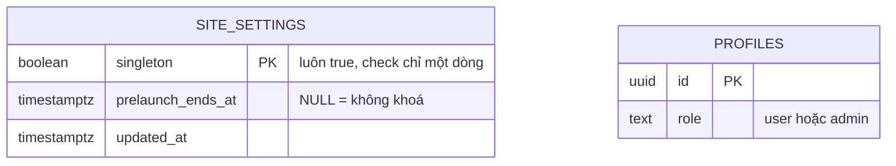

# F005_CountdownPrelaunch — Technical Spec

**Priority**: P1
**Type**: mixed
**Generated**: 2026-10-09

**See also:** [`functional-spec.md`](./functional-spec.md) — plain-language overview, open
decisions, requirements/business rules stated in one-liners, screens, user stories, scenarios,
edge cases, and configuration for a BA/QA audience.

**How to read this file:** § 2 is the index — pick the action you care about and read its block
in § 3 straight through; each block is one complete thread, top to bottom. § 4 is the shared
appendix — jump in only when a § 3 block points you there. Mã của feature đã có (as-built, 2026-10-09): mọi rung **Source** và mọi `Source:` trích `path:line` đã đối chiếu với mã; tên handler là tên hàm thật trong mã.

## 1. Technical Overview

Trước mốc ra mắt, `proxy.ts` chuyển mọi trang (trừ `/login`, `/auth/callback`) về `/countdown` bằng phản hồi 307; admin (`profiles.role = 'admin'`) đi qua. Mốc đọc từ một dòng duy nhất của bảng mới `site_settings` (cột `prelaunch_ends_at`, đọc công khai, chỉ `service_role` ghi); thiếu, sai hoặc không đọc được thì site mở (fail open). Trang `/countdown` là Server Component đọc cùng mốc rồi giao cho client hai con số: mốc (`targetMs`) và giờ máy chủ lúc render (`serverNowMs`); client tính độ lệch một lần khi mount rồi đếm theo giờ máy chủ, dùng lại phép tính phút của đồng hồ trang chủ (`lib/countdown/**`), và tự `router.replace("/")` đúng lúc giờ máy chủ chạm mốc; sau mốc, chính proxy chuyển `/countdown` về `/`. Đồng hồ trang chủ vẫn dùng biến môi trường `SAA_COUNTDOWN_TARGET`, không đụng tới.



## 2. Action Index

| # | Action (handler) | Method · Path | Codes | Writes | Detail |
|---|---|---|---|---|---|
| **A0** | *cross-cutting — belongs to no single action* | — | FR-602, BR-006 | — | § 4.4 |
| **A1** | `CountdownPage` | `GET` `/countdown` | FR-201, FR-202, FR-203, FR-204, FR-205, FR-206, FR-207, BR-002, BR-005, BR-008, DEC-003, ALG-001, ALG-003, INT-001, US028 | — *(read-only: `site_settings`)* | § 3.1 |
| **A2** | `prelaunchGateTarget` | `GET` `HEAD` `/<mọi trang khác>` | FR-101, FR-102, FR-103, FR-104, FR-601, BR-001, BR-002, BR-003, BR-004, DEC-001, ALG-002, INT-001, INT-002, US029, US030 | — *(read-only: `site_settings`, `profiles`)* | § 3.2 |
| **A3** | `site_settings#setPrelaunchEndsAt` *(operator, no FE; thao tác SQL, không có hàm trong mã)* | operator · `service_role` | FR-001, FR-002, US033 | `site_settings` | § 3.2 |
| **A4** | `decidePrelaunchGate` *(nhánh `/countdown`)* | `GET` `HEAD` `/countdown` | FR-105, BR-001, BR-002, BR-004, DEC-002, ALG-002, INT-001, US032 | — *(read-only: `site_settings`)* | § 3.3 |
| **A5** | `usePrelaunchCountdown` *(client behaviour, no HTTP)* | — | FR-401, BR-002, BR-004, BR-007, BR-008, ALG-001, ALG-003, US031 | — *(chỉ điều hướng)* | § 3.3 |

**Rung set** — mỗi khối trong § 3 theo thứ tự **Who** → **FE** → **Request** → **BE** → **Rule** → **Result** → **State** → **Source**; rung vắng thì bỏ hẳn. Feature này không có máy trạng thái bền vững (không SM, § 4.3) nên không có rung **State**. Chỉ A3 ghi một bảng; không action nào chạy nền hay ghi ≥ 2 bảng nên không khối nào cần `sequenceDiagram` (phần phân nhánh của A2, A4 là bảng DEC).

## 3. Actions

### 3.1 CAP-01 — Xem đồng hồ đếm ngược

#### A1 · Hiển thị trang đếm ngược prelaunch
`GET /countdown` → `` `CountdownPage` `` *(Server Component `app/countdown/page.tsx:8-14` + `CountdownPrelaunchContent` + Client Component đồng hồ)*
`FR-201` `FR-202` `FR-203` `FR-204` `FR-205` `FR-206` `FR-207` `BR-002` `BR-005` `BR-008` `DEC-003` `ALG-001` `ALG-003` `INT-001` `US028` · `SCR005_CountdownPrelaunch`

**Who** · Khách, người dùng thường hoặc admin, khi site đang khoá (sau mốc, A4 đã chuyển họ đi trước khi tới đây) *(gate A0 — § 4.4)*
**FE** · Nền toàn màn hình (ảnh MoMorph xuất, `cover`, `no-repeat`) phủ lớp tối bán trong suốt; tiêu đề căn giữa, chữ trắng; ba khối ngày / giờ / phút, mỗi khối là một `role="group"` có `aria-label` dạng `"NN DAYS"`, mỗi ký tự của giá trị một ô LED (hai ô khi 00–99, thêm ô khi trên 99 ngày; trước hydrate là `--` tức hai ô) và nhãn `DAYS` / `HOURS` / `MINUTES` in hoa trắng (`app/_components/countdown-prelaunch/countdown-prelaunch-unit.tsx:30-50`). Đúng một `<h1>` là tiêu đề (`app/_components/countdown-prelaunch/countdown-prelaunch-view.tsx:41-43`). Không header, footer, bộ chọn ngôn ngữ, chuông, nút hay liên kết. Nền là `public/countdown/bg-image.png` (`next/image` `fill`, `object-cover`, `app/_components/countdown-prelaunch/countdown-prelaunch-view.tsx:25-32`) phủ lớp tối gradient (`:34-37`). Ô số tạo mới trong `app/_components/countdown-prelaunch/`, không dùng lại `CountdownTiles` (§ 5.3 mục 4); phông "Digital Numbers" không có nên dùng `font-mono` thay thế (`app/_components/countdown-prelaunch/countdown-prelaunch-unit.tsx:8-9,22`, § 5.3 mục 6). Vỏ trang tĩnh bọc `<Suspense>` có khung chờ nền tối `#00101A` (`app/countdown/page.tsx:9`); phần đọc locale và mốc nằm trong `<Suspense>` để `cacheComponents` prerender được vỏ.
**Request** · cookie `NEXT_LOCALE`; không có tham số truy vấn. Không có endpoint riêng cho mốc: mục TODO "thiết kế API lấy target datetime" của spec MoMorph được giải bằng việc Server Component đọc thẳng DB (INT-001) rồi giao một con số cho client; trình duyệt không bao giờ gọi Supabase.
**BE** · `CountdownPrelaunchContent` (`app/countdown/_components/countdown-prelaunch-content.tsx:14-34`): `await connection()` ngoài `try` (`:17`), `getLocale()` (`lib/i18n/get-locale.ts:9-12`) và `getDictionary(locale)`; từ điển có nhánh `countdownPrelaunch.title` ("Sự kiện sẽ bắt đầu sau" / "Event starts in", `lib/i18n/dictionary.ts:57-59,73-75`), nhãn `DAYS`/`HOURS`/`MINUTES` lấy từ `dictionary.home.countdown` nên giống nhau ở hai ngôn ngữ (`:30`). Hàm đọc mốc dùng chung với proxy (`INT-001`: đọc `site_settings.prelaunch_ends_at` bằng khoá publishable *(§ 4.5)*) trả `targetMs: number | null`; `serverNowMs = Date.now()` lấy SAU lần đọc mốc để khoảng trễ tới trình duyệt nhỏ nhất, vẫn theo hướng an toàn (`:39-45`); cả hai con số xuống client qua `PrelaunchCountdownLive` (`app/countdown/_components/prelaunch-countdown-live.tsx:14-22`), không có endpoint nào khác. Client gọi `usePrelaunchCountdown(targetMs, serverNowMs)` (`lib/countdown/use-prelaunch-countdown.ts:32-51`), bên trong là `useCountdown(targetMs, clockOffsetMs)` (`:38`; `ALG-001`: phút còn lại làm tròn lên, đệm hai chữ số; `ALG-003`: `clockOffsetMs = serverNowMs - Date.now()` đo một lần ở lần đọc đầu phía client, tham số thứ hai của `useCountdown` có mặc định `0` nên đồng hồ trang chủ không đổi, `lib/countdown/use-countdown.ts:42`) *(§ 4.5)*.
**Rule**
- **BR-005 — Đồng hồ dùng đúng quy tắc tính của đồng hồ trang chủ.** Làm tròn lên theo phút, ô nào cũng ít nhất hai chữ số, ô ngày dài hơn khi còn trên 99 ngày, `00 00 00` từ mốc trở đi; trước khi hydrate hiện `--` vì render không đọc đồng hồ máy chủ. Múi giờ không ảnh hưởng phép tính vì mốc là thời điểm tuyệt đối (`timestamptz`). Các giá trị ngoài miền như giờ -1/25, phút -1/60 trong test case không thể phát sinh từ phép tính thời gian thật; đã được hàm chặn (âm hoặc không hợp lệ → `00`) bao phủ. *Design basis: clarifications.md.*
- **BR-002 — Mốc thiếu, `NULL`, sai hoặc không đọc được được coi là "không có khoá".** Ở trang này đồng nghĩa với `targetMs = null`: đồng hồ hiện `00 00 00` ngay và A5 đưa người xem về `/`; không bao giờ hiện lỗi hay trang trắng. *(§ 4.4)*
- **BR-008 — Đồng hồ đếm theo giờ máy chủ, không theo đồng hồ máy người xem.** Số còn lại luôn tính bằng `Date.now() + offset`; đồng hồ máy lệch nhanh hay chậm không làm số sai. *(§ 4.4)*

| DEC | subtype | Condition | What the user sees | Source |
|---|---|---|---|---|
| **DEC-003** | render | chưa hydrate | ba khối hiện `--`, chưa có chuyển hướng | `lib/countdown/use-countdown.ts:21-27,53` `lib/countdown/use-prelaunch-countdown.ts:40` |
| **DEC-003** | render | đã hydrate VÀ `targetMs` còn ở tương lai | số ngày / giờ / phút còn lại, cập nhật khi đổi phút | `lib/countdown/use-countdown.ts:54` |
| **DEC-003** | render, flow | đã hydrate VÀ (`targetMs` đã tới hoặc qua, hoặc `null`) | cả ba khối `00`; A5 chạy | `lib/countdown/use-countdown.ts:54` `lib/countdown/use-prelaunch-countdown.ts:40-48` |

**Result** · Chỉ đọc, không ghi DB. Người xem thấy nền, tiêu đề đúng ngôn ngữ và ba khối đếm ngược.
**Source:** `app/countdown/page.tsx:8-14` → `app/countdown/_components/countdown-prelaunch-content.tsx:14-45` → `app/countdown/_components/prelaunch-countdown-live.tsx:14-22` → `app/_components/countdown-prelaunch/countdown-prelaunch-view.tsx:13-53` → `app/_components/countdown-prelaunch/countdown-prelaunch-unit.tsx:30-50`

<!-- Không vẽ sequenceDiagram: dưới ngưỡng (một lần đọc, không ghi bảng, đồng bộ trong request; phần đếm là hook client có sẵn). Phần phân nhánh là bảng DEC-003. -->

---

### 3.2 CAP-02 — Giữ site sau trang đếm ngược trước giờ mở

#### A2 · Chặn mọi trang khi site đang khoá
`GET` `HEAD` `/<trang khớp matcher>` → `` `prelaunchGateTarget` `` *(mở rộng `updateSession` trong `lib/supabase/proxy-session.ts:43-79`; hàm cổng ở `:143-160`)*
`FR-101` `FR-102` `FR-103` `FR-104` `FR-601` `BR-001` `BR-002` `BR-003` `BR-004` `DEC-001` `ALG-002` `INT-001` `INT-002` `US029` `US030` · `SCR005_CountdownPrelaunch`

**Who** · Khách, người dùng thường, admin *(gate A0 — § 4.4)*
**FE** · *không có giao diện riêng* — kết quả là phản hồi 307 tới `/countdown` hoặc chạy tiếp tới trang đã yêu cầu; cookie phiên đã làm mới luôn được gắn vào cả hai kiểu phản hồi (như `updateSession` hiện có, để chuyển hướng không làm rơi token mới).
**Request** · mọi `GET`/`HEAD` khớp matcher mới (`"/((?!_next/|__nextjs|.*\\..*).*)"` — literal tĩnh, phủ mọi page route kể cả trang chưa tồn tại, loại `_next/*`, `__nextjs*` và mọi đường dẫn có dấu chấm tức tệp tĩnh trong `public/`; `proxy.ts:22-24`) *(§ 4.6)*. Method khác (`POST` của Server Action) không qua cổng, giống quy tắc chỉ chuyển hướng `GET`/`HEAD` đang có (`lib/supabase/proxy-session.ts:54,162-164`). `/auth/callback` từng không nằm trong matcher; nay matcher có khớp nhưng `updateSession` trả `NextResponse.next()` ngay cho đường này, trước mọi việc làm mới phiên hay đọc mốc (`lib/supabase/proxy-session.ts:45`).
**BE** · Thứ tự làm việc, rẻ trước đắt sau: (1) `/auth/callback` → `NextResponse.next()` ngay, không làm mới phiên (`lib/supabase/proxy-session.ts:45`). (2) `gateApplies` = `GET`/`HEAD` và không phải `/login` (`:54`): method khác vẫn làm mới phiên nhưng không đọc mốc, không qua cổng; `/login` giữ nguyên quy tắc hiện có (người đã đăng nhập → 307 `/`, `:129-135`) và không đọc mốc. (3) Còn lại: đọc mốc (`INT-001`) song song với `getClaims()` bằng `Promise.all`, không chờ nhau — hai việc không chia sẻ client vì đọc mốc không dùng cookie (`:55-58`). (4) `ALG-002` (`decidePrelaunchGate`) quyết định `next` / `redirect` / `admin-check` *(§ 4.5)* (`:148-155`). (5) Chỉ khi `admin-check` và có phiên hợp lệ mới đọc vai trò (`INT-002`) *(§ 4.5)*; khách không có phiên bị chuyển ngay, không tra `profiles` (`:157-159`). Phản hồi, kể cả redirect, luôn mang cookie đã làm mới (`:70-76`).
**Rule**
- **BR-003 — Chỉ admin được đi qua cổng; mọi trường hợp còn lại khi đang khoá đều bị chuyển.** Admin nghĩa là `profiles.role` đọc được và đúng chữ `admin`, lấy từ DB bằng phiên của chính người dùng (`sub` của claims đã xác minh), không từ `user_metadata`. Lỗi tra cứu, quá 2 giây, không có hồ sơ hoặc giá trị lạ đều là người thường, nên phía bỏ qua cổng fail closed trong khi phía mốc fail open. Quy tắc "chỉ đúng chữ `admin`" là hàm dùng chung `toUserRole` (`lib/supabase/user-role.ts:13-15`) với `getCurrentUser()` của F003 (không trích mã BR của spec khác). `lib/prelaunch/read-gate-user-role.ts:24-49`, `lib/supabase/proxy-session.ts:157-159`. Design basis: clarifications.md.
- **BR-001 — Site chỉ khoá khi mốc đọc được và còn ở tương lai.** `now < prelaunch_ends_at` thì khoá; từ mốc trở đi hoặc mốc không dùng được thì mở. So sánh bằng đồng hồ máy chủ. *(§ 4.4)*
- **BR-002 — Mốc thiếu, `NULL`, sai, quá thời gian chờ hay không đọc được thì site mở và lỗi được ghi ở máy chủ.** Đây là cổng ra mắt, không phải kiểm soát an ninh; một lỗi cấu hình hay DB sập không được khoá cả site. `NULL` là cách tắt cổng có chủ ý nên site mở im lặng, không ghi lỗi. *(§ 4.4)*
- **BR-004 — Chuyển hướng an toàn.** Chỉ `GET`/`HEAD`; luôn 307 (tạm thời, không bị trình duyệt hay CDN cache lâu); đích là hằng `/countdown` hoặc `/`, không đọc gì từ URL hay query nên không có open redirect. *(§ 4.4)*

| DEC | subtype | Condition | What the user sees | Source |
|---|---|---|---|---|
| **DEC-001** | flow | đường dẫn là `/auth/callback`, hoặc method khác `GET`/`HEAD`; mọi mốc, mọi vai trò | chạy tiếp, không đọc mốc | `lib/supabase/proxy-session.ts:45,54` `lib/prelaunch/prelaunch-gate-decision.ts:46-47` |
| **DEC-001** | flow | đường dẫn là `/login`; mọi mốc, mọi vai trò | chạy tiếp, không đọc mốc; người đã đăng nhập vẫn bị chuyển `/` như quy tắc cũ | `lib/supabase/proxy-session.ts:54` `lib/supabase/proxy-session.ts:129-135` `lib/prelaunch/prelaunch-gate-decision.ts:14` |
| **DEC-001** | flow | đường dẫn khác VÀ mở (mốc ≤ now) | chạy tiếp, trang như thường | `lib/prelaunch/prelaunch-gate-decision.ts:49` `lib/prelaunch/prelaunch-gate-decision.ts:54` |
| **DEC-001** | flow | đường dẫn khác VÀ mốc thiếu / `NULL` / sai / không đọc được | chạy tiếp (fail open); log `[prelaunch]`, trừ `NULL` thì im lặng | `lib/prelaunch/read-prelaunch-ends-at.ts:32-66,70-77` `lib/prelaunch/prelaunch-gate-decision.ts:49` |
| **DEC-001** | flow | đường dẫn khác VÀ khoá VÀ khách (không phiên hợp lệ) | 307 `/countdown` | `lib/supabase/proxy-session.ts:157` |
| **DEC-001** | flow | đường dẫn khác VÀ khoá VÀ đã đăng nhập, vai trò `admin` | chạy tiếp, admin duyệt trang bình thường | `lib/supabase/proxy-session.ts:158-159` `lib/prelaunch/read-gate-user-role.ts:43` `lib/supabase/user-role.ts:13-15` |
| **DEC-001** | flow | đường dẫn khác VÀ khoá VÀ đã đăng nhập, vai trò `user`, hoặc tra vai trò lỗi, hoặc không có hồ sơ | 307 `/countdown` | `lib/prelaunch/read-gate-user-role.ts:33-47` `lib/supabase/proxy-session.ts:159` |

**Result** · Chỉ đọc, không ghi DB. Người xem được chuyển tới `/countdown` hoặc tới trang đã mở.
**Source:** `proxy.ts:10-24` → `lib/supabase/proxy-session.ts:43-79` → `lib/prelaunch/prelaunch-gate-decision.ts:40-56` → `lib/supabase/proxy-session.ts:143-160` → `lib/prelaunch/read-gate-user-role.ts:24-49`

<!-- Không vẽ sequenceDiagram: dưới ngưỡng (không ghi bảng, đồng bộ trong request); thực chất là bảng nhánh nên bảng DEC-001 đọc dễ hơn. -->

---

#### A3 · Vận hành đặt mốc mở site
`—` → `` `site_settings#setPrelaunchEndsAt` `` *(operator, no FE; migration + seed + cập nhật bằng `service_role`)*
`FR-001` `FR-002` `US033` · `SCR005_CountdownPrelaunch`

**Who** · Người vận hành, bằng khoá `service_role` (Supabase Studio, SQL hoặc helper E2E); không phải người dùng cuối
**FE** · *no entry point in the app* — ứng dụng không có trang quản trị mốc; chỉ thao tác trực tiếp trên DB.
**Request** · `update public.site_settings set prelaunch_ends_at = '<ISO-8601 có múi giờ>'` (hoặc `NULL` để tắt cổng); cột kiểu `timestamptz` nên DB từ chối giá trị không phải thời điểm.
**BE** · migration `supabase/migrations/20261009083754_create_site_settings.sql` tạo bảng một dòng `site_settings` (`:22-27`) và chèn sẵn dòng duy nhất với `prelaunch_ends_at = NULL` (`:46`); seed `supabase/seeds/common/03-site-settings.sql` đặt mốc `2026-01-01T00:00:00+07:00` trong quá khứ nên local luôn mở sau `db reset` (`:7-11`) *(§ 4.2)*. RLS bật (`:31`), policy `site_settings_select_public` cho `anon`, `authenticated` chỉ `select` (`:33-35`); thu hết quyền rồi cấp `select` cho hai vai trò đó và đủ ghi cho `service_role` (`:41-43`). Hiệu lực ở request kế tiếp vì không cache (`lib/prelaunch/read-prelaunch-ends-at.ts:13-16`).
**Rule** · Không có BR riêng ngoài BR-001 và BR-002 ở A2. Test chạy cổng đặt mốc tương lai rồi phải khôi phục về giá trị quá khứ (`e2e/support/prelaunch-setting.ts:33-37,47-49`; hằng `SEED_PAST_ISO` phải bằng literal trong seed).
**Result** · Ghi `site_settings.prelaunch_ends_at` ← giá trị người vận hành đặt. Dời mốc xa hơn thì người đang ở `/countdown` vẫn đếm tới mốc cũ cho tới khi tải lại (xem § 3.4).
**Source:** `supabase/migrations/20261009083754_create_site_settings.sql:22-46` · `supabase/seeds/common/03-site-settings.sql:7-11` · `e2e/support/prelaunch-setting.ts:33-37`

<!-- Không vẽ sequenceDiagram: dưới ngưỡng (ghi một bảng, đồng bộ, không có bước nền). -->

---

### 3.3 CAP-03 — Vào site khi tới giờ

#### A4 · Chuyển `/countdown` về trang chủ khi site đã mở
`GET` `HEAD` `/countdown` → `` `decidePrelaunchGate` `` *(nhánh `/countdown`, `lib/prelaunch/prelaunch-gate-decision.ts:51-53`; cùng hàm `ALG-002` với A2, được gọi từ `lib/supabase/proxy-session.ts:143-155`)*
`FR-105` `BR-001` `BR-002` `BR-004` `DEC-002` `ALG-002` `INT-001` `US032` · `SCR005_CountdownPrelaunch`

**Who** · Bất kỳ ai mở `/countdown` *(gate A0 — § 4.4)*
**FE** · *không có giao diện riêng* — phản hồi 307 tới `/`.
**Request** · `GET`/`HEAD` `/countdown`; đọc mốc song song với `getClaims()` như A2.
**BE** · `ALG-002` với địa chỉ `/countdown`: khoá thì `{ kind: "next" }` (A1 render), mở hoặc mốc không dùng được thì `{ kind: "redirect", to: "/" }` *(§ 4.5)*; `prelaunchGateTarget` trả đích đó (`lib/supabase/proxy-session.ts:154-155`). Không đọc vai trò: `/countdown` hiện cho mọi vai trò khi đang khoá. Trang A1 không tự chuyển hướng ở phía server (`app/countdown/_components/countdown-prelaunch-content.tsx:8-13`); phần đua (mốc qua giữa lúc proxy chạy và lúc trang render) do A5 xử lý bằng `00 00 00` rồi về `/`.
**Rule**
- **BR-001 — Site chỉ khoá khi mốc đọc được và còn ở tương lai.** Trang đếm ngược chỉ có nghĩa khi còn khoá; từ mốc trở đi nó không còn nội dung nên đẩy về `/`. *(§ 4.4)*
- **BR-002 — Mốc không dùng được thì coi như không khoá.** `/countdown` cũng về `/`, không trang trống. *(§ 4.4)*
- **BR-004 — Chuyển hướng an toàn.** 307, đích là hằng `/`, chỉ `GET`/`HEAD`. *(§ 4.4)*

| DEC | subtype | Condition | What the user sees | Source |
|---|---|---|---|---|
| **DEC-002** | flow | đường dẫn `/countdown` VÀ khoá | trang đếm ngược (A1), cho mọi vai trò kể cả admin | `lib/prelaunch/prelaunch-gate-decision.ts:51-52` |
| **DEC-002** | flow | đường dẫn `/countdown` VÀ mở | 307 `/`; trang chủ như thường | `lib/prelaunch/prelaunch-gate-decision.ts:52` |
| **DEC-002** | flow | đường dẫn `/countdown` VÀ mốc thiếu / `NULL` / sai / không đọc được | 307 `/` (fail open); log `[prelaunch]`, trừ `NULL` thì im lặng | `lib/prelaunch/prelaunch-gate-decision.ts:49,52` `lib/prelaunch/read-prelaunch-ends-at.ts:32-66` |

**Result** · Chỉ đọc, không ghi DB. Người mở `/countdown` sau mốc vào thẳng trang chủ.
**Source:** `lib/prelaunch/prelaunch-gate-decision.ts:7-9,51-53` → `lib/supabase/proxy-session.ts:143-155`

<!-- Không vẽ sequenceDiagram: dưới ngưỡng (không ghi bảng, đồng bộ). Phần phân nhánh là bảng DEC-002. -->

---

#### A5 · Trình duyệt tự chuyển sang trang chủ khi đồng hồ về 0
`—` → `` `usePrelaunchCountdown` `` *(client behaviour, chạy trong cây của A1; `lib/countdown/use-prelaunch-countdown.ts:32-51`)*
`FR-401` `BR-002` `BR-004` `BR-007` `BR-008` `ALG-001` `ALG-003` `US031` · `SCR005_CountdownPrelaunch`

**Who** · Người đang mở `/countdown` *(gate A0 — § 4.4)*
**FE** · Không có giao diện riêng: khi ba khối vừa hiện `00` thì trình duyệt chuyển trang; người xem thấy trang chủ thay cho trang đếm ngược.
**Request** · không gọi máy chủ riêng; việc điều hướng là một yêu cầu `GET /` mà A2 sẽ đánh giá.
**BE** · `useEffect` trong hook (`lib/countdown/use-prelaunch-countdown.ts:44-48`): khi `reached` gọi `router.replace("/")` (`:47`). `reached` được suy ra từ trạng thái của `useCountdown` hiện có, không thêm trường mới: `values[0] !== COUNTDOWN_PLACEHOLDER && !showComingSoon`, tức đã hydrate (không còn `--`) và hết thời gian (`:40`; `ALG-001`: số phút bằng 0 chỉ khi `now ≥ mốc`, với `now = Date.now() + clockOffsetMs` theo `ALG-003`, tức giờ máy chủ). Cờ chặn gọi lại là `redirectedForRef` mang giá trị `serverNowMs` đã chuyển (`:43,45-46`), nên mỗi lần máy chủ render một `serverNowMs` mới thì được chuyển lại đúng một lần. `replace` để nút Back không quay về trang vừa tự bỏ. Đích là hằng `HOME_PATH = "/"` (`:9`), không đọc từ URL. `targetMs = null` cũng tính là đã tới 0 nên đi cùng đường (`BR-002`).
**Rule**
- **BR-007 — Trình duyệt chuyển sang `/` nhiều nhất một lần cho mỗi lần máy chủ render trang.** Cờ `ref` theo `serverNowMs` chặn gọi lại: Cache Components giữ state và ref của component (Activity) khi một điều hướng render lại `/countdown`, nên offset và cờ cùng bám `serverNowMs` — lần render mới đo lại và được chuyển thêm một lần, lần hiển thị lại thì không (`lib/countdown/use-prelaunch-countdown.ts:22-27,36,43-48`). Nhờ BR-008 trình duyệt chuyển đúng lúc giờ máy chủ chạm mốc nên máy chủ không còn thấy site khoá; chỉ còn lại độ trễ mạng giữa lúc máy chủ render và lúc trang mount (RISK-02 ở functional-spec § 11), và sai số đó làm đồng hồ chạy chậm chứ không nhanh nên không gây vòng lặp.
- **BR-008 — Đồng hồ đếm theo giờ máy chủ, không theo đồng hồ máy người xem.** Chạm 0 nghĩa là giờ máy chủ chạm mốc, nên người xem chuyển sang `/` đúng lúc cổng thật sự mở dù đồng hồ máy lệch. *(§ 4.4)*
- **BR-002 — Mốc không dùng được thì tính là đã tới 0.** Người xem ở `/countdown` với mốc hỏng được đưa về `/`. *(§ 4.4)*
- **BR-004 — Chuyển hướng an toàn.** Đích cố định `/`, không tham số. *(§ 4.4)*

**Result** · Chỉ điều hướng, không ghi DB. Người xem vào trang chủ ngay khi đồng hồ chạm 0, không cần bấm hay tải lại.
**Source:** `lib/countdown/use-prelaunch-countdown.ts:9,32-51` · `lib/countdown/use-countdown.ts:42-55` · `app/countdown/_components/prelaunch-countdown-live.tsx:14-22`

<!-- Không vẽ sequenceDiagram: dưới ngưỡng (một sự kiện client, không ghi bảng). -->

---

### 3.4 Edge cases

| Action | Scenario | Behavior |
|---|---|---|
| A2 · A4 | Mốc thiếu dòng, `NULL`, sai kiểu, DB sập hoặc quá thời gian chờ đọc | site mở, `/countdown` về `/`; ghi một dòng `[prelaunch]` (mỗi thông báo khác nhau một lần mỗi tiến trình, như tiền lệ đồng hồ trang chủ), trừ `NULL` là trạng thái tắt hợp lệ nên không ghi *(BR-002, DEC-001)* |
| A2 | Người đã đăng nhập mở `/login` khi site đang khoá | quy tắc cũ chuyển `/`; cổng chuyển tiếp: thường → `/countdown` (hai lần 307), admin → ở lại `/` *(DEC-001)* |
| A2 | `POST` (Server Action) tới một trang khi site đang khoá | không qua cổng, không bị chuyển hướng; mọi trang vẫn tự kiểm tra quyền như trước *(BR-004, A0)* |
| A2 | Tra `profiles.role` lỗi, quá 2 giây hoặc không có dòng hồ sơ khi đang khoá | coi là người thường, 307 `/countdown`, log `[profiles]` ở cấp lỗi, không retry *(BR-003, `lib/prelaunch/read-gate-user-role.ts:11,30-47`)* |
| A2 | Truy cập prefetch RSC hoặc `_next/data` tới một trang khi đang khoá | cũng bị 307 (Next luôn gọi proxy cho `_next/data`) *(DEC-001)* |
| A2 | Đường dẫn chưa có page (ví dụ `/profile`, `/admin`) khi đang khoá | người thường bị chuyển `/countdown` thay vì 404; admin thấy 404 như hiện nay *(DEC-001)* |
| A2 | Ảnh, font, tệp tĩnh dưới `public/` và `/_next/*` | không khớp matcher nên luôn tải được, trang đếm ngược có đủ ảnh nền và font |
| A2 | Admin chưa đăng nhập mở một trang khi đang khoá | bị coi là khách, 307 `/countdown`; phải vào thẳng `/login` (trang đếm ngược không có liên kết) *(DEC-001)* |
| A1 | Còn hơn 99 ngày | ô ngày hiện đủ số, nhiều chữ số hơn *(BR-005, ALG-001)* |
| A1 · A5 | JavaScript bị tắt hoặc chưa hydrate | ba khối giữ `--`, không tự chuyển hướng; proxy vẫn đẩy về `/` khi tải lại sau mốc *(DEC-003, A4)* |
| A1 | Cookie `NEXT_LOCALE` lạ | rơi về `vi` như `getLocale()` hiện có |
| A1 · A5 | Tab nền bị trình duyệt giãn hẹn giờ | hook có sẵn đồng bộ lại khi tab hiện lại, rồi chuyển hướng nếu đã qua mốc *(ALG-001)* |
| A3 · A5 | Vận hành dời mốc xa hơn khi có người đang mở `/countdown` | trang đã tải vẫn đếm tới mốc cũ; chạm 0 → `/` → bị chuyển lại `/countdown` với mốc mới (một lần, cờ theo `serverNowMs`), rồi đếm tiếp *(BR-007)* |
| A1 · A5 | Cache Components giữ state khi một điều hướng render lại `/countdown` | offset và cờ chuyển hướng cùng bám `serverNowMs`: lần render mới đo lại offset và được chuyển một lần nữa, lần hiển thị lại thì không *(BR-007, `lib/countdown/use-prelaunch-countdown.ts:22-27,36,43-48`)* |
| A1 · A5 | Đồng hồ máy khách nhanh hoặc chậm hơn máy chủ | không ảnh hưởng: số đếm theo `Date.now() + offset` (giờ máy chủ); chuyển sang `/` đúng lúc giờ máy chủ chạm mốc, không bị trả lại `/countdown` *(BR-008, ALG-003)* |
| A5 | Trang mount trễ so với lúc máy chủ render (mạng chậm) | offset lấy theo giờ render nên đồng hồ chạy chậm hơn máy chủ đúng bằng độ trễ đó, trình duyệt chuyển hơi muộn chứ không sớm; không có vòng lặp *(BR-008, BR-007)* |
| A5 | Đồng hồ máy người xem bị chỉnh tay sau khi trang đã mount | offset đã tính một lần nên đồng hồ trên trang lệch theo mức chỉnh; không tính lại cho tới khi tải lại; chấp nhận vì tải lại là đủ *(ALG-003)* |
| A3 | Ghi giá trị không phải thời điểm vào `prelaunch_ends_at` | DB từ chối vì cột `timestamptz`; không bao giờ có giá trị "sai định dạng" trong DB, "sai" chỉ còn là `NULL` hoặc lỗi đọc |
| A1-A5 | Mốc đặt đúng bằng thời điểm hiện tại | `now < mốc` sai nên mở; đồng hồ `00 00 00` *(BR-001)* |

## 4. Shared Foundation

### 4.1 Components

| Component | Responsibility | Used in | File |
|---|---|---|---|
| `proxy` | điểm vào: gọi `updateSession`; literal `config.matcher` mới phủ mọi page route | A2, A4 | `proxy.ts:10-24` *(có sẵn, sửa matcher)* |
| `updateSession` / `verifySession` / `loginRedirectTarget` / `prelaunchGateTarget` | làm mới phiên và quy tắc chuyển hướng; thêm nhánh cổng, đọc mốc song song `getClaims()`, đọc vai trò khi cần (`redirectTarget` cũ đổi tên `loginRedirectTarget`, `hasVerifiedSession` cũ đổi thành `verifySession` trả `userId` + client) | A2, A4 | `lib/supabase/proxy-session.ts:43-164` *(có sẵn, sửa)* |
| `decidePrelaunchGate` (`ALG-002`) | hàm thuần, không import, kiểm bằng Node thuần; hằng `COUNTDOWN_PATH`, `OPEN_SITE_PATH` | A2, A4 | `lib/prelaunch/prelaunch-gate-decision.ts:7-56` *(mới)* |
| `readPrelaunchEndsAt` (`INT-001`) và `readGateUserRole` (`INT-002`) | đọc `site_settings`, đọc `profiles.role`; fail open / fail closed như BR-002, BR-003 | A1, A2, A4 | `lib/prelaunch/read-prelaunch-ends-at.ts:32-66`, `lib/prelaunch/read-gate-user-role.ts:24-49` *(mới)* |
| `CountdownPage`, `CountdownPrelaunchContent`, `PrelaunchCountdownLive`, `CountdownPrelaunchView`, `CountdownPrelaunchUnit`, `usePrelaunchCountdown` | vỏ tĩnh + `<Suspense>`; đọc locale, mốc, `serverNowMs`; cầu nối client; nền, tiêu đề, ba khối (trình bày thuần); hook đếm theo giờ máy chủ + chuyển hướng (A5) | A1, A5 | `app/countdown/page.tsx`, `app/countdown/_components/`, `app/_components/countdown-prelaunch/`, `lib/countdown/use-prelaunch-countdown.ts` *(mới)* |
| `useCountdown`, `minutesLeft`, `toCountdownValues`, `msUntilNextChange` | phép tính phút và đồng hồ client; hook thêm tham số tuỳ chọn `clockOffsetMs` (mặc định `0`, cộng vào `Date.now()` ở cả lần đọc và lần hẹn giờ) để đếm theo giờ máy chủ; xuất thêm hằng `COUNTDOWN_PLACEHOLDER` | A1, A5 | `lib/countdown/use-countdown.ts:21,42-93` *(có sẵn, sửa tương thích ngược)*, `lib/countdown/countdown-math.ts` *(có sẵn, không đổi)* |
| `parseCountdownTarget`, `reportOnce` | phân tích mốc ISO có offset; thêm tham số `label` (mặc định `[countdown] SAA_COUNTDOWN_TARGET`) để thông báo lỗi và khoá chống ghi lặp theo đúng nguồn; `reportOnce` được xuất để cổng dùng chung (§ 5.3 mục 1) | A1, A2, A4 | `lib/countdown/parse-countdown-target.ts:19-23,32-51` *(có sẵn, sửa tương thích ngược)* |
| `toUserRole` | hàm thuần "chỉ đúng chữ `admin` mới là admin, còn lại là `user`"; dùng chung cho `getCurrentUser()` và proxy (§ 5.3 mục 2) | A2 | `lib/supabase/user-role.ts:13-15` *(mới, không import `next/*`; `lib/supabase/current-user.ts:78` có sẵn được sửa để gọi nó)* |
| `getLocale`, `getDictionary`, bản chữ của trang | cookie ngôn ngữ; tiêu đề hai ngôn ngữ trong nhánh `countdownPrelaunch` (không có tệp chữ mới) | A1 | `lib/i18n/dictionary.ts:19-21,57-59,73-75` *(sửa)* |
| `site_settings`, `profiles` | nơi lưu mốc; nơi lưu vai trò | A1, A2, A3, A4 | `supabase/migrations/20261009083754_create_site_settings.sql`, `supabase/seeds/common/03-site-settings.sql` *(mới)*; `profiles` có sẵn, không đổi |

### 4.2 Data Model



<!-- erDiagram chỉ giữ cột chính; hai bảng không có quan hệ khoá ngoại với nhau (profiles có sẵn, chỉ đọc). -->

#### Key Entities

| Entity | Table | Key Columns | Purpose |
|--------|-------|-------------|---------|
| `SiteSettings` *(mới)* | `site_settings` | `singleton` (PK, `check (singleton)`), `prelaunch_ends_at timestamptz` (null = không khoá), `updated_at` | cài đặt toàn site; hiện chỉ một dòng một cột nghiệp vụ; A1, A2, A4 đọc, A3 ghi |
| `Profile` *(có sẵn, không đổi)* | `profiles` | `id` (PK, tham chiếu `auth.users`), `role` (`user` \| `admin`) | nguồn vai trò admin cho cổng; đọc bằng phiên của chính người dùng (`profiles_select_own`) *(A2)* |

**Chọn dạng bảng: một dòng có cột có kiểu (khuyến nghị) thay vì khoá/giá trị.** *Design basis: yêu cầu của lead + clarifications.md (`site_settings.prelaunch_ends_at`).*

| Tiêu chí | Một dòng, cột có kiểu (khuyến nghị) | Khoá/giá trị (`key`, `value`) |
|---|---|---|
| Kiểu dữ liệu | `timestamptz`: DB từ chối giá trị sai, không cần phân tích | `text`/`jsonb`: phải tự phân tích, sinh thêm nhánh "sai định dạng" |
| Cách đọc | `select prelaunch_ends_at limit 1` | `select value where key = '…'` rồi phân tích |
| Thêm cài đặt thứ hai | thêm cột bằng migration | thêm dòng, không cần migration |
| Quyền (RLS) | một policy, một bộ grant | như nhau, hoặc tách theo khoá thì phức tạp |
| YAGNI | khớp: hiện chỉ có một cài đặt | tổng quát hoá cho nhu cầu chưa có |

Hệ quả cần giữ: mọi cột của bảng đọc công khai nên cài đặt nhạy cảm sau này phải ở bảng khác. Nếu số cài đặt tăng quá vài mục thì đổi sang khoá/giá trị bằng một migration, chi phí thấp vì chỉ có một dòng.

Ghi chú về migration và seed *(as-built)*:
- Migration chỉ thêm: tạo `site_settings` một dòng (`singleton boolean primary key default true check (singleton)`), bật RLS, policy `select` cho `anon, authenticated` (`using (true)`), thu hết quyền rồi chỉ cấp `select` cho `anon, authenticated` và đủ ghi cho `service_role` — cùng mẫu với `awards` và `profiles` (`supabase/migrations/20261009083754_create_site_settings.sql:22-27,31-35,41-43`); chèn sẵn dòng duy nhất với `prelaunch_ends_at = NULL` để môi trường thật chỉ phải `update` một giá trị (`:46`). Có chú thích ROLLBACK STRATEGY với SQL xuống như các migration hiện có (`:1-13`); bảng bị xoá thì cổng tự mở.
- Seed `supabase/seeds/common/03-site-settings.sql:7-11`, idempotent (`on conflict (singleton) do update`), đặt mốc cố định `2026-01-01T00:00:00+07:00` trong quá khứ nên local mở sau `db reset`. Muốn thấy khoá local: đổi một dòng trong Supabase Studio.
- `profiles` không đổi (không cột, không quyền mới).

#### Polymorphic Behavior

N/A — no discriminator fields in Key Entities.

### 4.3 State Management

None.

<!-- Trạng thái "khoá / mở" là giá trị dẫn xuất từ mốc và giờ máy chủ ở mỗi request (BR-001), không có vòng đời bền vững hay trạng thái client có ≥ 3 trạng thái ngoài ba trạng thái hiển thị của đồng hồ đã có trong DEC-003; nên không lập SM. -->

### 4.4 Shared Rules

#### Bin 3 — cross-cutting, belongs to no single action

**A0 · FR-602 — Cổng ra mắt không thay kiểm soát quyền của từng trang.**
Cross-cutting: áp dụng cho toàn feature, không thuộc riêng action nào. Cổng chỉ quyết định "ai được thấy site trước giờ mở" và fail open khi mốc hỏng; nó không phải rào chắn an ninh và không làm vai trò admin thành quyền truy cập: nội dung trang đã mở vẫn công khai, và mọi trang hay Server Action về sau (ví dụ `/admin`) vẫn phải tự kiểm tra vai trò ở server như tài liệu quyền hiện hành. Proxy cũng không chặn `POST` nên không thể là chốt duy nhất của một hành động.
**Design basis:** clarifications.md ("a launch gate, not a security control")

**A0 · BR-006 — Mốc prelaunch (DB) và mốc sự kiện của trang chủ (biến môi trường) độc lập nhau.**
Cross-cutting: không action nào gộp hai giá trị. Đồng hồ trang chủ tiếp tục đọc `SAA_COUNTDOWN_TARGET` qua `parseCountdownTarget`; đổi hoặc hỏng một mốc không ảnh hưởng mốc kia; không có bước đồng bộ giữa hai mốc.
**Design basis:** clarifications.md ("The homepage countdown keeps its env var unchanged")

#### Bin 2 — used by ≥2 named actions

**BR-001 — Site chỉ khoá khi mốc đọc được và còn ở tương lai.**
Used in: **A2** · **A4**. Khoá khi `prelaunch_ends_at` là một thời điểm hợp lệ và `Date.now() < prelaunch_ends_at` (đồng hồ máy chủ); mọi trường hợp khác là mở. Bằng nhau là mở: đồng hồ hiện `00 00 00` đúng lúc cổng mở.
**Design basis:** Study report + clarifications.md
```text
locked = momentMs != null and now < momentMs      # momentMs: parsed epoch ms or null
open   = not locked
```

**BR-002 — Mốc thiếu, `NULL`, sai, quá thời gian chờ hay không đọc được thì site mở và lỗi được ghi ở máy chủ.**
Used in: **A1** · **A2** · **A4** · **A5**. Hàm đọc mốc (`INT-001`) không bao giờ ném: mọi lỗi (mạng, HTTP khác 2xx, không có dòng, chuỗi không phân tích được) trả `null` và ghi một dòng `[prelaunch]`; riêng cột `NULL` cũng trả `null` nhưng im lặng vì là cách tắt cổng có chủ ý; `null` nghĩa là "không khoá" ở A2/A4 và "đã tới 0" ở A1/A5. Chỉ phía mốc fail open; phía admin vẫn fail closed (BR-003, ở A2).
**Design basis:** clarifications.md ("Fail open")
```text
readPrelaunchEndsAt():
  try   row = fetch site_settings (publishable key, no-store, timeout)
        ms  = parse(row.prelaunch_ends_at)          # ISO with offset, or null
  catch log "[prelaunch] ..." ; return null
  return ms
```

**BR-004 — Chuyển hướng an toàn.**
Used in: **A2** · **A4** · **A5**. Chỉ chuyển hướng `GET`/`HEAD` (`lib/supabase/proxy-session.ts:54,162-164`); luôn 307 (`NextResponse.redirect` mặc định, `:66-67`); đích là hằng `/countdown` hoặc `/` (`lib/prelaunch/prelaunch-gate-decision.ts:7,9`), không bao giờ lấy từ query hay header; ở client, `router.replace("/")` cũng là hằng (`lib/countdown/use-prelaunch-countdown.ts:9,47`). Server Action (`POST`) đi qua nguyên vẹn để không làm hỏng lời gọi action.
**Design basis:** quy tắc chuyển hướng hiện có của proxy + clarifications.md
```text
if method not in {GET, HEAD}: next
redirect(307, fixedTarget)       # "/countdown" | "/"
```

**BR-008 — Đồng hồ đếm theo giờ máy chủ, không theo đồng hồ máy người xem.**
Used in: **A1** · **A5**. Server Component giao `serverNowMs` cùng `targetMs`; client tính `clockOffsetMs = serverNowMs - Date.now()` một lần khi mount rồi dùng `Date.now() + clockOffsetMs` cho cả số hiển thị lẫn lúc chuyển sang `/`. Vì `serverNowMs` được chụp lúc render, trước lúc mount một khoảng bằng độ trễ, đồng hồ trên trang luôn chậm hơn máy chủ chừng đó chứ không nhanh hơn, nên trình duyệt không bao giờ tới `/` trước khi cổng mở. Cổng và `serverNowMs` đọc cùng một đồng hồ (máy chủ).
**Design basis:** clarifications.md (spec gaps session: "count by server time")
```text
render (server):  serverNowMs = Date.now(); targetMs = read()          # after connection()
mount  (client):  clockOffsetMs = serverNowMs - Date.now()             # computed once
tick   (client):  now = Date.now() + clockOffsetMs ; minutes = minutesLeft(targetMs, now)
```

### 4.5 Algorithms & Integrations

### Tính phút còn lại và chữ số hiển thị, dùng chung với đồng hồ trang chủ (ALG-001)
**Linked FR:** FR-203, FR-204, FR-205, FR-401
**Used in:** A1, A5
**Source:** `lib/countdown/countdown-math.ts:15-28` · `lib/countdown/use-countdown.ts:42-55` *(có sẵn; hook chỉ thêm tham số `clockOffsetMs`, phép tính không đổi)*
**Input:** `targetMs: number | null`, `Date.now()` · **Output:** `[ngày, giờ, phút]` đệm ≥ 2 chữ số, hoặc `--` trước hydrate · **Complexity:** O(1)
**Description:** Số phút còn lại làm tròn lên, nên `0` chỉ khi `now ≥ mốc`; `null` tính là đã tới. Tách thành ngày, giờ, phút, mỗi giá trị đệm hai chữ số, ngày có thể dài hơn. Âm hoặc không hợp lệ về `00`. Hook chỉ đọc `Date.now()` và `setTimeout` nên đồng hồ giả của Playwright điều khiển được phía client, còn phía máy chủ luôn dùng giờ thật.

**Pseudocode:**
```text
minutes = target == null ? 0 : ceil(max(0, target - now) / 60000)
days = floor(minutes / 1440); hours = floor((minutes % 1440) / 60); mins = minutes % 60
display = [pad2(days), pad2(hours), pad2(mins)]        # pad2 only pads; >99 days keeps all digits
reached = hydrated and not showComingSoon              # A5 navigates on this; use-prelaunch-countdown.ts:40
```

### Quyết định cổng: cho đi, chuyển hướng hay hỏi vai trò admin (ALG-002)
**Linked FR:** FR-101, FR-102, FR-103, FR-104, FR-105
**Used in:** A2 → A4
**Source:** `lib/prelaunch/prelaunch-gate-decision.ts:40-56` · `lib/supabase/proxy-session.ts:143-160`
**Input:** `{ method, pathname, momentMs: number | null, nowMs }` · **Output:** `{ kind: "next" }` \| `{ kind: "redirect", to }` \| `{ kind: "admin-check" }` (trong pseudocode: `NEXT` / `REDIRECT(target)` / `ADMIN_CHECK`) · **Complexity:** O(1)
**Description:** Hàm thuần, không phụ thuộc module nào, kiểm được bằng Node thuần như hai hàm đồng hồ hiện có. Địa chỉ miễn trừ là hai hằng `/login` và `/auth/callback` (`:14`); `/countdown` có nhánh riêng (`:51-53`). `admin-check` là tín hiệu để proxy hỏi vai trò, nên mọi truy vấn `profiles` nằm ngoài hàm thuần. Proxy đã lọc method và `/login` trước khi gọi (`gateApplies`), hàm vẫn tự kiểm lại để đúng một mình (lớp phòng thủ thứ hai). Bảng quyết định đầy đủ (đường dẫn × khoá × vai trò × trạng thái mốc) là hai bảng DEC-001 ở A2 và DEC-002 ở A4; không lặp ở đây.

**Pseudocode:**
```text
decide(method, path, momentMs, now):
  if method not in {GET, HEAD}:               return NEXT
  if path in {"/login", "/auth/callback"}:    return NEXT
  locked = momentMs != null and now < momentMs
  if path == "/countdown":                    return locked ? NEXT : REDIRECT("/")
  if not locked:                              return NEXT
  return ADMIN_CHECK
# proxy, on ADMIN_CHECK:
#   no verified session                       -> REDIRECT("/countdown")
#   role == "admin"                           -> NEXT
#   role user / lookup failed / no row        -> REDIRECT("/countdown")
```

### Bù độ lệch giữa đồng hồ máy người xem và đồng hồ máy chủ (ALG-003)
**Linked FR:** FR-207, FR-401
**Used in:** A1, A5
**Source:** `lib/countdown/use-prelaunch-countdown.ts:14-15,32-38,58-61` · `lib/countdown/use-countdown.ts:42-55`
**Input:** `serverNowMs` (giờ máy chủ lúc render), `Date.now()` lúc đọc đầu phía client · **Output:** `clockOffsetMs` cố định cho tới khi `serverNowMs` đổi · **Complexity:** O(1)
**Description:** Offset tính một lần, không đọc đồng hồ trong lúc render phía máy chủ (giữ tương thích `cacheComponents`; trước hydrate vẫn hiện `--`). Cách làm: `useSyncExternalStore` với snapshot server cố định `0` và `getSnapshot` là bộ đọc `createOffsetReader(serverNowMs)` ghi nhớ giá trị đo ở lần đọc đầu, bộ đọc được `useMemo` theo `serverNowMs` nên offset bám `serverNowMs` (một lần render mới của máy chủ thì đo lại). Nếu React bỏ bộ đọc đã nhớ, lần đo lại chỉ làm đồng hồ chậm thêm (hướng an toàn). Hook `useCountdown` nhận offset làm tham số thứ hai tuỳ chọn (mặc định `0`) và cộng vào mọi lần đọc `Date.now()` — lần tính phút và lần hẹn giờ kế (`msUntilNextChange`) — nên trang chủ không đổi. Sai số còn lại bằng độ trễ giữa render và mount, theo hướng làm đồng hồ chậm (an toàn).

**Pseudocode:**
```text
clockOffsetMs = serverNowMs - Date.now()          # once per serverNowMs, at the first client read
nowAtServer() = Date.now() + clockOffsetMs
minutes = minutesLeft(targetMs, nowAtServer())    # ALG-001, unchanged math
nextTick = msUntilNextChange(targetMs, nowAtServer())
```

### Đọc mốc prelaunch từ dịch vụ dữ liệu Supabase (INT-001)
**Linked FR:** FR-001, FR-101, FR-105, FR-201
**Used in:** A1, A2 → A4
**Source:** `lib/prelaunch/read-prelaunch-ends-at.ts:32-66,70-82`
**Type:** api-call
**Target:** Supabase Data API (PostgREST), bảng `public.site_settings`, một dòng; dùng khoá publishable, vai trò `anon`, không gắn cookie người dùng
**Payload:** `select prelaunch_ends_at from site_settings where singleton = true` qua `.maybeSingle()` (`:40-49`); không có secret đi qua trình duyệt. Yêu cầu có `cache: "no-store"` (`:15-16`) và hạn chờ 2 giây `AbortSignal.timeout(READ_TIMEOUT_MS)` (`:9,44`).
**Failure handling:** mọi lỗi (thiếu hay sai `SUPABASE_URL`/`SUPABASE_PUBLISHABLE_KEY`, mạng, quá hạn chờ, HTTP lỗi, không có dòng, không phân tích được) → trả `null` và log một dòng `[prelaunch]`; cột `NULL` trả `null` im lặng (tắt cổng có chủ ý); không retry: `.retry(false)` (`:48`), vì postgrest-js mặc định lùi 1 giây rồi 2 giây khi lỗi mạng nên DB sập sẽ làm mỗi trang tốn trọn hạn chờ thay vì mở ngay (BR-002, fail open). Mỗi thông báo `[prelaunch]` khác nhau chỉ ghi một lần mỗi tiến trình qua `reportOnce` (`:80-82`). Chuỗi không phân tích được dùng `parseCountdownTarget` có tham số nhãn (§ 5.3 mục 1; `:70-77`). Hai quyết định thiết kế (đã giữ trong mã): (1) **không dùng client gắn cookie phiên** (`createClient` của `@supabase/supabase-js`, `persistSession: false`, `:35-38`) của proxy để đọc mốc, vì client đó tự làm mới token khi `getClaims()` chạy và hai lời gọi song song có thể đua làm mới cùng một refresh token; client không cookie không dính phiên nên chạy song song được và không thêm độ trễ ngoài việc lâu hơn của hai việc. (2) **Không cache trong tiến trình** ở phiên bản đầu: tài liệu Next khuyên proxy không dựa vào module hay biến toàn cục dùng chung, tra khoá chính một dòng rất rẻ, và E2E đổi mốc cần hiệu lực tức thì; chỉ thêm TTL ngắn khi đo thấy chậm (RISK-03). Đường dẫn miễn trừ không tốn lượt đọc nào.

### Đọc vai trò admin trong proxy bằng phiên của người dùng (INT-002)
**Linked FR:** FR-103, FR-601
**Used in:** A2
**Source:** `lib/prelaunch/read-gate-user-role.ts:24-49` · `lib/supabase/proxy-session.ts:157-159`
**Type:** api-call
**Target:** Supabase Data API, `public.profiles`, bằng chính client gắn cookie đã dựng cho `getClaims()` trong proxy (vai trò `authenticated`, policy `profiles_select_own` có sẵn)
**Payload:** `select role from profiles where id = <sub của claims>`; chỉ chạy khi cổng trả `ADMIN_CHECK` và claims có `sub`.
**Failure handling:** lỗi, hạn chờ 2 giây (`ROLE_READ_TIMEOUT_MS`, `:11,30`), không có dòng hoặc giá trị khác `admin` → `user` (không bao giờ `admin`), log `[profiles]` ở cấp lỗi (`console.error`), không retry (`.retry(false)`, `:31`); kết quả là redirect `/countdown`. `getCurrentUser()` của F003 là hàm cho Server Component (đọc cookie bằng API của request, bọc `cache`) nên proxy dùng đường đọc riêng của mình; riêng quy tắc "chỉ đúng chữ `admin` mới là admin" dùng chung hàm thuần `toUserRole` với F003 (§ 5.3 mục 2) để không có hai bản.

### 4.6 Configuration

```text
proxy matcher ["/((?!_next/|__nextjs|.*\\..*).*)"]            # proxy.ts:22-24; literal tĩnh phủ mọi page route (A2, A4); thay ["/", "/login", "/awards-information"]
EXEMPT paths  "/login", "/auth/callback"                       # hằng trong hàm quyết định (ALG-002, prelaunch-gate-decision.ts:14) và kiểm trong proxy-session.ts:10-12,45,54; không nằm ở matcher
GATE target   "/countdown" (khoá) , "/" (mở)                   # hằng, không đọc từ request (BR-004)
SUPABASE_URL, SUPABASE_PUBLISHABLE_KEY                        # server-only, đã có; INT-001 đọc ở proxy và ở A1 (tên biến, không có giá trị)
SAA_COUNTDOWN_TARGET                                           # mốc đồng hồ trang chủ, giữ nguyên, không dùng cho cổng (BR-006)
site_settings.prelaunch_ends_at                                # mốc cổng, timestamptz, NULL = không khoá (BR-001)
playwright.config.ts  project "prelaunch-gate"                 # SỬA CẤU HÌNH (danh sách an toàn), :11,23-37: testMatch /prelaunch-gate-.*\.spec\.ts$/, workers 1, fullyParallel false, dependencies ["chromium"]; project "chromium" testIgnore các tệp cổng; vẫn chạy bằng `npm run test:e2e`
supabase/migrations/20261009083754_create_site_settings.sql     # mới: bảng, RLS, GRANT, dòng duy nhất NULL
supabase/seeds/common/03-site-settings.sql                      # mới: mốc quá khứ cho local, idempotent (chỉ khi db reset)
public/countdown/bg-image.png                                  # ảnh nền xuất từ MoMorph (3,1 MB); không dùng lại public/home/key-visual.png
```

**Client behavior:** see
[`behavior-logic.md`](../../generated/behavior-logic.md) (client-side patterns — debounce, optimistic UI, polling, upload, realtime),
[`permissions.md`](../../system/permissions.md) (feature flags / experiments / env / locale gates),
[`architecture.md`](../../system/architecture.md) (guards / deep-link state restoration / unsaved-changes protection).

## 5. Verification & Technical Notes

### 5.1 Technical Verification

Chính sách kiểm thử: `e2e-red-first` (chuyển hướng, cổng và tự điều hướng là hành vi; runner Playwright có sẵn trong `e2e/`) — viết ca Playwright trước và chạy ĐỎ trước khi viết mã. Quy tắc cho ca cần mốc: (1) ca cổng đổi một dòng DB dùng chung nên nằm trong các tệp riêng thuộc một project Playwright mới `prelaunch-gate` (`workers: 1`, `dependencies: ["chromium"]`), còn project `chromium` hiện có phải `testIgnore` đúng các tệp đó; lệnh `npm run test:e2e` vẫn chạy cả hai project và đây là thay đổi của `playwright.config.ts` (cấu hình, thuộc danh sách an toàn nên chạy đủ bộ). Hệ quả cần biết: Playwright bỏ qua project phụ thuộc khi project chính lỗi, nên ca cổng chỉ chạy khi project `chromium` xanh. Mỗi ca luôn khôi phục mốc quá khứ khi xong, kể cả khi ca lỗi. (2) Ca "đồng hồ về 0 thì sang `/`" đặt mốc cách hiện tại vài giây theo giờ máy chủ thật rồi chờ giờ thật: `page.clock` chỉ di chuyển đồng hồ trình duyệt, còn proxy luôn dùng giờ thật, nên tua giờ trình duyệt (`runFor`, `fastForward`) làm client tới mốc trước server (đồng hồ trang đếm theo `Date.now() + offset` nên cũng bị tua theo) và bị trả lại `/countdown`. (3) Ca nhìn trang (nền, tiêu đề, ba khối, hai ngôn ngữ) và ca độ lệch đồng hồ có thể dùng `page.clock.install` với giờ lệch khi không tua thời gian, vì offset bù đúng phần lệch ban đầu. Ca schema/RLS cho `site_settings` cùng loại với các ca `supabase-schema-rls-*` hiện có đã được viết; ca matcher (`e2e/proxy-matcher.spec.ts`) khẳng định mọi page route khớp còn `/_next/*` và tệp tĩnh thì không. Ánh xạ SC → tệp E2E (thư mục `e2e/`): SC-001 `prelaunch-gate-guest-redirects.spec.ts` + `proxy-matcher.spec.ts`; SC-002 `prelaunch-gate-roles.spec.ts`; SC-003 `prelaunch-gate-open-states.spec.ts`; SC-004 `prelaunch-gate-countdown-screen.spec.ts` + `prelaunch-gate-countdown-language.spec.ts`; SC-005 `prelaunch-gate-countdown-auto-redirect.spec.ts`; SC-006 `supabase-schema-rls-site-settings-read.spec.ts` + `supabase-schema-rls-site-settings-write-denied.spec.ts` + `prelaunch-gate-site-settings-service-role.spec.ts`; SC-008 `prelaunch-gate-countdown-clock-skew.spec.ts`; SC-007 chưa thấy ca riêng. Hàm trợ giúp đặt và khôi phục mốc: `e2e/support/prelaunch-setting.ts`.

- **SC-001** *(A2)* Khi mốc ở tương lai: khách mở `/`, `/awards-information`, `/profile` (chưa có page) đều nhận 307 về `/countdown`; `/login` và `/auth/callback` mở được; tải ảnh nền và font của trang đếm ngược không bị chuyển hướng (covers FR-101, FR-102, DEC-001, BR-004)
- **SC-002** *(A2)* Khi mốc ở tương lai: admin đã đăng nhập mở `/` và `/awards-information` thấy trang thật; người dùng thường đã đăng nhập bị 307 về `/countdown`; hồ sơ không tra được cũng bị chuyển (covers FR-103, FR-601, BR-003)
- **SC-003** *(A2, A4)* Khi mốc ở quá khứ hoặc `NULL` hoặc dòng thiếu: mọi trang mở bình thường cho khách; `/countdown` nhận 307 về `/`; hành vi F001–F004 không đổi (covers FR-104, FR-105, BR-001, BR-002, DEC-001, DEC-002)
- **SC-004** *(A1)* Trang `/countdown` có nền, tiêu đề VN/EN đúng chữ, ba khối `DAYS`/`HOURS`/`MINUTES`; mốc cách 1 ngày 2 giờ 3 phút hiện `01 02 03`; còn hơn 99 ngày hiện đủ số; tới mốc hiện `00 00 00` (covers FR-201, FR-202, FR-203, FR-204, FR-205, FR-206, BR-005, ALG-001, DEC-003)
- **SC-005** *(A5)* Mốc cách vài giây: trang tự chuyển sang `/` khi đồng hồ chạm 0, URL cuối là `/`, nút Back không quay lại `/countdown`; không chuyển trước mốc (covers FR-401, BR-007, BR-004)
- **SC-006** *(A3)* Với vai trò `anon` và `authenticated`, `select` trên `site_settings` thành công còn `insert`, `update`, `delete` bị từ chối; `service_role` ghi được; ghi giá trị không phải thời điểm bị DB từ chối (covers FR-001, FR-002)
- **SC-008** *(A1, A5)* Với `page.clock.install` đặt giờ trình duyệt lệch hàng giờ so với giờ thật và mốc cách vài giây theo giờ thật: số hiển thị vẫn đúng theo giờ máy chủ, trình duyệt chuyển sang `/` đúng lúc mốc qua, URL cuối là `/` và không có lần trả lại `/countdown` (covers FR-207, FR-401, BR-007, BR-008, ALG-003)
- **SC-007** *(A0)* Trang chủ vẫn đếm tới `SAA_COUNTDOWN_TARGET` và không đổi khi `prelaunch_ends_at` thay đổi (covers BR-006)

#### US028 *(A1)*

**Independent Test:** Đặt mốc tương lai, mở `/countdown` bằng VN rồi EN.

**Acceptance Scenarios:**

1. **Given** mốc cách `1 ngày 2 giờ 3 phút`, **When** mở `/countdown`, **Then** ba khối hiện `01`, `02`, `03` với nhãn `DAYS`, `HOURS`, `MINUTES` và tiêu đề đúng ngôn ngữ.
2. **Given** mốc ở quá khứ, **When** trang chạm trạng thái đã hydrate, **Then** ba khối hiện `00` (trước đó `--`).

#### US029 *(A2)*

**Independent Test:** Khi site khoá, mở lần lượt `/`, `/awards-information`, `/login` như khách.

**Acceptance Scenarios:**

1. **Given** mốc tương lai và khách chưa đăng nhập, **When** mở `/awards-information`, **Then** nhận 307 về `/countdown`.
2. **Given** mốc tương lai, **When** mở `/login`, **Then** trang đăng nhập hiện bình thường.

#### US030 *(A2)*

**Independent Test:** Đăng nhập bằng tài khoản `admin` rồi bằng tài khoản `user` khi site khoá.

**Acceptance Scenarios:**

1. **Given** mốc tương lai và phiên admin, **When** mở `/`, **Then** trang chủ hiện bình thường.
2. **Given** mốc tương lai và phiên người dùng thường, **When** mở `/`, **Then** bị chuyển về `/countdown`.

#### US031 *(A5)*

**Independent Test:** Đặt mốc cách vài giây, mở `/countdown`, chờ giờ thật.

**Acceptance Scenarios:**

1. **Given** đang ở `/countdown` và mốc cách vài giây, **When** đồng hồ chạm 0, **Then** trình duyệt tới `/` mà không cần thao tác.
2. **Given** đồng hồ trình duyệt lệch nhanh hàng giờ so với máy chủ, **When** mở `/countdown`, **Then** số hiển thị vẫn theo giờ máy chủ và trình duyệt chỉ chuyển sang `/` khi máy chủ qua mốc.

#### US032 *(A4)*

**Independent Test:** Đặt mốc quá khứ rồi mở `/countdown` trực tiếp.

**Acceptance Scenarios:**

1. **Given** mốc ở quá khứ, **When** mở `/countdown`, **Then** nhận 307 về `/`.
2. **Given** dòng cài đặt có `prelaunch_ends_at = NULL`, **When** mở `/countdown`, **Then** nhận 307 về `/`.

#### US033 *(A3)*

**Independent Test:** Dùng `service_role` đặt mốc tương lai rồi quá khứ và quan sát trang.

**Acceptance Scenarios:**

1. **Given** vận hành đặt mốc tương lai, **When** khách mở `/`, **Then** bị chuyển về `/countdown` ngay ở request kế tiếp.
2. **Given** vận hành đặt lại mốc quá khứ, **When** khách mở `/`, **Then** trang chủ hiện bình thường.

### 5.2 Assumptions

- *(A2, A4)* Proxy chạy Node runtime nên gọi được Supabase bằng `fetch`; tài liệu Next 16 xác nhận matcher phải là hằng tĩnh (cho phép regex phủ định), `_next/data` luôn qua proxy và Server Function là `POST` tới chính route nên không qua cổng chuyển hướng `GET`/`HEAD`. Các khẳng định về hành vi chạy thật (prefetch RSC, `_next/data`) dựa trên tài liệu, spec này không chạy `next build` hay E2E.
- *(A2)* Mọi page route của app không có dấu chấm trong đường dẫn; nếu sau này thêm page có dấu chấm, matcher `.*\\..*` sẽ lọt route đó khỏi cổng. Ca matcher ở § 5.1 bắt được điều này.
- *(A3)* Môi trường thật không có seed; vận hành `update` dòng duy nhất do migration tạo. Dòng bị xoá thì cổng tự mở (BR-002) cho tới khi chèn lại.
- *(A1)* Spec MoMorph ghi múi giờ Asia/Ho_Chi_Minh; vì mốc là `timestamptz` và phép tính theo mili giây epoch, múi giờ chỉ là cách người vận hành nhập, không đổi kết quả đếm.
- *(A1)* Ảnh nền là ảnh MoMorph xuất (full-bleed + lớp tối); `public/home/key-visual.png` chỉ dùng lại khi xác nhận cùng một tệp (clarifications.md).
- *(A2)* Hạn chờ 2 giây cho lần đọc mốc (`lib/prelaunch/read-prelaunch-ends-at.ts:9`) và cho lần đọc vai trò (`lib/prelaunch/read-gate-user-role.ts:11`) là hằng trong mã, chưa kiểm bằng đo.
- *(A1, A5)* Trang `/countdown` được render động theo từng request (đọc `connection()` rồi `Date.now()` ở máy chủ) và không được cache toàn trang; nếu một lớp cache giữ bản render cũ thì `serverNowMs` cũ làm offset sai. Quyết định lấy từ clarifications.md (spec gaps session).
- *(A5)* Project `prelaunch-gate` phụ thuộc `chromium`: Playwright bỏ qua project phụ thuộc khi project chính lỗi; `workers`, `dependencies`, `testIgnore` đều là tuỳ chọn theo từng project; cấu hình thật có ở `playwright.config.ts:11,23-37`.

### 5.3 Unresolved Questions

1. **[RESOLVED — khuyến nghị của spec, không cần người dùng] Nhãn lỗi của `parseCountdownTarget`** *(A1, A2, A4)*: thêm tham số nhãn tuỳ chọn `source` (mặc định `SAA_COUNTDOWN_TARGET`) và khoá chống ghi lặp theo cặp nguồn + giá trị, thay vì viết hàm phân tích riêng. Lý do: hàm đã phân tích đúng định dạng ISO có offset mà PostgREST trả cho `timestamptz` (ví dụ `...+00:00`); bản riêng sẽ chép lại biểu thức chính quy và `reportOnce` (vi phạm DRY); đổi chữ ký có mặc định thì tương thích ngược nên trang chủ không đổi. Người gọi mốc prelaunch xử lý `NULL` ở ngoài (im lặng, vì là cách tắt cổng) và chỉ gọi hàm với chuỗi.
2. **[RESOLVED — khuyến nghị của spec, không cần người dùng] Quy tắc vai trò admin dùng chung** *(A2)*: tách một hàm thuần `toUserRole(value: unknown): UserRole` (không import `next/*`; kiểu `UserRole` giữ nguyên) trong `lib/supabase/` rồi để `readRole` của F003 và proxy cùng gọi. Lý do: đây là quy tắc bảo mật duy nhất ("chỉ đúng chữ `admin`"), hai bản có thể lệch nhau âm thầm; việc sửa F003 chỉ là thay một dòng so sánh bằng lời gọi hàm; truy vấn `profiles` vẫn tách riêng vì `readRole` bám `next/headers`. Cần một test đơn vị nhỏ cho `toUserRole` (`admin` → `admin`; mọi giá trị khác, kể cả `null` và `"Admin"` → `user`).
3. **[RESOLVED — as-built] Nhận biết "vừa về 0" ở client** *(A5)*: suy ra từ trạng thái của `useCountdown`, không thêm trường: `reached = values[0] !== COUNTDOWN_PLACEHOLDER && !showComingSoon` (`lib/countdown/use-prelaunch-countdown.ts:40`); `COUNTDOWN_PLACEHOLDER` là hằng mới được xuất ở `lib/countdown/use-countdown.ts:21`.
4. **[RESOLVED — as-built] Dùng lại `CountdownTiles` của trang chủ hay làm bản riêng** *(A1)*: làm ô mới, trình bày thuần, trong `app/_components/countdown-prelaunch/` (`countdown-prelaunch-view.tsx:13-53`, `countdown-prelaunch-unit.tsx:30-50`); không có dòng "Coming soon" và không mang style của hero.
5. **[RESOLVED] Cách chạy ca E2E cổng không ảnh hưởng tệp khác** *(A2, A3)*: một project Playwright riêng `prelaunch-gate` (`workers: 1`, `dependencies: ["chromium"]`) chạy sau project chính; project `chromium` `testIgnore` các tệp cổng; vẫn do `npm run test:e2e` chạy. Đây là thay đổi cấu hình `playwright.config.ts` (§ 4.6, § 5.1). Quyết định của người dùng (clarifications.md, spec gaps session).
6. **[RESOLVED — as-built] Phông "Digital Numbers" chưa có trong kho** *(A1)*: giữ `font-mono` thay thế theo tiền lệ F002, không thêm phông (`app/_components/countdown-prelaunch/countdown-prelaunch-unit.tsx:8-9,22`).
7. **[RESOLVED — as-built] Offset và cờ chuyển hướng theo `serverNowMs`** *(A1, A5)*: Cache Components giữ state và ref khi điều hướng render lại `/countdown`, nên offset (`useMemo` theo `serverNowMs`) và cờ `redirectedForRef` (giá trị `serverNowMs`) cùng bám `serverNowMs` thay vì "một lần mỗi lần mount" (`lib/countdown/use-prelaunch-countdown.ts:22-27,36,43-48`).
8. **[RESOLVED — as-built] Không retry khi đọc mốc** *(A1, A2, A4)*: `.retry(false)` trên truy vấn `site_settings` (`lib/prelaunch/read-prelaunch-ends-at.ts:48`), vì postgrest-js mặc định lùi 1 giây rồi 2 giây khi lỗi mạng, DB sập sẽ làm mỗi trang tốn trọn hạn chờ thay vì mở ngay.
9. **[RESOLVED — as-built] Đọc vai trò trong proxy có hạn chờ 2 giây và fail closed** *(A2)*: `AbortSignal.timeout(2_000)` + `.retry(false)`; lỗi, quá hạn, không có dòng hoặc giá trị khác `admin` đều ra `"user"` rồi 307 `/countdown` (`lib/prelaunch/read-gate-user-role.ts:11,24-49`).

### 5.4 Source References

**Source:** `proxy.ts:10-24` · `lib/supabase/proxy-session.ts:43-164` · `lib/prelaunch/prelaunch-gate-decision.ts:40-56` · `lib/prelaunch/read-prelaunch-ends-at.ts:32-66` · `lib/prelaunch/read-gate-user-role.ts:24-49` · `lib/supabase/user-role.ts:13-15` · `lib/countdown/use-prelaunch-countdown.ts:32-61` · `app/countdown/page.tsx:8-14`

Mã mới (as-built, theo thứ tự nên đọc): `proxy.ts:10-24` và `lib/supabase/proxy-session.ts:43-164` (cổng), `lib/prelaunch/prelaunch-gate-decision.ts:40-56` (ALG-002), `lib/prelaunch/read-prelaunch-ends-at.ts:32-66` (INT-001), `lib/prelaunch/read-gate-user-role.ts:24-49` (INT-002), `lib/supabase/user-role.ts:13-15` (`toUserRole`), `app/countdown/page.tsx:8-14`, `app/countdown/_components/countdown-prelaunch-content.tsx:14-45`, `app/countdown/_components/prelaunch-countdown-live.tsx:14-22`, `lib/countdown/use-prelaunch-countdown.ts:32-61` (ALG-003, A5), `app/_components/countdown-prelaunch/countdown-prelaunch-view.tsx:13-53` và `countdown-prelaunch-unit.tsx:10-50`, `supabase/migrations/20261009083754_create_site_settings.sql`, `supabase/seeds/common/03-site-settings.sql`. Mã có sẵn được sửa tương thích ngược: `lib/countdown/use-countdown.ts:42-55` (tham số `clockOffsetMs`), `lib/countdown/parse-countdown-target.ts:32-51` (tham số `label`), `lib/supabase/current-user.ts:78` (gọi `toUserRole`), `lib/i18n/dictionary.ts:19-21,57-59,73-75`, `playwright.config.ts:11,23-37`. Mã có sẵn dùng lại không đổi: `lib/countdown/countdown-math.ts` (phép tính), `app/_components/home/countdown.tsx` và `countdown-tiles.tsx` (đồng hồ trang chủ), `supabase/migrations/20261008045415_create_profiles.sql` (mẫu RLS và GRANT). Hành vi: xem `## 7. User Stories` trong functional-spec.md.

#### Data Flow

```text
Operator (service_role) -> UPDATE site_settings.prelaunch_ends_at -> (stored as timestamptz)
Request (GET/HEAD page) -> proxy: skip exempt | read moment (anon, no-store) || getClaims -> decide
   -> locked & guest      -> 307 /countdown
   -> locked & signed-in  -> read profiles.role (user session) -> admin: next | else: 307 /countdown
   -> open | moment null  -> next   (/countdown -> 307 /)
GET /countdown (locked)  -> Server Component: targetMs + serverNowMs (Date.now() after connection())
   -> client mount: clockOffsetMs = serverNowMs - Date.now() -> useCountdown(targetMs, clockOffsetMs)
   -> server-time minutes reach 0 -> router.replace("/") -> proxy re-evaluates with the same server clock
```

### 5.5 Artifact References

| Artifact | File | Codes Used | Reviewed |
|----------|------|------------|----------|
| System Overview | [system-overview.md](../../system/overview.md) | — | [x] |
| Architecture | [architecture.md](../../system/architecture.md) | ALG-002, INT-001, INT-002, BR-001, BR-002, BR-003, BR-008 | [ ] |
| Permissions | [permissions.md](../../system/permissions.md) | FR-101, FR-103, FR-602, BR-002, BR-003, BR-004 | [x] |
| Feature List | [feature-list.md](../../generated/feature-list.md) | F005 | [x] |
| Entities | [entities.md](../../generated/entities.md) | FR-001, FR-002, BR-002 | [ ] |
| Screens | [functional-spec.md § 6](./functional-spec.md#6-screens) | SCR005_CountdownPrelaunch | [ ] |
| Behavior Logic | [behavior-logic.md](../../generated/behavior-logic.md) | — (chưa có mục cho F005: chạy `/tkm:rebuild-spec --artifact behavior-logic`) | [ ] |
| Permissions Matrix | [permissions-matrix.md](../../generated/permissions-matrix.md) | FR-001, FR-103, FR-601, BR-003 | [ ] |
| User Stories | [user-stories.md](../../generated/user-stories.md) | — (US028–US033 chưa có: chạy `/tkm:rebuild-spec --artifact user-stories`) | [ ] |
