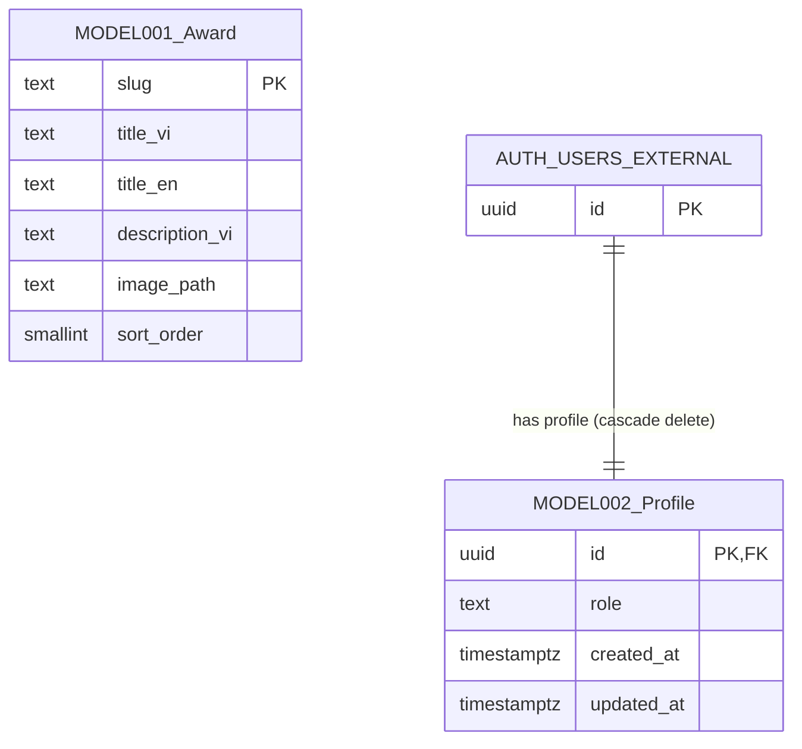

# Entities

**Project**: my-app (SAA Homepage — Next.js 16.4 + Supabase)
**Generated**: 2026-10-08

> Phạm vi: chỉ các bảng Postgres do app sở hữu trong `public` (qua `supabase/migrations/*.sql`). `auth.users` do Supabase quản lý nên chỉ ghi nhận là thực thể ngoài được tham chiếu, không đánh mã MODEL###. Trạng thái phía client (cookie `NEXT_LOCALE`) không thuộc mô hình dữ liệu này — xem artifact khác.

## Entity Relationship Diagram

## Entities

### MODEL001_Award

**Description**: Danh mục giải thưởng SAA hiển thị ở lưới giải thưởng trên trang chủ. Dữ liệu chỉ đọc cho `anon` và `authenticated`; ghi chỉ qua `service_role`. Sáu dòng được seed cục bộ (`top-talent`, `top-project`, `top-project-leader`, `best-manager`, `signature-2025-creator`, `mvp`) và chạy lại được nhờ `on conflict (slug) do update`.

**Source:** `supabase/migrations/20261008045411_create_awards.sql:15-22` (bảng), `:26-30` (RLS), `:34-36` (quyền); seed: `supabase/seeds/common/01-awards.sql:4-28`; đọc dữ liệu: `lib/awards/get-awards.ts:25-27`; kiểu TS: `lib/awards/award-card-mapping.ts:7-16` (`AWARD_COLUMNS`, `AwardRow`), guard `:34-44` (`isAwardRow`).

| Attribute | Type | Constraints | Description |
|-----------|------|-------------|-------------|
| slug | text | PK, NOT NULL | Định danh giải thưởng; đồng thời là anchor `/awards-information#<slug>` (`create_awards.sql:16`). Seed dùng kebab-case. |
| title_vi | text | NOT NULL | Tên giải thưởng tiếng Việt. |
| title_en | text | NOT NULL | Tên giải thưởng tiếng Anh. Seed đặt `title_en = title_vi` vì là tên riêng (`01-awards.sql:3`). Ở chế độ EN, mapping dùng `title_en`, nếu rỗng sau `trim()` thì quay về `title_vi` (`award-card-mapping.ts:57`). |
| description_vi | text | NOT NULL | Mô tả giải thưởng, chỉ có bản tiếng Việt; chế độ EN vẫn hiển thị nội dung VN (`create_awards.sql:19`, `award-card-mapping.ts:58`). |
| image_path | text | NOT NULL | Đường dẫn ảnh dưới `/public`, ví dụ `/home/awards/<slug>.png`. Chỉ nhận đường dẫn gốc nội bộ (bắt đầu bằng `/`, không `//`, không `\`), ngược lại dùng ảnh thay thế `/home/logo.png` (`award-card-mapping.ts:31,59,67-69`). |
| sort_order | smallint | NOT NULL | Thứ tự hiển thị tăng dần (query `.order("sort_order", { ascending: true })`). Cố ý không UNIQUE để upsert đổi thứ tự không va chạm (`create_awards.sql:21`). Không nằm trong `AWARD_COLUMNS` — chỉ dùng để sắp xếp ở DB. |

**Relationships**:
- Không có khóa ngoại tới bảng khác; bảng độc lập (tra cứu chỉ đọc).

**Discriminator Fields**: None.

---

### MODEL002_Profile

**Description**: Hồ sơ mỗi người dùng đã xác thực, giữ vai trò (role) dùng cho phân quyền. Mỗi `auth.users` có đúng một dòng: tạo tự động bằng trigger `on_auth_user_created` khi user mới sinh ra, và đã backfill một lần cho tài khoản có trước migration. Người dùng chỉ đọc được dòng của chính mình; không có quyền insert/update/delete cho `authenticated`, nên đổi role chỉ qua `service_role` hoặc SQL của vận hành.

**Source:** `supabase/migrations/20261008045415_create_profiles.sql:18-23` (bảng), `:27-31` (RLS), `:35-37` (quyền), `:41-58` (hàm + trigger), `:61-63` (backfill); đọc role: `lib/supabase/current-user.ts:61-83` (`readRole`), kiểu `UserRole` `:6`.

| Attribute | Type | Constraints | Description |
|-----------|------|-------------|-------------|
| id | uuid | PK, FK, NOT NULL | Trùng `auth.users.id` (`references auth.users (id) on delete cascade`, `create_profiles.sql:19`). Xoá user thì xoá profile theo. |
| role | text | NOT NULL, DEFAULT 'user', CHECK (role in ('user','admin')) | Vai trò của người dùng; mặc định `user`. Luôn lấy default khi tạo, không bao giờ lấy từ user metadata (`create_profiles.sql:20,39-40`). |
| created_at | timestamptz | NOT NULL, DEFAULT now() | Thời điểm tạo profile. |
| updated_at | timestamptz | NOT NULL, DEFAULT now() | Thời điểm cập nhật cuối. Không có trigger tự cập nhật trong migration — giá trị chỉ đổi nếu bên ghi tự đặt. |

**Relationships**:
- One-to-One với `auth.users` (thực thể ngoài do Supabase quản lý) qua `id`; xoá cascade từ `auth.users` sang `profiles`. Phía `auth.users` là bắt buộc phát sinh profile qua trigger `on_auth_user_created` (`after insert`, `for each row`, gọi `public.handle_new_user()`, `security definer`, `set search_path = ''`, `on conflict (id) do nothing`).

**Discriminator Fields**:

> **Scope:** enum fields with ≥2 distinct behavioral values. Boolean flags (`is_active`, `is_published`) are NOT discriminators — document their behavioral impact in feature spec Business Rules.

| Field | DISC-### | Values | Description |
|-------|----------|--------|-------------|
| role | DISC-001 | user, admin | `user`: người dùng thường (mặc định). `admin`: quản trị viên. Ràng buộc bằng CHECK ở DB (`create_profiles.sql:20`) và bằng kiểu `UserRole = "user" \| "admin"` ở app (`current-user.ts:6`). Phía app chỉ giá trị chữ `"admin"` mới được coi là admin; mọi giá trị khác, lỗi tra cứu hay không có dòng đều quy về `"user"` (`current-user.ts:77`). |

---

## Validation Rules

### Award (`awards`)

| Rule | Field | Constraint | Error Message |
|------|-------|------------|---------------|
| Slug bắt buộc, duy nhất | slug | PRIMARY KEY, NOT NULL | Lỗi Postgres 23505 khi trùng (seed dùng upsert `on conflict (slug)`) |
| Các cột văn bản bắt buộc | title_vi, title_en, description_vi, image_path | NOT NULL | Lỗi Postgres 23502 |
| Thứ tự bắt buộc | sort_order | NOT NULL, kiểu smallint (không UNIQUE) | Lỗi Postgres 23502 / 22003 khi vượt miền smallint |
| Kiểu dữ liệu dòng đọc về | slug, title_vi, title_en, description_vi, image_path | `isAwardRow`: cả 5 cột phải là `string` | Dòng không qua guard bị bỏ; log `[awards] skipped N malformed row(s)` (`award-card-mapping.ts:34-44`, `get-awards.ts:34-37`) |
| Đường dẫn ảnh nội bộ | image_path | Bắt đầu bằng `/`, không bắt đầu `//`, không chứa `\` | Không có thông báo; dùng ảnh thay thế `/home/logo.png` |
| Chỉ đọc cho client | (bảng) | RLS: select cho `anon`, `authenticated`; không có policy ghi | Ghi bị từ chối (quyền: chỉ `select` cho hai role này; `insert/update/delete` chỉ `service_role`) |

### Profile (`profiles`)

| Rule | Field | Constraint | Error Message |
|------|-------|------------|---------------|
| Khoá chính = user | id | PRIMARY KEY, FK → `auth.users(id)` ON DELETE CASCADE | Lỗi Postgres 23503/23505 |
| Role hợp lệ | role | NOT NULL, CHECK (role in ('user','admin')), DEFAULT 'user' | Lỗi Postgres 23514 (check violation) |
| Dấu thời gian bắt buộc | created_at, updated_at | NOT NULL, DEFAULT now() | Lỗi Postgres 23502 |
| Chỉ đọc dòng của mình | (bảng) | RLS `profiles_select_own`: `(select auth.uid()) = id`, chỉ role `authenticated` | Dòng của người khác không trả về (không có lỗi); `anon` không có quyền |
| Role không do user ghi | role | Không có grant/policy insert/update/delete cho `anon`/`authenticated` | Ghi bị từ chối; chỉ `service_role` ghi được |
| Tạo profile idempotent | id | `insert ... on conflict (id) do nothing` (trigger và backfill) | Không lỗi khi đã tồn tại |

---

## Summary

- **Total Entities**: 2 (MODEL001_Award, MODEL002_Profile; `auth.users` là thực thể ngoài, không tính)
- **Total Relationships**: 1 (Profile 1—1 `auth.users`, cascade delete)
