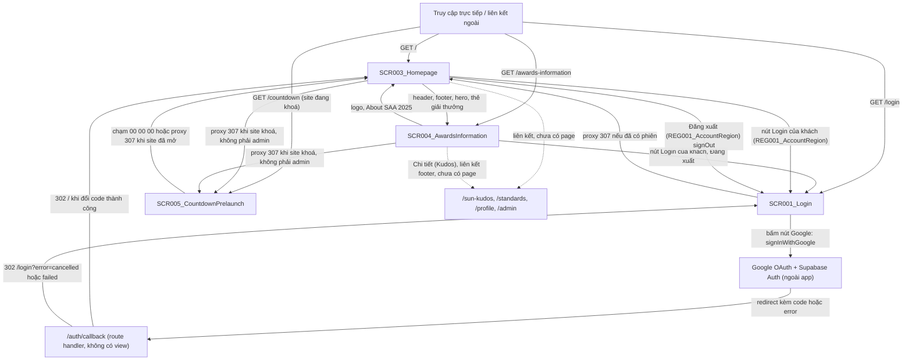
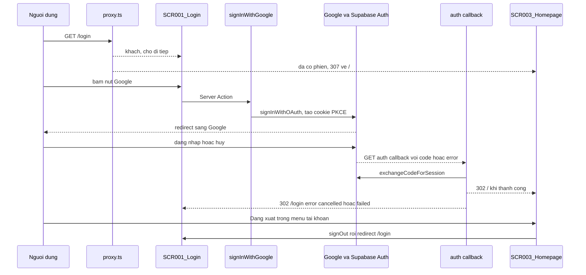

# Screen Flow

**Project**: my-app (SAA 2025 — Sun* Annual Awards 2025)
**Generated**: 2026-10-08
**Analysis Scope**: Điều hướng giữa `/login` (SCR001_Login), `/` (SCR003_Homepage), `/awards-information` (SCR004_AwardsInformation) và `/countdown` (SCR005_CountdownPrelaunch, F005), đường quay về OAuth `/auth/callback`, chuyển hướng của `proxy.ts`, Server Action `signInWithGoogle` / `signOut` / `setLocale`. SCR002_Todo đã gỡ (2026-10-08), không có cạnh điều hướng.

**Code Format**: All SCR codes MUST follow `SCR###_NameSlug` format (e.g., SCR001_LoginForm, SCR002_Dashboard) | `SCR###/REG###` for region-scoped transitions

## Navigation Map



> Ghi chú: các đích `/sun-kudos`, `/standards`, `/profile`, `/admin` được liên kết trong giao diện nhưng không có page trong code, nên không phải SCR. SCR002_Todo (đã gỡ) không xuất hiện trên bản đồ.

## Feature Entry Points

<!-- Feature Entry Points: run /tkm:rebuild-spec --feature-specs to populate -->

---

## Screen Access Paths

| From Screen | To Screen | Action/Trigger | Conditions | Region |
|-------------|-----------|----------------|------------|--------|
| START (truy cập trực tiếp / liên kết ngoài) | SCR003_Homepage | Tải trang `GET /` (ROUTE001) | Không cần phiên; khi site đã mở khách không bị chuyển hướng (`lib/supabase/proxy-session.ts:129-135`); khi site khoá xem các dòng SCR005 bên dưới | |
| START (truy cập trực tiếp / liên kết ngoài) | SCR001_Login | Tải trang `GET /login` (ROUTE004) | Khách: hiển thị màn hình đăng nhập | |
| START (truy cập trực tiếp / liên kết ngoài) | SCR003_Homepage | `GET /login` bị `proxy` chuyển 307 về `/` | Phiên hợp lệ (`getClaims` có claims); chỉ GET/HEAD (`proxy-session.ts:129-132`); khi site khoá và không phải admin, `/` tiếp tục bị chuyển 307 `/countdown` | |
| SCR003_Homepage | SCR001_Login | Bấm nút "Login" (`GuestLoginLink`, `app/_components/site/account-slot-parts.tsx:14-22`) | Khách (không có người dùng, `account-region.tsx:53`) | SCR003_Homepage/REG001_AccountRegion |
| SCR003_Homepage | SCR001_Login | Chọn "Đăng xuất" trong menu tài khoản → `signOut` (ROUTE002) rồi `redirect("/login")` (`lib/auth/actions.ts:19-33`) | Đã đăng nhập; luôn về `/login` kể cả khi revoke lỗi | SCR003_Homepage/REG001_AccountRegion |
| SCR001_Login | Google OAuth (ngoài app) | Bấm nút Google → `signInWithGoogle` (ROUTE005) → `redirect(authorizeUrl)` (`app/login/actions.ts:60`) | Dựng được origin từ header và `signInWithOAuth` không lỗi; nếu không, ở lại SCR001 với lỗi inline | |
| Google OAuth (ngoài app) | SCR003_Homepage | Supabase redirect về `/auth/callback?code=…` (ROUTE007) → đổi code lấy phiên → 302 `/` (`app/auth/callback/route.ts:24-30,47-48`) | Có `code`, không có `error`, `exchangeCodeForSession` thành công | |
| Google OAuth (ngoài app) | SCR001_Login | `/auth/callback?error=access_denied` hoặc không có `code` → 302 `/login?error=cancelled` (`route.ts:36-41`) | Người dùng huỷ ở Google | |
| Google OAuth (ngoài app) | SCR001_Login | `/auth/callback` lỗi khác hoặc đổi code lỗi/ném lỗi → 302 `/login?error=failed` (`route.ts:37,50-59`) | Lỗi nhà cung cấp, Supabase không tới được, thiếu biến môi trường | |
| SCR001_Login | SCR001_Login | Chọn ngôn ngữ → `setLocale` (ROUTE006) ghi cookie `NEXT_LOCALE`, giao diện làm mới tại chỗ | Giá trị phải thuộc danh sách cho phép (`lib/i18n/actions.ts:10`) | |
| SCR003_Homepage | SCR003_Homepage | Chọn ngôn ngữ → `setLocale` (ROUTE003); hoặc bấm logo / "About SAA 2025" → cuộn lên đầu (`same-page-scroll-top.tsx:17-31`) | Bấm chuột trái thường, không phím bổ trợ | |
| SCR003_Homepage | SCR004_AwardsInformation | Bấm ảnh, tên hoặc "Chi tiết/Details" của thẻ giải thưởng → mở `/awards-information#<slug>` (`lib/awards/award-card-mapping.ts:60`); neo bỏ trống nếu hàng không có slug | Có dữ liệu giải thưởng; neo là slug của giải | SCR003_Homepage/REG002_AwardsGrid |
| SCR003_Homepage | SCR004_AwardsInformation | Bấm "Awards Information" ở header (`site-header.tsx:48-54`) hoặc footer (`site-footer.tsx:45-51`), hoặc nút "ABOUT AWARDS" ở hero (`hero-section.tsx:69`) | Không cần phiên; không ai bị chuyển hướng | |
| SCR003_Homepage | (chưa có page) `/sun-kudos`, `/standards` | Bấm liên kết ở header, hero, khối Kudos, footer | Đích chưa xây, không có SCR | |
| START (truy cập trực tiếp / liên kết ngoài) | SCR004_AwardsInformation | Tải trang `GET /awards-information` (ROUTE008), kèm hoặc không kèm neo `#<slug>` | Không cần phiên; khi site đã mở khách không bị chuyển hướng (`proxy.ts:23`, `lib/supabase/proxy-session.ts:129-135`); neo khớp slug thì trang tới khối đó, neo lạ bị bỏ qua | |
| START (truy cập trực tiếp / liên kết ngoài) | SCR005_CountdownPrelaunch | Tải trang `GET /countdown` (HEAD cũng vậy) | Site đang khoá (`now < prelaunch_ends_at`); mọi vai trò kể cả khách, không cần phiên (`lib/prelaunch/prelaunch-gate-decision.ts:51-53`, `lib/supabase/proxy-session.ts:143-155`); mốc thiếu, `NULL`, hỏng hoặc đã qua thì xem dòng chuyển về `/` bên dưới | |
| SCR003_Homepage | SCR005_CountdownPrelaunch | Mở `GET`/`HEAD /` khi site khoá → `proxy` chuyển 307 `/countdown` | Khách, hoặc đã đăng nhập mà vai trò không phải đúng chữ `admin` (tra vai trò lỗi hoặc quá 2 giây cũng tính là người thường); admin ở lại `/` (`lib/supabase/proxy-session.ts:157-159`) | |
| SCR004_AwardsInformation | SCR005_CountdownPrelaunch | Mở `GET`/`HEAD /awards-information` khi site khoá → `proxy` chuyển 307 `/countdown` | Như dòng trên; mọi page route khác (kể cả đường chưa có page) cũng vậy, riêng `/login` và `/auth/callback` luôn được miễn (`lib/prelaunch/prelaunch-gate-decision.ts:14,46-55`) | |
| SCR005_CountdownPrelaunch | SCR003_Homepage | Đồng hồ chạm 00 00 00 (hoặc mốc `null`) → `router.replace("/")`, Back không quay lại | Chỉ khi đã hydrate; một lần cho mỗi `serverNowMs` (`lib/countdown/use-prelaunch-countdown.ts:40-48`) | |
| SCR005_CountdownPrelaunch | SCR003_Homepage | Mở `GET`/`HEAD /countdown` khi site đã mở, hoặc mốc thiếu/`NULL`/hỏng → `proxy` chuyển 307 `/` | Không đọc vai trò (`lib/prelaunch/prelaunch-gate-decision.ts:51-53`) | |
| SCR004_AwardsInformation | SCR003_Homepage | Bấm logo hoặc "About SAA 2025" ở header (`site-header.tsx:26,40-46`) hoặc footer (`site-footer.tsx:24,37-43`) | Liên kết `/`; ở trang này "About SAA 2025" không ở kiểu đang chọn | |
| SCR004_AwardsInformation | SCR001_Login | Bấm nút "Login" (vùng tài khoản dùng chung) hoặc chọn "Đăng xuất" → `signOut` rồi `redirect("/login")` | Khách có nút "Login"; Đăng xuất chỉ khi đã đăng nhập | |
| SCR004_AwardsInformation | SCR004_AwardsInformation | Bấm mục menu → cuộn tới `<section id="<slug>">` và đổi mục đang chọn; cuộn tay, `hashchange`; chọn ngôn ngữ → `setLocale` (ROUTE009) ghi cookie `NEXT_LOCALE`, giao diện làm mới tại chỗ | Chuột trái thường, không phím bổ trợ (menu); giá trị ngôn ngữ trong danh sách cho phép | |
| SCR004_AwardsInformation | (chưa có page) `/sun-kudos`, `/standards` | Bấm "Chi tiết" của khối Kudos, hoặc liên kết ở header/footer | Đích chưa xây, không có SCR | |
| SCR003_Homepage | (chưa có page) `/profile` | Chọn "Profile" trong menu tài khoản | Đã đăng nhập; đích chưa xây | SCR003_Homepage/REG001_AccountRegion |
| SCR003_Homepage | (chưa có page) `/admin` | Chọn "Admin" trong menu tài khoản | Chỉ khi `profiles.role = 'admin'` (`account-region.tsx:71`); đích chưa xây, hiện mục chỉ là giao diện, trang `/admin` khi xây phải tự kiểm tra lại vai trò ở server | SCR003_Homepage/REG001_AccountRegion |

> Region column: fill with `SCR###/REG###` for region-scoped transitions; leave blank for whole-screen transitions.

## Screen Transitions

### SCR001_Login (Login)

**Entry Points**:
- Truy cập trực tiếp `/login` hoặc liên kết ngoài (khách)
- Từ SCR003_Homepage: nút "Login" của khách (REG001_AccountRegion)
- Từ SCR003_Homepage: Đăng xuất (`signOut` luôn `redirect("/login")`)
- Từ `/auth/callback`: 302 `/login?error=cancelled` hoặc `/login?error=failed`

**Exit Points**:
- Sang Google OAuth: bấm nút Google (`signInWithGoogle`, ROUTE005)
- Sang SCR003_Homepage: đăng nhập thành công (qua `/auth/callback`), hoặc `proxy` chuyển 307 khi đã có phiên

**Decision Points**:
- Mở `/login`: nếu phiên hợp lệ và method là GET/HEAD → 307 `/` (SCR003_Homepage), nếu không → hiển thị SCR001_Login
- `?error`: nếu giá trị là `cancelled` hoặc `failed` → hiện thông báo lỗi inline, giá trị khác → bỏ qua (không phản chiếu nội dung query ra trang, `app/login/page.tsx:9-11,29-30`)
- `signInWithGoogle`: nếu có origin hợp lệ và Supabase trả `data.url` → redirect sang Google, nếu không → `{ error: "failed" }`, nút bật lại và hiện lỗi

---

### SCR002_Todo (Todo)

> Đã gỡ (removed 2026-10-08). Không có Entry Points, Exit Points hay Decision Points; mục này chỉ giữ để mọi mã SCR đều có chỗ trong luồng. Đích sau đăng nhập hiện là SCR003_Homepage.

---

### SCR003_Homepage (Homepage)

**Entry Points**:
- Truy cập trực tiếp `/` hoặc liên kết ngoài (công khai)
- Từ SCR004_AwardsInformation: logo hoặc "About SAA 2025" ở header/footer
- Từ SCR001_Login: đăng nhập thành công qua `/auth/callback` (302 `/`)
- Từ SCR001_Login: `proxy` chuyển 307 khi người đã đăng nhập mở `/login`
- Từ SCR005_CountdownPrelaunch: đồng hồ chạm 00 00 00 (`router.replace("/")`), hoặc `proxy` chuyển 307 khi mở `/countdown` lúc site đã mở

**Exit Points**:
- Sang SCR001_Login: nút "Login" của khách (REG001_AccountRegion); Đăng xuất (REG001_AccountRegion)
- Sang SCR004_AwardsInformation: liên kết "Awards Information" ở header, footer, nút "ABOUT AWARDS" ở hero, thẻ giải thưởng (REG002_AwardsGrid) kèm neo
- Sang các đích chưa có page: `/sun-kudos`, `/standards`, `/profile`, `/admin` (không thuộc SCR nào)
- Sang SCR005_CountdownPrelaunch: `proxy` chuyển 307 khi site khoá và người mở không phải admin

**Decision Points**:
- Vùng tài khoản (REG001_AccountRegion): không có người dùng → nút "Login"; có người dùng → menu tài khoản; role đọc đúng bằng `"admin"` → thêm mục Admin (`account-region.tsx:53-72`)
- Chuông thông báo (REG001_AccountRegion): chỉ hiện khi đã đăng nhập (`account-region.tsx:44-47`)
- Lưới giải thưởng (REG002_AwardsGrid): có dữ liệu → hiện thẻ; rỗng hoặc truy vấn lỗi → hiện thông báo rỗng (`awards-grid.tsx:21-23`)
- Đồng hồ đếm ngược: `SAA_COUNTDOWN_TARGET` hợp lệ → đếm tiếp; thiếu hoặc sai định dạng → hiển thị mốc 00 và ẩn "Coming soon" (`lib/countdown/parse-countdown-target.ts:32-51`)

---

### SCR004_AwardsInformation (Awards Information)

**Entry Points**:
- Truy cập trực tiếp `/awards-information`, kèm hoặc không kèm neo `#<slug>` (công khai)
- Từ SCR003_Homepage: "Awards Information" ở header hoặc footer, nút "ABOUT AWARDS" ở hero, thẻ giải thưởng (kèm neo của giải)

**Exit Points**:
- Sang SCR003_Homepage: logo, "About SAA 2025" ở header/footer
- Sang SCR001_Login: nút "Login" của khách; Đăng xuất (vùng tài khoản dùng chung)
- Sang các đích chưa có page: `/sun-kudos` ("Chi tiết" của Kudos, header, footer), `/standards` (footer), `/profile`, `/admin` (menu tài khoản)
- Sang SCR005_CountdownPrelaunch: `proxy` chuyển 307 khi site khoá và người mở không phải admin

**Decision Points**:
- Phần giải thưởng: có ≥ 1 giải hợp lệ → menu và sáu khối; rỗng, truy vấn lỗi hoặc mọi hàng hỏng → thông báo `home.awards.empty` thay cho menu và khối (`award-details-loader.tsx:17-26`, `lib/awards/get-award-details.ts:34-49`)
- Neo `#<slug>`: khớp slug của một giải → cuộn tới khối và chọn mục đó; không khớp hoặc mã hoá lỗi → bỏ qua, mục đầu đang chọn (`lib/ui/section-scroll-spy.ts:34-44`)
- Bấm mục menu: chuột trái thường → `preventDefault`, cuộn mượt (tức thì khi bật giảm chuyển động); có phím bổ trợ hoặc không phải nút trái → liên kết mặc định (`use-awards-nav-active-slug.ts:73-88`)
- Cuộn tay: không đang ghim → mục đang chọn là khối cuối đã lên tới đường chuẩn, hoặc mục cuối khi ở cuối trang (`section-scroll-spy.ts:18-26`)

---

### SCR005_CountdownPrelaunch (Countdown Prelaunch)

**Entry Points**:
- Truy cập trực tiếp `/countdown` hoặc liên kết ngoài, khi site đang khoá (mọi vai trò, không cần phiên)
- Từ mọi page route khác: `proxy` chuyển 307 `/countdown` khi site khoá và người mở là khách hoặc không phải admin (SCR001_Login `/login` và `/auth/callback` được miễn; người đã đăng nhập mở `/login` bị đưa về `/` rồi tiếp tục tới đây)

**Exit Points**:
- Sang SCR003_Homepage: đồng hồ chạm 00 00 00 hoặc mốc `null` (`router.replace("/")`); hoặc `proxy` chuyển 307 `/` khi mở `/countdown` lúc site đã mở hay mốc không dùng được
- Không có nút hay liên kết nào trên màn hình; admin chưa đăng nhập phải mở thẳng `/login`

**Decision Points**:
- `proxy` mở `/countdown`: site khoá → hiện màn hình; site mở, mốc thiếu, `NULL` hoặc hỏng → 307 `/` (`lib/prelaunch/prelaunch-gate-decision.ts:51-53`)
- Đồng hồ: chưa hydrate → `--`, chưa chuyển; còn thời gian → đếm theo giờ máy chủ; chạm 0 hoặc mốc `null` → `00` rồi chuyển `/` một lần cho mỗi `serverNowMs` (`lib/countdown/use-prelaunch-countdown.ts:38-48`)

---

## Region Transitions

> Region transitions are typically client-state (no URL change); document only transitions that change user-visible state within the region or cross region boundary.

| From Region | To Target | Action/Trigger | Client-State Only |
|-------------|-----------|----------------|-------------------|
| SCR003_Homepage/REG001_AccountRegion (AccountRegion) | SCR001_Login (toàn màn hình) | Bấm nút "Login" khi là khách | No (URL đổi sang `/login`) |
| SCR003_Homepage/REG001_AccountRegion (AccountRegion) | SCR001_Login (toàn màn hình) | Đăng xuất: `signOut` rồi `redirect("/login")` | No (Server Action + URL đổi) |
| SCR003_Homepage/REG001_AccountRegion (AccountRegion) | Menu tài khoản mở/đóng | Bấm nút tài khoản; đóng bằng Esc, bấm ra ngoài, hoặc rời focus (`lib/ui/use-menu-disclosure.ts`) | Yes |
| SCR003_Homepage/REG001_AccountRegion (AccountRegion) | (chưa có page) `/profile`, `/admin` | Chọn mục Profile / Admin | No (URL đổi, đích chưa xây) |
| SCR003_Homepage/REG002_AwardsGrid (AwardsGrid) | SCR004_AwardsInformation (toàn màn hình) `/awards-information#<slug>` | Bấm thẻ hoặc "Chi tiết" của giải thưởng | No (URL đổi sang `/awards-information#<slug>`) |
| SCR003_Homepage/REG002_AwardsGrid (AwardsGrid) | REG002_AwardsGrid chính nó | `Suspense` chuyển từ khung chờ sang lưới thật hoặc thông báo rỗng | Yes |

---

## Authentication Flow



| Screen | Authentication Required | Authorization Level |
|--------|------------------------|-------------------|
| SCR001_Login | Không (người đã đăng nhập bị chuyển 307 về `/`) | Public (khách) |
| SCR003_Homepage | Không | Public; vùng REG001_AccountRegion đổi theo phiên: khách → "Login", user → menu Profile, admin → thêm mục Admin (chỉ là giao diện) |
| SCR004_AwardsInformation | Không | Public; khách và người đã đăng nhập thấy cùng nội dung, chỉ vùng tài khoản dùng chung khác nhau |
| SCR005_CountdownPrelaunch | Không | Public, mọi vai trò kể cả khách và admin; chỉ hiện khi site đang khoá |

> Ghi chú: khi site đã mở không có route nào bị chặn đối với khách; `proxy.ts` chỉ chuyển hướng `GET|HEAD /login` khi đã có phiên (xem GUARD-001). Khi site còn khoá (F005), cổng prelaunch chuyển người không phải admin về `/countdown` (xem GUARD-002); đây là cổng ra mắt, không phải kiểm soát an ninh. Quyền chi tiết nằm ở `permissions.md`.

---

## Error Handling Flows

| Screen | Error | Handling | Scope |
|--------|-------|----------|-------|
| SCR001_Login | `signInWithGoogle` lỗi (thiếu origin, `signInWithOAuth` lỗi hoặc ném lỗi) | Trả `{ error: "failed" }`, nút bật lại, hiện thông báo lỗi inline (`app/login/actions.ts:34-57`, `google-button.tsx:50-57`) | screen |
| SCR001_Login | Người dùng huỷ ở Google (`access_denied`, hoặc callback không có `code`) | Callback 302 `/login?error=cancelled`, trang hiện thông báo lỗi (`route.ts:36-41`) | screen |
| SCR001_Login | Lỗi nhà cung cấp hoặc đổi code lỗi / ném lỗi | Callback 302 `/login?error=failed`, trang hiện thông báo lỗi; không bao giờ trả 500 (`route.ts:50-59`) | screen |
| SCR001_Login | `?error` có giá trị lạ | Bỏ qua, không hiện lỗi và không phản chiếu query (`page.tsx:9-11`) | screen |
| SCR001_Login | Chuyển ngôn ngữ thất bại | Giữ ngôn ngữ hiện tại, chỉ ghi log (`language-selector.tsx:52-57`) | screen |
| SCR003_Homepage | Đọc phiên lỗi (claims lỗi / ném lỗi) | Coi là khách, hiện nút "Login", ghi log (`lib/supabase/current-user.ts:40-42,54-57`) | region:REG001_AccountRegion |
| SCR003_Homepage | Tra cứu `profiles.role` lỗi / không có dòng / giá trị lạ | Quy về `"user"`, không hiện mục Admin (`current-user.ts:70-83`) | region:REG001_AccountRegion |
| SCR004_AwardsInformation | Truy vấn `awards` kèm `award_prizes` lỗi hoặc ném lỗi (kể cả thiếu biến môi trường Supabase) | Trả danh sách rỗng, hiện thông báo rỗng thay cho menu và khối, ghi log `[awards-information]`; Kudos và footer vẫn hiện (`lib/awards/get-award-details.ts:34-49`) | screen |
| SCR004_AwardsInformation | Hàng giải thiếu cột hoặc sai kiểu | Hàng bị bỏ khỏi cả menu và khối, log số hàng bị bỏ (`get-award-details.ts:39-43`, `award-detail-mapping.ts:64-81`) | screen |
| SCR004_AwardsInformation | Neo `#<slug>` không khớp giải nào hoặc mã hoá lỗi | Bỏ qua, không lỗi, trang ở đầu, mục đầu đang chọn (`section-scroll-spy.ts:34-44`) | screen |
| SCR003_Homepage | Truy vấn `awards` lỗi hoặc dòng sai kiểu | Trả danh sách rỗng và hiện thông báo rỗng; dòng sai kiểu bị bỏ và ghi log (`lib/awards/get-awards.ts:28-43`) | region:REG002_AwardsGrid |
| SCR003_Homepage | `SAA_COUNTDOWN_TARGET` thiếu hoặc sai định dạng | Đếm ngược hiển thị 00, ẩn "Coming soon", ghi log một lần (`parse-countdown-target.ts:32-51`) | screen |
| SCR001_Login, SCR003_Homepage, SCR004_AwardsInformation | `proxy` kiểm tra phiên lỗi (thiếu biến môi trường Supabase, mạng lỗi) | Coi là khách, request đi tiếp, ghi log; khi site khoá khách bị chuyển `/countdown` (`lib/supabase/proxy-session.ts:110-126`) | screen |
| SCR005_CountdownPrelaunch | Mốc `prelaunch_ends_at` thiếu dòng, `NULL`, sai kiểu, quá 2 giây hoặc lỗi mạng | Fail open: site mở, `/countdown` chuyển 307 `/`; ghi một dòng `[prelaunch]` mỗi thông báo một lần mỗi tiến trình (trừ `NULL`, im lặng) (`lib/prelaunch/read-prelaunch-ends-at.ts:32-66`) | screen |
| SCR001_Login, SCR003_Homepage, SCR004_AwardsInformation, SCR005_CountdownPrelaunch | Tra `profiles.role` của người dùng đã đăng nhập lỗi, quá 2 giây hoặc không có dòng khi site khoá | Fail closed: coi là `user`, 307 `/countdown`, log `[profiles]` (`lib/prelaunch/read-gate-user-role.ts:24-49`) | screen |

> Scope values: `screen` (affects entire screen) | `region:REG###` (error contained within the named region).

---

## Circular Dependencies Check

- [x] Không có vòng chuyển hướng tự động vô hạn: khi site đã mở khách ở `/` không bị chuyển; khi site khoá `/` → `/countdown` và `/countdown` → `/` (chạm 0) chỉ xảy ra một lần vì đồng hồ đếm theo giờ máy chủ nên trình duyệt không tới `/` trước khi cổng mở (BR-007, BR-008 của F005); `/login` chỉ chuyển về `/` khi đã có phiên; `signOut` luôn kết thúc ở `/login` và khách ở `/login` không bị chuyển tiếp
- [x] All screens have valid entry/exit points (SCR002_Todo đã gỡ, không tính)
- [x] All navigation paths terminate

> Ghi chú: SCR001_Login và SCR003_Homepage tạo một vòng điều hướng do người dùng chủ động (đăng nhập → trang chủ → đăng xuất → đăng nhập); mỗi bước đều cần một hành động hoặc đổi trạng thái phiên, không phải phụ thuộc vòng.

---

## Guard Logic

Route guards intercept navigation to enforce conditions beyond authentication — loading required data, checking permissions, or applying business rules. Document each guard found on any route.

### GUARD-001 — LoggedInRedirect on /login
**trigger:** `middleware` (Next.js 16 `proxy.ts`, trước khi route khớp `config.matcher = ["/((?!_next/|__nextjs|.*\\..*).*)"]` render; F005 mở rộng từ `["/", "/login", "/awards-information"]`)
**source:** `proxy.ts:10-12` → `lib/supabase/proxy-session.ts:129-135`
**logic:**
```pseudo
refresh Supabase session cookies (getClaims)
if (method is not GET and not HEAD) → continue
if (hasVerifiedClaims and path == /login) → redirect 307 /
else → continue (while the site is open a guest is never redirected by this rule)
```
**failure path:** lỗi `getClaims` hoặc ném lỗi (kể cả thiếu biến môi trường) → coi là khách, request đi tiếp, không có 500; quy tắc này không chặn route nào đối với khách

### GUARD-002 — PrelaunchGate on every page route (F005)
**trigger:** `middleware` (cùng `proxy.ts`, chạy sau quy tắc `/login`; chỉ `GET`/`HEAD`, bỏ qua `/login` và `/auth/callback`)
**source:** `proxy.ts:22-24` → `lib/supabase/proxy-session.ts:43-79,143-160` → `lib/prelaunch/prelaunch-gate-decision.ts:40-56`
**logic:**
```pseudo
read prelaunch_ends_at (anon, no-store, 2 s timeout, no retry) in parallel with getClaims
locked = moment != null and now < moment
if (path == /countdown) → locked ? continue : redirect 307 /
if (not locked) → continue
if (no verified session) → redirect 307 /countdown
if (role from profiles == exactly "admin") → continue else redirect 307 /countdown
```
**failure path:** mốc không đọc được → site mở (fail open); vai trò không đọc được → `user`, bị chuyển (fail closed); cổng không phải kiểm soát an ninh, không thấy `POST` nên mọi trang và action vẫn tự kiểm tra quyền

---

## Deep-Link State Restoration

Document screens where URL parameters or path segments reconstruct non-trivial UI state on direct visit (bookmarked URL, shared link, browser refresh). This is distinct from simple routing — it means the app reads URL params and rehydrates view state from them.

### SCR001_Login
**URL pattern:** `/login?error={cancelled|failed}`
**State restored:**

| Param | Restores | Default if missing |
|-------|----------|--------------------|
| error | Thông báo lỗi đăng nhập inline (`showInitialError` → `useActionState` khởi tạo `{ error: "failed" }`, `app/login/page.tsx:29-30`, `google-button.tsx:19-21`) | Không hiện lỗi |

**Failure mode:** giá trị `error` ngoài `cancelled` / `failed` bị bỏ qua, không hiện lỗi và không phản chiếu nội dung query ra trang

### SCR004_AwardsInformation
**URL pattern:** `/awards-information#<slug>`
**State restored:**

| Param | Restores | Default if missing |
|-------|----------|--------------------|
| `#<slug>` (hash) | Mục menu đang chọn và vị trí cuộn: `matchSectionHash` so khớp chính xác với danh sách slug của giải rồi `applyHash` cuộn tức thì tới khối (`lib/ui/section-scroll-spy.ts:34-44`, `use-awards-nav-active-slug.ts:95-101,132-136`); `hashchange` (Back/Forward) áp dụng lại (`:123-125`) | Mục đầu tiên đang chọn, trang ở đầu |

**Failure mode:** neo không khớp slug nào, rỗng hoặc mã hoá lỗi (ví dụ `%E0%A4%A`) bị bỏ qua, không lỗi JavaScript, mục đầu đang chọn

---

## Unsaved-Changes Protection

Document screens and forms that warn the user before discarding unsaved input — via browser `beforeunload`, route-leave guards, or modal close intercepts.

N/A — no unsaved-changes guards detected.

---

## Extraction Signatures

Framework-agnostic identifier patterns for locating the above constructs.

### Guard Logic
Function/method definitions tied to a route: `beforeEnter|canActivate|middleware|loader|before_action|authenticate|authorize` — check if called from a router config or route registration.

### Deep-Link State Restoration
URL param reads at component mount synced to state: `useSearchParams|useQuery|router\.query|URLSearchParams|params\[|$route\.query` — look for these at top of component with corresponding `setState` or reactive assignment.

### Unsaved-Changes Protection
`beforeunload|onbeforeunload|usePrompt|useBeforeUnload|leaveGuard|isDirty|formState\.isDirty|data-turbo-confirm` — presence confirms protection; absence is a potential gap to flag.
