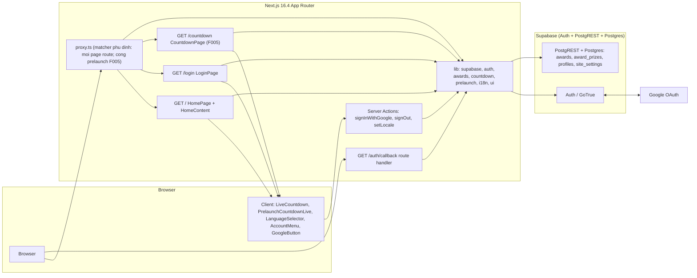
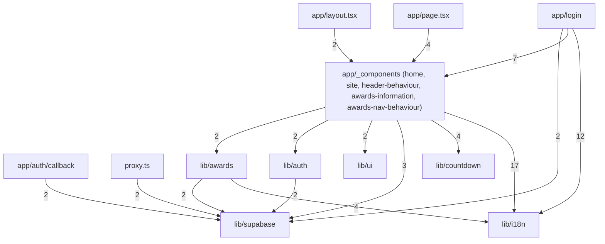
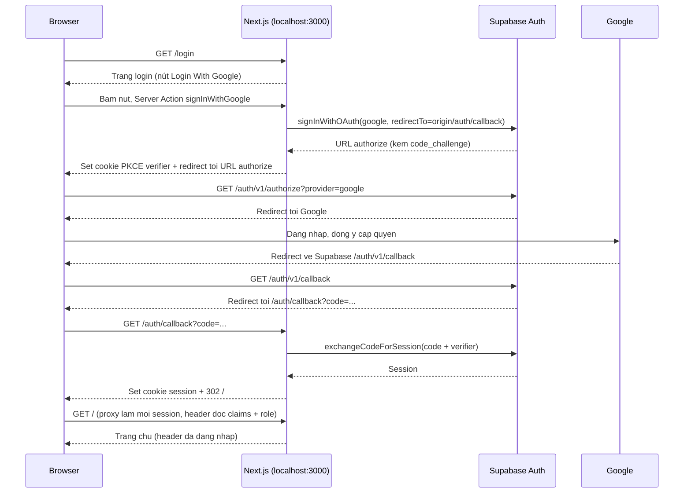
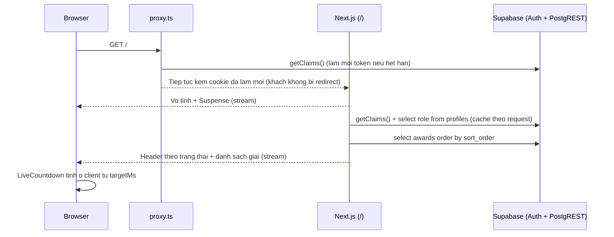
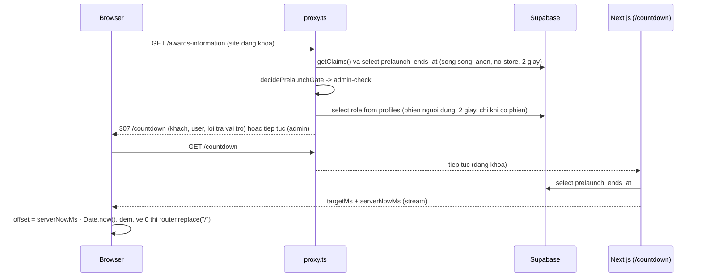

# Architecture

Kiến trúc AS-BUILT của ứng dụng SAA 2025 (Next.js 16.4 + Supabase): trang chủ công khai `/` (F002), trang Hệ thống giải thưởng công khai `/awards-information` (F004), đăng nhập Google `/login` + `/auth/callback` (F001), menu tài khoản có vai trò admin nằm trong header trang chủ (F003), trang đếm ngược prelaunch `/countdown` cùng cổng prelaunch toàn site trong `proxy.ts` (F005). Route theo `ROUTE001`–`ROUTE010` (xem `route-list.md`), bảng dữ liệu theo `MODEL001_Award`, `MODEL002_Profile`, `MODEL003_AwardPrize`, `MODEL004_SiteSettings` (xem `entities.md`). Tài liệu này đối chiếu bản nháp forward của takumi với code hiện có: mọi đường dẫn bên dưới đều tồn tại trong working tree.

> Note: `/todo` (SCR002_Todo) đã bị xoá khỏi code (`app/todo/**` không còn); `/profile`, `/admin`, `/sun-kudos`, `/standards` được link tới nhưng **chưa có page** trong `app/` (xem "Known Gaps" ở cuối mục System Architecture).

## System Architecture

Ứng dụng là một Next.js App Router (`cacheComponents: true`, `partialPrefetching: true` — `next.config.ts:8-9`) chạy `http://localhost:3000` (`playwright.config.ts:10`). Mọi lời gọi Supabase đi qua server (Server Component, Server Action, Route Handler, `proxy.ts`): ứng dụng **không có client Supabase phía trình duyệt**, cookie session là `httpOnly` (`lib/supabase/session-cookie-options.ts:11-16`). Supabase Auth (GoTrue) xử lý OAuth với Google; dữ liệu (`public.awards`, `public.award_prizes`, `public.profiles`) đọc qua PostgREST bằng publishable key kèm cookie của người dùng, RLS áp dụng; ngoại lệ có chủ ý là mốc prelaunch (`public.site_settings`), đọc bằng client không cookie (vai `anon`) ở `lib/prelaunch/read-prelaunch-ends-at.ts` để không đua làm mới refresh token với `getClaims()` của proxy.

### Module Graph

Đồ thị import cấp module (dựng từ graph máy rồi đối chiếu `import` thực tế; đã loại `docs/`, `e2e/`, `README*`, `.claude/`, `tsconfig.json`, `package.json`). Nhãn cạnh = số import đo được bởi graph. Cạnh `app/layout.tsx → _components` là import `HtmlLangScript`.

Quy tắc phụ thuộc (đúng với code): `lib/*` không import ngược `app/*`; `lib/supabase` chạm Supabase qua `@supabase/ssr`, riêng `lib/prelaunch/read-prelaunch-ends-at.ts` (F005) tạo client không cookie bằng `@supabase/supabase-js` có chủ ý (`:35-38`); `lib/supabase/proxy-session.ts` import `lib/prelaunch/*` và `lib/prelaunch/read-gate-user-role.ts` import `lib/supabase/user-role.ts` (hàm thuần, không import) nên ở mức tệp không có vòng; `lib/countdown/parse-countdown-target.ts` và `lib/awards/award-card-mapping.ts`, `lib/awards/award-detail-mapping.ts` và `lib/ui/section-scroll-spy.ts` và `lib/prelaunch/prelaunch-gate-decision.ts`, `lib/supabase/user-role.ts` là hàm thuần (chỉ import type hoặc mapping thuần, hai tệp sau không import gì), `lib/countdown/use-countdown.ts`, `lib/countdown/use-prelaunch-countdown.ts` và `lib/ui/use-menu-disclosure.ts` là hook client (`"use client"`). Đồ thị trên dựng trước F005; F005 thêm hai nút `app/countdown` (import `lib/i18n`, `lib/prelaunch`, `app/_components/countdown-prelaunch`, `lib/countdown`) và `lib/prelaunch` (import `lib/supabase`, `lib/countdown`), cạnh `proxy`/`lib/supabase` → `lib/prelaunch` chưa vẽ.

### Components

| Component | Path | Responsibility |
|-----------|------|----------------|
| Proxy | `proxy.ts` | Chạy trên Node runtime trước route khớp, gọi `updateSession` (`proxy.ts:10-12`). `matcher: ["/((?!_next/|__nextjs|.*\\..*).*)"]` phải là literal tĩnh (`proxy.ts:22-24`): phủ mọi page route kể cả `/`, route lạ; không khớp `/_next/*`, `__nextjs*`, mọi đường có dấu chấm (asset); `/auth/callback` khớp nhưng được trả tiếp ngay trong code. |
| Session helper | `lib/supabase/proxy-session.ts` | `updateSession` (`:43`): `/auth/callback` → đi tiếp ngay (`:45`); `getClaims()` (`verifySession`, `:88-127`) làm mới token song song với đọc mốc prelaunch (`:55-58`), chép cookie mới sang response kể cả khi redirect. Quy tắc `/login`: GET/HEAD + claims hợp lệ → 307 `/` (`loginRedirectTarget`, `:129-135`). Cổng prelaunch (`prelaunchGateTarget`, `:143-160`) chỉ cho GET/HEAD: xem hàng "Prelaunch gate". Khi site đã mở khách trên `/` không bị chuyển hướng. Server Action POST đi tiếp. Thiếu/sai env hoặc `getClaims` lỗi → coi là khách, chỉ ghi log. |
| Server client | `lib/supabase/server.ts` | `createClient()` (`:19`) tạo `createServerClient` mới mỗi lần gọi, đọc/ghi cookie qua `cookies()`. `setAll` bọc try/catch vì Server Component không ghi được cookie; lỗi khác với thông báo "read-only" thì log. |
| Supabase env | `lib/supabase/supabase-env.ts` | `getSupabaseEnv()` (`:15`) đọc `SUPABASE_URL`, `SUPABASE_PUBLISHABLE_KEY` mỗi lần gọi; thiếu hoặc `SUPABASE_URL` không phải http(s) thì ném lỗi. Không dùng tiền tố `NEXT_PUBLIC_`. |
| Cookie options | `lib/supabase/session-cookie-options.ts` | `SESSION_COOKIE_OPTIONS`: `httpOnly`, `sameSite: "lax"`, `secure` khi `NODE_ENV === "production"`, `path: "/"`. Dùng chung cho server client và proxy. |
| Current user | `lib/supabase/current-user.ts` | `getCurrentUser` (`:32`) bọc `cache()` (một lần/request): `connection()` rồi `getClaims()` và đọc `profiles.role` bằng session của người dùng. Lỗi claims/ngoại lệ → `null` (khách); lỗi/thiếu dòng/giá trị lạ khi đọc role → `"user"` (fail closed); chỉ literal `"admin"` mới ra `admin`. |
| Root layout | `app/layout.tsx` | Không đọc cookie (đọc sẽ chặn prerender mọi route dưới `cacheComponents`). Cố định `lang="vi"` + `suppressHydrationWarning`; `HtmlLangScript` (`app/_components/html-lang.tsx`) đặt `documentElement.lang` theo cookie `NEXT_LOCALE` lúc parse HTML. Font Geist/Geist Mono qua `next/font/google`. |
| Homepage | `app/page.tsx`, `app/_components/home/home-content.tsx` | `HomePage` là vỏ tĩnh bọc `SaaPageShell` + `<Suspense>`; `HomeContent` (async) đọc locale, `parseCountdownTarget(process.env.SAA_COUNTDOWN_TARGET)` và ráp header, hero, Root Further, Awards, Kudos, widget, footer. Awards và vùng tài khoản có `<Suspense>` riêng. |
| Award details query (F004) | `lib/awards/get-award-details.ts`, `lib/awards/award-detail-mapping.ts` | `getAwardDetails(locale)` (`get-award-details.ts:24`): `connection()` ngoài `try`, rồi một truy vấn lồng `from("awards").select(AWARD_DETAIL_COLUMNS)` kèm `award_prizes(...)` sắp theo `sort_order` (`:30-33`). Không bao giờ ném: lỗi → log `[awards-information]` và trả `[]`; hàng hỏng bị lọc và đếm vào log. Mapping thuần (`award-detail-mapping.ts:99-116`): số lượng đệm hai chữ số, số tiền ngăn nghìn bằng dấu chấm kèm "VNĐ", chữ EN rơi về VN khi trống, ảnh trái/phải xen kẽ. |
| Awards query | `lib/awards/get-awards.ts`, `lib/awards/award-card-mapping.ts` | `getAwards(locale)` (`:18`): `connection()` rồi `from("awards").select(...).order("sort_order")` bằng server client (vai `anon` cho khách). Không bao giờ ném: lỗi → log `[awards]` và trả `[]`. Mapping lọc dòng sai kiểu, ép `image_path` về đường dẫn cục bộ (fallback `/home/logo.png`), link `/awards-information#<slug>`. Chưa dùng `"use cache"`. |
| Countdown | `lib/countdown/parse-countdown-target.ts`, `lib/countdown/countdown-math.ts`, `lib/countdown/use-countdown.ts`, `app/_components/home/countdown.tsx`, `app/_components/home/countdown-tiles.tsx` | Server parse `SAA_COUNTDOWN_TARGET` (ISO-8601 bắt buộc có offset; sai/thiếu → `null`, log một lần mỗi giá trị) rồi truyền số epoch ms xuống `LiveCountdown` (client). Hook dùng `useSyncExternalStore`, snapshot server là chỗ giữ chỗ `--`, tick theo phút, đọc lại khi tab hiện. F005 thêm tham số tuỳ chọn `clockOffsetMs` (mặc định `0`) cho `useCountdown` (`use-countdown.ts:42`) và tham số `label` cho `parseCountdownTarget` (`parse-countdown-target.ts:32`); trang chủ không truyền nên không đổi. |
| Prelaunch gate (F005) | `lib/prelaunch/prelaunch-gate-decision.ts`, `lib/prelaunch/read-prelaunch-ends-at.ts`, `lib/prelaunch/read-gate-user-role.ts`, `lib/supabase/user-role.ts` | `decidePrelaunchGate` (`:40-56`) hàm thuần: non-GET/HEAD và `/login`, `/auth/callback` → đi tiếp; `locked = momentMs !== null && nowMs < momentMs`; `/countdown` đi tiếp khi khoá, 307 `/` khi mở; trang khác khi khoá → `admin-check`. `readPrelaunchEndsAt` (`:32-66`) đọc `site_settings.prelaunch_ends_at` bằng client không cookie, `cache: "no-store"`, hạn chờ 2 giây, `.retry(false)`, fail open (`null`). `readGateUserRole` (`:24-49`) đọc `profiles.role` bằng client cookie của proxy sau `getClaims()`, hạn chờ 2 giây, fail closed (`"user"`). `toUserRole` (`user-role.ts:13-15`) là quy tắc "chỉ đúng chữ `admin`" dùng chung với `getCurrentUser()`. |
| Countdown Prelaunch page (F005) | `app/countdown/page.tsx`, `app/countdown/_components/{countdown-prelaunch-content,prelaunch-countdown-live}.tsx`, `app/_components/countdown-prelaunch/{countdown-prelaunch-view,countdown-prelaunch-unit}.tsx`, `lib/countdown/use-prelaunch-countdown.ts`, `public/countdown/bg-image.png` | Vỏ tĩnh `<Suspense>` (`page.tsx:8-14`); `CountdownPrelaunchContent` (`:14-34`) gọi `connection()`, đọc locale, mốc, rồi `serverNowMs = Date.now()` (`:39-45`) và giao cho client. `usePrelaunchCountdown` (`:32-51`) đo `clockOffsetMs = serverNowMs - Date.now()` một lần cho mỗi `serverNowMs`, đếm bằng `useCountdown`, và `router.replace("/")` một lần khi về 0. View và unit là phần trình bày thuần; không header/footer, một `<h1>`. |
| Account region | `app/_components/header-behaviour/account-region.tsx` | `AccountRegion` / `AccountBellRegion`, mỗi vùng một `<Suspense>`; fallback là `AccountSlotSkeleton` (không phải nút Login, tránh nháy). Khách → `GuestLoginLink` (`/login`); đã đăng nhập → `AccountMenu` + chuông (chỉ UI). Mục Admin chỉ có khi `role === "admin"` (`:69-73`). |
| Account menu | `app/_components/header-behaviour/account-menu.tsx`, `app/_components/site/account-menu-view.tsx`, `lib/ui/use-menu-disclosure.ts` | `AccountMenu` (client) giữ trạng thái mở/đóng + bàn phím; `AccountMenuView` là phần hiển thị thuần. `items` đã lọc theo role ở server nên role không xuống trình duyệt. Mục: Profile (`/profile`), Admin (`/admin`), Sign out (form gọi Server Action). |
| Sign-out action | `lib/auth/actions.ts` | Server Action `signOut` (`:19`): `signOut({ scope: "local" })`, lỗi chỉ log, luôn `redirect("/login")`. Không kiểm tra lại session (không có session thì là no-op). |
| Same-page scroll | `app/_components/header-behaviour/same-page-scroll-top.tsx` | Client, một listener click uỷ quyền: link cùng trang (logo, "About SAA 2025") cuộn lên đầu, không `preventDefault`. |
| Login page | `app/login/page.tsx`, `app/login/_components/login-screen.tsx`, `app/login/_components/login-types.ts` | Vỏ tĩnh; `searchParams` và locale đọc trong `LoginContent` bọc `<Suspense>`. Chỉ nhận `error` ∈ {`cancelled`, `failed`}. |
| Google button | `app/login/_components/google-button.tsx` | Client, `useActionState`: khi chờ thì `disabled` + `aria-busy`; nghe `pageshow` (bfcache) để reset khi người dùng Back từ Google. |
| Sign-in action | `app/login/actions.ts` | Server Action `signInWithGoogle` (`:29`): dựng origin từ header `origin` (hoặc `x-forwarded-host`/`host` đã kiểm tra), `signInWithOAuth({ provider: "google", redirectTo: <origin>/auth/callback })`, `redirect(authorizeUrl)`. Lỗi → `{ error: "failed" }`. |
| Callback | `app/auth/callback/route.ts` | `GET` (`:24`): có `error` → `cancelled` (nếu `access_denied`) hoặc `failed`; không có `code` → `cancelled`; ngược lại `exchangeCodeForSession(code)`. Luôn 302 tới `/` hoặc `/login?error=<outcome>`; đích viết cứng, không đọc từ query (không open redirect). |
| i18n | `lib/i18n/locales.ts`, `lib/i18n/get-locale.ts`, `lib/i18n/actions.ts`, `lib/i18n/dictionary.ts`, `lib/i18n/home-copy.ts` | Từ điển `vi`/`en` tự viết (không dùng thư viện i18n). `getLocale()` đọc cookie `NEXT_LOCALE`, mặc định `vi`. `setLocale` (Server Action) allow-list rồi ghi cookie (`path=/`, 1 năm, `sameSite=lax`). Mô tả giải chỉ có tiếng Việt. |
| Language selector | `app/_components/site/language-selector.tsx` | Client dropdown dùng chung cho `/` và `/login`; nhận `onSelect={setLocale}` qua prop. |
| Site chrome | `app/_components/site/site-header.tsx`, `site-footer.tsx`, `saa-page-shell.tsx`, `site-icons.tsx`, `site-types.ts`, `account-slot-parts.tsx` | Phần hiển thị thuần (header/footer/shell/icon/kiểu props) dùng chung giữa các trang SAA. |
| Home sections | `app/_components/home/{hero,root-further,awards,kudos}-section.tsx`, `awards-grid.tsx`, `widget-button.tsx` | Các khối trình bày của trang chủ; dữ liệu và copy nhận qua props. |
| Awards Information (F004) | `app/awards-information/page.tsx`, `app/awards-information/_components/{awards-information-content,award-details-loader}.tsx`, `app/_components/awards-information/*` (hero, tiêu đề, bố cục, khối giải, trạng thái, `awards-nav-view.tsx`), `app/_components/awards-nav-behaviour/*` | Vỏ tĩnh + `<Suspense>`; nội dung ghép header/footer (`currentPage="awards"`), phần giải thưởng đọc dữ liệu trong `<Suspense>` thứ hai. Menu là client component: hook `use-awards-nav-active-slug.ts` là nơi duy nhất ghi mục đang chọn (bấm, cuộn tay, neo `#<slug>`); thuật toán thuần ở `lib/ui/section-scroll-spy.ts`, các lời gọi DOM ở `awards-nav-scroll-dom.ts`. Chữ trang ở `lib/i18n/awards-information-copy.ts`. |
| Fonts | `app/_components/saa-fonts.ts` | Montserrat (400/700) và Montserrat Alternates (700), subset latin + vietnamese, `next/font/google`. |
| Migration (F005) | `supabase/migrations/20261009083754_create_site_settings.sql` | Tạo `public.site_settings` một dòng (`singleton boolean primary key check (singleton)`, `prelaunch_ends_at timestamptz`, `updated_at`), bật RLS, policy `site_settings_select_public` (`anon`, `authenticated`), `REVOKE`/`GRANT` tường minh (ghi chỉ `service_role`), chèn dòng khởi tạo với `prelaunch_ends_at = NULL`; có chú thích ROLLBACK STRATEGY. |
| Seed (F005) | `supabase/seeds/common/03-site-settings.sql` | Upsert mốc `2026-01-01T00:00:00+07:00` (quá khứ) để local luôn mở sau `db reset`; E2E đặt mốc tương lai rồi khôi phục literal này. |
| Migrations | `supabase/migrations/20261008045411_create_awards.sql`, `supabase/migrations/20261008045415_create_profiles.sql`, `supabase/migrations/20261009021753_add_award_details_and_prizes.sql` | Tạo `public.awards`, `public.profiles`, bật RLS, policy, `REVOKE`/`GRANT` tường minh; trigger `on_auth_user_created` + backfill cho profile; migration thứ ba chỉ thêm năm cột chi tiết vào `awards` và bảng `award_prizes` (RLS + GRANT cùng mẫu). |
| Seed | `supabase/seeds/common/01-awards.sql`, `supabase/seeds/common/02-award-details.sql` | Upsert 6 giải thưởng (`on conflict (slug) do update`); `02` (chạy sau `01` theo tên tệp) cập nhật cột chi tiết theo `slug` và upsert `award_prizes` theo `(award_slug, sort_order)`; chạy khi `supabase db reset` (theo `[db.seed] sql_paths`, `supabase/config.toml:58-63`). |

Ghi chú về `cacheComponents`: mọi thứ phụ thuộc request (cookie `NEXT_LOCALE`, `searchParams`, `getClaims()` vì đọc đồng hồ, truy vấn DB) nằm trong `<Suspense>`; hàm phụ thuộc phiên gọi `connection()` ngoài `try` trước khi đọc (`lib/supabase/current-user.ts:35`, `lib/awards/get-awards.ts:20`) và `unstable_rethrow` trong `catch` để không nuốt tín hiệu prerender. Không dùng `export const dynamic/revalidate`.

### Data Model

Bốn bảng trong schema `public` (chi tiết cột/ràng buộc: `entities.md`).

| Bảng | MODEL | Cột chính | RLS / quyền |
|------|-------|-----------|-------------|
| `public.awards` | `MODEL001_Award` | `slug` (PK), `title_vi`, `title_en`, `description_vi`, `image_path` (đường dẫn dưới `/public`, ví dụ `/home/awards/<slug>.png`), `sort_order` (smallint); từ F004 thêm `detail_description_vi`, `quantity`, `unit_vi`, `unit_en`, `nav_label` (nullable) | RLS bật. Policy `awards_select_public` cho `anon`, `authenticated`. `GRANT select` cho hai vai đó; `service_role` đủ quyền (`supabase/migrations/20261008045411_create_awards.sql:26-36`). Migration F004 không đổi policy hay quyền. |
| `public.award_prizes` | `MODEL003_AwardPrize` | `(award_slug, sort_order)` (PK; `award_slug` FK → `awards.slug` cascade), `amount_vnd` (integer, ≥ 0), `note_vi`, `note_en` (nullable) | RLS bật. Policy `award_prizes_select_public` cho `anon`, `authenticated`; thu hồi hết rồi `GRANT select` cho hai vai đó, `service_role` đủ quyền (`supabase/migrations/20261009021753_add_award_details_and_prizes.sql:46-57`). |
| `public.site_settings` | `MODEL004_SiteSettings` | `singleton` (boolean PK, `check (singleton)`: tối đa một dòng), `prelaunch_ends_at` (timestamptz, `NULL` = cổng tắt), `updated_at` | RLS bật. Policy `site_settings_select_public` cho `anon`, `authenticated`; thu hồi hết rồi `GRANT select` cho hai vai đó, `service_role` mới ghi được (`supabase/migrations/20261009083754_create_site_settings.sql:31-43`). Mọi cột đọc công khai. |
| `public.profiles` | `MODEL002_Profile` | `id` (uuid PK, FK `auth.users(id)` `on delete cascade`), `role` (`'user'` \| `'admin'`, mặc định `'user'`), `created_at`, `updated_at` | RLS bật. Policy `profiles_select_own` chỉ cho `authenticated` đọc dòng của mình (`(select auth.uid()) = id`). Chỉ `GRANT select` cho `authenticated`; không có quyền/policy ghi cho người dùng. `service_role` đủ quyền (`supabase/migrations/20261008045415_create_profiles.sql:27-37`). |

- Dòng `profiles` do trigger `after insert on auth.users` tạo (hàm `public.handle_new_user`, `security definer`, `search_path = ''`, `on conflict do nothing`); `role` luôn lấy mặc định, không bao giờ từ metadata người dùng. Migration có backfill cho tài khoản đã tồn tại (`:60-63`).
- `REVOKE ALL` rồi `GRANT` tường minh để kết quả không phụ thuộc ACL mặc định của dự án.
- Ảnh giải nằm trong `/public/home/awards/*.png`, hiển thị bằng `next/image`; không dùng Supabase Storage (bucket `images` đặt `public = false`, `supabase/config.toml:109-110`).
- Seed chỉ chạy khi `db reset` local; `supabase db push` không chạy seed.
- Chưa sinh kiểu bằng `supabase gen types` (bốn bảng, truy vấn hẹp; dùng type guard tay `isAwardRow`; mốc prelaunch kiểm kiểu ở `read-prelaunch-ends-at.ts:70-77`).

### Known Gaps

Phát hiện khi đối chiếu code, không sửa trong phạm vi tài liệu này:

- Link tới trang chưa tồn tại (không có `page.tsx`): `/profile`, `/admin` (`app/_components/header-behaviour/account-region.tsx:70-71`), `/sun-kudos`, `/standards` (header/footer/kudos). (`/awards-information` đã có page từ F004.) Phía server của `/admin` chưa có nên BR-004 (kiểm tra role ở route admin) chưa thực thi được.
- Asset được tham chiếu nhưng không có trong `public/`: `/login/key-visual.png` (`app/login/_components/login-screen.tsx:34`) và `/login/flag-gb.svg` (`app/_components/site/language-selector.tsx:15`). Trang chủ có `public/home/key-visual.png` nhưng login trỏ vào `/login/`.
- `@supabase/supabase-js` được import trong `e2e/` (`e2e/support/supabase-session.ts`, `e2e/support/prelaunch-setting.ts`, các `e2e/supabase-schema-rls-*.spec.ts`) và, từ F005, ở đúng một tệp ứng dụng: `lib/prelaunch/read-prelaunch-ends-at.ts:1` (client không cookie cho mốc prelaunch); phần còn lại của ứng dụng dùng `@supabase/ssr`.

## Tech Stack

| Layer | Technology | Version |
|-------|------------|---------|
| Frontend / Server | Next.js (App Router, `cacheComponents`, `proxy.ts`, Turbopack rule cho `*.css`) | 16.4.0 (`package.json`) |
| UI runtime | React, React DOM | 19.3.0 |
| Language | TypeScript (`strict`, alias `@/*` → `./*`) | ^5 |
| Styling | Tailwind CSS qua `@tailwindcss/turbopack` (`next.config.ts:10-17`, `app/globals.css`) | ^4 / ^4 |
| Fonts | `next/font/google`: Geist, Geist Mono, Montserrat, Montserrat Alternates | (đi kèm Next) |
| Auth client | `@supabase/ssr` (server client trong `lib/supabase`) | 0.12.7 (ghim; API 0.x) |
| Supabase JS | `@supabase/supabase-js` (chỉ E2E import trực tiếp) | 2.117.2 |
| Auth server | Supabase Auth (GoTrue); provider Google bật (`supabase/config.toml:302-313`) | theo Supabase CLI ^2.120.0 |
| Identity provider | Google OAuth 2.0 (PKCE) | n/a |
| Backend | Không có API riêng: Server Component, Server Action, Route Handler của Next | n/a |
| Database | Supabase Postgres (`major_version = 17`, `supabase/config.toml:34`) + PostgREST, migration trong `supabase/migrations` | 17 |
| i18n | Từ điển tự viết (`lib/i18n`) + cookie `NEXT_LOCALE` | n/a |
| Lint | ESLint + `eslint-config-next` (`eslint.config.mjs`) | ^9 / 16.4.0 |
| E2E | `@playwright/test`, chỉ project chromium, `testDir: ./e2e` (`playwright.config.ts`) | ^1.63.0 |
| Cache | Không dùng (không có Redis/`"use cache"`) | n/a |
| Queue | Không dùng | n/a |

## Data Flow

Luồng OAuth PKCE, chuyển hướng trong cùng một tab (`ROUTE005`, `ROUTE007`):

Nhánh lỗi: người dùng huỷ ở Google (`error=access_denied`) hoặc thiếu `code` → `/login?error=cancelled`; lỗi provider khác, đổi `code` thất bại hay Supabase không với tới được → `/login?error=failed` (`app/auth/callback/route.ts:35-59`). Cả hai hiển thị cùng một thông báo inline (`role="alert"`): "Đăng nhập không thành công. Vui lòng thử lại." (EN: "Login failed. Please try again."). `signInWithGoogle` lỗi (không dựng được origin, Supabase trả lỗi) → `{ error: "failed" }`, nút bật lại và hiện cùng thông báo.

Luồng hiển thị trang chủ (`ROUTE001`):

- Proxy phải khớp `/` vì `getClaims()` làm mới access token và xoay refresh token; Server Component không ghi được cookie, nên không có proxy thì token mới bị mất và người dùng bị đăng xuất ngẫu nhiên (`proxy.ts:14-21`).
- Countdown: server đọc `SAA_COUNTDOWN_TARGET` trong `HomeContent`, `parseCountdownTarget` chỉ nhận ISO-8601 có offset (`Z` hoặc `±hh:mm`) và trả epoch ms; thiếu hoặc sai → `null`, log một lần mỗi giá trị, client hiện `00 00 00` và ẩn "Coming soon". Trước hydrate hiện `--`.
- Đăng xuất (`ROUTE002`): `<form action={signOut}>` trong menu tài khoản → `signOut({ scope: "local" })` xoá cookie session của trình duyệt này (lỗi chỉ log) → redirect `/login`.
- Đổi ngôn ngữ (`ROUTE003`, `ROUTE006`): chọn trong dropdown → Server Action `setLocale` ghi cookie `NEXT_LOCALE` → Next làm mới cây UI; `HtmlLangSync` cập nhật `<html lang>`.

Luồng cổng prelaunch (F005, `ROUTE010`):

- Cổng là cổng ra mắt, không phải kiểm soát an ninh: mốc fail open (thiếu dòng, `NULL`, sai, quá 2 giây → site mở, log `[prelaunch]`), vai trò fail closed; không thấy `POST` nên mọi trang và Server Action vẫn tự kiểm tra quyền (`lib/supabase/proxy-session.ts:35-40`).
- Redirect là 307 tới hằng `/countdown` hoặc `/`, không đọc từ request (`lib/prelaunch/prelaunch-gate-decision.ts:7,9`). `/countdown` luôn render theo request (`connection()` + `Date.now()`), không được cache, để `serverNowMs` luôn tươi.

## Deployment View

> Derived from repository infrastructure-as-code — not verified against production.

N/A — no infrastructure-as-code found in repository.

> Note: repo không có Dockerfile, docker-compose, manifest k8s, Terraform, `vercel.json` hay PaaS manifest nào khác. `supabase/config.toml` chỉ là cấu hình Supabase CLI cho môi trường phát triển local (dịch vụ chạy trên máy dev), không thuộc nhóm IaC trong `deployment-source-patterns.md`, nên không dựng sơ đồ topology triển khai. Cách chạy local và cấu hình cần thiết ghi dưới đây.

### Environment & Config

Chỉ nêu tên biến, không có giá trị. Ứng dụng đọc env ở server; không có biến `NEXT_PUBLIC_*`.

| Key | Đọc ở | Ghi chú |
|-----|-------|---------|
| `SUPABASE_URL` | `lib/supabase/supabase-env.ts:16` | Phải là URL http(s) tuyệt đối. Thiếu → ném lỗi khi tạo client (proxy coi là khách; đọc mốc prelaunch coi là không khoá, site mở). |
| `SUPABASE_PUBLISHABLE_KEY` | `lib/supabase/supabase-env.ts:17` | Publishable key; quyền thực tế do RLS quyết định. |
| `SAA_COUNTDOWN_TARGET` | `app/_components/home/home-content.tsx:31` | ISO-8601 có offset. Chỉ server đọc; client nhận số epoch ms. Giá trị cố định lúc prerender, đổi env cần build lại. |
| `SUPABASE_SECRET_KEY` | `e2e/support/supabase-session.ts:6`, `e2e/support/prelaunch-setting.ts:5` | Chỉ E2E (dựng user test, đặt `profiles.role`, đặt và khôi phục `site_settings.prelaunch_ends_at`). Ứng dụng không đọc. |
| `GOOGLE_CLIENT_ID`, `GOOGLE_CLIENT_SECRET` | `supabase/config.toml:304,306` (`env()`) | Supabase CLI đọc khi `supabase start`; ứng dụng Next không đọc. |
| `SUPABASE_EXTRA_SEEDS` | `supabase/config.toml:63` (`env()`) | Danh sách seed bổ sung tuỳ chọn cho `db reset`. |
| `NODE_ENV`, `CI` | `lib/supabase/session-cookie-options.ts:13`, `playwright.config.ts:16-43` | `secure` cho cookie khi production; `CI` đổi `webServer` sang `npm run build && npm run start`. Playwright có thêm project `prelaunch-gate` (`:29-36`, một worker, chạy sau `chromium`) cho các ca đổi mốc prelaunch dùng chung. |

Dịch vụ Supabase local (`supabase/config.toml`, từ Supabase CLI): API `54321` (`:10`), Postgres `54322` (`:29`), Studio `54323`, Inbucket `54324`. `site_url = "http://localhost:3000"` (`:148`) và `additional_redirect_urls` chứa `http://localhost:3000/auth/callback` (`:150`; phải khớp chính xác). Provider `google` bật, `skip_nonce_check = false` (`:302-313`). `[auth.email] enable_signup = true` (`:201`) chỉ để E2E seed session bằng mật khẩu, được chú thích "LOCAL ONLY" — ứng dụng không có form email. Sau khi đổi config: `npx supabase stop && npx supabase start`; sau khi thêm migration/seed: `npx supabase db reset` (xoá `auth.users`/`profiles`; E2E dựng lại user qua `ensureUser`).

Script chạy: `npm run dev`, `npm run build`, `npm run start`, `npm run lint`, `npm run test:e2e` (`package.json`).

Ràng buộc host: luôn mở ứng dụng bằng `http://localhost:3000`, không trộn với `127.0.0.1`, vì cookie PKCE verifier và callback phải cùng host (`app/auth/callback/route.ts:21-22`).
