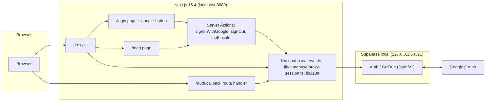
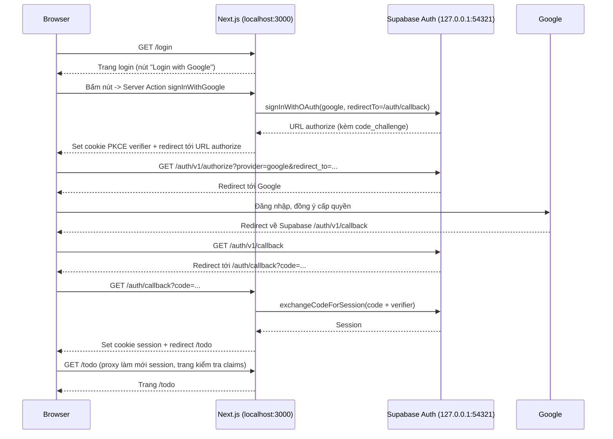
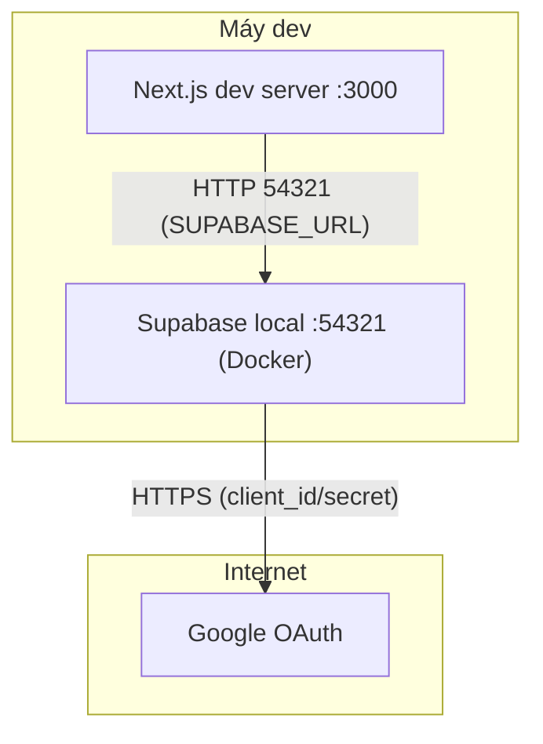

# Architecture

Bản nháp kiến trúc cho tính năng đăng nhập bằng Google (`/login`). Mã định danh `ROUTE###`, `MODEL###`, `BL###`: `TBD (draft)` — sẽ được cấp khi đối chiếu với code thực tế.

## System Architecture

Ứng dụng là Next.js 16.4 (App Router, bật `cacheComponents`) chạy tại `http://localhost:3000`. Việc xác thực giao cho Supabase Auth (GoTrue) chạy local tại `http://127.0.0.1:54321`; Google là nhà cung cấp OAuth phía sau Supabase. Trình duyệt không bao giờ gọi Supabase trực tiếp từ code ứng dụng: mọi lời gọi Supabase đi qua server (Server Action, Route Handler, `proxy.ts`), nên không cần client Supabase phía trình duyệt.

### Components

| Component | Path | Responsibility |
|-----------|------|----------------|
| Proxy | `proxy.ts` | Làm mới session bằng `getClaims()`, điều hướng theo trạng thái đăng nhập. Matcher dự kiến: `/login`, `/todo/:path*`. Chạy trên Node runtime. |
| Session helper | `lib/supabase/proxy-session.ts` | `updateSession`: gọi `getClaims()`, áp quy tắc điều hướng, chép cookie vừa làm mới sang response redirect. |
| Server client | `lib/supabase/server.ts` | Tạo `createServerClient` mới cho mỗi lần gọi, đọc/ghi cookie qua `cookies()`. `setAll` bọc try/catch vì Server Component không được ghi cookie. |
| Login page | `app/login/page.tsx` | Vỏ tĩnh; phần đọc cookie và `searchParams` nằm trong con được bọc `<Suspense>`. |
| Google button | `app/login/google-button.tsx` | Client component, dùng `useActionState`: khi chờ thì nút `disabled` và `aria-busy="true"`. Nghe `pageshow` (bfcache) để tải lại khi người dùng bấm Back từ Google. |
| Sign-in action | `app/login/actions.ts` | Server Action `signInWithGoogle`: gọi `signInWithOAuth({ provider: "google" })` với `redirectTo` = `${origin}/auth/callback`, rồi `redirect()` tới URL Supabase trả về. Lỗi thì trả `{ error: "failed" }`. |
| Callback | `app/auth/callback/route.ts` | GET: `exchangeCodeForSession(code)`; thành công → `/todo`; thất bại → `/login?error=cancelled\|failed`. Đích `/todo` viết cứng, không đọc từ query (tránh open redirect). |
| Todo page | `app/todo/page.tsx` | Trang tối thiểu có bảo vệ: hiện email người dùng và nút đăng xuất. Tự kiểm tra lại claims phía server. |
| Sign-out action | `app/todo/actions.ts` | Server Action `signOut`: xoá session rồi `redirect("/login")`. |
| i18n | `lib/i18n/dictionary.ts`, `lib/i18n/get-locale.ts`, `lib/i18n/actions.ts` | Từ điển vi/en nằm trong repo (không dùng thư viện i18n). `getLocale()` đọc cookie `NEXT_LOCALE`, hợp lệ khi thuộc {`vi`, `en`}, mặc định `vi`. `setLocale` là Server Action ghi cookie. |

Ghi chú về `cacheComponents`: root layout không đọc `NEXT_LOCALE` (nếu đọc sẽ chặn prerender mọi route); giữ `lang="vi"` và `suppressHydrationWarning`, một script inline trong head đặt `documentElement.lang` theo cookie. Không dùng `export const dynamic/revalidate`.

## Tech Stack

| Layer | Technology | Version |
|-------|------------|---------|
| Frontend / Server | Next.js (App Router, `cacheComponents`, `proxy.ts`) | 16.4 |
| Auth client | `@supabase/ssr` | 0.12.7 (ghim phiên bản; API 0.x) |
| Auth client | `@supabase/supabase-js` | 2.117.2 |
| Auth server | Supabase Auth (GoTrue), local qua Supabase CLI | `TBD (draft)` |
| Identity provider | Google OAuth 2.0 | n/a |
| i18n | Từ điển tự viết + cookie `NEXT_LOCALE` | n/a |
| E2E | `@playwright/test` (devDependency, chỉ chromium) | `TBD (draft)` |
| Database / Cache / Queue | Không dùng cho tính năng này | n/a |

## Data Flow

Luồng OAuth PKCE, chuyển hướng trong cùng một tab:

Nhánh lỗi: người dùng huỷ ở Google, hoặc đổi `code` thất bại (kể cả lỗi mạng khi gọi Supabase) → `/auth/callback` redirect `/login?error=cancelled` hoặc `/login?error=failed`. Cả hai hiển thị cùng một thông báo inline (`role="alert"`): "Đăng nhập không thành công. Vui lòng thử lại." (EN: "Login failed. Please try again.").

Luồng đăng xuất: `<form action={signOut}>` trên `/todo` → Supabase `signOut()` xoá cookie session → redirect `/login`.

Luồng đổi ngôn ngữ: chọn trong dropdown → Server Action `setLocale` ghi cookie `NEXT_LOCALE` (`path=/`, 1 năm, `sameSite=lax`) → Next làm mới UI.

## Deployment View

> Phạm vi: môi trường phát triển local. Dựng từ `supabase/config.toml`; chưa có hạ tầng triển khai khác.

| Node / Edge | Description | Source |
|-------------|-------------|--------|
| Next.js :3000 | `site_url` của Supabase trỏ về đây | `supabase/config.toml:148` |
| Supabase local :54321 | GoTrue phục vụ `/auth/v1`; chạy bằng Supabase CLI trên Docker | `supabase/config.toml:144` |
| Supabase → Google | Provider `google` bật, đọc `GOOGLE_CLIENT_ID`/`GOOGLE_CLIENT_SECRET` qua `env()` | `supabase/config.toml:299-303` |

### Environment & Config

| Key | Nơi đặt | Ai đọc | Ghi chú |
|-----|---------|--------|---------|
| `SUPABASE_URL` | `.env.local` | Next.js (server-only) | Local: `http://127.0.0.1:54321`. Không có biến `NEXT_PUBLIC_*`. |
| `SUPABASE_PUBLISHABLE_KEY` | `.env.local` | Next.js (server-only) | Lấy từ `npx supabase status`. |
| `GOOGLE_CLIENT_ID` | `.env` ở thư mục gốc | Supabase CLI (`env()` trong config.toml) | CLI chỉ đọc `.env` gốc, không đọc `.env.local`. |
| `GOOGLE_CLIENT_SECRET` | `.env` ở thư mục gốc | Supabase CLI | Không commit; `.gitignore` đã phủ `.env*`. |

Cấu hình Supabase (`supabase/config.toml`, mục `[auth]`):

- `additional_redirect_urls` phải chứa chính xác `http://localhost:3000/auth/callback`. Danh sách hiện tại chỉ có `http://localhost:3000` và `https://127.0.0.1:3000` — cần sửa (đã được duyệt trong clarifications).
- `[auth.email] enable_signup = true` — chỉ phục vụ seed session bằng mật khẩu cho E2E; ứng dụng không có form email. Hiện đang là `false` — cần sửa (đã được duyệt).
- `[auth.external.google]` đã bật, `skip_nonce_check = false` giữ nguyên.
- Sau khi đổi config: `npx supabase stop && npx supabase start`.

Phía Google Cloud: tạo OAuth client loại Web, redirect URI `http://127.0.0.1:54321/auth/v1/callback`; khi consent screen còn ở chế độ Testing, phải thêm test user.

Ràng buộc host: luôn mở ứng dụng bằng `http://localhost:3000`, không trộn với `127.0.0.1`, vì cookie PKCE verifier và callback phải cùng host.
