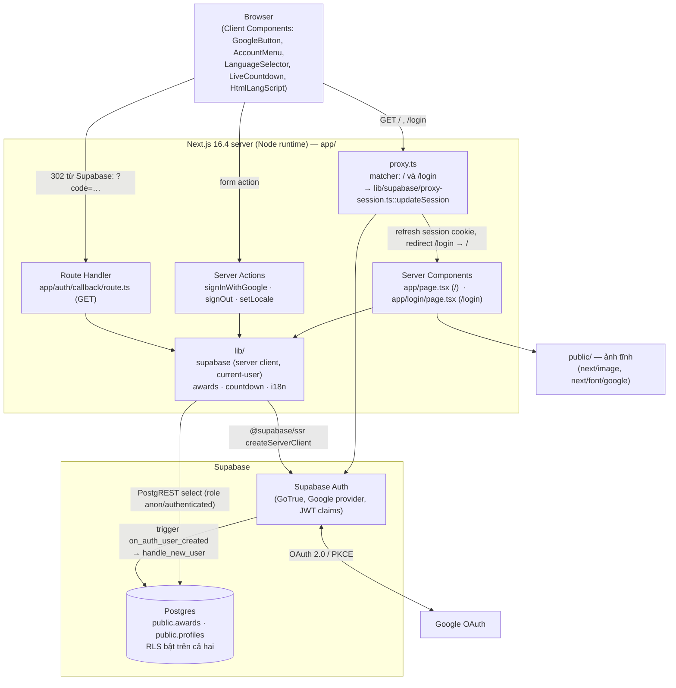
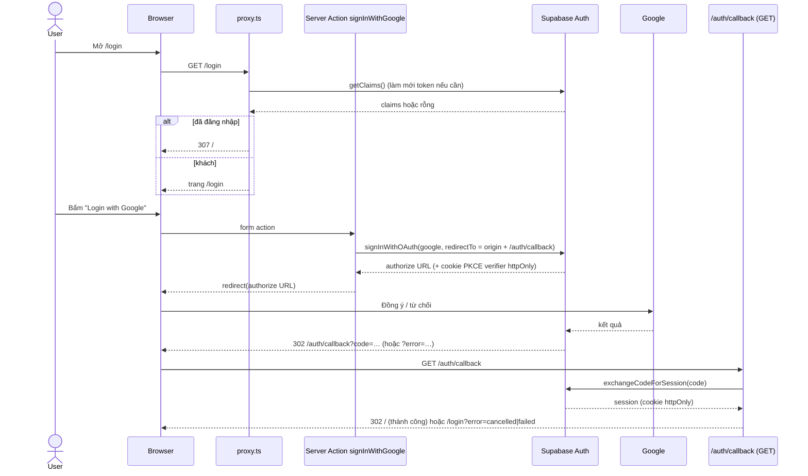
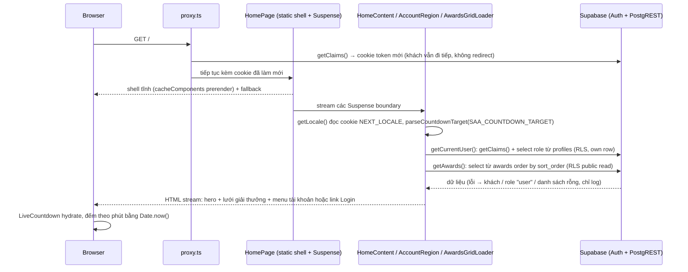

# System Overview

**Project**: my-app (SAA 2025 — Sun* Annual Awards 2025)
**Generated**: 2026-10-08
**Architecture Type**: Monolith Next.js 16 (App Router, Server Components + Server Actions) kết nối Supabase (BaaS: Auth + Postgres) — không có API backend riêng

## Executive Summary

my-app là website sự kiện "SAA 2025 — Sun* Annual Awards 2025" (`app/layout.tsx:16-19`), chạy trên một ứng dụng Next.js 16.4 duy nhất. Hiện có hai màn hình thật: trang chủ công khai `/` (hero, đồng hồ đếm ngược tới sự kiện, lưới giải thưởng đọc từ DB, khối Kudos, header/footer, chọn ngôn ngữ vi/en) và màn hình đăng nhập `/login` (Login with Google). Route handler `/auth/callback` nhận kết quả OAuth và đổi mã lấy session. Header trang chủ có menu tài khoản (Profile / Admin / Logout) và chuông thông báo (chỉ UI) cho người đã đăng nhập; mục Admin chỉ hiện khi vai trò đọc từ `public.profiles` đúng bằng `admin`.

Không có tầng API riêng: Server Component đọc dữ liệu trực tiếp qua Supabase client theo từng request (`lib/supabase/server.ts`), thao tác ghi đi qua 3 Server Action (`signInWithGoogle`, `signOut`, `setLocale`). Dữ liệu nằm ở 2 bảng Postgres có RLS (`awards`, `profiles`). Các đường dẫn `/profile`, `/admin`, `/awards-information`, `/sun-kudos`, `/standards` được liên kết trong UI nhưng **chưa có page** trong code. Route `/todo` cũ đã bị xoá (working tree 2026-10-08).

For architecture diagrams and tech stack details, see [architecture.md](architecture.md).

## System Architecture

Ranh giới chính:

- **Một tiến trình Next.js** phục vụ cả HTML (Server Components), route handler và Server Action; không có service nền, queue hay job định kỳ (scout-report: `queue-worker`, `scheduled-job`, `webhook` = none).
- **`proxy.ts`** (tên mới của middleware trong Next 16) chỉ chạy cho `/` và `/login` (`proxy.ts:17-19`): làm mới token Supabase vào cookie phản hồi, và là nơi duy nhất redirect theo session (`GET|HEAD /login` đã đăng nhập → `/`, `lib/supabase/proxy-session.ts:99-102`). Không có route nào bị chặn đối với khách.
- **Supabase** cung cấp cả xác thực (Google OAuth) lẫn dữ liệu. Ứng dụng không có Supabase client phía trình duyệt: cookie session là `httpOnly` và chỉ code server đọc (`lib/supabase/session-cookie-options.ts`).
- **Client Component** chỉ dùng cho tương tác UI (nút Google, menu tài khoản, chọn ngôn ngữ, đồng hồ đếm ngược, đồng bộ `<html lang>`, cuộn lên đầu trang) — 8 file `"use client"`.
- **Hạ tầng test/dev** (không thuộc sản phẩm): Playwright e2e (`e2e/`, `playwright.config.ts`), Supabase CLI local (`supabase/config.toml`).

## Technology Stack

| Layer | Technology | Version |
|-------|------------|---------|
| Framework | Next.js (App Router, `cacheComponents`, `partialPrefetching`, `proxy.ts`, Turbopack) | 16.4.0 |
| UI runtime | React / React DOM | 19.3.0 |
| Language | TypeScript (strict, alias `@/*`) | ^5 (lock: 5.9.3) |
| Styling | Tailwind CSS (v4, `@import "tailwindcss"`) | ^4 (lock: 4.3.3) |
| Styling build | @tailwindcss/turbopack (loader CSS trong `next.config.ts`) | ^4 (lock: 4.3.3) |
| Fonts | `next/font/google`: Geist, Geist Mono, Montserrat, Montserrat Alternates | đi kèm Next 16.4.0 |
| Images | `next/image` + file tĩnh trong `public/` | đi kèm Next 16.4.0 |
| Authentication | Supabase Auth, Google OAuth (PKCE) qua `@supabase/ssr` | 0.12.7 |
| Supabase client | @supabase/supabase-js | 2.117.2 |
| Database | Supabase Postgres + RLS (`supabase/migrations/*.sql`, seed `supabase/seeds/common/01-awards.sql`) | không pin trong code (do Supabase quản lý) |
| Database tooling | Supabase CLI (`supabase/config.toml`, migration, seed local) | ^2.120.0 |
| E2E testing | Playwright (`@playwright/test`, project chromium) | ^1.63.0 (lock: 1.63.0) |
| Linting | ESLint + eslint-config-next (core-web-vitals, typescript) | ^9 (lock: 9.39.5) / 16.4.0 |
| Runtime types | @types/node, @types/react, @types/react-dom | ^20 / ^19 / ^19 |

Ghi chú: không có ORM, thư viện state, thư viện UI/component hay HTTP client riêng — i18n tự viết (`lib/i18n/`, 2 locale `vi`/`en`, mặc định `vi`, cookie `NEXT_LOCALE`). Phiên bản "lock" lấy từ `package-lock.json`; các dòng không có "lock" được pin đúng trong `package.json`.

## Data Flow

Luồng 1 — Đăng nhập Google (OAuth PKCE):

Luồng 2 — Render trang chủ `/`:

Đổi ngôn ngữ: `LanguageSelector` gọi Server Action `setLocale` (allow-list `vi|en`, ghi cookie `NEXT_LOCALE` 1 năm), cây component được làm mới. Đăng xuất: form trong menu tài khoản gọi `signOut` (`scope: "local"`), luôn redirect `/login`.

## Key Design Decisions

### Decision 1: Next.js 16 `cacheComponents` — vỏ trang tĩnh, dữ liệu theo request nằm trong `<Suspense>`

**Context**: Trang chủ cần prerender nhanh nhưng phải đọc cookie ngôn ngữ, session và bảng `awards` theo từng request. `next.config.ts` bật `cacheComponents: true` và `partialPrefetching: true`; chế độ này từ chối đọc dữ liệu request-time (cookie, đồng hồ) ngoài ranh giới Suspense.

**Decision**: Root layout và `app/page.tsx` giữ tĩnh; mọi truy cập `cookies()`, `getClaims()` và truy vấn DB nằm trong component con bọc `<Suspense>` (`HomeContent`, `AccountRegion`, `AccountBellRegion`, `AwardsGridLoader`). Hàm request-time gọi `connection()` ngoài `try` và dùng `unstable_rethrow` để không nuốt tín hiệu bail-out của Next (`lib/supabase/current-user.ts:34,54`, `lib/awards/get-awards.ts:20,40`). Locale ở root layout được đồng bộ bằng inline script `HtmlLangScript` thay vì đọc cookie trong layout; đồng hồ đếm ngược dùng placeholder `--` ở server rồi mới đọc `Date.now()` sau hydrate (`lib/countdown/use-countdown.ts:16-25`).

**Rationale**: Vỏ trang và hero hiển thị ngay, phần chậm (auth, DB) stream sau mà không chặn nhau; không có "flash" nút Login khi đã đăng nhập vì vùng tài khoản có skeleton cùng kích thước. Đổi lại, mọi dev phải nhớ quy tắc "đọc request-time chỉ trong Suspense", nếu không cả route bị chặn.

### Decision 2: Supabase là backend duy nhất, truy cập chỉ từ server qua `@supabase/ssr` với cookie `httpOnly`

**Context**: Cần đăng nhập Google và đọc dữ liệu công khai/theo người dùng mà không tự dựng API server hay lưu secret ở trình duyệt.

**Decision**: Không có Supabase client phía trình duyệt. Mỗi request tạo một server client riêng bằng `createServerClient` gắn với cookie request đó (`lib/supabase/server.ts`), cấu hình qua biến môi trường server-only `SUPABASE_URL` và `SUPABASE_PUBLISHABLE_KEY` (không có tiền tố `NEXT_PUBLIC_`, `lib/supabase/supabase-env.ts`). Cookie session đặt `httpOnly`, `sameSite: lax`, `secure` ở production (`lib/supabase/session-cookie-options.ts`). Danh tính chỉ lấy từ `getClaims()` (JWT đã xác minh), không dùng `getSession()` hay `user_metadata`; vai trò đọc từ `public.profiles` dưới RLS bằng chính session người dùng. `proxy.ts` làm mới token vì Server Component không ghi được cookie.

**Rationale**: Token không bao giờ chạm JavaScript của trang, bề mặt tấn công nhỏ, và không phải viết/bảo trì API trung gian. Đổi lại ứng dụng gắn chặt với Supabase (Auth + PostgREST) và phụ thuộc `proxy.ts` để token không hết hạn giữa chừng.

### Decision 3: Phân quyền fail-closed, vai trò nằm trong bảng `profiles` chỉ-đọc với người dùng

**Context**: Menu tài khoản cần phân biệt `user` và `admin`; vai trò không được để người dùng tự sửa.

**Decision**: `public.profiles(id, role)` có RLS `select` chỉ cho dòng của chính mình, người dùng không có quyền `insert/update/delete`; ghi chỉ qua `service_role`. Dòng profile được tạo tự động bởi trigger `on_auth_user_created` (`security definer`, `search_path = ''`) và role luôn lấy default `'user'` (`supabase/migrations/20261008045415_create_profiles.sql`). `getCurrentUser()` trả `null` (khách) khi lỗi và `"user"` khi tra cứu role lỗi/rỗng; chỉ chuỗi đúng `"admin"` mới cho quyền admin (`lib/supabase/current-user.ts:60-83`). Việc ẩn/hiện mục Admin chỉ là UX; code ghi rõ trang `/admin` khi được xây phải tự kiểm tra lại role phía server.

**Rationale**: Mặc định từ chối khi có lỗi tránh vô tình cấp quyền cao; đặt role trong bảng có RLS thay vì metadata của JWT ngăn người dùng tự nâng quyền. Rủi ro hiện tại: `/admin` và `/profile` chưa tồn tại nên chưa có điểm thực thi quyền phía server.

## Security Overview

- **Authentication**: Đăng nhập duy nhất bằng Google qua Supabase Auth, luồng OAuth PKCE (`signInWithOAuth` → `/auth/callback` → `exchangeCodeForSession`). Session ở cookie `httpOnly`, `sameSite: lax`, `secure` khi `NODE_ENV=production`. Nhận diện người dùng bằng `getClaims()`; lỗi xác minh/mạng/thiếu env đều coi là khách (log, không trả 500). Cấu hình provider Google dùng biến `GOOGLE_CLIENT_ID` / `GOOGLE_CLIENT_SECRET` trong `supabase/config.toml` (thay thế từ môi trường, không có giá trị trong repo).
- **Authorization**: Không có route nào bị chặn đối với khách; trang chủ công khai. Phân quyền theo dữ liệu bằng RLS: `awards` cho `select` đối với `anon` và `authenticated`; `profiles` chỉ cho `authenticated` đọc dòng của mình (`(select auth.uid()) = id`); quyền bảng được `revoke all` rồi `grant` tường minh, `service_role` mới được ghi. Vai trò `admin` chỉ hiển thị mục menu; kiểm tra thực thi cho `/admin` chưa có (route chưa build).
- **Data Encryption**: Code không tự mã hoá dữ liệu. Mã hoá truyền tải (HTTPS) và lưu trữ do hạ tầng triển khai và Supabase đảm nhiệm — không cấu hình trong repo (local: `api.tls` tắt, URL `http://127.0.0.1:54321`). Cookie `secure` chỉ bật ở production. Không có dữ liệu nhạy cảm nào do ứng dụng lưu ngoài `profiles.role`; email chỉ đọc từ claims.
- **API Security**: Không có REST/GraphQL API tự viết. Redirect dùng đường dẫn cố định trên origin của request (`/`, `/login?error=cancelled|failed`), bỏ qua `next`/`redirect_to` nên không có open redirect; `/login` chỉ phản ánh mã lỗi nằm trong allow-list (`cancelled`, `failed`). Server Action chịu kiểm tra Origin/Host CSRF của Next; `signInWithGoogle` tự dựng `redirectTo` từ Origin hợp lệ hoặc Host đã qua regex, Supabase còn đối chiếu với danh sách `additional_redirect_urls`. `setLocale` allow-list `vi|en` trước khi ghi cookie. `proxy.ts` chỉ redirect `GET|HEAD` để không phá Server Action `signOut`. Biến môi trường server-only: `SUPABASE_URL`, `SUPABASE_PUBLISHABLE_KEY`, `SAA_COUNTDOWN_TARGET` — không biến nào mang tiền tố `NEXT_PUBLIC_`. Không thấy rate limiting hay header bảo mật (CSP…) cấu hình trong ứng dụng; chỉ có `auth.rate_limit` của Supabase local.

## Scalability

- **Current Capacity**: Chưa có số liệu tải, benchmark hay giới hạn nào trong code/cấu hình. Quy mô hiện tại rất nhỏ: 2 route hiển thị, 2 bảng, 6 dòng `awards` seed, một truy vấn `awards` và tối đa một cặp truy vấn `getClaims` + `profiles` cho mỗi request trang chủ.
- **Scaling Strategy**: Ứng dụng không giữ state trong tiến trình (session ở cookie, locale ở cookie, dữ liệu ở Postgres) nên có thể nhân bản ngang. Mỗi request tạo Supabase client riêng, `getCurrentUser` dùng React `cache()` để chia sẻ một lần tra cứu giữa các vùng header. Vỏ trang tĩnh được prerender nhờ `cacheComponents`, phần động stream qua Suspense. Chưa có cache dữ liệu `awards` giữa các request (đọc DB mỗi lần, `connection()` ép động); nếu tải tăng, `awards` là ứng viên đầu tiên cho cache vì là dữ liệu công khai gần như tĩnh.
- **Performance Targets**: Không định nghĩa chỉ tiêu (latency, LCP…) trong code. Tối ưu hiện có là `next/font` (`display: swap`), `next/image`, Suspense + skeleton cho vùng tài khoản/lưới giải thưởng, và đồng hồ đếm ngược chỉ cập nhật khi đổi phút (`msUntilNextChange`) thay vì mỗi giây.
